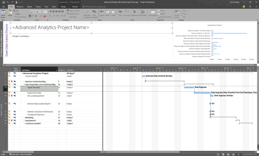
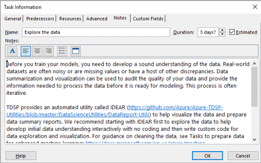

# Team Data Science Process project planning

The Team Data Science Process (TDSP) provides a lifecycle to structure the development of your data science projects. This article provides links to Microsoft Project and Excel templates that help you plan and manage these project stages.

The lifecycle outlines the major stages that projects typically execute, often iteratively:

- Business Understanding
- Data Acquisition and Understanding
- Modeling
- Deployment
- Customer Acceptance

For descriptions of each of these stages, see [The Team Data Science Process lifecycle](https://docs.microsoft.com/azure/machine-learning/team-data-science-process/lifecycle).

 
## Microsoft Project template

The Microsoft Project template for the Team Data Science Process is available from here: [Microsoft Project template](https://github.com/Azure/Azure-MachineLearning-DataScience/blob/master/Team-Data-Science-Process/Project-Planning-and-Governance/Advanced%20Analytics%20Microsoft%20Project%20Plan.mpp) 

When you open the plan, click the link to the far left for the TDSP. Change the name and description and then add in any other team resources you need. Estimate the dates required from your experience.

Each task has a note. Open those tasks to see what resources have already been created for you.

## Excel template

If don’t have access to Microsoft Project, an Excel worksheet with all the same data is also available for download here: [Excel template](https://github.com/Azure/Azure-MachineLearning-DataScience/blob/master/Team-Data-Science-Process/Project-Planning-and-Governance/Advanced%20Analytics%20Microsoft%20Project%20Plan.xlsx)
You can pull it in to whatever tool you prefer to use.

Use these templates at your own risk. The [usual disclaimers](https://www.gnu.org/licenses/gpl-3.0.en.html) apply.

## Repository template

Use this [project template repository](https://github.com/Azure/Azure-TDSP-ProjectTemplate) to support efficient project execution and collaboration. This repository gives you a standardized directory structure and document templates you can use for your own TDSP project.

## Next steps

[Agile development of data science projects](agile-development.md) This document describes to execute a data science project in a systematic, version controlled, and collaborative way within a project team by using the Team Data Science Process.

Walkthroughs that demonstrate all the steps in the process for **specific scenarios** are also provided. They are listed and linked with thumbnail descriptions in the [Example walkthroughs](walkthroughs.md) article. They illustrate how to combine cloud, on-premises tools, and services into a workflow or pipeline to create an intelligent application. 

