# Tasks for the team lead on a Team Data Science Process team

This article describes the tasks that a *team lead* completes for their data science team. The team lead's objective is to establish a collaborative team environment that standardizes on the [Team Data Science Process](overview.md) (TDSP). The TDSP is designed to help improve collaboration and team learning. 

The TDSP is an agile, iterative data science methodology to efficiently deliver predictive analytics solutions and intelligent applications. The process distills the best practices and structures from Microsoft and the industry.  The goal is successful implementation of data science initiatives and fully realizing the benefits of their analytics programs. For an outline of the personnel roles and associated tasks for a data science team standardizing on the TDSP, see [Team Data Science Process roles and tasks](roles-tasks.md).

A team lead manages a team consisting of several data scientists in the data science unit of an enterprise. Depending on the data science unit's size and structure, the [group manager](group-manager-tasks.md) and the team lead might be the same person, or they could delegate their tasks to surrogates. But the tasks themselves do not change. 

The following diagram shows the workflow for the tasks the team lead completes to set up a team environment:

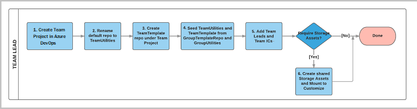

1. Create a **team project** in the group's organization in Azure DevOps. 
  
1. Rename the default team repository to **TeamUtilities**.
  
1. Create a new **TeamTemplate** repository in the team project. 
  
1. Import the contents of the group's **GroupUtilities** and **GroupProjectTemplate** repositories into the **TeamUtilities** and **TeamTemplate** repositories. 
  
1. Set up **security control** by adding team members and configuring their permissions.
  
1. If required, create team data and analytics resources:
   - Add team-specific utilities to the **TeamUtilities** repository. 
   - Create **Azure file storage** to store data assets that can be useful for the entire team. 
   - Mount the Azure file storage to the team lead's **Data Science Virtual Machine** (DSVM) and add data assets to it.

The following tutorial walks through the steps in detail.

> [!NOTE] 
> This article uses Azure DevOps and a DSVM to set up a TDSP team environment, because that is how to implement TDSP at Microsoft. If your team uses other code hosting or development platforms, the team lead tasks are the same, but the way to complete them may be different.

## Prerequisites

This tutorial assumes that the following resources and permissions have been set up by your [group manager](group-manager-tasks.md):

- The Azure DevOps **organization** for your data unit
- **GroupProjectTemplate** and **GroupUtilities** repositories, populated with the contents of the Microsoft TDSP team's **ProjectTemplate** and **Utilities** repositories
- Permissions on your organization account for you to create projects and repositories for your team

To be able to clone repositories and modify their content on your local machine or DSVM, or set up Azure file storage and mount it to your DSVM, you need the following:

- An Azure subscription.
- Git installed on your machine. If you're using a DSVM, Git is pre-installed. Otherwise, see the [Platforms and tools appendix](platforms-and-tools.md#appendix).
- If you want to use a DSVM, the Windows or Linux DSVM created and configured in Azure. For more information and instructions, see the [Data Science Virtual Machine Documentation](/azure/machine-learning/data-science-virtual-machine/).
- For a Windows DSVM, [Git Credential Manager (GCM)](https://github.com/Microsoft/Git-Credential-Manager-for-Windows) installed on your machine. In the *README.md* file, scroll down to the **Download and Install** section and select the **latest installer**. Download the *.exe* installer from the installer page and run it. 
- For a Linux DSVM, an SSH public key set up on your DSVM and added in Azure DevOps. For more information and instructions, see the **Create SSH public key** section in the [Platforms and tools appendix](platforms-and-tools.md#appendix). 

## Create a team project and repositories

In this section, you create the following resources in your group's Azure DevOps organization:

- The **MyTeam** project in Azure DevOps
- The **TeamTemplate** repository
- The **TeamUtilities** repository

The names specified for the repositories and directories in this tutorial assume that you want to establish a separate project for your own team within your larger data science organization. However, the entire group can choose to work under a single project created by the group manager or organization administrator. Then, all the data science teams create repositories under this single project. This scenario might be valid for:
- A small data science group that doesn't have multiple data science teams. 
- A larger data science group with multiple data science teams that nevertheless wants to optimize inter-team collaboration with activities such as group-level sprint planning. 

If teams choose to have their team-specific repositories under a single group project, the team leads should create the repositories with names like *\<TeamName>Template* and *\<TeamName>Utilities*. For instance: *TeamATemplate* and *TeamAUtilities*. 

In any case, team leads need to let their team members know which template and utilities repositories to set up and clone. Project leads should follow the [project lead tasks for a data science team](project-lead-tasks.md) to create project repositories, whether under separate projects or a single project. 

### Create the MyTeam project

To create a separate project for your team:

1. In your web browser, go to your group's Azure DevOps organization home page at URL *https:\//\<server name>/\<organization name>*, and select **New project**. 
   
   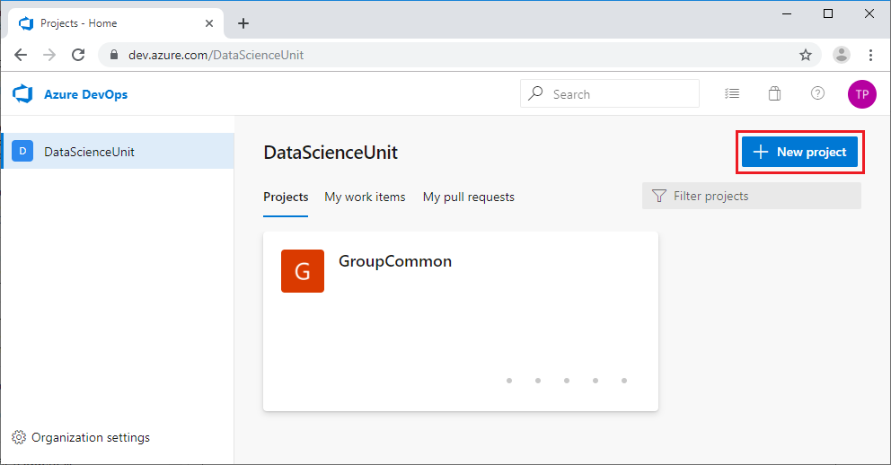
   
1. In the **Create project** dialog, enter your team name, such as *MyTeam*, under **Project name**, and then select **Advanced**. 
   
1. Under **Version control**, select **Git**, and under **Work item process**, select **Agile**. Then select **Create**. 
   
   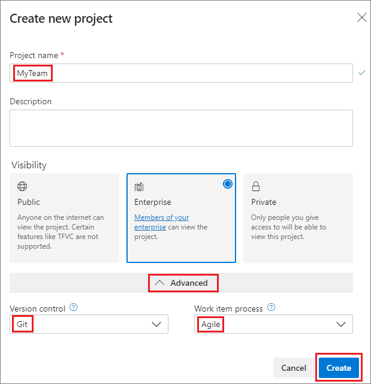
   
The team project **Summary** page opens, with page URL *https:\//\<server name>/\<organization name>/\<team name>*.

### Rename the MyTeam default repository to TeamUtilities

1. On the **MyTeam** project **Summary** page, under **What service would you like to start with?**, select **Repos**. 
   
   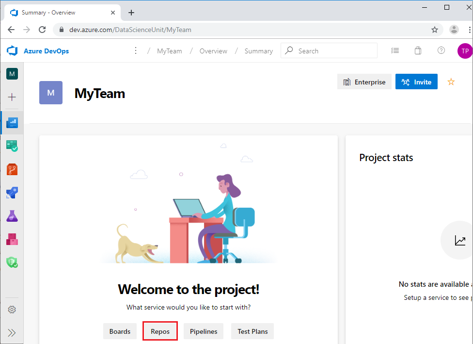
   
1. On the **MyTeam** repo page, select the **MyTeam** repository at the top of the page, and then select **Manage repositories** from the dropdown. 
   
   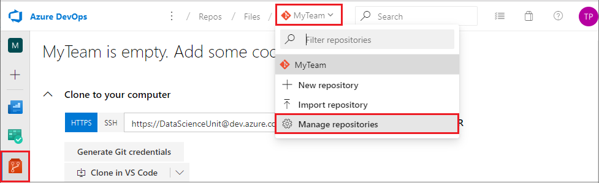
1. On the **Project Settings** page, select the **...** next to the **MyTeam** repository, and then select **Rename repository**. 
   
   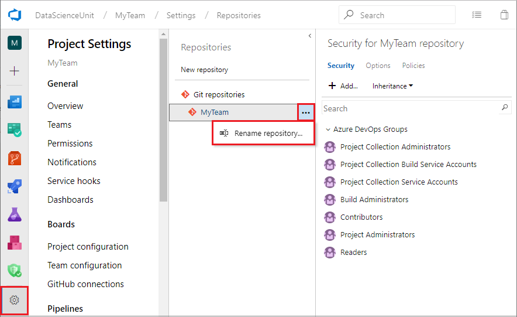
   
1. In the **Rename the MyTeam repository** popup, enter *TeamUtilities*, and then select **Rename**. 

### Create the TeamTemplate repository

1. On the **Project Settings** page, select **New repository.** 
   
   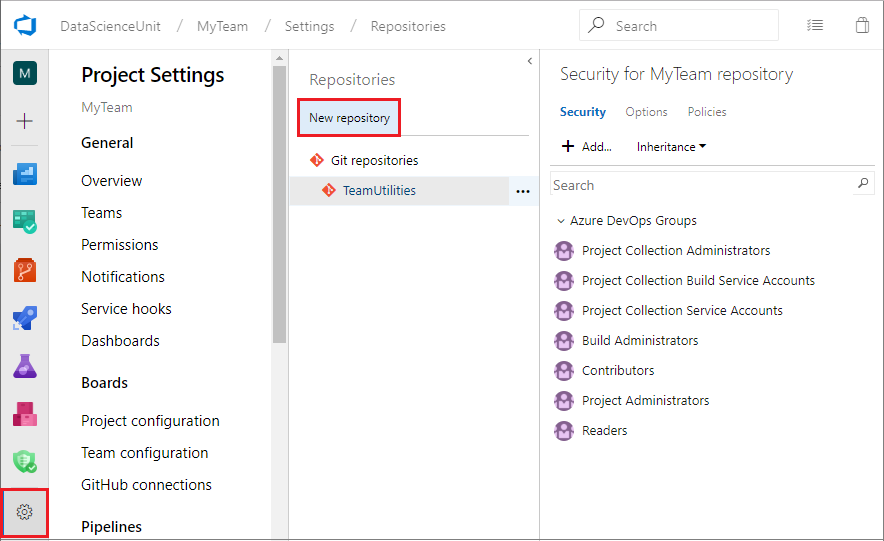
   
   Or, select **Repos** from the left navigation of the **MyTeam** project **Summary** page, select a repository at the top of the page, and then select **New repository** from the dropdown.
   
1. In the **Create a new repository** dialog, make sure **Git** is selected under **Type**. Enter *TeamTemplate* under **Repository name**, and then select **Create**.
   
   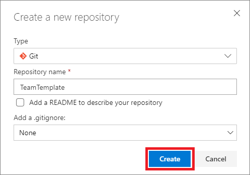
   
1. Confirm that you can see the two repositories **TeamUtilities** and **TeamTemplate** on your project settings page. 
   
   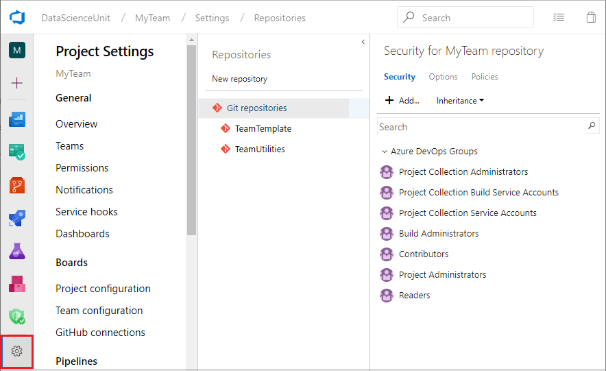

### Import the contents of the group common repositories

To populate your team repositories with the contents of the group common repositories set up by your group manager:

1. From your **MyTeam** project home page, select **Repos** in the left navigation. If you get a message that the **MyTeam** template is not found, select the link in **Otherwise, navigate to your default TeamTemplate repository.** 
   
   The default **TeamTemplate** repository opens. 
   
1. On the **TeamTemplate is empty** page, select **Import**. 
   
   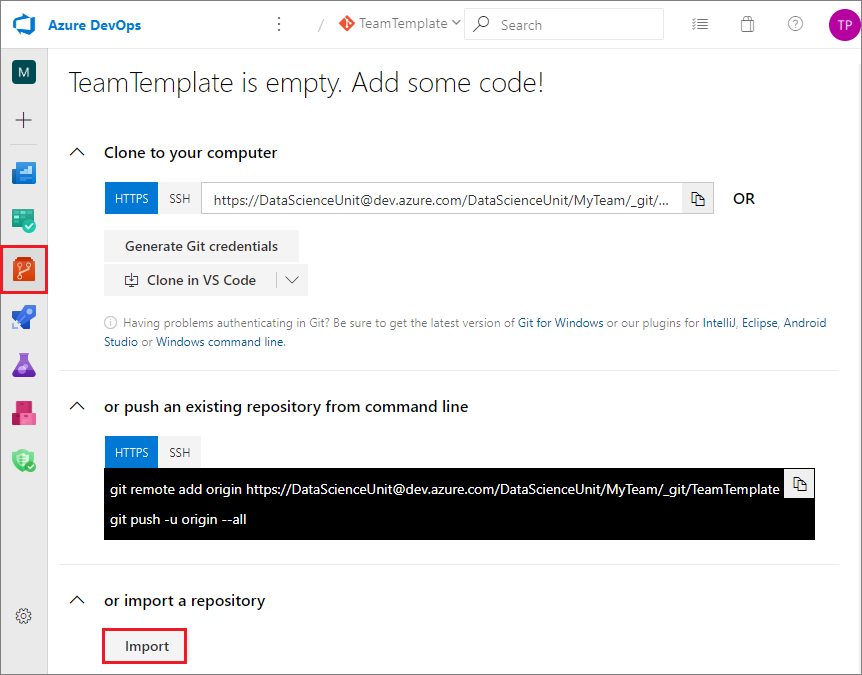
   
1. In the **Import a Git repository** dialog, select **Git** as the **Source type**, and enter the URL for your group common template repository under **Clone URL**. The URL is *https:\//\<server name>/\<organization name>/_git/\<repository name>*. For example: *https:\//dev.azure.com/DataScienceUnit/GroupCommon/_git/GroupProjectTemplate*. 
   
1. Select **Import**. The contents of your group template repository are imported into your team template repository. 
   
   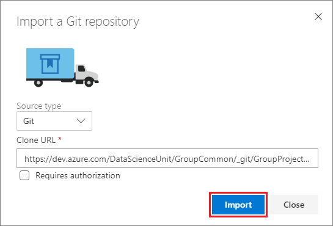
   
1. At the top of your project's **Repos** page, drop down and select the **TeamUtilities** repository.
   
1. Repeat the import process to import the contents of your group common utilities repository, for example *GroupUtilities*, into your **TeamUtilities** repository. 
   
Each of your two team repositories now contains the files from the corresponding group common repository. 

### Customize the contents of the team repositories

If you want to customize the contents of your team repositories to meet your team's specific needs, you can do that now. You can modify files, change the directory structure, or add files and folders.

To modify, upload, or create files or folders directly in Azure DevOps:

1. On the **MyTeam** project **Summary** page, select **Repos**. 
   
1. At the top of the page, select the repository you want to customize.

1. In the repo directory structure, navigate to the folder or file you want to change. 
   
   - To create new folders or files, select the arrow next to **New**. 
     
     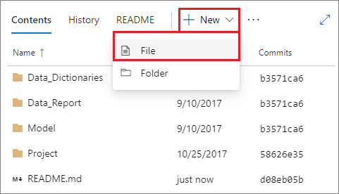
     
   - To upload files, select **Upload file(s)**. 
     
     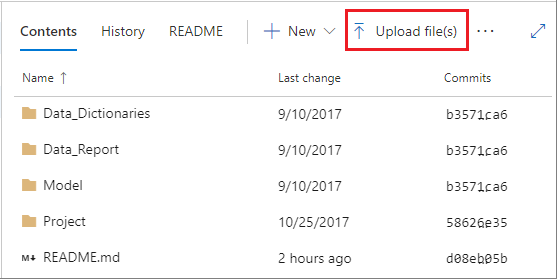
     
   - To edit existing files, navigate to the file and then select **Edit**. 
     
     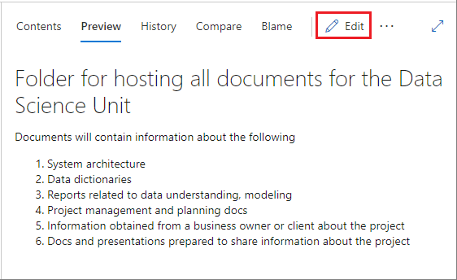
     
1. After adding or editing files, select **Commit**.
   
   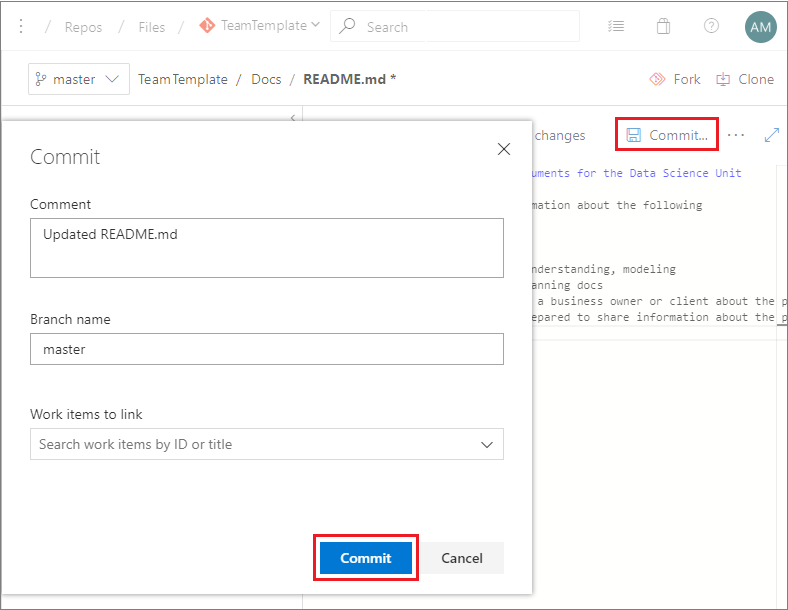

To work with repositories on your local machine or DSVM, you first copy or *clone* the repositories to your local machine, and then commit and push your changes up to the shared team repositories, 

To clone repositories:

1. On the **MyTeam** project **Summary** page, select **Repos**, and at the top of the page, select the repository you want to clone.
   
1. On the repo page, select **Clone** at upper right.
   
1. In the **Clone repository** dialog, under **Command line**, select **HTTPS** for an HTTP connection or **SSH** for an SSH connection, and copy the clone URL to your clipboard.
   
   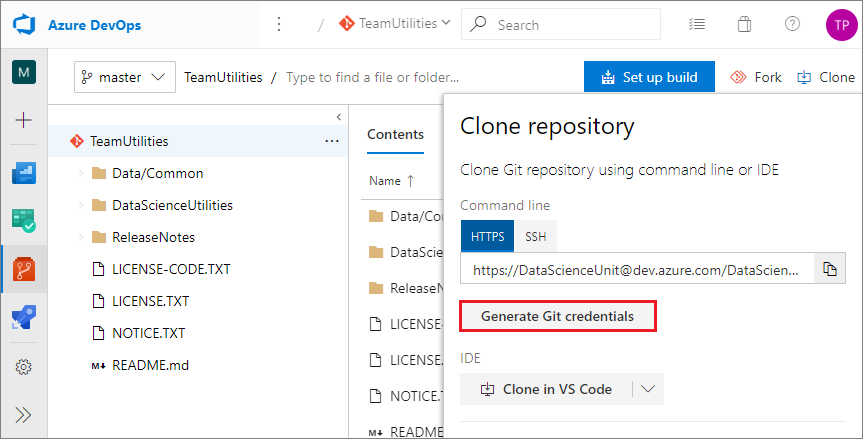
   
1. On your local machine, create the following directories:
   
   - For Windows: **C:\GitRepos\MyTeam**
   - For Linux, **$home/GitRepos/MyTeam** 
   
1. Change to the directory you created.
   
1. In Git Bash, run the command `git clone <clone URL>`, where \<clone URL> is the URL you copied from the **Clone** dialog.
   
   For example, use one of the following commands to clone the **TeamUtilities** repository to the *MyTeam* directory on your local machine. 
   
   **HTTPS connection:**
   
   ```bash
   git clone https://DataScienceUnit@dev.azure.com/DataScienceUnit/MyTeam/_git/TeamUtilities
   ```
   
   **SSH connection:**
   
   ```bash
   git clone git@ssh.dev.azure.com:v3/DataScienceUnit/MyTeam/TeamUtilities
   ```

After making whatever changes you want in the local clone of your repository, commit and push the changes to the shared team repositories. 

Run the following Git Bash commands from your local **GitRepos\MyTeam\TeamTemplate** or **GitRepos\MyTeam\TeamUtilities** directory.

```bash
git add .
git commit -m "push from local"
git push
```

> [!NOTE]
> If this is the first time you commit to a Git repository, you may need to configure global parameters *user.name* and *user.email* before you run the `git commit` command. Run the following two commands:
> 
> `git config --global user.name <your name>`
> 
> `git config --global user.email <your email address>`
> 
> If you're committing to several Git repositories, use the same name and email address for all of them. Using the same name and email address is convenient when building Power BI dashboards to track your Git activities in multiple repositories.

## Add team members and configure permissions

To add members to the team:

1. In Azure DevOps, from the **MyTeam** project home page, select **Project settings** from the left navigation. 
   
1. From the **Project Settings** left navigation, select **Teams**, then on the **Teams** page, select the **MyTeam Team**. 
   
   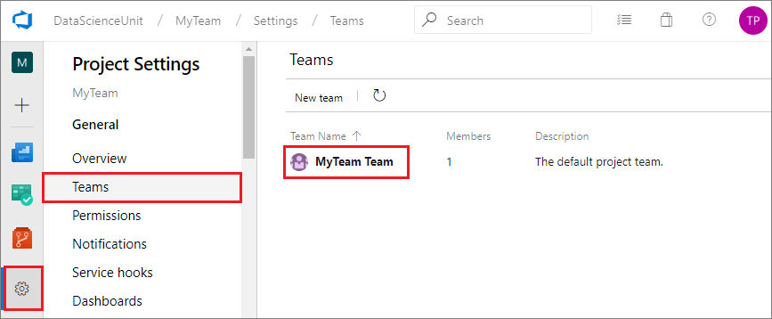
   
1. On the **Team Profile** page, select **Add**.
   
   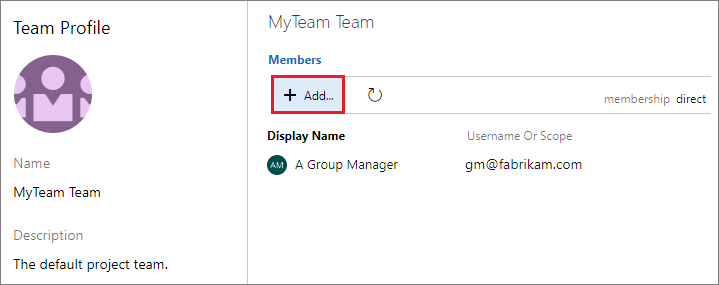
   
1. In the **Add users and groups** dialog, search for and select members to add to the group, and then select **Save changes**. 
   
   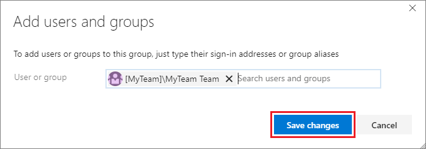
   

To configure permissions for team members:

1. From the **Project Settings** left navigation, select **Permissions**. 
   
1. On the **Permissions** page, select the group you want to add members to. 
   
1. On the page for that group, select **Members**, and then select **Add**. 
   
1. In the **Invite members** popup, search for and select members to add to the group, and then select **Save**. 
   
   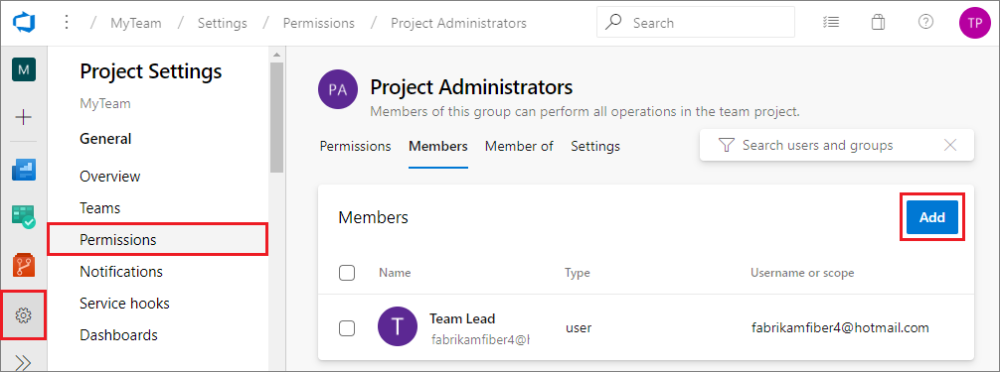

## Create team data and analytics resources

This step is optional, but sharing data and analytics resources with your entire team has performance and cost benefits. Team members can execute their projects on the shared resources, save on budgets, and collaborate more efficiently. You can create Azure file storage and mount it on your DSVM to share with team members. 

For information about sharing other resources with your team, such as Azure HDInsight Spark clusters, see [Platforms and tools](platforms-and-tools.md). That topic provides guidance from a data science perspective on selecting resources that are appropriate for your needs, and links to product pages and other relevant and useful tutorials.

>[!NOTE]
> To avoid transmitting data across data centers, which might be slow and costly, make sure that your Azure resource group, storage account, and DSVM are all hosted in the same Azure region. 

### Create Azure file storage

1. Run the following script to create Azure file storage for data assets that are useful for your entire team. The script prompts you for your Azure subscription information, so have that ready to enter. 

   - On a Windows machine, run the script from the PowerShell command prompt:
     
     ```powershell
     wget "https://raw.githubusercontent.com/Azure/Azure-MachineLearning-DataScience/master/Misc/TDSP/CreateFileShare.ps1" -outfile "CreateFileShare.ps1"
     .\CreateFileShare.ps1
     ```
     
   - On a Linux machine, run the script from the Linux shell:
     
     ```shell
     wget "https://raw.githubusercontent.com/Azure/Azure-MachineLearning-DataScience/master/Misc/TDSP/CreateFileShare.sh"
     bash CreateFileShare.sh
     ```
   
1. Log in to your Microsoft Azure account when prompted, and select the subscription you want to use.
   
1. Select the storage account to use, or create a new one under your selected subscription. You can use lowercase characters, numbers, and hyphens for the Azure file storage name.
   
1. To facilitate mounting and sharing the storage, press Enter or enter *Y* to save the Azure file storage information into a text file in your current directory. You can check in this text file to your **TeamTemplate** repository, ideally under **Docs\DataDictionaries**, so all projects in your team can access it. You also need the file information to mount your Azure file storage to your Azure DSVM in the next section. 
   
### Mount Azure file storage on your local machine or DSVM

1. To mount your Azure file storage to your local machine or DSVM, use the following script.
   
   - On a Windows machine, run the script from the PowerShell command prompt:
     
     ```powershell
     wget "https://raw.githubusercontent.com/Azure/Azure-MachineLearning-DataScience/master/Misc/TDSP/AttachFileShare.ps1" -outfile "AttachFileShare.ps1"
     .\AttachFileShare.ps1
     ```
     
   - On a Linux machine, run the script from the Linux shell:
     
     ```shell
     wget "https://raw.githubusercontent.com/Azure/Azure-MachineLearning-DataScience/master/Misc/TDSP/AttachFileShare.sh"
     bash AttachFileShare.sh
     ```
   
1. Press Enter or enter *Y* to continue, if you saved an Azure file storage information file in the previous step. Enter the complete path and name of the file you created. 
   
   If you don't have an Azure file storage information file, enter *n*, and follow the instructions to enter your subscription, Azure storage account, and Azure file storage information.
   
1. Enter the name of a local or TDSP drive to mount the file share on. The screen displays a list of existing drive names. Provide a drive name that doesn't already exist.
   
1. Confirm that the new drive and storage is successfully mounted on your machine.

## Next steps

Here are links to detailed descriptions of the other roles and tasks defined by the Team Data Science Process:

- [Group Manager tasks for a data science team](group-manager-tasks.md)
- [Project Lead tasks for a data science team](project-lead-tasks.md)
- [Project Individual Contributor tasks for a data science team](project-ic-tasks.md)
