# Tasks for the team lead in the Team Data Science Process Team

This topic outlines the tasks that a team lead is expected to complete for their data science team. The objective is to establish collaborative team environment that standardizes on the [Team Data Science Process](overview.md) (TDSP). TDSP is an agile, iterative data science methodology to deliver predictive analytics solutions and intelligent applications efficiently. It is designed to help improve collaboration and team learning. The process is a distillation of the best practices and structures from both Microsoft as well as from the industry, needed for successful implementation of data science initiatives to help companies fully realize the benefits of their analytics programs. For an outline of the personnel roles and their associated tasks that are handled by a data science team standardizing on this process, see [Team Data Science Process roles and tasks](roles-tasks.md).

A **Team Lead** manages a team in the data science unit of an enterprise. A team consists of multiple data scientists. For data science unit with only a small number of data scientists, the **Group Manager** and the **Team Lead** might be the same person or they could delegate their task to a surrogate. But the tasks themselves do not change. The workflow for the tasks to be completed by team leads to set up this environment are depicted in the following figure:

>[AZURE.NOTE] The tasks in blocks 1 and 2 of the figure are needed if you are using Azure DevOps as the code hosting platform and you want to have a separate Azure DevOps project for your own team. Once these tasks are completed, all repositories of your team can be created under this project. 

After several prerequisites tasks specified in a following section are satisfied by the group manager, there are the five principal tasks (some optional) that you complete in this tutorial. These tasks correspond the main numbered sections of this topic:

1. Create a **project** on the group's Azure DevOps Services of the group and two team repositories in the project:
	- **ProjectTemplate repository** 
	- **TeamUtilities repository**
2. Seed the team **ProjectTemplate** repository from the **GroupProjectTemplate** repository which has been set up by your group manager. 
3. Create team data and analytics resources:
	- Add the team-specific utilities to the **TeamUtilities** repository. 
	- (Optional) Create an **Azure file storage** to be used to store data assets that can be useful for the entire team. 
4. (Optional) Mount the Azure file storage to the **Data Science Virtual Machine** (DSVM) of the team lead and add data assets on it.
5. Set up the **security control** by adding team members and configure their privileges.

>[AZURE.NOTE] We outline the steps needed to set up a TDSP team environment using Azure DevOps in the following instructions. We specify how to accomplish these tasks with Azure DevOps because that is how we implement TDSP at Microsoft. If another code hosting platform is used for your group, the tasks that need to be completed by the team lead generally do not change. But the way to complete these tasks is going to be different.

## Repositories and directories

This topic   uses abbreviated names for repositories and directories. These names make it easier to follow the operations between the repositories and directories. This notation (**R** for Git repositories and **D** for local directories on your DSVM) is used in the following sections:

- **R1**: The **GroupProjectTemplate** repository on Git that your group manager set up on your Azure DevOps group server.
- **R3**: The team **ProjectTemplate** repository on Git you set up.
- **R4**: The **TeamUtilities** repository on Git you set up.
- **D1**: The local directory cloned from R1 and copied to D3.
- **D3**: The local directory cloned from R3, customize, and copied back to R3.
- **D4**: The local directory cloned from R4, customize, and copied back to R4.

The names specified for the repositories and directories in this tutorial have been provided on the assumption that your objective is to establish a separate project for your own team within a larger data science group. But there are other options open to you as team lead:

- The entire group can choose to create a single project. Then all projects from all data science teams would be under this single project. To achieve this, you can designate a git administrator to follow these instructions to create a single project. This scenario might be valid, for example, for:
	-  a small data science group that does not have multiple data science teams 
	-  a larger data science group with multiple data science teams that nevertheless wants to optimize inter-team collaboration with activities such as group-level sprint planning. 
- Teams can choose to have team-specific project templates or team-specific utilities under the single project for the entire group. In this case, the team leads should create project template repositories and/or team utilities repositories under the same project. Name these repositories *<TeamName\>ProjectTemplate* and *<TeamName\>Utilities*, for instance, *TeamJohnProjectTemplate* and *TeamJohnUtilities*. 

In any case, team leads need to let their team members know which template and utilities repositories to adopt when they are setting up and cloning the project and utilities repositories. Project leads should follow the [Project Lead tasks for a data science team](project-lead-tasks.md) to create project repositories, whether under separate projects or under a single project. 

## 0. Prerequisites

The prerequisites are satisfied by completing the tasks assigned to your group manager outlined in [Group Manager tasks for a data science team](group-manager-tasks.md). To summarize here, the following requirements need to meet before you begin the team lead tasks: 

- Your **group Azure DevOps Services** (or group account on some other code hosting platform) has been set up by your group manager.
- Your **GroupProjectTemplate repository** (R1) has been set up on your group account by your group manager on the code hosting platform you plan to use.
- You have been **authorized** on your group account to create repositories for your team.
- Git must be installed on your machine. If you are using a Data Science Virtual Machine (DSVM), Git has been pre-installed and you are good to go. Otherwise, see the [Platforms and tools appendix](platforms-and-tools.md#appendix).  
- If you are using a **Windows DSVM**, you need to have [Git Credential Manager (GCM)](https://github.com/Microsoft/Git-Credential-Manager-for-Windows) installed on your machine. In the README.md file, scroll down to the **Download and Install** section and click the *latest installer*. This takes you to the latest installer page. Download the .exe installer from here and run it. 
- If you are using **Linux DSVM**, create an SSH public key on your DSVM and add it to your group Azure DevOps Services. For more information about SSH, see the **Create SSH public key** section in the [Platforms and tools appendix](platforms-and-tools.md#appendix). 
	
## 1. Create a project and repositories

Complete this step if you are using Azure DevOps as your code hosting platform for versioning and collaboration. This section has you create three artifacts in the Azure DevOps Services of your group:

- **MyTeam** project in Azure DevOps
- **MyProjectTemplate** repository (**R3**) on Git
- **MyTeamUtilities** repository (**R4**) on Git

### Create the MyTeam project

- Go to your group's Azure DevOps Services homepage at URL `https://<Azure DevOps Services Name\>.visualstudio.com`. 
- Click **New** to create a project. 

	

- A Create project window asks you to input the Project name (**MyTeam** in this example). Make sure that you select **Agile** as the **Process template** and **Git** as the **Version control**. 

	

- Click **Create project**. Your project **MyTeam** is created in less than 1 minute. 

- After the project **MyTeam** is created, click **Navigate to project** button, to be directed to the home page of your project. 

	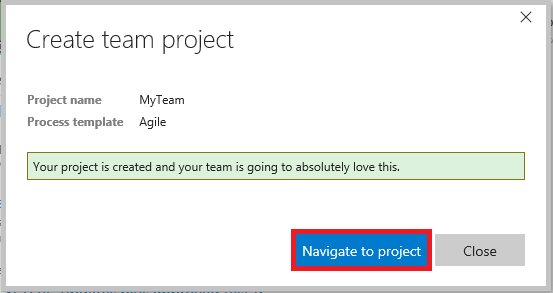

- If you see a **Congratulations!** popup window, click the **Add code** (button in red box). Otherwise, click **Code** (in yellow box). This directs you to the Git repository page of your project. 

	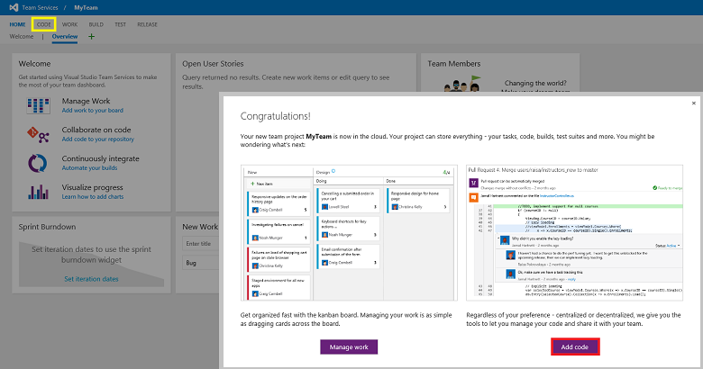

### Create the MyProjectTemplate repository (R3) on Git

- On the Git repository page of your project, click the downward arrow beside repository name **MyTeam**, and select **Manage repositories...**.

	

- On the **Version control** tab of the control panel of your project, click **MyTeam**, then select **Rename repository...**. 

	

- Input a new name to the repository in the **Rename the MyTeam repository** window. In this example, *MyTeamProjectTemplate*. You can choose something like *<Your team name\>ProjectTemplate*. Click **Rename** to continue.

	

### Create the MyTeamUtilities repository (R4) on Git

- To create a new repository *<your team name\>Utilities* under your project, click **New repository...** on the **Version control** tab of your project's control panel.  

	

- In the **Create a new repository** window that pops up, provide a name for this repository. In this example, we name it as *MyTeamUtilities*, which is **R4** in our notation. Choose something like *<your team name\>Utilities*. Make sure that you select **Git** for **Type**. Then, click **Create** to continue.

	

- Confirm that you see the two new Git repositories created under your project **MyTeam**. In this example: 

- **MyTeamProjectTemplate** (R3) 
- **MyTeamUtilities** (R4).

	

## 2. Seed your ProjectTemplate and TeamUtilities repositories

The seeding procedure uses the directories on your local DSVM as intermediate staging sites. If you need to customize your **ProjectTemplate** and **TeamUtilities** repositories to meet some specific team needs, you do so in the penultimate step of following procedure. Here is a summary of the steps used to seed the content of the **MyTeamProjectTemplate** and **MyTeamUtilities** repositories for a data science team. The individual steps correspond to the subsections in the seeding procedure:

- Clone group repository into local directory: team R1 - cloned to -> local D1
- Clone your team repositories into local directories: team R3 & R4 - cloned to -> local D3 & D4
- Copy the group project template content to the local team folder:  D1 - contents copied to -> D3
- (Optional) customization of local D3 & D4
- Push local directory content to team repositories: D3 & D4 - contents add to -> team R3 & R4

### Initialize the team repositories

In this step, you initialize your project template repository from the group project template repository:

- **MyTeamProjectTemplate** repository (**R3**) from your **GroupProjectTemplate** (**R1**) repository

### Clone group repositories into local directories

To begin this procedure:

- Create directories on your local machine:
	- For **Windows**: **C:\GitRepos\GroupCommon** and **C:\GitRepos\MyTeam**
	- For **Linux**: **GitRepos\GroupCommon** and **GitRepos\MyTeam** on your home directory 
- Change to directory **GitRepos\GroupCommon**.
- Run the following command, as appropriate, on the operating system of your local machine.

**Windows**

	git clone https://<Your Azure DevOps Services name>.visualstudio.com/GroupCommon/_git/GroupProjectTemplate
	

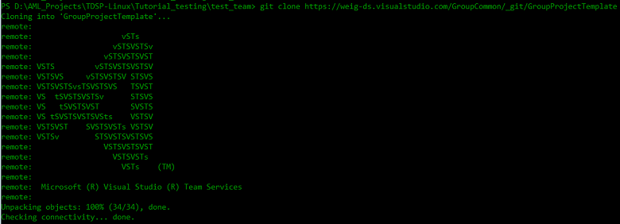

**Linux**
	
	git clone ssh://<Your Azure DevOps Services name>@<Your Azure DevOps Services name>.visualstudio.com:22/GroupCommon/_git/GroupProjectTemplate
	
	
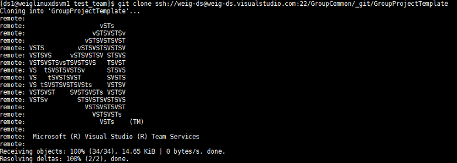

These commands clone your **GroupProjectTemplate** (R1) repository on your group Azure DevOps Services to local directory in **GitRepos\GroupCommon** on your local machine. After cloning, directory **GroupProjectTemplate** (D1) is created in directory **GitRepos\GroupCommon**. Here, we assume that your group manager created a project **GroupCommon**, and the **GroupProjectTemplate** repository is under this project. 

### Clone your team repositories into local directories

These commands clone your **MyTeamProjectTemplate** (R3) and **MyTeamUtilities** (R4) repositories under your project **MyTeam** on your group Azure DevOps Services to the **MyTeamProjectTemplate** (D3) and **MyTeamUtilities** (D4) directories in **GitRepos\MyTeam** on your local machine. 

- Change to directory **GitRepos\MyTeam**
- Run the following commands, as appropriate, on the operating system of your local machine. 

**Windows**

	git clone https://<Your Azure DevOps Services name>.visualstudio.com/<Your Team Name>/_git/MyTeamProjectTemplate
	git clone https://<Your Azure DevOps Services name>.visualstudio.com/<Your Team Name>/_git/MyTeamUtilities

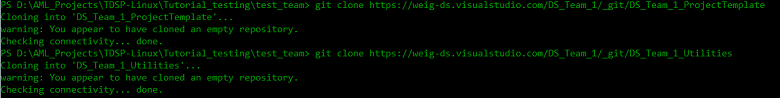
		
**Linux**
	
	git clone ssh://<Your Azure DevOps Services name>@<Your Azure DevOps Services name>.visualstudio.com:22/<Your Team Name>/_git/MyTeamProjectTemplate
	git clone ssh://<Your Azure DevOps Services name>@<Your Azure DevOps Services name>.visualstudio.com:22/<Your Team Name>/_git/MyTeamUtilities
	
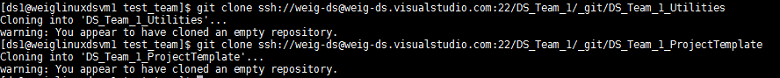

After cloning, two directories **MyTeamProjectTemplate** (D3) and **MyTeamUtilities** (D4) are created in directory **GitRepos\MyTeam**. We have assumed here that you named your project template and utilities repositories **MyTeamProjectTemplate** and **MyTeamUtilities**. 

### Copy the group project template content to the local project template directory

To copy the content of the local **GroupProjectTemplate** (D1) folder to the local **MyTeamProjectTemplate** (D3), run one of the following shell scripts: 

#### From the PowerShell command-line for Windows		

    wget "https://raw.githubusercontent.com/Azure/Azure-MachineLearning-DataScience/master/Misc/TDSP/tdsp_local_copy_win.ps1" -outfile "tdsp_local_copy_win.ps1"
    .\tdsp_local_copy_win.ps1 2

	

#### From the Linux shell for the **Linux DSVM**
	
	wget "https://raw.githubusercontent.com/Azure/Azure-MachineLearning-DataScience/master/Misc/TDSP/tdsp_local_copy_linux.sh"
	bash tdsp_local_copy_linux.sh 2
    
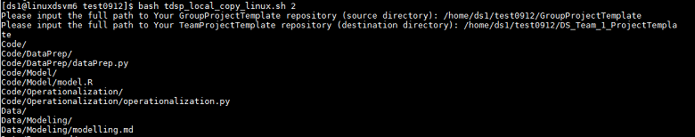

The scripts exclude the contents of the .git directory. The scripts prompt you to provide the **complete paths** to the source directory D1 and to the destination directory D3.
		

### Customize your project template or team utilities (optional)

Customize your **MyTeamProjectTemplate** (D3) and **MyTeamUtilities** (D4), if needed, at this stage of the setup process. 

- If you want to customize the contents of D3 to meet the specific needs of your team, you can modify the template documents or change the directory structure.

- If your team has developed some utilities that you want to share with your entire team, copy and paste these utilities into directory D4. 

### Push local directory content to team repositories

To add the contents in the (optionally customized) local directories D3 and D4 to the team repositories R3 and R4, run the following git bash commands either from a Windows PowerShell console or from the Linux shell. Run the commands from the **GitRepos\MyTeam\MyTeamProjectTemplate** directory.

	git status
	git add .
	git commit -m"push from DSVM"
	git push
	
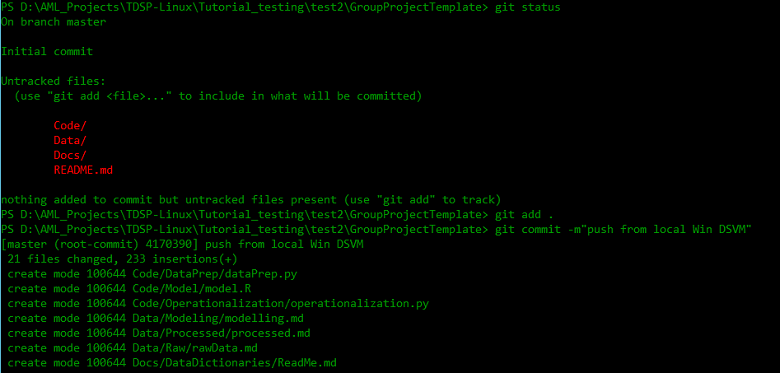

The files in the MyTeamProjectTemplate repository of your group's Azure DevOps Services are synced nearly instantly when this script is run.

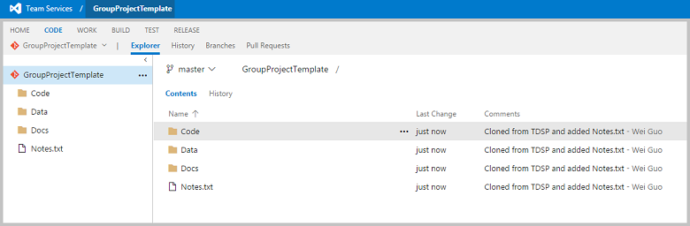

Now run the same set of four git commands from the **GitRepos\MyTeam\MyTeamUtilities** directory. 

> [AZURE.NOTE]If this is the first time you commit to a Git repository, you need to configure global parameters *user.name* and *user.email* before you run the `git commit` command. Run the following two commands:
		
	git config --global user.name <your name>
	git config --global user.email <your email address>
 
> If you are committing to multiple Git repositories, use the same name and email address when you commit to each of them. Using the same name and email address proves convenient later on when you build PowerBI dashboards to track your Git activities on multiple repositories.

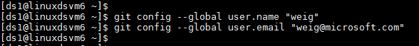

## 3. Create team data and analytics resources (Optional)

Sharing data and analytics resources with your entire team has performance and cost benefits: team members can execute their projects on the shared resources, save on budgets, and collaborate more efficiently. In this section, we provide instructions on how to create Azure file storage. In the next section, we provide instruction on how to mount Azure file storage to your local machine. For additional information on sharing other resources, such as Azure Data Science Virtual Machines, Azure HDInsight Spark Clusters, see [Platforms and tools](platforms-and-tools.md). This topic provides you guidance from a data science perspective on selecting resources that are appropriate for your needs, and links to product pages and other relevant and useful tutorials that we have published.

>[AZURE.NOTE] To avoid data transmitting cross data centers, which might be slow and costly, make sure that the resource group, storage account, and the Azure VM (e.g., DSVM) are in the same Azure data center. 

Run the following scripts to create Azure file storage for your team. Azure file storage for your team can be used to store data assets that are useful for your entire team. The scripts prompt you for your Azure account and subscription information, so have these credentials ready to enter. 

### Create Azure file storage with PowerShell from Windows

Run this script from the PowerShell command-line:

	wget "https://raw.githubusercontent.com/Azure/Azure-MachineLearning-DataScience/master/Misc/TDSP/CreateFileShare.ps1" -outfile "CreateFileShare.ps1"
	.\CreateFileShare.ps1

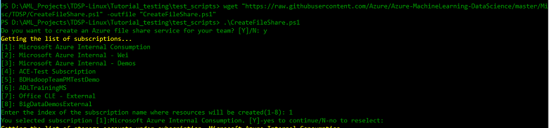	

Log in to your Microsoft Azure account when prompted:

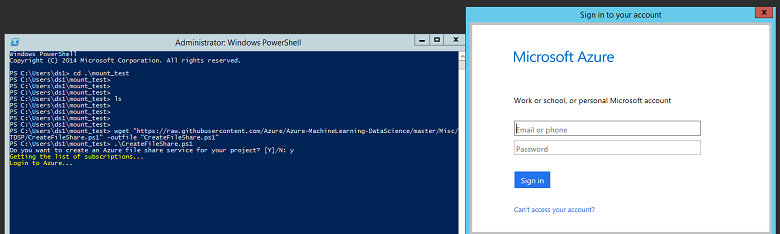

Select the Azure subscription you want to use:

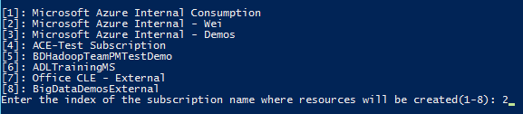

Select which storage account to use or create a new one under your selected subscription:

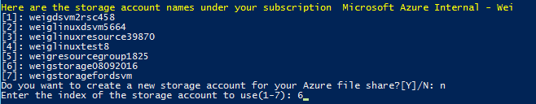

Enter the name of the Azure file storage to create. Only lower case characters, numbers and - are accepted:

To facilitate mounting and sharing this storage after it is created, save the Azure file storage information into a text file and make a note of the path to its location. In particular, you need this file to mount your Azure file storage to your Azure virtual machines in the next section. 

It is a good practice to check in this text file into your ProjectTemplate repository. We recommend to put in the directory **Docs\DataDictionaries**. Therefore, this data asset can be accessed by all projects in your team. 

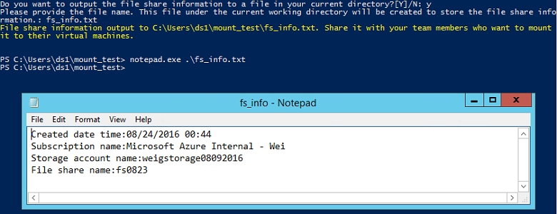

### Create Azure file storage with a Linux script

Run this script from the Linux shell:

	wget "https://raw.githubusercontent.com/Azure/Azure-MachineLearning-DataScience/master/Misc/TDSP/CreateFileShare.sh"
	bash CreateFileShare.sh

Log in to your Microsoft Azure account following the instructions on this screen:

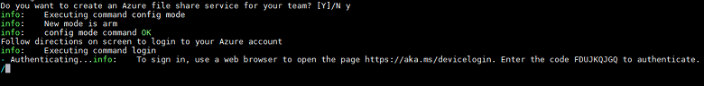

Select the Azure subscription that you want to use:

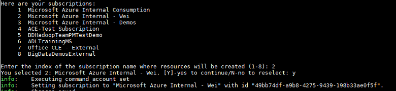

Select which storage account to use or create a new one under your selected subscription:

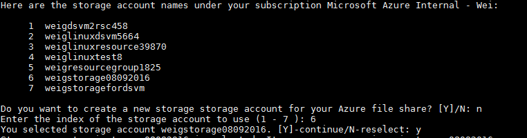

Enter the name of the Azure file storage to create, only lower case characters, numbers and - are accepted:

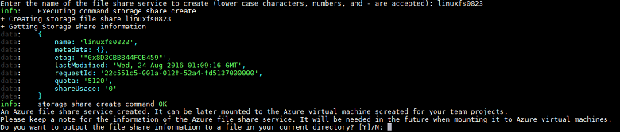

To facilitate accessing this storage after it is created, save the Azure file storage information into a text file and make a note of the path to its location. In particular, you need this file to mount your Azure file storage to your Azure virtual machines in the next section.

It is a good practice to check in this text file into your ProjectTemplate repository. We recommend to put in the directory **Docs\DataDictionaries**. Therefore, this data asset can be accessed by all projects in your team. 

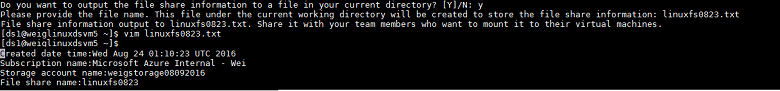

## 4. Mount Azure file storage (Optional)

After Azure file storage is created successfully, it can be mounted to your local machine using the one of the following PowerShell or Linux scripts.

### Mount Azure file storage with PowerShell from Windows

	wget "https://raw.githubusercontent.com/Azure/Azure-MachineLearning-DataScience/master/Misc/TDSP/AttachFileShare.ps1" -outfile "AttachFileShare.ps1"
	.\AttachFileShare.ps1
	
You are asked to log in first, if you have not logged in. 

Click **Enter** or **y** to continue when you are asked if you have an Azure file storage information file, and then input the ***complete path and name** of the file you create in previous step. The information to mount an Azure file storage is read directly from that file and you are ready to go to the next step.

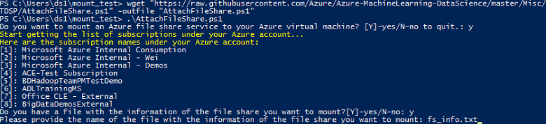

> [AZURE.NOTE] If you do not have a file containing the Azure file storage information, the steps to input the information from keyboard are provided at the end of this section.

Then you are asked to enter the name of the drive to be added to your virtual machine. A list of existing drive names is printed on the screen. You should provide a drive name that does not already exist in the list.

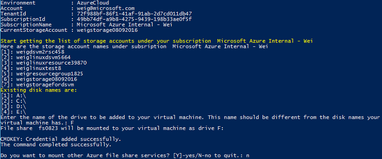

Confirm that a new F drive has been successfully mounted to your machine.

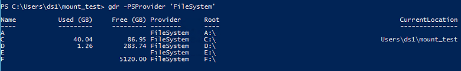

**How to enter the Azure file storage information manually:** 
If you do not have your Azure file storage information on a text file, you can follow the instructions on the following screen to type in the required subscription, storage account, and Azure file storage information:

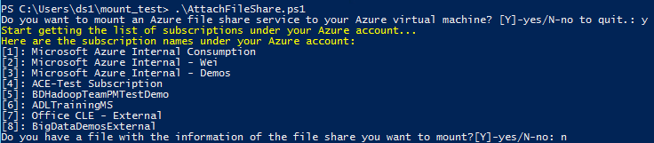

Type in your Azure subscription name, select the storage account where the Azure file storage is created, and type in the Azure file storage name:

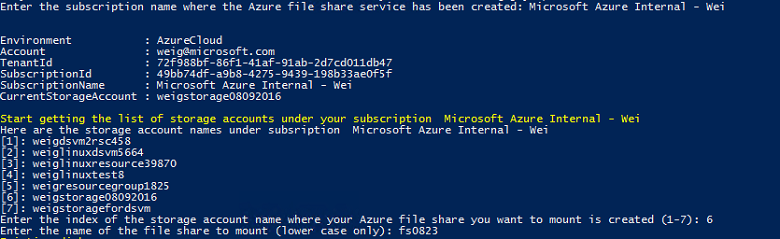

### Mount Azure file storage with a Linux script

	wget "https://raw.githubusercontent.com/Azure/Azure-MachineLearning-DataScience/master/Misc/TDSP/AttachFileShare.sh"
	bash AttachFileShare.sh

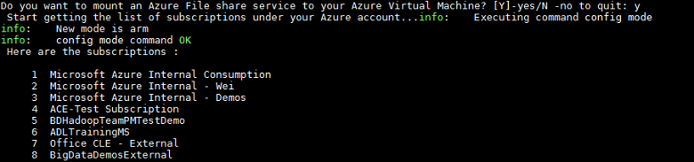

You are asked to log in first, if you have not logged in. 

Click **Enter** or **y** to continue when you are asked if you have an Azure file storage information file, and then input the ***complete path and name** of the file you create in previous step. The information to mount an Azure file storage is read directly from that file and you are ready to go to the next step.

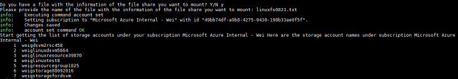

Then you are asked to enter the name of the drive to be added to your virtual machine. A list of existing drive names is printed on the screen. You should provide a drive name that does not already exist in the list.

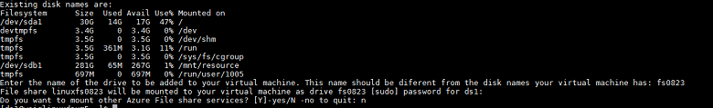

Confirm that a new F drive has been successfully mounted to your machine.

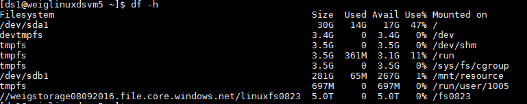

**How to enter the Azure file storage information manually:** 
If you do not have your Azure file storage information on a text file, you can follow the instructions on the following screen to type in the required subscription, storage account, and Azure file storage information:

- Input **n**.
- Select the index of the subscription name where the Azure file storage was created in the previous step:

	

- Select the storage account under your subscription and type in the Azure file storage name:

	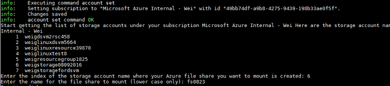

- Enter the name of drive to be added to your machine, which should be distinct from any existing ones:

	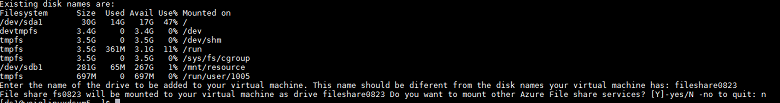

## 5. Set up security control policy 

From your group Azure DevOps Services's homepage, click the **gear icon** next to your user name in the upper right corner, then select the **Security** tab. You can add members to your team here with various permissions.

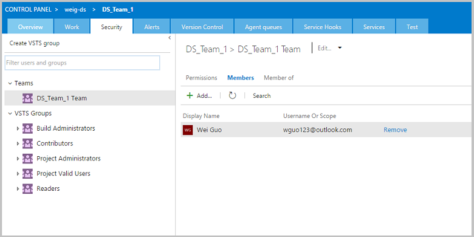

## Next steps

Here are links to the more detailed descriptions of the roles and tasks defined by the Team Data Science Process:

- [Group Manager tasks for a data science team](group-manager-tasks.md)
- [Team Lead tasks for a data science team](team-lead-tasks.md)
- [Project Lead tasks for a data science team](project-lead-tasks.md)
- [Project Individual Contributors for a data science team](project-ic-tasks.md)
