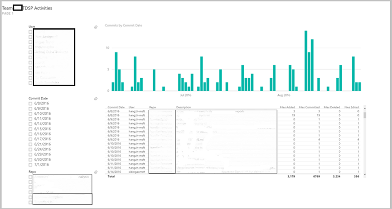
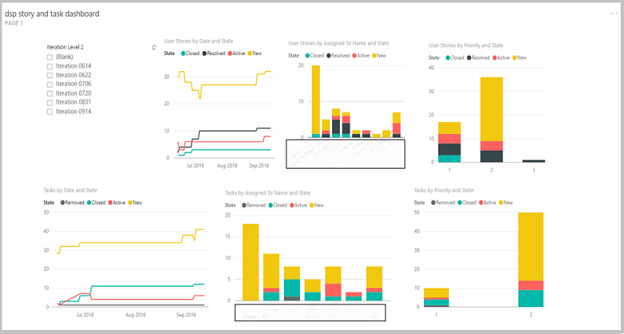

# Track progress of data science projects

Data science group managers, team leads, and project leads need to track the progress of their projects. They need to know what work has been done on them, who has done the work, and what work remains on the to-do lists. If you are using Visual Studio Team Services (VSTS), you are able to build Power BI dashboards to track the activities and the work items associated with a Git repository. 

For more information on how to connect Power BI to Visual Studio Team Services, see [Connect Power BI to Team Services](https://www.visualstudio.com/en-us/docs/report/powerbi/connect-vso-pbi-vs). 

To learn how to create Power BI dashboards and reports to track your Git repository activities and your work items after the data of VSTS is connected to Power BI, see [Create Power BI dashboards and reports](https://www.visualstudio.com/en-us/docs/report/powerbi/report-on-vso-with-power-bi-vs). 

Here are two simple example dashboards that are built to track Git activities and work items. In the first example dashboard, the git commitment activities are listed by different users, on different dates, and on different repositories. You can easily slice and dice to filter the ones that you are interested in.

In the second example dashboard, the work items (stories and tasks) in different iterations are presented. They are grouped by assignees and priority levels, and colored by state.

 
## Next steps

Walkthroughs that demonstrate all the steps in the process for **specific scenarios** are also provided. They are listed and linked with thumbnail descriptions in the [Example walkthroughs](walkthroughs.md) article. They illustrate how to combine cloud, on-premises tools, and services into a workflow or pipeline to create an intelligent application. 

For examples executing steps in the Team Data Science Process that use Azure Machine Learning Studio, see the [With Azure ML](http://aka.ms/datascienceprocess) learning path.