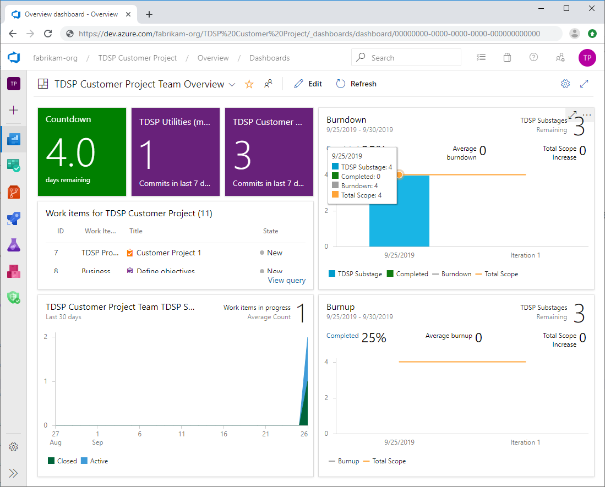

# Track the progress of data science projects

Data science group managers, team leads, and project leads can track the progress of their projects, such as what work has been done, who did it, and what work remains. 

## Azure DevOps dashboards

If you're using Azure DevOps, you can build dashboards to track the activities and work items associated with a given Agile project. For more information about dashboards, see [Dashboards](/azure/devops/report/dashboards/).

For instructions on how to create and customize dashboards and widgets in Azure DevOps, see the following quickstarts:

- [Add and manage dashboards](/azure/devops/report/dashboards/dashboards)
- [Add widgets to a dashboard](/azure/devops/report/dashboards/add-widget-to-dashboard).

## Example dashboard

Here is a simple example dashboard that tracks the sprint activities of an Agile data science project, including the number of commits to associated repositories. 

- At upper left, the **countdown** widget shows the number of days that remain in the current sprint. The two **code tiles** show the number of commits in the two project repositories for the past seven days. 

- Below the tiles are **query results** that show all work items and their current states. 

- Below the query results is a **cumulative flow diagram** (CFD) that shows the number of Closed and Active work items.

- At upper right is a **burndown chart** that shows work left to complete against remaining time in the sprint

- Below that is a **burnup chart** that shows completed work against the total amount of work in the sprint.

## Next steps

[Example walkthroughs](walkthroughs.md) lists walkthroughs that demonstrate all the steps in the process for specific scenarios, with links and thumbnail descriptions. The linked scenarios illustrate how to combine cloud and on-premises tools and services into workflows or pipelines to create intelligent applications. 
