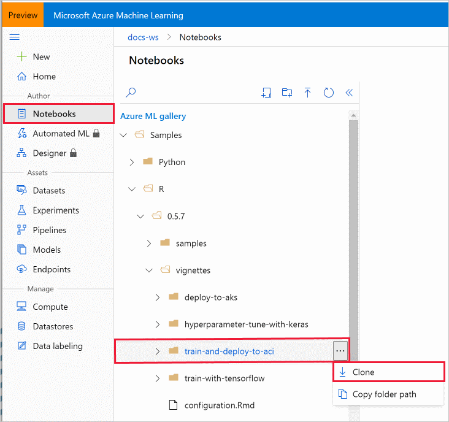

# Tutorial: Use R to create a machine learning model (preview)
[!INCLUDE [applies-to-skus](../../includes/aml-applies-to-basic-enterprise-sku.md)]

In this tutorial you'll use the Azure Machine Learning R SDK (preview) to create a logistic regression model that predicts the likelihood of a fatality in a car accident. You'll see how the Azure Machine Learning cloud resources work with R to provide a scalable environment for training and deploying a model.  

In this tutorial, you perform the following tasks:
> [!div class="checklist"]
> * Create an Azure Machine Learning workspace
> * Clone a notebook folder with the files necessary to run this tutorial into your workspace
> * Open RStudio from your workspace
> * Load data and prepare for training
> * Upload data to a datastore so it is available for remote training
> * Create a compute resource to train the model remotely
> * Train a `caret` model to predict probability of fatality
> * Deploy a prediction endpoint
> * Test the model from R

If you don't have an Azure subscription, create a free account before you begin. Try the [free or paid version of Azure Machine Learning](https://aka.ms/AMLFree) today.


## Create a workspace

An Azure Machine Learning workspace is a foundational resource in the cloud that you use to experiment, train, and deploy machine learning models. It ties your Azure subscription and resource group to an easily consumed object in the service. 

You create a workspace via the Azure portal, a web-based console for managing your Azure resources. 

[!INCLUDE [aml-create-portal](../../includes/aml-create-in-portal.md)]

>[!IMPORTANT] 
> Take note of your **workspace** and **subscription**. You'll need these to ensure you create your experiment in the right place. 


## <a name="azure"></a>Clone a notebook folder

This example uses the cloud notebook server in your workspace for an install-free and pre-configured experience. Use [your own environment](https://azure.github.io/azureml-sdk-for-r/articles/installation.html) if you prefer to have control over your environment, packages and dependencies.

You complete the following experiment set-up and run steps in Azure Machine Learning studio, a consolidated interface that includes machine learning tools to perform data science scenarios for data science practitioners of all skill levels.

1. Sign in to [Azure Machine Learning studio](https://ml.azure.com/).

1. Select your subscription and the workspace you created.

1. Select **Notebooks** on the left.

1. Open the **Samples** folder.

1. Open the **R** folder.

1. Open the folder with a version number on it.  This number represents the current release for the R SDK.

1. Select the **"..."** at the right of the **vignettes** folder and then select **Clone**.

    

1. A list of folders displays showing each user who accesses the workspace.  Select your folder to clone the **vignettes**  folder there.

## <a name="open"></a>Open RStudio

Use RStudio on a compute instance or Notebook VM to run this tutorial.  

1. Select **Compute** on the left.

1. Add a compute resource if one does not already exist.

1. Once the compute is running, use the **RStudio** link to open RStudio.

1. In RStudio, your *vignettes* folder is a few levels down from *Users* in the **Files** section on the lower right.  Under *vignettes*, select the *train-and-deploy-to-aci* folder to find the files needed in this tutorial.

> [!Important]
> The rest of this article contains the same content as you see in the  *train-and-deploy-to-aci.Rmd* file. 
> If you are experienced with RMarkdown, feel free to use the code from that file.  Or you can copy/paste the code snippets from there, or from this article into an R script or the command line.  


## Set up your development environment
The setup for your development work in this tutorial includes the following actions:

* Install required packages
* Connect to a workspace, so that your compute instance can communicate with remote resources
* Create an experiment to track your runs
* Create a remote compute target to use for training

### Install required packages

 * Install the latest version from CRAN.

    ```R
    # install the latest version from CRAN
    install.packages("azuremlsdk")
    azuremlsdk::install_azureml(envname = 'r-reticulate')
    ```
    
* Or install the development version from GitHub.

    ```R
    # or install the development version from GitHub
    remotes::install_github('https://github.com/Azure/azureml-sdk-for-r')
    azuremlsdk::install_azureml(envname = 'r-reticulate')
    ```

Now go ahead and import the **azuremlsdk** package.

```R
library(azuremlsdk)
```

The training and scoring scripts (`accidents.R` and `accident_predict.R`) have some additional dependencies. If you plan on running those scripts locally, make sure you have those required packages as well.

### Load your workspace
Instantiate a workspace object from your existing workspace. The following code will load the workspace details from the **config.json** file. You can also retrieve a workspace using [`get_workspace()`](https://azure.github.io/azureml-sdk-for-r/reference/get_workspace.html).

```R
ws <- load_workspace_from_config()
```

### Create an experiment
An Azure ML experiment tracks a grouping of runs, typically from the same training script. Create an experiment to track the runs for training the caret model on the accidents data.

```R
experiment_name <- "accident-logreg"
exp <- experiment(ws, experiment_name)
```

### Create a compute target
By using Azure Machine Learning Compute (AmlCompute), a managed service, data scientists can train machine learning models on clusters of Azure virtual machines. Examples include VMs with GPU support. In this tutorial, you create a single-node AmlCompute cluster as your training environment. The code below creates the compute cluster for you if it doesn't already exist in your workspace.

You may need to wait a few minutes for your compute cluster to be provisioned if it doesn't already exist.

```R
cluster_name <- "rcluster"
compute_target <- get_compute(ws, cluster_name = cluster_name)
if (is.null(compute_target)) {
  vm_size <- "STANDARD_D2_V2" 
  compute_target <- create_aml_compute(workspace = ws,
                                       cluster_name = cluster_name,
                                       vm_size = vm_size,
                                       max_nodes = 1)
}

wait_for_provisioning_completion(compute_target)
```

## Prepare data for training
This tutorial uses data from the US [National Highway Traffic Safety Administration](https://cdan.nhtsa.gov/tsftables/tsfar.htm) (with thanks to [Mary C. Meyer and Tremika Finney](https://www.stat.colostate.edu/~meyer/airbags.htm)).
This dataset includes data from over 25,000 car crashes in the US, with variables you can use to predict the likelihood of a fatality. First, import the data into R and transform it into a new dataframe `accidents` for analysis, and export it to an `Rdata` file.

```R
nassCDS <- read.csv("nassCDS.csv", 
                     colClasses=c("factor","numeric","factor",
                                  "factor","factor","numeric",
                                  "factor","numeric","numeric",
                                  "numeric","character","character",
                                  "numeric","numeric","character"))
accidents <- na.omit(nassCDS[,c("dead","dvcat","seatbelt","frontal","sex","ageOFocc","yearVeh","airbag","occRole")])
accidents$frontal <- factor(accidents$frontal, labels=c("notfrontal","frontal"))
accidents$occRole <- factor(accidents$occRole)
accidents$dvcat <- ordered(accidents$dvcat, 
                          levels=c("1-9km/h","10-24","25-39","40-54","55+"))

saveRDS(accidents, file="accidents.Rd")
```

### Upload data to the datastore
Upload data to the cloud so that it can be access by your remote training environment. Each Azure Machine Learning workspace comes with a default datastore that stores the connection information to the Azure blob container that is provisioned in the storage account attached to the workspace. The following code will upload the accidents data you created above to that datastore.

```R
ds <- get_default_datastore(ws)

target_path <- "accidentdata"
upload_files_to_datastore(ds,
                          list("./accidents.Rd"),
                          target_path = target_path,
                          overwrite = TRUE)
```


## Train a model

For this tutorial, fit a logistic regression model on your uploaded data using your remote compute cluster. To submit a job, you need to:

* Prepare the training script
* Create an estimator
* Submit the job

### Prepare the training script
A training script called `accidents.R` has been provided for you in the same directory as this tutorial. Notice the following details **inside the training script** that have been done to leverage Azure Machine Learning for training:

* The training script takes an argument `-d` to find the directory that contains the training data. When you define and submit your job later, you point to the datastore for this argument. Azure ML will mount the storage folder to the remote cluster for the training job.
* The training script logs the final accuracy as a metric to the run record in Azure ML using `log_metric_to_run()`. The Azure ML SDK provides a set of logging APIs for logging various metrics during training runs. These metrics are recorded and persisted in the experiment run record. The metrics can then be accessed at any time or viewed in the run details page in [studio](https://ml.azure.com). See the [reference](https://azure.github.io/azureml-sdk-for-r/reference/index.html#section-training-experimentation) for the full set of logging methods `log_*()`.
* The training script saves your model into a directory named **outputs**. The `./outputs` folder receives special treatment by Azure ML. During training, files written to `./outputs` are automatically uploaded to your run record by Azure ML and persisted as artifacts. By saving the trained model to `./outputs`, you'll be able to access and retrieve your model file even after the run is over and you no longer have access to your remote training environment.

### Create an estimator

An Azure ML estimator encapsulates the run configuration information needed for executing a training script on the compute target. Azure ML runs are run as containerized jobs on the specified compute target. By default, the Docker image built for your training job will include R, the Azure ML SDK, and a set of commonly used R packages. See the full list of default packages included here.

To create the estimator, define:

* The directory that contains your scripts needed for training (`source_directory`). All the files in this directory are uploaded to the cluster node(s) for execution. The directory must contain your training script and any additional scripts required.
* The training script that will be executed (`entry_script`).
* The compute target (`compute_target`), in this case the AmlCompute cluster you created earlier.
* The parameters required from the training script (`script_params`). Azure ML will run your training script as a command-line script with `Rscript`. In this tutorial you specify one argument to the script, the data directory mounting point, which you can access with `ds$path(target_path)`.
* Any environment dependencies required for training. The default Docker image built for training already contains the three packages (`caret`, `e1071`, and `optparse`) needed in the training script.  So you don't need to specify additional information. If you are using R packages that are not included by default, use the estimator's `cran_packages` parameter to add additional CRAN packages. See the [`estimator()`](https://azure.github.io/azureml-sdk-for-r/reference/estimator.html) reference for the full set of configurable options.

```R
est <- estimator(source_directory = ".",
                 entry_script = "accidents.R",
                 script_params = list("--data_folder" = ds$path(target_path)),
                 compute_target = compute_target
                 )
```

### Submit the job on the remote cluster

Finally submit the job to run on your cluster. `submit_experiment()` returns a Run object that you then use to interface with the run. In total, the first run takes **about 10 minutes**. But for later runs, the same Docker image is reused as long as the script dependencies don't change.  In this case, the image is cached and the container startup time is much faster.

```R
run <- submit_experiment(exp, est)
```

You can view the run's details in RStudio Viewer. Clicking the "Web View" link provided will bring you to Azure Machine Learning studio, where you can monitor the run in the UI.

```R
view_run_details(run)
```

Model training happens in the background. Wait until the model has finished training before you run more code.

```R
wait_for_run_completion(run, show_output = TRUE)
```

You -- and colleagues with access to the workspace -- can submit multiple experiments in parallel, and Azure ML will take of scheduling the tasks on the compute cluster. You can even configure the cluster to automatically scale up to multiple nodes, and scale back when there are no more compute tasks in the queue. This configuration is a cost-effective way for teams to share compute resources.

## Retrieve training results
Once your model has finished training, you can access the artifacts of your job that were persisted to the run record, including any metrics logged and the final trained model.

### Get the logged metrics
In the training script `accidents.R`, you logged a metric from your model: the accuracy of the predictions in the training data. You can see metrics in the [studio](https://ml.azure.com), or extract them to the local session as an R list as follows:

```R
metrics <- get_run_metrics(run)
metrics
```

If you've run multiple experiments (say, using differing variables, algorithms, or hyperparamers), you can use the metrics from each run to compare and choose the model you'll use in production.

### Get the trained model
You can retrieve the trained model and look at the results in your local R session. The following code will download the contents of the `./outputs` directory, which includes the model file.

```R
download_files_from_run(run, prefix="outputs/")
accident_model <- readRDS("outputs/model.rds")
summary(accident_model)
```

You see some factors that contribute to an increase in the estimated probability of death:

* higher impact speed 
* male driver
* older occupant
* passenger

You see lower probabilities of death with:

* presence of airbags
* presence seatbelts
* frontal collision 

The vehicle year of manufacture does not have a significant effect.

You can use this model to make new predictions:

```R
newdata <- data.frame( # valid values shown below
 dvcat="10-24",        # "1-9km/h" "10-24"   "25-39"   "40-54"   "55+"  
 seatbelt="none",      # "none"   "belted"  
 frontal="frontal",    # "notfrontal" "frontal"
 sex="f",              # "f" "m"
 ageOFocc=16,          # age in years, 16-97
 yearVeh=2002,         # year of vehicle, 1955-2003
 airbag="none",        # "none"   "airbag"   
 occRole="pass"        # "driver" "pass"
 )

## predicted probability of death for these variables, as a percentage
as.numeric(predict(accident_model,newdata, type="response")*100)
```

## Deploy as a web service

With your model, you can predict the danger of death from a collision. Use Azure ML to deploy your model as a prediction service. In this tutorial, you will deploy the web service in [Azure Container Instances](https://docs.microsoft.com/azure/container-instances/) (ACI).

### Register the model

First, register the model you downloaded to your workspace with [`register_model()`](https://azure.github.io/azureml-sdk-for-r/reference/register_model.html). A registered model can be any collection of files, but in this case the R model object is sufficient. Azure ML will use the registered model for deployment.

```R
model <- register_model(ws, 
                        model_path = "outputs/model.rds", 
                        model_name = "accidents_model",
                        description = "Predict probablity of auto accident")
```

### Define the inference dependencies
To create a web service for your model, you first need to create a scoring script (`entry_script`), an R script that will take as input variable values (in JSON format) and output a prediction from your model. For this tutorial, use the provided scoring file `accident_predict.R`. The scoring script must contain an `init()` method that loads your model and returns a function that uses the model to make a prediction based on the input data. See the [documentation](https://azure.github.io/azureml-sdk-for-r/reference/inference_config.html#details) for more details.

Next, define an Azure ML **environment** for your script's package dependencies. With an environment, you specify R packages (from CRAN or elsewhere) that are needed for your script to run. You can also provide the values of environment variables that your script can reference to modify its behavior. By default, Azure ML will build the same default Docker image used with the estimator for training. Since the tutorial has no special requirements, create an environment with no special attributes.

```R
r_env <- r_environment(name = "basic_env")
```

If you want to use your own Docker image for deployment instead, specify the `custom_docker_image` parameter. See the [`r_environment()`](https://azure.github.io/azureml-sdk-for-r/reference/r_environment.html) reference for the full set of configurable options for defining an environment.

Now you have everything you need to create an **inference config** for encapsulating your scoring script and environment dependencies.

```R
inference_config <- inference_config(
  entry_script = "accident_predict.R",
  environment = r_env)
```

### Deploy to ACI
In this tutorial, you will deploy your service to ACI. This code provisions a single container to respond to inbound requests, which is suitable for testing and light loads. See [`aci_webservice_deployment_config()`](https://azure.github.io/azureml-sdk-for-r/reference/aci_webservice_deployment_config.html) for additional configurable options. (For production-scale deployments, you can also [deploy to Azure Kubernetes Service](https://azure.github.io/azureml-sdk-for-r/articles/deploy-to-aks.html).)

``` R
aci_config <- aci_webservice_deployment_config(cpu_cores = 1, memory_gb = 0.5)
```

Now you deploy your model as a web service. Deployment **can take several minutes**. 

```R
aci_service <- deploy_model(ws, 
                            'accident-pred', 
                            list(model), 
                            inference_config, 
                            aci_config)

wait_for_deployment(aci_service, show_output = TRUE)
```

## Test the deployed service

Now that your model is deployed as a service, you can test the service from R using [`invoke_webservice()`](https://azure.github.io/azureml-sdk-for-r/reference/invoke_webservice.html).  Provide a new set of data to predict from, convert it to JSON, and send it to the service.

```R
library(jsonlite)

newdata <- data.frame( # valid values shown below
 dvcat="10-24",        # "1-9km/h" "10-24"   "25-39"   "40-54"   "55+"  
 seatbelt="none",      # "none"   "belted"  
 frontal="frontal",    # "notfrontal" "frontal"
 sex="f",              # "f" "m"
 ageOFocc=22,          # age in years, 16-97
 yearVeh=2002,         # year of vehicle, 1955-2003
 airbag="none",        # "none"   "airbag"   
 occRole="pass"        # "driver" "pass"
 )

prob <- invoke_webservice(aci_service, toJSON(newdata))
prob
```

You can also get the web service's HTTP endpoint, which accepts REST client calls. You can share this endpoint with anyone who wants to test the web service or integrate it into an application.

```R
aci_service$scoring_uri
```

## Clean up resources

Delete the resources once you no longer need them. Don't delete any resource you plan to still use. 

Delete the web service:
```R
delete_webservice(aci_service)
```

Delete the registered model:
```R
delete_model(model)
```

Delete the compute cluster:
```R
delete_compute(compute)
```

### Delete everything

[!INCLUDE [aml-delete-resource-group](../../includes/aml-delete-resource-group.md)]

You can also keep the resource group but delete a single workspace. Display the workspace properties and select **Delete**.

## Next steps

* Now that you've completed your first Azure Machine Learning experiment in R, learn more about the [Azure Machine Learning SDK for R](https://azure.github.io/azureml-sdk-for-r/index.html).

* Learn more about Azure Machine Learning with R from the examples in the other *vignettes* folders.
