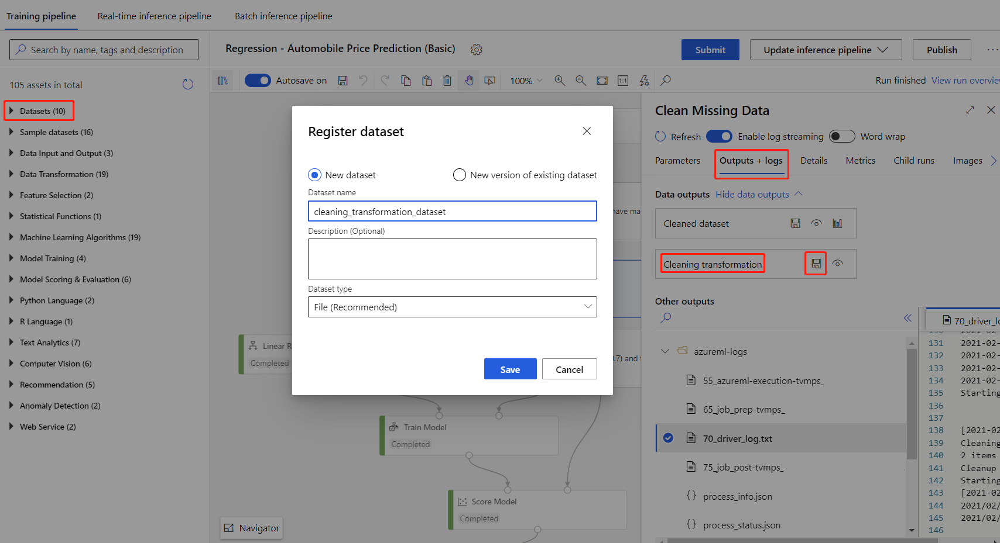

# Tutorial: Designer - deploy a machine learning model

Use the designer to deploy a machine learning model to predict the price of cars. This tutorial is part two of a two-part series.

In [part one of the tutorial](tutorial-designer-automobile-price-train-score.md) you trained a linear regression model on car prices. In part two, you deploy the model to give others a chance to use it. In this tutorial, you:

> [!div class="checklist"]
> * Create a real-time inference pipeline.
> * Create an inferencing cluster.
> * Deploy the real-time endpoint.
> * Test the real-time endpoint.

## Prerequisites

Complete [part one of the tutorial](tutorial-designer-automobile-price-train-score.md) to learn how to train and score a machine learning model in the designer.

[!INCLUDE [machine-learning-missing-ui](../../includes/machine-learning-missing-ui.md)]

## Create a real-time inference pipeline

To deploy your pipeline, you must first convert the training pipeline into a real-time inference pipeline. This process removes training modules and adds web service inputs and outputs to handle requests.

### Create a real-time inference pipeline

1. Above the pipeline canvas, select **Create inference pipeline** > **Real-time inference pipeline**.

    :::image type="content" source="./media/tutorial-designer-automobile-price-deploy/tutorial2-create-inference-pipeline.png" alt-text="Screenshot showing where to find the create pipeline button":::

    Your pipeline should now look like this: 

   

    When you select **Create inference pipeline**, several things happen:
    
    * The trained model is stored as a **Dataset** module in the module palette. You can find it under **My Datasets**.
    * Training modules like **Train Model** and **Split Data** are removed.
    * The saved trained model is added back into the pipeline.
    * **Web Service Input** and **Web Service Output** modules are added. These modules show where user data enters the pipeline and where data is returned.

    > [!NOTE]
    > By default, the **Web Service Input** will expect the same data schema as the module output data which connects to the same downstream port as it. In this sample, **Web Service Input** and **Automobile price data (Raw)** connect to the same downstream module, hence **Web Service Input** expect the same data schema as **Automobile price data (Raw)** and target variable column `price` is included in the schema.
    > However, usually When you score the data, you won't know the target variable values. For such case, you can remove the target variable column in the inference pipeline using **Select Columns in Dataset** module. Make sure that the output of **Select Columns in Dataset** removing target variable column is connected to the same port as the output of the **Web Service Intput** module.

1. Select **Submit**, and use the same compute target and experiment that you used in part one.

    If this is the first run, it may take up to 20 minutes for your pipeline to finish running. The default compute settings have a minimum node size of 0, which means that the designer must allocate resources after being idle. Repeated pipeline runs will take less time since the compute resources are already allocated. Additionally, the designer uses cached results for each module to further improve efficiency.

1. Select **Deploy**.

## Create an inferencing cluster

In the dialog box that appears, you can select from any existing Azure Kubernetes Service (AKS) clusters to deploy your model to. If you don't have an AKS cluster, use the following steps to create one.

1. Select **Compute** in the dialog box that appears to go to the **Compute** page.

1. On the navigation ribbon, select **Inference Clusters** > **+ New**.

    
   
1. In the inference cluster pane, configure a new Kubernetes Service.

1. Enter *aks-compute* for the **Compute name**.
    
1. Select a nearby region that's available for the **Region**.

1. Select **Create**.

    > [!NOTE]
    > It takes approximately 15 minutes to create a new AKS service. You can check the provisioning state on the **Inference Clusters** page.
    >

## Deploy the real-time endpoint

After your AKS service has finished provisioning, return to the real-time inferencing pipeline to complete deployment.

1. Select **Deploy** above the canvas.

1. Select **Deploy new real-time endpoint**. 

1. Select the AKS cluster you created.

    :::image type="content" source="./media/tutorial-designer-automobile-price-deploy/setup-endpoint.png" alt-text="Screenshot showing how to set up a new real-time endpoint":::

    You can also change **Advanced** setting for your real-time endpoint.
    
    |Advanced setting|Description|
    |---|---|
    |Enable Application Insights diagnostics and data collection| Whether to enable Azure Application Insights to collect data from the deployed endpoints.   By default: false |
    |Scoring timeout| A timeout in milliseconds to enforce for scoring calls to the web service. By default: 60000|
    |Auto scale enabled|   Whether to enable autoscaling for the web service. By default: true|
    |Min replicas| The minimum number of containers to use when autoscaling this web service. By default: 1|
    |Max replicas| The maximum number of containers to use when autoscaling this web service.  By default: 10|
    |Target utilization|The target utilization (in percent out of 100) that the autoscaler should attempt to maintain for this web service.  By default: 70|
    |Refresh period|How often (in seconds) the autoscaler attempts to scale this web service.  By default: 1|
    |CPU reserve capacity|The number of CPU cores to allocate for this web service.  By default: 0.1|
    |Memory reserve capacity|The amount of memory (in GB) to allocate for this web service.  By default: 0.5|
        

1. Select **Deploy**. 

    A success notification above the canvas appears after deployment finishes. It might take a few minutes.

> [!TIP]
> You can also deploy to **Azure Container Instance** (ACI) if you select **Azure Container Instance** for **Compute type** in the real-time endpoint setting box.
> Azure Container Instance is used for testing or development. Use ACI for low-scale CPU-based workloads that require less than 48 GB of RAM.

## Test the real-time endpoint

After deployment finishes, you can view your real-time endpoint by going to the **Endpoints** page.

1. On the **Endpoints** page, select the endpoint you deployed.

    In the **Details** tab, you can see more information such as the REST URI, Swagger definition, status, and tags.

    In the **Consume** tab, you can find sample consumption code, security keys, and set authentication methods.

    In the **Deployment logs** tab, you can find the detailed deployment logs of your real-time endpoint.

1. To test your endpoint, go to the **Test** tab. From here, you can enter test data and select **Test** verify the output of your endpoint.

For more information on consuming your web service, see [Consume a model deployed as a webservice](how-to-consume-web-service.md)

## Limitations

### Update inference pipeline

If you make some modifications in your training pipeline, you should resubmit the training pipeline, **Update** the inference pipeline and run the inference pipeline again.

Note that only trained models will be updated in the inference pipeline, while data transformation will not be updated.

To use the updated transformation in inference pipeline, you need to register the transformation output of the transformation module as dataset.

Then manually replace the **TD-** module in inference pipeline with the registered dataset.

Then you can submit the inference pipeline with the updated model and transformation, and deploy.

### Deploy real-time endpoint

Due to datstore access limitation, if your inference pipeline contains **Import Data** or **Export Data** module, they will be auto-removed when deploy to real-time endpoint.

## Clean up resources

[!INCLUDE [aml-ui-cleanup](../../includes/aml-ui-cleanup.md)]

## Next steps

In this tutorial, you learned the key steps in how to create, deploy, and consume a machine learning model in the designer. To learn more about how you can use the designer see the following links:

+ [Designer samples](samples-designer.md): Learn how to use the designer to solve other types of problems.
+ [Use Azure Machine Learning studio in an Azure virtual network](how-to-enable-studio-virtual-network.md).
