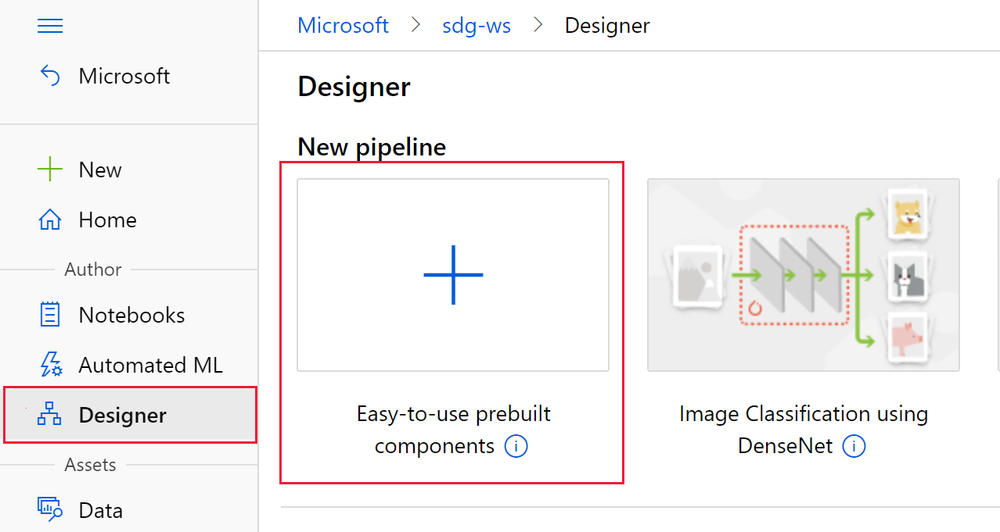
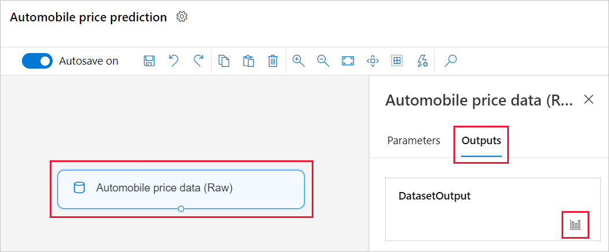
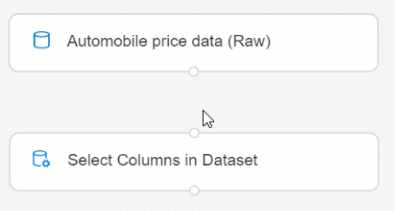
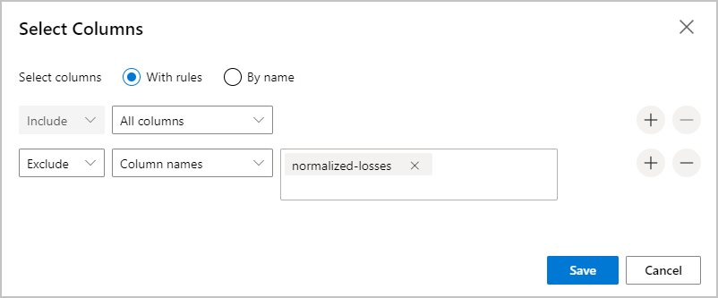
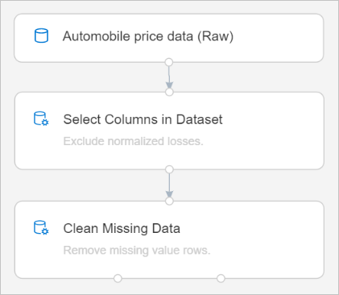
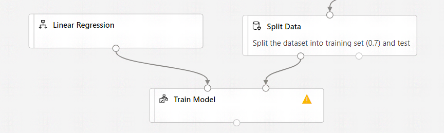
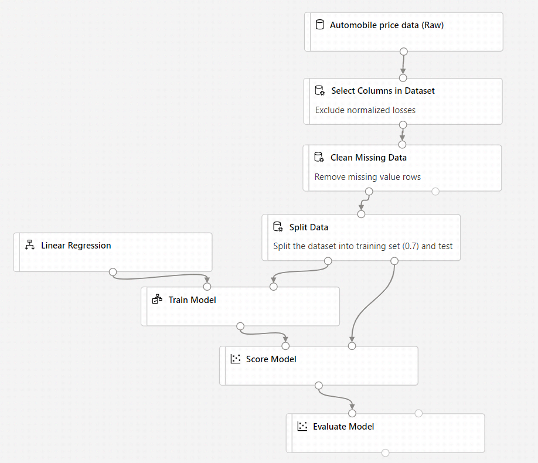
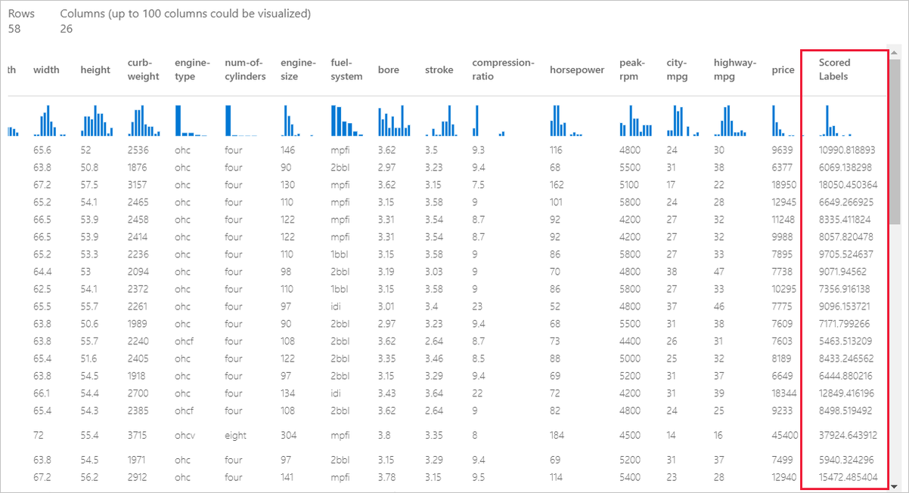

# Tutorial: Predict automobile price with the designer (preview)
[!INCLUDE [applies-to-skus](../../includes/aml-applies-to-enterprise-sku.md)]

In this two-part tutorial, you learn how to use the Azure Machine Learning designer to develop and deploy a predictive analytics solution that predicts the price of any car.

In part one of the tutorial, you'll learn how to:

> [!div class="checklist"]
> * Create a new pipeline.
> * Import data.
> * Prepare data.
> * Train a machine learning model.
> * Evaluate a machine learning model.

In [part two](tutorial-designer-automobile-price-deploy.md) of the tutorial, you'll deploy your model as a real-time inferencing endpoint to predict the price of any car based on technical specifications you send it. 

> [!NOTE]
>A completed version of this tutorial is available as a sample pipeline.
>
>To find it, go to the designer in your workspace. In the **New pipeline** section, select **Sample 1 - Regression: Automobile Price Prediction(Basic)**.

## Create a new pipeline

Azure Machine Learning pipelines organize multiple machine learning and data processing steps into a single resource. Pipelines let you organize, manage, and reuse complex machine learning workflows across projects and users.

To create an Azure Machine Learning pipeline, you need an Azure Machine Learning workspace. In this section, you learn how to create both these resources.

### Create a new workspace

If you have an Azure Machine Learning workspace with an Enterprise edition, [skip to the next section](#create-the-pipeline).

[!INCLUDE [aml-create-portal](../../includes/aml-create-in-portal-enterprise.md)]

### Create the pipeline

1. Sign in to [ml.azure.com](https://ml.azure.com), and select the workspace you want to work with.

1. Select **Designer**.

    

1. Select **Easy-to-use prebuilt modules**.

1. At the top of the canvas, select the default pipeline name **Pipeline-Created-on**. Rename it to *Automobile price prediction*. The name doesn't need to be unique.

## Import data

There are several sample datasets included in the designer for you to experiment with. For this tutorial, use **Automobile price data (Raw)**. 

1. To the left of the pipeline canvas is a palette of datasets and modules. Select **Datasets**, and then view the **Samples** section to view the available sample datasets.

1. Select the dataset **Automobile price data (Raw)**, and drag it onto the canvas.

   

### Visualize the data

You can visualize the data to understand the dataset that you'll use.

1. Select the **Automobile price data (Raw)** module.

1. In the properties pane to the right of the canvas, select **Outputs**.

1. Select the graph icon to visualize the data.

    

1. Select the different columns in the data window to view information about each one.

    Each row represents an automobile, and the variables associated with each automobile appear as columns. There are 205 rows and 26 columns in this dataset.

## Prepare data

Datasets typically require some preprocessing before analysis. You might have noticed some missing values when you inspected the dataset. These missing values must be cleaned so that the model can analyze the data correctly.

### Remove a column

When you train a model, you have to do something about the data that's missing. In this dataset, the **normalized-losses** column is missing many values, so you exclude that column from the model altogether.

1. Enter **Select** in the search box at the top of the palette to find the **Select Columns in Dataset** module.

1. Drag the **Select Columns in Dataset** module onto the canvas. Drop the module below the dataset module.

1. Connect the **Automobile price data (Raw)** dataset to the **Select Columns in Dataset** module. Drag from the dataset's output port, which is the small circle at the bottom of the dataset on the canvas, to the input port of **Select Columns in Dataset**, which is the small circle at the top of the module.

    > [!TIP]
    > You create a flow of data through your pipeline when you connect the output port of one module to an input port of another.
    >

    

1. Select the **Select Columns in Dataset** module.

1. In the properties pane to the right of the canvas, select **All columns**.

1. Select the **+** to add a new rule.

1. From the drop-down menu, select **Exclude** and **Column names**.
    
1. Enter *normalized-losses* in the text box.

1. In the lower right, select **Save** to close the column selector.

    

1. Select the **Select Columns in Dataset** module. 

1. In the properties pane, select the **Comment** text box and enter *Exclude normalized losses*.

    Comments will appear on the graph to help you organize your pipeline.

### Clean missing data

Your dataset still has missing values after you remove the **normalized-losses** column. You can remove the remaining missing data by using the **Clean Missing Data** module.

> [!TIP]
> Cleaning the missing values from input data is a prerequisite for using most of the modules in the designer.

1. Enter **Clean** in the search box to find the **Clean Missing Data** module.

1. Drag the **Clean Missing Data** module to the pipeline canvas. Connect it to the **Select Columns in Dataset** module. 

1. In the properties pane, select **Remove entire row** under **Cleaning mode**.

1. In the properties pane **Comment** box, enter *Remove missing value rows*. 

    Your pipeline should now look something like this:
    
    

## Train a machine learning model

Now that you have the modules in place to process the data, you can set up the training modules.

Because you want to predict price, which is a number, you can use a regression algorithm. For this example, you use a linear regression model.

### Split the data

Splitting data is a common task in machine learning. You will split your data into two separate datasets. One dataset will train the model and the other will test how well the model performed.

1. Enter **split data** in the search box to find the **Split Data** module. Connect the left port of the **Clean Missing Data** module to the **Split Data** module.

    > [!IMPORTANT]
    > Be sure that the left output ports of **Clean Missing Data** connects to **Split Data**. The left port contains the the cleaned data. The right port contains the discarted data.

1. Select the **Split Data** module.

1. In the properties pane, set the **Fraction of rows in the first output dataset** to 0.7.

    This option splits 70 percent of the data to train the model and 30 percent for testing it. The 70 percent dataset will be accessible through the left output port. The remaining data will be available through the right output port.

1. In the properties pane **Comment** box, enter *Split the dataset into training set (0.7) and test set (0.3)*.

### Train the model

Train the model by giving it a dataset that includes the price. The algorithm constructs a model that explains the relationship between the features and the price as presented by the training data.

1. To select the learning algorithm, clear your module palette search box.

1. Expand **Machine Learning Algorithms**.
    
    This option displays several categories of modules that you can use to initialize learning algorithms.

1. Select **Regression** > **Linear Regression**, and drag it to the pipeline canvas.

1. Find and drag the **Train Model** module to the pipeline canvas. 

1. Connect the output of the **Linear Regression** module to the left input of the **Train Model** module.

1. Connect the training data output (left port) of the **Split Data** module to the right input of the **Train Model** module.
    
    > [!IMPORTANT]
    > Be sure that the left output ports of **Split Data** connects to **Train Model**. The left port contains the the training set. The right port contains the test set.

    

1. Select the **Train Model** module.

1. In the properties pane, select **Edit column** selector.

1. In the **Label column** dialog box, expand the drop-down menu and select **Column names**. 

1. In the text box, enter *price* to specify the value that your model is going to predict.

    Your pipeline should look like this:

    

## Score a machine learning model

After you train your model by using 70 percent of the data, you can use it to score the other 30 percent to see how well your model functions.

1. Enter *score model* in the search box to find the **Score Model** module. Drag the module to the pipeline canvas. 

1. Connect the output of the **Train Model** module to the left input port of **Score Model**. Connect the test data output (right port) of the **Split Data** module to the right input port of **Score Model**.

## Evaluate a machine learning model

Use the **Evaluate Model** module to evaluate how well your model scored the test dataset.

1. Enter *evaluate* in the search box to find the **Evaluate Model** module. Drag the module to the pipeline canvas. 

1. Connect the output of the **Score Model** module to the left input of **Evaluate Model**. 

    The final pipeline should look something like this:

    

## Run the pipeline

[!INCLUDE [aml-ui-create-training-compute](../../includes/aml-ui-create-training-compute.md)]

### View scored labels

After the run completes, you can view the results of the pipeline run. First, look at the predictions generated by the regression model.

1. Select the **Score Model** module to view its output.

1. In the properties pane, select **Outputs** > graph icon  to view results.

    Here you can see the predicted prices and the actual prices from the testing data.

    

### Evaluate models

Use the **Evaluate Model** to see how well the trained model performed on the test dataset.

1. Select the **Evaluate Model** module to view its output.

1. In the properties pane, select **Output** > graph icon  to view results.

The following statistics are shown for your model:

* **Mean Absolute Error (MAE)**: The average of absolute errors. An error is the difference between the predicted value and the actual value.
* **Root Mean Squared Error (RMSE)**: The square root of the average of squared errors of predictions made on the test dataset.
* **Relative Absolute Error**: The average of absolute errors relative to the absolute difference between actual values and the average of all actual values.
* **Relative Squared Error**: The average of squared errors relative to the squared difference between the actual values and the average of all actual values.
* **Coefficient of Determination**: Also known as the R squared value, this statistical metric indicates how well a model fits the data.

For each of the error statistics, smaller is better. A smaller value indicates that the predictions are closer to the actual values. For the coefficient of determination, the closer its value is to one (1.0), the better the predictions.

## Clean up resources

[!INCLUDE [aml-ui-cleanup](../../includes/aml-ui-cleanup.md)]

## Next steps

In part one of this tutorial, you completed the following tasks:

* Create a pipeline
* Prepare the data
* Train the model
* Score and evaluate the model

In part two, you'll learn how to deploy your model as a real-time endpoint.

> [!div class="nextstepaction"]
> [Continue to deploying models](tutorial-designer-automobile-price-deploy.md)
