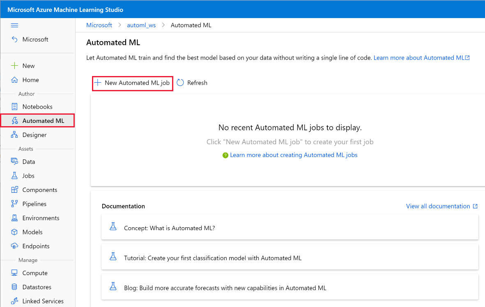
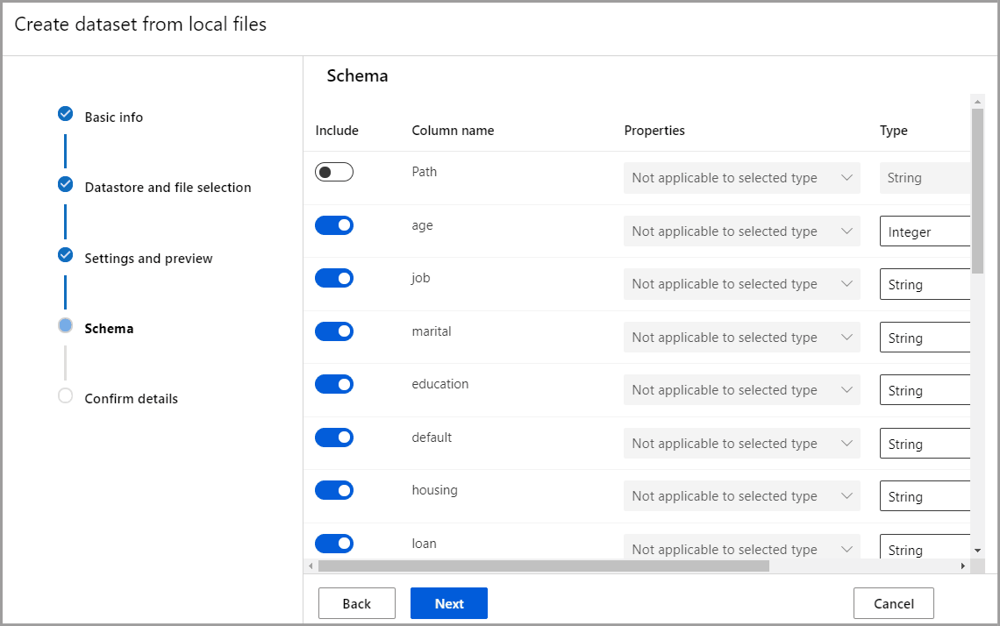
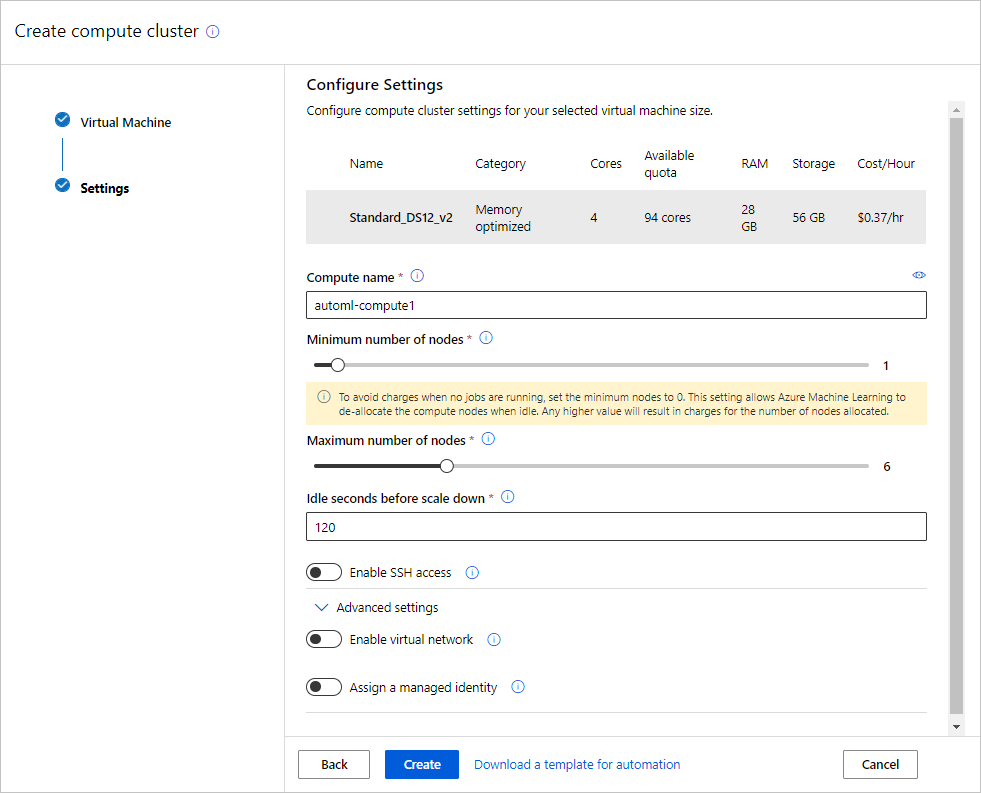

# Tutorial: Train a classification model with no-code AutoML in the Azure Machine Learning studio

Learn how to train a classification model with no-code AutoML using Azure Machine Learning automated ML in the Azure Machine Learning studio. This classification model predicts if a client will subscribe to a fixed term deposit with a financial institution.

With automated ML, you can automate away time intensive tasks. Automated machine learning rapidly iterates over many combinations of algorithms and hyperparameters to help you find the best model based on a success metric of your choosing.

You won't write any code in this tutorial, you'll use the studio interface to perform training.  You'll learn how to do the following tasks:

> [!div class="checklist"]
> * Create an Azure Machine Learning workspace.
> * Run an automated machine learning experiment.
> * Explore model details.
> * Deploy the recommended model.

Also try automated machine learning for these other model types:

* For a no-code example of forecasting, see [Tutorial: Demand forecasting & AutoML](tutorial-automated-ml-forecast.md).
* For a code first example of an object detection model, see the [Tutorial: Train an object detection model with AutoML and Python](tutorial-auto-train-image-models.md),

## Prerequisites

* An Azure subscription. If you don't have an Azure subscription, create a [free account](https://azure.microsoft.com/free/).

* Download the [**bankmarketing_train.csv**](https://automlsamplenotebookdata.blob.core.windows.net/automl-sample-notebook-data/bankmarketing_train.csv) data file. The **y** column indicates if a customer subscribed to a fixed term deposit, which is later identified as the target column for predictions in this tutorial. 

## Create a workspace

An Azure Machine Learning workspace is a foundational resource in the cloud that you use to experiment, train, and deploy machine learning models. It ties your Azure subscription and resource group to an easily consumed object in the service. 

In this tutorial, complete the follow steps to create a workspace and continue the tutorial. 

1. Sign in to [Azure Machine Learning studio](https://ml.azure.com)
   
1. Select **Create workspace**
   
1. Provide the following information to configure your new workspace:

  | Field| Description |
  | ---|--- |
 |  Workspace name | Enter a unique name that identifies your workspace. Names must be unique across the resource group. Use a name that's easy to recall and to differentiate from workspaces created by others. The workspace name is case-insensitive. |
  | Subscription | Select the Azure subscription that you want to use. |
  | Resource group | Use an existing resource group in your subscription or enter a name to create a new resource group. A resource group holds related resources for an Azure solution. You need *contributor* or *owner* role to use an existing resource group.  For more information about access, see [Manage access to an Azure Machine Learning workspace](how-to-assign-roles.md). |
  | Region | Select the Azure region closest to your users and the data resources to create your workspace. |

1. Select **Create** to create the workspace

For more information on Azure resources refer to the steps in this article, [Create resources you need to get started.](quickstart-create-resources.md#create-the-workspace)

For other ways to create a workspace in Azure, [Manage Azure Machine Learning workspaces in the portal or with the Python SDK (v2).](how-to-manage-workspace.md)

## Create an Automated Machine Learning job

You complete the following experiment set-up and run steps via the Azure Machine Learning studio at https://ml.azure.com, a consolidated web interface that includes machine learning tools to perform data science scenarios for data science practitioners of all skill levels. The studio is not supported on Internet Explorer browsers.

1. Select your subscription and the workspace you created.

1. In the left pane, select **Automated ML** under the **Authoring** section.

   Since this is your first automated ML experiment, you'll see an empty list and links to documentation.

   

1. Select **+New automated ML job**. 

## Create and load a dataset as a data asset

Before you configure your experiment, upload your data file to your workspace in the form of an Azure Machine Learning data asset. In the case of this tutorial, you can think of a data asset as your dataset for the AutoML job.  Doing so, allows you to ensure that your data is formatted appropriately for your experiment.

1. Create a new data asset by selecting **From local files** from the  **+Create data asset** drop-down. 

    1. On the **Basic info** form, give your data asset a name and provide an optional description. The automated ML interface currently only supports TabularDatasets, so the dataset type should default to *Tabular*.

    1. Select **Next** on the bottom left

    1. On the **Datastore and file selection** form, select the default datastore that was automatically set up during your workspace creation, **workspaceblobstore (Azure Blob Storage)**. This is where you'll upload your data file to make it available to your workspace.

    1. Select **Upload files** from the **Upload** drop-down.
    
    1. Choose the **bankmarketing_train.csv** file on your local computer. This is the file you downloaded as a [prerequisite](https://automlsamplenotebookdata.blob.core.windows.net/automl-sample-notebook-data/bankmarketing_train.csv).

    1. Select **Next** on the bottom left, to  upload it to the default container that was automatically set up during your workspace creation.  
    
       When the upload is complete, the **Settings and preview** form is pre-populated based on the file type. 
       
    1. Verify that your data is properly formatted via the **Schema** form. The data should be populated as follows. After you verify that the data is accurate, select **Next**.
        
        Field|Description| Value for tutorial
        ---|---|---
        File format|Defines the layout and type of data stored in a file.| Delimited
        Delimiter|One or more characters for specifying the boundary between&nbsp; separate, independent regions in plain text or other data streams. |Comma
        Encoding|Identifies what bit to character schema table to use to read your dataset.| UTF-8
        Column headers| Indicates how the headers of the dataset, if any, will be treated.| All files have same headers
        Skip rows | Indicates how many, if any, rows are skipped in the dataset.| None

    1. The **Schema** form allows for further configuration of your data for this experiment. For this example, select the toggle switch for the **day_of_week**, so as to not include it. Select **Next**.
         
    1. On the **Confirm details** form, verify the information matches what was previously  populated on the **Basic info, Datastore and file selection** and **Settings and preview** forms.
    
    1. Select **Create** to complete the creation of your dataset.
    
    1. Select your dataset once it appears in the list.
    
    1. Review the data by selecting the data asset and looking at the **preview** tab that populates to ensure you didn't include **day_of_week** then, select **Close**.

    1. Select  **Next**.

## Configure job

After you load and configure your data, you can set up your experiment. This setup includes experiment design tasks such as, selecting the size of your compute environment and specifying what column you want to predict. 

1. Select the **Create new** radio button.

1. Populate the **Configure Job** form as follows:
    1. Enter this experiment name: `my-1st-automl-experiment`

    1. Select **y** as the target column, what you want to predict. This column indicates whether the client subscribed to a term deposit or not.
    
    1. Select **compute cluster** as your compute type.
    1.  A compute target is a local or cloud-based resource environment used to run your training script or host your service deployment. For this experiment, you can either try a cloud-based serverless compute (preview) or create your own cloud-based compute.
        1. To use serverless compute, [enable the preview feature](./how-to-use-serverless-compute.md#how-to-use-serverless-compute), select **Serverless**, and skip the rest of this step.
        1.  To create your own compute target, select **+New** to configure your compute target. 
            1. Populate the **Select virtual machine** form to set up your compute.
    
                Field | Description | Value for tutorial
                ----|---|---
                Location | Your region that you'd like to run the machine from |West US 2
                Virtual&nbsp;machine&nbsp;tier |Select what priority your experiment should have| Dedicated
                Virtual&nbsp;machine&nbsp;type| Select the virtual machine type for your compute.|CPU (Central Processing Unit)
                Virtual&nbsp;machine&nbsp;size| Select the virtual machine size for your compute. A list of recommended sizes is provided based on your data and experiment type. |Standard_DS12_V2
            
            1. Select **Next** to populate the **Configure settings form**.
            
                Field | Description | Value for tutorial
                ----|---|---
                Compute name |    A unique name that identifies your compute context. | automl-compute
                Min / Max nodes| To profile data, you must specify 1 or more nodes.|Min nodes: 1 Max nodes: 6
                Idle seconds before scale down | Idle time before  the cluster is automatically scaled down to the minimum node count.|120 (default)
                Advanced settings | Settings to configure and authorize a virtual network for your experiment.| None
    
            1. Select **Create** to create your compute target. 
    
                **This takes a couple minutes to complete.** 
    
                 
    
            1. After creation, select your new compute target from the drop-down list.

    1. Select **Next**.

1. On the **Select task and settings** form, complete the setup for your automated ML experiment by specifying the machine learning task type and configuration settings.
    
    1.  Select **Classification** as the machine learning task type.

    1. Select **View additional configuration settings** and populate the fields as follows. These settings are to better control the training job. Otherwise, defaults are applied based on experiment selection and data.

        Additional&nbsp;configurations|Description|Value&nbsp;for&nbsp;tutorial
        ------|---------|---
        Primary metric| Evaluation metric that the machine learning algorithm will be measured by.|AUC_weighted
        Explain best model| Automatically shows explainability on the best model created by automated ML.| Enable
        Blocked algorithms | Algorithms you want to exclude from the training job| None
        Additional&nbsp;classification settings | These settings help improve the accuracy of your model |Positive class label: None
        Exit criterion| If a criteria is met, the training job is stopped. |Training&nbsp;job&nbsp;time (hours): 1   Metric&nbsp;score&nbsp;threshold: None
        Concurrency| The maximum number of parallel iterations executed per iteration| Max&nbsp;concurrent&nbsp;iterations: 5
        
        Select **Save**.
    1. Select **Next**.
    
1. On the **[Optional] Validate and test** form, 
    1. Select k-fold cross-validation as your **Validation type**.
    1.  Select 2 as your **Number of cross validations**.

1. Select **Finish** to run the experiment. The **Job Detail**  screen opens with the **Job status** at the top as the experiment preparation begins. This status updates as the experiment progresses. Notifications also appear in the top right corner of the studio to inform you of the status of your experiment.

>[!IMPORTANT]
> Preparation takes **10-15 minutes** to prepare the experiment run.
> Once running, it takes **2-3 minutes more for each iteration**.     
> In production, you'd likely walk away for a bit. But for this tutorial, we suggest you start exploring the tested algorithms on the **Models** tab as they complete while the others are still running. 

##  Explore models

Navigate to the **Models** tab to see the algorithms (models) tested. By default, the models are ordered by metric score as they complete. For this tutorial, the model that scores the highest based on the chosen **AUC_weighted** metric is at the top of the list.

While you wait for all of the experiment models to finish, select the **Algorithm name** of a completed model to explore its performance details. 

The following navigates through the **Details** and the **Metrics** tabs to view the selected model's properties, metrics, and performance charts. 

## Model explanations

While you wait for the models to complete, you can also take a look at model explanations and see which data features (raw or engineered) influenced a particular model's predictions. 

These model explanations can be generated on demand, and are summarized in the model explanations dashboard  that's part of the **Explanations (preview)** tab.

To generate model explanations, 
 
1. Select **Job 1** at the top to navigate back to the **Models** screen. 
1. Select the **Models** tab.
1. For this tutorial, select the first **MaxAbsScaler, LightGBM** model.
1. Select the **Explain model** button at the top. On the right, the **Explain model** pane appears. 
1. Select the **automl-compute** that you created previously. This compute cluster initiates a child job to generate the model explanations.
1. Select **Create** at the bottom. A green success message appears towards the top of your screen. 
    >[!NOTE]
    > The explainability job takes about 2-5 minutes to complete.
1. Select the **Explanations (preview)** button. This tab populates once the explainability run completes.
1. On the left hand side, expand the pane and select the row that says **raw** under **Features**. 
1. Select the **Aggregate feature importance** tab on the right. This chart shows which data features influenced the predictions of the selected model. 

    In this example, the *duration* appears to have the most influence on the predictions of this model.
    
    

## Deploy the best model

The automated machine learning interface allows you to deploy the best model as a web service in a few steps. Deployment is the integration of the model so it can predict on new data and identify potential areas of opportunity. 

For this experiment, deployment to a web service means that the financial institution now has an iterative and scalable web solution for identifying potential fixed term deposit customers. 

Check to see if your experiment run is complete. To do so,  navigate back to the parent job page by selecting **Job 1** at the top of your screen. A **Completed** status is shown on the top left of the screen. 

Once the experiment run is complete, the **Details** page is populated with a **Best model summary** section. In this experiment context, **VotingEnsemble** is considered the best model, based on the **AUC_weighted** metric.  

We deploy this model, but be advised, deployment takes about 20 minutes to complete. The deployment process entails several steps including registering the model, generating resources, and configuring them for the web service.

1. Select **VotingEnsemble** to open the model-specific page.

1. Select the **Deploy** menu in the top-left and select **Deploy to web service**.

1. Populate the **Deploy a model** pane as follows:

    Field| Value
    ----|----
    Deployment name| my-automl-deploy
    Deployment description| My first automated machine learning experiment deployment
    Compute type | Select Azure Container Instance (ACI)
    Enable authentication| Disable. 
    Use custom deployments| Disable. Allows for the default driver file (scoring script) and environment file to be auto-generated. 
    
    For this example, we use the defaults provided in the *Advanced* menu. 

1. Select **Deploy**.  

    A green success message appears at the top of the **Job** screen, and in the **Model summary** pane, a status message appears under **Deploy status**. Select **Refresh** periodically to check the deployment status.
    
Now you have an operational web service to generate predictions. 

Proceed to the [**Next Steps**](#next-steps) to learn more about how to consume your new web service, and test your predictions using Power BI's built in Azure Machine Learning support.

## Clean up resources

Deployment files are larger than data and experiment files, so they cost more to store. Delete only the deployment files to minimize costs to your account, or if you want to keep your workspace and experiment files. Otherwise, delete the entire resource group, if you don't plan to use any of the files.  

### Delete the deployment instance

Delete just the deployment instance from Azure Machine Learning at https:\//ml.azure.com/, if you want to keep the resource group and workspace for other tutorials and exploration. 

1. Go to [Azure Machine Learning](https://ml.azure.com/). Navigate to your workspace and  on the left under the **Assets** pane, select **Endpoints**. 

1. Select the deployment you want to delete and select **Delete**. 

1. Select **Proceed**.

### Delete the resource group

[!INCLUDE [aml-delete-resource-group](includes/aml-delete-resource-group.md)]

## Next steps

In this automated machine learning tutorial, you used Azure Machine Learning's automated ML interface to create and deploy a classification model. See these articles for more information and next steps:

> [!div class="nextstepaction"]
> [Consume a web service](/power-bi/connect-data/service-aml-integrate?context=azure%2fmachine-learning%2fcontext%2fml-context)

+ Learn more about [automated machine learning](concept-automated-ml.md).
+ For more information on classification metrics and charts, see the [Understand automated machine learning results](how-to-understand-automated-ml.md) article.

>[!NOTE]
> This Bank Marketing dataset is made available under the [Creative Commons (CCO: Public Domain) License](https://creativecommons.org/publicdomain/zero/1.0/). Any rights in individual contents of the database are licensed under the [Database Contents License](https://creativecommons.org/publicdomain/zero/1.0/) and available on [Kaggle](https://www.kaggle.com/janiobachmann/bank-marketing-dataset). This dataset was originally available within the [UCI Machine Learning Database](https://archive.ics.uci.edu/ml/datasets/bank+marketing).  
> [Moro et al., 2014] S. Moro, P. Cortez and P. Rita. A Data-Driven Approach to Predict the Success of Bank Telemarketing. Decision Support Systems, Elsevier, 62:22-31, June 2014.
