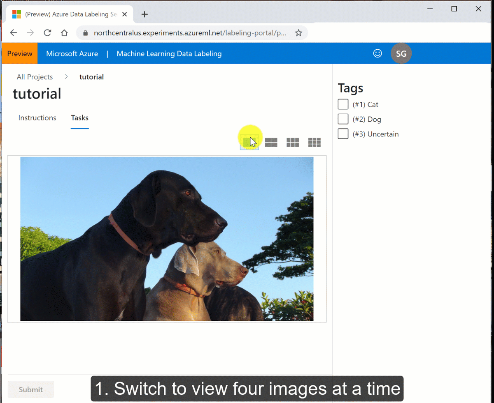

# Tutorial: Create a labeling project (preview) for multi-class image classification 
[!INCLUDE [applies-to-skus](../../includes/aml-applies-to-basic-enterprise-sku.md)]

This tutorial shows you how to manage the process of labeling (also referred to as tagging) images to be used as data for building machine learning models. Data labeling in Azure Machine Learning is in public preview.

If you want to train a machine learning model to classify images, you need hundreds or even thousands of images that are correctly labeled.  Azure Machine Learning helps you manage the progress of your private team of domain experts as they label your data.
 
In this tutorial, you'll use images of cats and dogs.  Since each image is either a cat or a dog, this is a *multi-class* labeling project. You'll learn how to:

> [!div class="checklist"]
>
> * Create an Azure storage account and upload images to the account.
> * Create an Azure Machine Learning workspace.
> * Create a multi-class image labeling project.
> * Label your data.  Either you or your labelers can perform this task.
> * Complete the project by reviewing and exporting the data.

## Prerequisites

* An Azure subscription. If you don't have an Azure subscription, create a [free account](https://aka.ms/AMLFree).

## Create a workspace

An Azure Machine Learning workspace is a foundational resource in the cloud that you use to experiment, train, and deploy machine learning models. It ties your Azure subscription and resource group to an easily consumed object in the service.

You create a workspace via the Azure portal, a web-based console for managing your Azure resources.

[!INCLUDE [aml-create-portal](../../includes/aml-create-in-portal.md)]

## Start a labeling project

Next you will manage the data labeling project in Azure Machine Learning studio, a consolidated interface that includes machine learning tools to perform data science scenarios for data science practitioners of all skill levels. The studio is not supported on Internet Explorer browsers.

1. Sign in to [Azure Machine Learning studio](https://ml.azure.com).

1. Select your subscription and the workspace you created.

### Create a datastore

Azure Machine Learning datastores are used to store connection information, like your subscription ID and token authorization. Here you use a datastore to connect to the storage account that contains the images for this tutorial.

1. On the left side of your workspace, select **Datastores**.

1. Select **+ New datastore**.

1. Fill out the form with these settings:

    Field|Description 
    ---|---
    Datastore name | Give the datastore a name.  Here we use **labeling_tutorial**.
    Datastore type | Select the type of storage.  Here we use **Azure Blob Storage**, the preferred storage for images.
    Account selection method | Select **Enter manually**.
    URL | `https://azureopendatastorage.blob.core.windows.net/openimagescontainer`
    Authentication type | Select **SAS token**.
    Account key | `?sv=2019-02-02&ss=bfqt&srt=sco&sp=rl&se=2025-03-25T04:51:17Z&st=2020-03-24T20:51:17Z&spr=https&sig=7D7SdkQidGT6pURQ9R4SUzWGxZ%2BHlNPCstoSRRVg8OY%3D`

1. Select **Create** to create the datastore.

### Create a labeling project

Now that you have access to the data you want to have labeled, create your labeling project.

1. At the top of the page, select **Projects**.

1. Select **+ Add project**.

    :::image type="content" source="media/tutorial-labeling/create-project.png" alt-text="Create a project":::

### Project details

1. Use the following input for the **Project details** form:

    Field|Description 
    ---|---
    Project name | Give your project a name.  Here we'll use **tutorial-cats-n-dogs**.
    Labeling task type | Select **Image Classification Multi-class**.  
    
    Select **Next** to continue creating the project.

### Select or create a dataset

1.   On the **Select or create a dataset** form, select the second choice, **Create a dataset**, then select the link **From datastore**.

1. Use the following input for the **Create dataset from datastore** form:

    1. On the **Basic info** form, add a name, here we'll use **images-for-tutorial**.  Add a description if you wish.  Then select **Next**.
    1. On the **Datastore selection** form, use the dropdown to select your **Previously created datastore**, for example **tutorial_images (Azure Blob Storage)**
    1. Next, still on the **Datastore selection** form, select **Browse** and then select **MultiClass - DogsCats**.  Select **Save** to use **/MultiClass - DogsCats** as the path.
    1. Select **Next** to confirm details and then **Create** to create the dataset.
    1. Select the circle next to the dataset name in the list, for example **images-for-tutorial**.

1. Select **Next** to continue creating the project.

### Incremental refresh

If you plan to add new images to your dataset,  incremental refresh will find these new images and add them to your project.  When you enable this feature, the project will periodically check for new images.  You won't be adding new images to the datastore for this tutorial, so leave this feature unchecked.

Select **Next** to continue.

### Label classes

1. On the **Label classes** form, type a label name, then select **+Add label** to type the next label.  For this project, the labels are **Cat**, **Dog**, and **Uncertain**.

1. Select **Next** when have added all the labels.

### Labeling instructions

1. On the **Labeling instructions** form, you can provide a link to a website that provides detailed instructions for your labelers.  We'll leave it blank for this tutorial.

1. You can also add a short description of the task directly on the form.  Type **Labeling tutorial - Cats & Dogs.**

1. Select **Next**.

1. On the **ML assisted labeling** form, leave the checkbox unchecked. ML assisted labeling requires more data than you'll be using in this tutorial.

1. Select **Create project**.

This page doesn't automatically refresh. After a pause, manually refresh the page until the project's status changes to **Created**.

## Start labeling

You have now set up your Azure resources, and configured a data labeling project. It's time to add labels to your data.

### Tag the images

In this part of the tutorial, you'll switch roles from the *project administrator* to that of a *labeler*.  Anyone who has contributor access to your workspace can become a labeler.

1. In [Machine Learning studio](https://ml.azure.com), select **Data labeling** on the left-hand side to find your project.  

1. Select the project name in the list.

1. Below the project name, select **Label data**.

1. Read the instructions, then select **Tasks**.

1. Select a thumbnail image on the right to display the number of images you wish to label in one go. You must label all these images before you can move on. Only switch layouts when you have a fresh page of unlabeled data. Switching layouts clears the page's in-progress tagging work.

1. Select one or more images, then select a tag to apply to the selection. The tag appears below the image.  Continue to select and tag all images on the page.  To select all the displayed images simultaneously, select **Select all**. Select at least one image to apply a tag.

    > [!TIP]
    > You can select the first nine tags by using the number keys on your keyboard.

1. Once all the images on the page are tagged, select **Submit** to submit these labels.

    

1. After you submit tags for the data at hand, Azure refreshes the page with a new set of images from the work queue.

## Complete the project

Now you'll switch roles back to the *project administrator* for the labeling project.

As a manager, you may want to review the work of your labeler.  

### Review labeled data

1. In [Machine Learning studio](https://ml.azure.com), select **Data labeling** on the left-hand side to find your project.  

1. Select the project name link.

1. The Dashboard shows you the progress of your project.

1. At the top of the page, select **Data**.

1. On the left side, select **Labeled data** to see your tagged images.  

1. When you disagree with a label, select the image and then select **Reject** at the bottom of the page.  The tags will be removed and the image is put back in the queue of unlabeled images.

### Export labeled data

You can export the label data for Machine Learning experimentation at any time. Users often export multiple times and train different models, rather than wait for all the images to be labeled.

Image labels can be exported in [COCO format](http://cocodataset.org/#format-data) or as an Azure Machine Learning dataset. The dataset format makes it easy to use for training in Azure Machine Learning.  

1. In [Machine Learning studio](https://ml.azure.com), select **Data labeling** on the left-hand side to find your project.  

1. Select the project name link.

1. Select **Export** and choose **Export as Azure ML Dataset**. 

    The status of the export appears just below the **Export** button. 

1. Once the labels are successfully exported, select **Datasets** on the left side to view the results.

## Clean up resources

[!INCLUDE [aml-delete-resource-group](../../includes/aml-delete-resource-group.md)]

## Next steps

In this tutorial, you labeled images.  Now use your labeled data:

> [!div class="nextstepaction"]
> [Train a machine learning image recognition model](https://github.com/Azure/MachineLearningNotebooks/blob/master/how-to-use-azureml/work-with-data/datasets-tutorial/labeled-datasets/labeled-datasets.ipynb).
