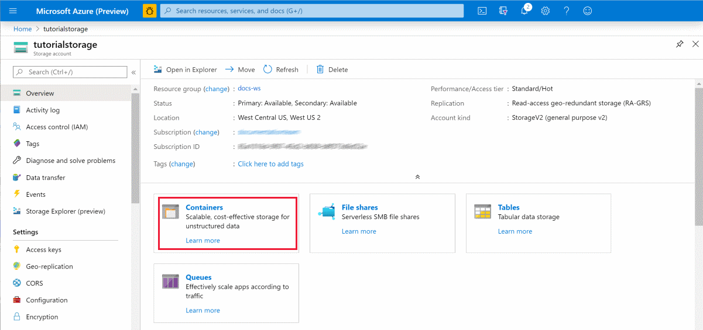

# Tutorial: Create your first image classification labeling project
[!INCLUDE [applies-to-skus](../../includes/aml-applies-to-basic-enterprise-sku.md)]

If you want to train a machine learning model to classify images, you need hundreds or even thousands of images that are correctly labeled.  Azure Machine Learning helps you manage a team of labelers to manually tag your images.  

This tutorial shows you how to set up and manage a project as the *project administrator*.  To complete the project, you will also play the role of a *labeler* to perform the tagging of images.  

In this tutorial, you learn how to:

> [!div class="checklist"]
>
> * Create an Azure storage account and upload your images to the account.
> * Create an Azure Machine Learning workspace.
> * Start a labeling project:
>     * Add users as a labelers.
>     * Create a datastore to connect your storage account to your workspace.
>     * Create the project.
>     * Add your users to the project.
> * Label your data.  Either you or your labelers can perform this task.
> * Complete the project:
>     * Review labeled data.
>     * Export labeled data to use for training a model.

## Prerequisites

* An Azure subscription. If you don’t have an Azure subscription, create a [free account](https://aka.ms/AMLFree).

* Images to label.  Download the [images used for this tutorial]().  

## Create a workspace

[!INCLUDE [aml-create-portal](../../includes/aml-create-in-portal.md)]

## Create a storage account

1. In the upper-left corner of Azure portal, select the menu icon.

1. select **+ Create a resource**.

    

1. Use the search bar to find **Storage account**.

1. Select **Storage account - blob, file, table, queue**.

1. In the **Storage account - blob, file, table, queue** pane, select **Create** to begin.

1. Provide the following information to configure your new workspace:

   Field|Description 
   ---|---
   Subscription |Select the same Azure subscription you used above to create your workspace.
   Resource group | For convenience, use the same resource group you just created for your workspace, **docs-aml**. 
   Storage account name | The name you pick must be unique across all existing storage account names in Azure.  Try including your initials or some other unique letters to help create the name.  Here we'll use **tutorialstorage**.
   Location | Select the location closest to your users and the data resources to create your workspace.
    Performance | Leave the default **Standard** selected.

1. After you're finished configuring the account, select **Review + Create**.

1. Select **Create**.

   > [!Warning] 
   > It can take several minutes to create your workspace in the cloud.

   When the process is finished, a deployment success message appears. 
 
 1. Select **Go to resource**.

### Copy account key

1. Select **Access keys** on the left of your storage account page in Azure portal.

1. Copy one of the keys.  You'll use this key to associate the account with your workspace in a few moments.

### Upload images

1. On the left, select **Overview** to go back to the storage account overview.

1. In the middle of the page, select **Containers**.

    

1. Select **+ Container** to create a new container.

1. Give the container a name, here we'll use **tutorial-images**.

1. Select **OK**.

1. Select the container name in the table to open it.

1. Select **Upload**.  

1. Select the folder icon to find your files.  Select all the images you downloaded as part of the [Prerequisites](#prerequisites).

1. Select **Upload** to add all your images to the storage account.  

## Start a labeling project

You now have an Azure Machine Learning workspace, and images stored in an Azure Storage container.

You complete the project steps in Azure Machine Learning studio, a consolidated interface that includes machine learning tools to perform data science scenarios for data science practitioners of all skill levels. The studio is not supported on Internet Explorer browsers.

1. Sign in to [Azure Machine Learning studio](https://ml.azure.com).

1. Select your subscription and the workspace you created.

### Create a datastore

You use a datastore to access the images from your storage account.

1. On the right side of your workspace, select **Datastores**.

1. Select **+ New datastore**.

1. Fill out the form with these settings:

    Field|Description 
    ---|---
    Datastore name | Give the datastore a name.  Here we use **labeling_tutorial**.
    Datastore type | Select the type of storage.  Here we use **Azure Blob Storage**, the preferred storage for images.
    Account selection method | Select **From Azure subscription**.
    Subscription ID | Select your subscription ID from the list.
    Storage account | Select the storage account created above, for example, **tutorialstorage (docs-ws)**.
    Blob container |  Select the blob container name created above, for example, **tutorial-images**
    Authentication type | Select **Account key**.
    Account key | Paste the key you copied above after you created the storage account.

1. Select **Create** to create the datastore.

### Add labelers

Set up your workspace to include all the people who will label data for any of your projects.  Later you'll add these labelers to your specific labeling project.

1. On the right side, select **Data labeling**.

1. At the top of the page, select **Labelers**.

1. Select **Add labeler** to add the email address of a labeler.

1. Continue to add more labelers until you're done.

### Create a labeling project

Now that you have your list of labelers and access to the data you want to have labeled, create your labeling project.

1. At the top of the page, select **Projects**.

1. Select **+ Add project**.

1. Use the following input for the **Project details** form:

    Field|Description 
    ---|---
    Project details | Give your project a name.  Here we'll use **tutorial-project**.
    Labeling task type | Select **Image Classification Multi-label**.
    
    Select **Next** to continue creating the project.

1.   On the **Select or create a dataset** form, select the second choice, **Create a dataset**, then select the link **From datastore**.

1. Use the following input for the **Create dataset from datastore** form:
    Field|Description 
    ---|---
    Name | Give the dataset a name, here we'll use **images-for-tutorial**.
    Dataset type | Select **File** as the type, since each of your images is a file.
    Datastore | Select the datastore from the list, for example **tutorial_images (Azure Blob Storage)
    Path | Select **Browse** and verify that your images appear.  Select **Save** to use **/** as the path.
    Description | Add a description here, for example, **Image files for the tutorial.**.

    Select **Create** to finish creating the dataset.

1. Select **Next** to continue creating the project.

1. On the **Label classes** form, type a label name, then select **+Add label** to type the next label.  For this project, the labels are **X**, **Y**, **Z**, and **Unknown**.

    Select **Next** when have added all the labels.

1. On the **Labeling instructions** form, you can provide a link to a website that provides detailed instructions for your labelers.  We'll leave it blank for this tutorial.

1. Select **Create project**.

This page doesn't automatically refresh. After a pause, manually refresh the page until the project's status changes to **Created**.

### Add labelers to your project

1. Select the project name to open the project.  

1. At the top of the page, select **Teams**.

1. Select the **labeling_tutorial Default Team** link.

1. Now use **Assign labelers** to add the labelers you want to participate in this project. 

1. Select from the list of labelers you created earlier.  Once you've selected all the labelers you wish to use, select **Assign labelers** to add them to your default project team.

## Label your data 

You have now set up your Azure resources, and configured a data labeling project. It's time to add labels to your data.  If you have lots of images to label, hopefully you also have lots of labelers to complete the task.  You'll now want to send them instructions so they can access the data and start labeling.

### Notify labelers

1. In [Machine Learning studio](https://ml.azure.com), select **Data labeling** on the left-hand side to find your project.  

1. Select the project name link.

1. At the top of the page, select **Details**.  You see a summary of your project.

    

1. Copy the **Labeling portal URL** link to send to your labelers.

1. Now select **Team** at the top to find your labeling team.  

1. Select the team name link.

1. At the top of the page, select **Email team** to start your email.  Paste in the labeling portal URL you just copied.  

Each time a labeler goes to the portal URL, they'll be presented with more images to label, until the queue is empty.  

### Tag the data

In this part of the tutorial, you'll switch roles from the *project administrator* to that of a *labeler*.  Use the URL you sent to the team.  This URL brings you to the labeling portal for your project.  If you had added instructions, you'd see them here when you arrive on the page.

1. At the top of the page, select **Tasks** to start labeling.

1. Select a thumbnail image on the right to display the number of images you wish to label. You need to label all these images before you can move on. Only switch layouts when you have a fresh page of unlabeled data. Switching layouts clears the page's in-progress tagging work.

1. Select one or more images, then select a tag to apply to the selection. The tag appears below the image.  Continue to select and tag all images on the page.  To select all the displayed images simultaneously, select **Select all**. You must select at least one image to apply a tag.

    > [!TIP]
    > You can select the first nine tags by using the number keys on your keyboard.

1. Once all the images on the page are tagged, select **Submit** to submit these labels.

1. After you submit tags for the data at hand, Azure refreshes the page with a new set of images from the work queue.

## Complete the project

Now you'll switch roles back to the *project administrator* for the labeling project.

As a manager, you may want to review the work of your labeler.  And when the images are all tagged, you can export your data to use for machine learning modeling.

### Review labeled data

1. In [Machine Learning studio](https://ml.azure.com), select **Data labeling** on the left-hand side to find your project.  

1. Select the project name link.

1. The Dashboard shows you the progress of your project.

1. At the top of the page, select **Data**.

1. On the left side, select **Labeled data** to see your tagged images.  

1. When you disagree with a label, select the image and then select **Reject** at the bottom of the page.  The tags will be removed and the image is put back in the queue of unlabeled images.

### Export labeled data

You can export the label data for Machine Learning experimentation at any time. If you plan to use this data for modeling, export the labeled data once all images have been tagged. 

Image labels can be exported in [COCO format](http://cocodataset.org/#format-data) or as an Azure Machine Learning dataset.  

1. In [Machine Learning studio](https://ml.azure.com), select **Data labeling** on the left-hand side to find your project.  

1. Select the project name link.

1. Select **Export** and choose **Export as Azure ML Dataset**. This format makes it easy to use for training in Azure Machine Learning.

    The status of the export appears just below the **Export** button. 

1. Once the labels are successfully exported, select **Datasets** on the left side to view the results.

## Clean up resources

[!INCLUDE [aml-delete-resource-group](../../includes/aml-delete-resource-group.md)]

## Next steps

In this tutorial, you played two roles.

* As a *project administrator*, you:
    * Uploaded images to an Azure Storage account.
    * Configured a labeling project so that all your labelers could tag the images with the appropriate label.
    * Reviewed the labels.
    * Exported the final labeled dataset to be used for modeling.
* As a *labeler*, you labeled the images.  You may have also included other labelers to participate in labeling as well.

Now use your labeled data  to [train a machine learning image recognition model](https://github.com/Azure/MachineLearningNotebooks/blob/master/how-to-use-azureml/work-with-data/datasets-tutorial/labeled-datasets/labeled-datasets.ipynb).