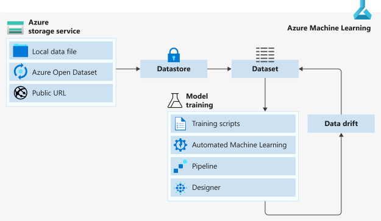

# Data in Azure Machine Learning v1

[!INCLUDE [CLI v1](../includes/machine-learning-cli-v1.md)]
[!INCLUDE [SDK v1](../includes/machine-learning-sdk-v1.md)]

Azure Machine Learning makes it easy to connect to your data in the cloud. It provides an abstraction layer over the underlying storage service, so you can securely access and work with your data without having to write code specific to your storage type. Azure Machine Learning also provides the following data capabilities:

*    Interoperability with Pandas and Spark DataFrames
*    Versioning and tracking of data lineage
*    Data labeling 
*    Data drift monitoring
    
## Data workflow

When you're ready to use the data in your cloud-based storage solution, we recommend the following data delivery workflow. This workflow assumes you have an [Azure storage account](../../storage/common/storage-account-create.md?tabs=azure-portal) and data in a cloud-based storage service in Azure. 

1. Create an [Azure Machine Learning datastore](#connect-to-storage-with-datastores) to store connection information to your Azure storage.

2. From that datastore, create an [Azure Machine Learning dataset](#reference-data-in-storage-with-datasets) to point to a specific file(s) in your underlying storage. 

3. To use that dataset in your machine learning experiment you can either
    * Mount it to your experiment's compute target for model training.

        **OR** 

    * Consume it directly in Azure Machine Learning solutions like, automated machine learning (automated ML) experiment runs, machine learning pipelines, or the [Azure Machine Learning designer](concept-designer.md).

4. Create [dataset monitors](#monitor-model-performance-with-data-drift) for your model output dataset to detect for data drift. 

5. If data drift is detected, update your input dataset and retrain your model accordingly.

The following diagram provides a visual demonstration of this recommended workflow.

## Connect to storage with datastores

Azure Machine Learning datastores securely keep the connection information to your data storage on Azure, so you don't have to code it in your scripts. [Register and create a datastore](../how-to-access-data.md) to easily connect to your storage account, and access the data in your underlying storage service. 

Supported cloud-based storage services in Azure that can be registered as datastores:

+ Azure Blob Container
+ Azure File Share
+ Azure Data Lake
+ Azure Data Lake Gen2
+ Azure SQL Database
+ Azure Database for PostgreSQL
+ Databricks File System
+ Azure Database for MySQL

>[!TIP]
> You can create datastores with credential-based authentication for accessing storage services, like a service principal or shared access signature (SAS) token. These credentials can be accessed by users who have *Reader* access to the workspace.
>
> If this is a concern, [create a datastore that uses identity-based data access](../how-to-identity-based-data-access.md) to connect to storage services.

## Reference data in storage with datasets

Azure Machine Learning datasets aren't copies of your data. By creating a dataset, you create a reference to the data in its storage service, along with a copy of its metadata. 

Because datasets are lazily evaluated, and the data remains in its existing location, you

* Incur no extra storage cost.
* Don't risk unintentionally changing your original data sources.
* Improve ML workflow performance speeds.

To interact with your data in storage, [create a dataset](how-to-create-register-datasets.md) to package your data into a consumable object for machine learning tasks. Register the dataset to your workspace to share and reuse it across different experiments without data ingestion complexities.

Datasets can be created from local files, public urls, [Azure Open Datasets](https://azure.microsoft.com/services/open-datasets/), or Azure storage services via datastores. 

There are 2 types of datasets: 

+ A [FileDataset](/python/api/azureml-core/azureml.data.file_dataset.filedataset) references single or multiple files in your datastores or public URLs. If your data is already cleansed and ready to use in training experiments, you can [download or mount files](how-to-train-with-datasets.md#mount-files-to-remote-compute-targets) referenced by FileDatasets to your compute target.

+ A [TabularDataset](/python/api/azureml-core/azureml.data.tabulardataset) represents data in a tabular format by parsing the provided file or list of files. You can load a TabularDataset into a pandas or Spark DataFrame for further manipulation and cleansing. For a complete list of data formats you can create TabularDatasets from, see the [TabularDatasetFactory class](/python/api/azureml-core/azureml.data.dataset_factory.tabulardatasetfactory).

Additional datasets capabilities can be found in the following documentation:

+ [Version and track](how-to-version-track-datasets.md) dataset lineage.
+ [Monitor your dataset](how-to-monitor-datasets.md) to help with data drift detection.    

## Work with your data

With datasets, you can accomplish a number of machine learning tasks through seamless integration with Azure Machine Learning features. 

+ Create a [data labeling project](#label-data-with-data-labeling-projects).
+ Train machine learning models:
     + [automated ML experiments](../how-to-use-automated-ml-for-ml-models.md)
     + the [designer](tutorial-designer-automobile-price-train-score.md#import-data)
     + [notebooks](how-to-train-with-datasets.md)
     + [Azure Machine Learning pipelines](how-to-create-machine-learning-pipelines.md)
+ Access datasets for scoring with [batch inference](../tutorial-pipeline-batch-scoring-classification.md) in [machine learning pipelines](how-to-create-machine-learning-pipelines.md).
+ Set up a dataset monitor for [data drift](#monitor-model-performance-with-data-drift) detection.

## Label data with data labeling projects

Labeling large amounts of data has often been a headache in machine learning projects. Those with a computer vision component, such as image classification or object detection, generally require thousands of images and corresponding labels.

Azure Machine Learning gives you a central location to create, manage, and monitor labeling projects. Labeling projects help coordinate the data, labels, and team members, allowing you to more efficiently manage the labeling tasks. Currently supported tasks are image classification, either multi-label or multi-class, and object identification using bounded boxes.

Create an [image labeling project](../how-to-create-image-labeling-projects.md) or [text labeling project](../how-to-create-text-labeling-projects.md), and output a dataset for use in machine learning experiments.

## Monitor model performance with data drift

In the context of machine learning, data drift is the change in model input data that leads to model performance degradation. It is one of the top reasons model accuracy degrades over time, thus monitoring data drift helps detect model performance issues.

See the [Create a dataset monitor](how-to-monitor-datasets.md) article, to learn more about how to detect and alert to data drift on new data in a dataset.

## Next steps 

+ Create a dataset in Azure Machine Learning studio or with the Python SDK [using these steps.](how-to-create-register-datasets.md)
+ Try out dataset training examples with our [sample notebooks](https://github.com/Azure/MachineLearningNotebooks/tree/master/how-to-use-azureml/work-with-data/).
