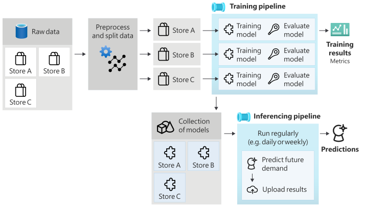
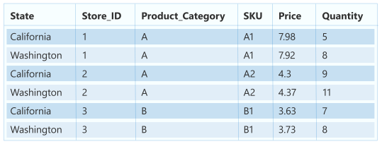
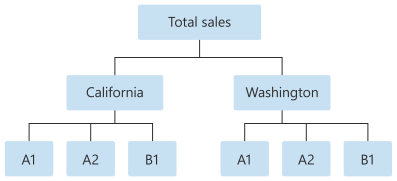

# Set up AutoML to train a time-series forecasting model with Python (SDKv1)

[!INCLUDE [sdk v1](../includes/machine-learning-sdk-v1.md)]


In this article, you learn how to set up AutoML training for time-series forecasting models with Azure Machine Learning automated ML in the [Azure Machine Learning Python SDK](/python/api/overview/azure/ml/).

To do so, you: 

> [!div class="checklist"]
> * Prepare data for time series modeling.
> * Configure specific time-series parameters in an [`AutoMLConfig`](/python/api/azureml-train-automl-client/azureml.train.automl.automlconfig.automlconfig) object.
> * Run predictions with time-series data.

For a low code experience, see the [Tutorial: Forecast demand with automated machine learning](../tutorial-automated-ml-forecast.md) for a time-series forecasting example using automated ML in the [Azure Machine Learning studio](https://ml.azure.com/).

Unlike classical time series methods, in automated ML, past time-series values are "pivoted" to become additional dimensions for the regressor together with other predictors. This approach incorporates multiple contextual variables and their relationship to one another during training. Since multiple factors can influence a forecast, this method aligns itself well with real world forecasting scenarios. For example, when forecasting sales, interactions of historical trends, exchange rate, and price all jointly drive the sales outcome. 

## Prerequisites

For this article you need, 

* An Azure Machine Learning workspace. To create the workspace, see [Create workspace resources](../quickstart-create-resources.md).

* This article assumes some familiarity with setting up an automated machine learning experiment. Follow the [how-to](../how-to-configure-auto-train.md) to see the main automated machine learning experiment design patterns.

    [!INCLUDE [automl-sdk-version](../includes/machine-learning-automl-sdk-version.md)]

## Training and validation data

The most important difference between a forecasting regression task type and regression task type within automated ML is including a feature in your training data that represents a valid time series. A regular time series has a well-defined and consistent frequency and has a value at every sample point in a continuous time span. 

> [!IMPORTANT]
> When training a model for forecasting future values, ensure all the features used in training can be used when running predictions for your intended horizon. For example, when creating a demand forecast, including a feature for current stock price could massively increase training accuracy. However, if you intend to forecast with a long horizon, you may not be able to accurately predict future stock values corresponding to future time-series points, and model accuracy could suffer.

You can specify separate [training data and validation data](concept-automated-ml.md#training-validation-and-test-data) directly in the `AutoMLConfig` object. Learn more about the [AutoMLConfig](#configure-experiment).

For time series forecasting, only **Rolling Origin Cross Validation (ROCV)** is used for validation by default. ROCV divides the series into training and validation data using an origin time point. Sliding the origin in time generates the cross-validation folds. This strategy preserves the time series data integrity and eliminates the risk of data leakage.

:::image type="content" source="../media/how-to-auto-train-forecast/rolling-origin-cross-validation.png" alt-text="Diagram showing cross validation folds separates the training and validation sets based on the cross validation step size.":::

Pass your training and validation data as one dataset to the parameter `training_data`. Set the number of cross validation folds with the parameter `n_cross_validations` and set the number of periods between two consecutive cross-validation folds with `cv_step_size`. You can also leave either or both parameters empty and AutoML will set them automatically. 

[!INCLUDE [sdk v1](../includes/machine-learning-sdk-v1.md)]

```python
automl_config = AutoMLConfig(task='forecasting',
                             training_data= training_data,
                             n_cross_validations="auto", # Could be customized as an integer
                             cv_step_size = "auto", # Could be customized as an integer
                             ...
                             **time_series_settings)
```


You can also bring your own validation data, learn more in [Configure data splits and cross-validation in AutoML](how-to-configure-cross-validation-data-splits.md#provide-validation-data).

Learn more about how AutoML applies cross validation to [prevent over-fitting models](../concept-manage-ml-pitfalls.md#prevent-overfitting).

## Configure experiment

The [`AutoMLConfig`](/python/api/azureml-train-automl-client/azureml.train.automl.automlconfig.automlconfig) object defines the settings and data necessary for an automated machine learning task. Configuration for a forecasting model is similar to the setup of a standard regression model, but certain models, configuration options, and featurization steps exist specifically for time-series data. 

### Supported models

Automated machine learning automatically tries different models and algorithms as part of the model creation and tuning process. As a user, there is no need for you to specify the algorithm. For forecasting experiments, both native time-series and deep learning models are part of the recommendation system. 

>[!Tip]
> Traditional regression models are also tested as part of the recommendation system for forecasting experiments. See a complete list of the [supported models](/python/api/azureml-train-automl-client/azureml.train.automl.constants.supportedmodels) in the SDK reference documentation.


### Configuration settings

Similar to a regression problem, you define standard training parameters like task type, number of iterations, training data, and number of cross-validations. Forecasting tasks require the `time_column_name` and `forecast_horizon` parameters to configure your experiment. If the data includes multiple time series, such as sales data for multiple stores or energy data across different states, automated ML automatically detects this and sets the `time_series_id_column_names` parameter (preview) for you. You can also include additional parameters to better configure your run, see the [optional configurations](#optional-configurations) section for more detail on what can be included.

> [!IMPORTANT]
> Automatic time series identification is currently in public preview. This preview version is provided without a service-level agreement. Certain features might not be supported or might have constrained capabilities. For more information, see [Supplemental Terms of Use for Microsoft Azure Previews](https://azure.microsoft.com/support/legal/preview-supplemental-terms/).

| Parameter&nbsp;name | Description |
|-------|-------|
|`time_column_name`|Used to specify the datetime column in the input data used for building the time series and inferring its frequency.|
|`forecast_horizon`|Defines how many periods forward you would like to forecast. The horizon is in units of the time series frequency. Units are based on the time interval of your training data, for example, monthly, weekly that the forecaster should predict out.|

The following code, 
* Leverages the [`ForecastingParameters`](/python/api/azureml-automl-core/azureml.automl.core.forecasting_parameters.forecastingparameters) class to define the forecasting parameters for your experiment training
* Sets the `time_column_name` to the `day_datetime` field in the data set. 
* Sets the `forecast_horizon` to 50 in order to predict for the entire test set. 

```python
from azureml.automl.core.forecasting_parameters import ForecastingParameters

forecasting_parameters = ForecastingParameters(time_column_name='day_datetime', 
                                               forecast_horizon=50,
                                               freq='W')
                                              
```

These `forecasting_parameters` are then passed into your standard `AutoMLConfig` object along with the `forecasting` task type, primary metric, exit criteria, and training data. 

```python
from azureml.core.workspace import Workspace
from azureml.core.experiment import Experiment
from azureml.train.automl import AutoMLConfig
import logging

automl_config = AutoMLConfig(task='forecasting',
                             primary_metric='normalized_root_mean_squared_error',
                             experiment_timeout_minutes=15,
                             enable_early_stopping=True,
                             training_data=train_data,
                             label_column_name=label,
                             n_cross_validations="auto", # Could be customized as an integer
                             cv_step_size = "auto", # Could be customized as an integer
                             enable_ensembling=False,
                             verbosity=logging.INFO,
                             forecasting_parameters=forecasting_parameters)
```

The amount of data required to successfully train a forecasting model with automated ML is influenced by the `forecast_horizon`, `n_cross_validations`, and `target_lags` or `target_rolling_window_size` values specified when you configure your `AutoMLConfig`. 

The following formula calculates the amount of historic data that what would be needed to construct time series features.

Minimum historic data required: (2x `forecast_horizon`) + #`n_cross_validations` + max(max(`target_lags`), `target_rolling_window_size`)

An `Error exception` is raised for any series in the dataset that does not meet the required amount of historic data for the relevant settings specified. 

### Featurization steps

In every automated machine learning experiment, automatic scaling and normalization techniques are applied to your data by default. These techniques are types of **featurization** that help *certain* algorithms that are sensitive to features on different scales. Learn more about default featurization steps in [Featurization in AutoML](how-to-configure-auto-features.md#automatic-featurization)

However, the following steps are performed only for `forecasting` task types:

* Detect time-series sample frequency (for example, hourly, daily, weekly) and create new records for absent time points to make the series continuous.
* Impute missing values in the target (via forward-fill) and feature columns (using median column values)
* Create features based on time series identifiers to enable fixed effects across different series
* Create time-based features to assist in learning seasonal patterns
* Encode categorical variables to numeric quantities
* Detect the non-stationary time series and automatically differencing them to mitigate the impact of unit roots.

To view the full list of possible engineered features generated from time series data, see [TimeIndexFeaturizer Class](/python/api/azureml-automl-runtime/azureml.automl.runtime.featurizer.transformer.timeseries.time_index_featurizer).

> [!NOTE]
> Automated machine learning featurization steps (feature normalization, handling missing data,
> converting text to numeric, etc.) become part of the underlying model. When using the model for
> predictions, the same featurization steps applied during training are applied to
> your input data automatically.

#### Customize featurization

You also have the option to customize your featurization settings to ensure that the data and features that are used to train your ML model result in relevant predictions. 

Supported customizations for `forecasting` tasks include:

|Customization|Definition|
|--|--|
|**Column purpose update**|Override the auto-detected feature type for the specified column.|
|**Transformer parameter update** |Update the parameters for the specified transformer. Currently supports *Imputer* (fill_value and median).|
|**Drop columns** |Specifies columns to drop from being featurized.|

To customize featurizations with the SDK, specify `"featurization": FeaturizationConfig` in your `AutoMLConfig` object. Learn more about [custom featurizations](how-to-configure-auto-features.md#customize-featurization).

>[!NOTE]
> The **drop columns** functionality is deprecated as of SDK version 1.19. Drop columns from your dataset as part of data cleansing, prior to consuming it in your automated ML experiment. 

```python
featurization_config = FeaturizationConfig()

# `logQuantity` is a leaky feature, so we remove it.
featurization_config.drop_columns = ['logQuantitity']

# Force the CPWVOL5 feature to be of numeric type.
featurization_config.add_column_purpose('CPWVOL5', 'Numeric')

# Fill missing values in the target column, Quantity, with zeroes.
featurization_config.add_transformer_params('Imputer', ['Quantity'], {"strategy": "constant", "fill_value": 0})

# Fill mising values in the `INCOME` column with median value.
featurization_config.add_transformer_params('Imputer', ['INCOME'], {"strategy": "median"})
```

If you're using the Azure Machine Learning studio for your experiment, see [how to customize featurization in the studio](../how-to-use-automated-ml-for-ml-models.md#customize-featurization).

## Optional configurations

Additional optional configurations are available for forecasting tasks, such as enabling deep learning and specifying a target rolling window aggregation. A complete list of additional parameters is available in the [ForecastingParameters SDK reference documentation](/python/api/azureml-automl-core/azureml.automl.core.forecasting_parameters.forecastingparameters).

### Frequency & target data aggregation

Leverage the frequency, `freq`, parameter to help avoid failures caused by irregular data, that is data that doesn't follow a set cadence, like hourly or daily data. 

For highly irregular data or for varying business needs, users can optionally set their desired forecast frequency, `freq`, and specify the `target_aggregation_function` to aggregate the target column of the time series. Leverage these two settings in your `AutoMLConfig` object can help save some time on data preparation. 

Supported aggregation operations for target column values include:

|Function | Description
|---|---
|`sum`| Sum of target values
|`mean`| Mean or average of target values
|`min`| Minimum value of a target  
|`max`| Maximum value of a target  

### Enable deep learning

> [!NOTE]
> DNN support for forecasting in Automated Machine Learning is in **preview** and not supported for local runs or runs initiated in Databricks.

You can also apply deep learning with deep neural networks, DNNs, to improve the scores of your model. Automated ML's deep learning allows for forecasting univariate and multivariate time series data.

Deep learning models have three intrinsic capabilities:
1. They can learn from arbitrary mappings from inputs to outputs
1. They support multiple inputs and outputs
1. They can automatically extract patterns in input data that spans over long sequences. 

To enable deep learning, set the `enable_dnn=True` in the `AutoMLConfig` object.

```python
automl_config = AutoMLConfig(task='forecasting',
                             enable_dnn=True,
                             ...
                             forecasting_parameters=forecasting_parameters)
```
> [!Warning]
> When you enable DNN for experiments created with the SDK, [best model explanations](how-to-machine-learning-interpretability-automl.md) are disabled.

To enable DNN for an AutoML experiment created in the Azure Machine Learning studio, see the [task type settings in the studio UI how-to](../how-to-use-automated-ml-for-ml-models.md#create-and-run-experiment).


### Target rolling window aggregation

Often the best information a forecaster can have is the recent value of the target.  Target rolling window aggregations allow you to add a rolling aggregation of data values as features. Generating and using these features as extra contextual data helps with the accuracy of the train model.

For example, say you want to predict energy demand. You might want to add a rolling window feature of three days to account for thermal changes of heated spaces. In this example, create this window by setting `target_rolling_window_size= 3` in the `AutoMLConfig` constructor. 

The table shows resulting feature engineering that occurs when window aggregation is applied. Columns for **minimum, maximum,** and **sum** are generated on a sliding window of three based on the defined settings. Each row has a new calculated feature, in the case of the timestamp for September 8, 2017 4:00am the maximum, minimum, and sum values are calculated using the **demand values** for September 8, 2017 1:00AM - 3:00AM. This window of three shifts along to populate data for the remaining rows.


View a Python code example applying the [target rolling window aggregate feature](https://github.com/Azure/azureml-examples/blob/v1-archive/v1/python-sdk/tutorials/automl-with-azureml/forecasting-energy-demand/auto-ml-forecasting-energy-demand.ipynb).

### Short series handling

Automated ML considers a time series a **short series** if there are not enough data points to conduct the train and validation phases of model development. The number of data points varies for each experiment, and depends on  the max_horizon, the number of cross validation splits, and the length of the model lookback, that is the maximum of history that's needed to construct the time-series features.

Automated ML offers short series handling by default with the `short_series_handling_configuration` parameter in the `ForecastingParameters` object. 

To enable short series handling,  the `freq` parameter must also be defined. To define an hourly frequency, we will set `freq='H'`. View the frequency string options by visiting the [pandas Time series page DataOffset objects section](https://pandas.pydata.org/pandas-docs/stable/user_guide/timeseries.html#dateoffset-objects). To change the default behavior, `short_series_handling_configuration = 'auto'`, update the `short_series_handling_configuration` parameter in your `ForecastingParameter` object.  

```python
from azureml.automl.core.forecasting_parameters import ForecastingParameters

forecast_parameters = ForecastingParameters(time_column_name='day_datetime', 
                                            forecast_horizon=50,
                                            short_series_handling_configuration='auto',
                                            freq = 'H',
                                            target_lags='auto')
```
The following table summarizes the available settings for `short_series_handling_config`.
 
|Setting|Description
|---|---
|`auto`| The default value for short series handling. <br> - _If all series are short_, pad the data. <br> - _If not all series are short_, drop the short series. 
|`pad`| If `short_series_handling_config = pad`, then automated ML adds random values to each short series found. The following lists the column types and what they're padded with: <br> - Object columns with NaNs <br> - Numeric columns  with 0 <br> - Boolean/logic columns with False <br> - The target column is padded with random values with mean of zero and standard deviation of 1. 
|`drop`| If `short_series_handling_config = drop`, then automated ML drops the short series, and it will not be used for training or prediction. Predictions for these series will return NaN's.
|`None`| No series is padded or dropped

>[!WARNING]
>Padding may impact the accuracy of the resulting model, since we are introducing artificial data just to get past training without failures. If many of the series are short, then you may also see some impact in explainability results

### Non-stationary time series detection and handling

A time series whose moments (mean and variance) change over time is called a **non-stationary**. For example, time series that exhibit stochastic trends are non-stationary by nature. To visualize this, the below image plots a series that is generally trending upward. Now, compute and compare the mean (average) values for the first and the second half of the series. Are they the same? Here, the mean of the series in the first half of the plot is significantly smaller than in the second half. The fact that the mean of the series depends on the time interval one is looking at, is an example of the time-varying moments. Here, the mean of a series is the first moment.

:::image type="content" source="../media/how-to-auto-train-forecast/non-stationary-retail-sales.png" alt-text="Diagram showing retail sales for a non-stationary time series.":::

Next, let's examine the image below, which plots the the original series in first differences, $x_t = y_t - y_{t-1}$ where $x_t$ is the change in retail sales and $y_t$ and $y_{t-1}$ represent the original series and its first lag, respectively. The mean of the series is roughly constant regardless the time frame one is looking at. This is an example of a first order stationary times series. The reason we added the first order term is because the first moment (mean) does not change with time interval, the same cannot be said about the variance, which is a second moment.


:::image type="content" source="../media/how-to-auto-train-forecast/weakly-stationary-retail-sales.png" alt-text="Diagram showing retail sales for a weakly stationary time series.":::

AutoML Machine learning models can not inherently deal with stochastic trends, or other well-known problems associated with non-stationary time series. As a result, their out of sample forecast accuracy will be "poor" if such trends are present.

AutoML automatically analyzes time series dataset to check whether it is stationary or not. When non-stationary time series are detected, AutoML applies a differencing transform automatically to mitigate the impact of non-stationary time series.

## Run the experiment 

When you have your `AutoMLConfig` object ready, you can submit the experiment. After the model finishes, retrieve the best run iteration.


```python
ws = Workspace.from_config()
experiment = Experiment(ws, "Tutorial-automl-forecasting")
local_run = experiment.submit(automl_config, show_output=True)
best_run, fitted_model = local_run.get_output()
``` 
 
## Forecasting with best model

Use the best model iteration to forecast values for data that wasn't used to train the model.
  
### Evaluating model accuracy with a rolling forecast

Before you put a model into production, you should evaluate its accuracy on a test set held out from the training data. A best practice procedure is a so-called rolling evaluation which rolls the trained forecaster forward in time over the test set, averaging error metrics over several prediction windows to obtain statistically robust estimates for some set of chosen metrics. Ideally, the test set for the evaluation is long relative to the model's forecast horizon. Estimates of forecasting error may otherwise be statistically noisy and, therefore, less reliable.

For example, suppose you train a model on daily sales to predict demand up to two weeks (14 days) into the future. If there is sufficient historic data available, you might reserve the final several months to even a year of the data for the test set. The rolling evaluation begins by generating a 14-day-ahead forecast for the first two weeks of the test set. Then, the forecaster is advanced by some number of days into the test set and you generate another 14-day-ahead forecast from the new position. The process continues until you get to the end of the test set.

To do a rolling evaluation, you call the `rolling_forecast` method of the `fitted_model`, then compute desired metrics on the result. For example, assume you have test set features in a pandas DataFrame called `test_features_df` and the test set actual values of the target in a numpy array called `test_target`. A rolling evaluation using the mean squared error is shown in the following code sample:

```python
from sklearn.metrics import mean_squared_error
rolling_forecast_df = fitted_model.rolling_forecast(
    test_features_df, test_target, step=1)
mse = mean_squared_error(
    rolling_forecast_df[fitted_model.actual_column_name], rolling_forecast_df[fitted_model.forecast_column_name])
```

In this sample, the step size for the rolling forecast is set to one which means that the forecaster is advanced one period, or one day in our demand prediction example, at each iteration. The total number of forecasts returned by `rolling_forecast` thus depends on the length of the test set and this step size. For more details and examples see the [rolling_forecast() documentation](/python/api/azureml-training-tabular/azureml.training.tabular.models.forecasting_pipeline_wrapper_base.forecastingpipelinewrapperbase#azureml-training-tabular-models-forecasting-pipeline-wrapper-base-forecastingpipelinewrapperbase-rolling-forecast) and the [Forecasting away from training data notebook](https://github.com/Azure/azureml-examples/blob/v1-archive/v1/python-sdk/tutorials/automl-with-azureml/forecasting-forecast-function/auto-ml-forecasting-function.ipynb). 
    
### Prediction into the future

The [forecast_quantiles()](/python/api/azureml-train-automl-client/azureml.train.automl.model_proxy.modelproxy#forecast-quantiles-x-values--typing-any--y-values--typing-union-typing-any--nonetype----none--forecast-destination--typing-union-typing-any--nonetype----none--ignore-data-errors--bool---false-----azureml-data-abstract-dataset-abstractdataset) function allows specifications of when predictions should start, unlike the `predict()` method, which is typically used for classification and regression tasks. The forecast_quantiles() method by default generates a point forecast or a mean/median forecast which doesn't have a cone of uncertainty around it. Learn more in the [Forecasting away from training data notebook](https://github.com/Azure/azureml-examples/blob/v1-archive/v1/python-sdk/tutorials/automl-with-azureml/forecasting-forecast-function/auto-ml-forecasting-function.ipynb).

In the following example, you first replace all values in `y_pred` with `NaN`. The forecast origin is at the end of training data in this case. However, if you replaced only the second half of `y_pred` with `NaN`, the function would leave the numerical values in the first half unmodified, but forecast the `NaN` values in the second half. The function returns both the forecasted values and the aligned features.

You can also use the `forecast_destination` parameter in the `forecast_quantiles()` function to forecast values up to a specified date.

```python
label_query = test_labels.copy().astype(np.float)
label_query.fill(np.nan)
label_fcst, data_trans = fitted_model.forecast_quantiles(
    test_dataset, label_query, forecast_destination=pd.Timestamp(2019, 1, 8))
```

Often customers want to understand the predictions at a specific quantile of the distribution. For example, when the forecast is used to control inventory like grocery items or virtual machines for a cloud service. In such cases, the control point is usually something like "we want the item to be in stock and not run out 99% of the time". The following demonstrates how to specify which quantiles you'd like to see for your predictions, such as 50th or 95th percentile. If you don't specify a quantile, like in the aforementioned code example, then only the 50th percentile predictions are generated. 

```python
# specify which quantiles you would like 
fitted_model.quantiles = [0.05,0.5, 0.9]
fitted_model.forecast_quantiles(
    test_dataset, label_query, forecast_destination=pd.Timestamp(2019, 1, 8))
```

You can calculate model metrics like, root mean squared error (RMSE) or mean absolute percentage error (MAPE) to help you estimate the models performance. See the Evaluate section of the [Bike share demand notebook](https://github.com/Azure/azureml-examples/blob/v1-archive/v1/python-sdk/tutorials/automl-with-azureml/forecasting-bike-share/auto-ml-forecasting-bike-share.ipynb) for an example. 

After the overall model accuracy has been determined, the most realistic next step is to use the model to forecast unknown future values. 

Supply a data set in the same format as the test set `test_dataset` but with future datetimes, and the resulting prediction set is the forecasted values for each time-series step. Assume the last time-series records in the data set were for 12/31/2018. To forecast demand for the next day (or as many periods as you need to forecast, <= `forecast_horizon`), create a single time series record for each store for 01/01/2019.

```output
day_datetime,store,week_of_year
01/01/2019,A,1
01/01/2019,A,1
```

Repeat the necessary steps to load this future data to a dataframe and then run `best_run.forecast_quantiles(test_dataset)` to predict future values.

> [!NOTE]
> In-sample predictions are not supported for forecasting with automated ML when `target_lags` and/or `target_rolling_window_size` are enabled.

## Forecasting at scale 

There are scenarios where a single machine learning model is insufficient and multiple machine learning models are needed. For instance, predicting sales for each individual store for a brand, or tailoring an experience to individual users. Building a model for each instance can lead to improved results on many machine learning problems. 

Grouping is a concept in time series forecasting that allows time series to be combined to train an individual model per group. This approach can be particularly helpful if you have time series which require smoothing, filling or entities in the group that can benefit from history or trends from other entities. Many models and hierarchical time series forecasting are solutions powered by automated machine learning for these large scale forecasting scenarios. 

### Many models

The Azure Machine Learning many models solution with automated machine learning allows users to train and manage millions of models in parallel. Many models The solution accelerator leverages [Azure Machine Learning pipelines](../concept-ml-pipelines.md) to train the model. Specifically, a [Pipeline](/python/api/azureml-pipeline-core/azureml.pipeline.core.pipeline%28class%29) object and [ParalleRunStep](/python/api/azureml-pipeline-steps/azureml.pipeline.steps.parallelrunstep) are used and require specific configuration parameters set through the [ParallelRunConfig](/python/api/azureml-pipeline-steps/azureml.pipeline.steps.parallelrunconfig). 


The following diagram shows the workflow for the many models solution. 



The following code demonstrates the key parameters users need to set up their many models run. See the [Many Models- Automated ML notebook](https://github.com/Azure/azureml-examples/blob/v1-archive/v1/python-sdk/tutorials/automl-with-azureml/forecasting-many-models/auto-ml-forecasting-many-models.ipynb) for a many models forecasting example 

```python
from azureml.train.automl.runtime._many_models.many_models_parameters import ManyModelsTrainParameters

partition_column_names = ['Store', 'Brand']
automl_settings = {"task" : 'forecasting',
                   "primary_metric" : 'normalized_root_mean_squared_error',
                   "iteration_timeout_minutes" : 10, #This needs to be changed based on the dataset. Explore how long training is taking before setting this value 
                   "iterations" : 15,
                   "experiment_timeout_hours" : 1,
                   "label_column_name" : 'Quantity',
                   "n_cross_validations" : "auto", # Could be customized as an integer
                   "cv_step_size" : "auto", # Could be customized as an integer
                   "time_column_name": 'WeekStarting',
                   "max_horizon" : 6,
                   "track_child_runs": False,
                   "pipeline_fetch_max_batch_size": 15,}

mm_paramters = ManyModelsTrainParameters(automl_settings=automl_settings, partition_column_names=partition_column_names)

```

### Hierarchical time series forecasting

In most applications, customers have a need to understand their forecasts at a macro and micro level of the business; whether that be predicting sales of products at different geographic locations, or understanding the expected workforce demand for different organizations at a company. The ability to train a machine learning model to intelligently forecast on hierarchy data is essential. 

A hierarchical time series is a structure in which each of the unique series are arranged into a hierarchy based on dimensions such as, geography or product type. The following example shows data with unique attributes that form a hierarchy. Our hierarchy is defined by: the product type such as headphones or tablets, the product category which splits product types into accessories and devices, and the region the products are sold in. 


 
To further visualize this, the leaf levels of the hierarchy contain all the time series with unique combinations of attribute values. Each higher level in the hierarchy considers one less dimension for defining the time series and aggregates each set of child nodes from the lower level into a parent node.
 


The hierarchical time series solution is built on top of the Many Models Solution and share a similar configuration setup.

The following code demonstrates the key parameters to set up your hierarchical time series forecasting runs. See the [Hierarchical time series- Automated ML notebook](https://github.com/Azure/azureml-examples/blob/v1-archive/v1/python-sdk/tutorials/automl-with-azureml/forecasting-hierarchical-timeseries/auto-ml-forecasting-hierarchical-timeseries.ipynb), for an end to end example. 

```python

from azureml.train.automl.runtime._hts.hts_parameters import HTSTrainParameters

model_explainability = True

engineered_explanations = False # Define your hierarchy. Adjust the settings below based on your dataset.
hierarchy = ["state", "store_id", "product_category", "SKU"]
training_level = "SKU"# Set your forecast parameters. Adjust the settings below based on your dataset.
time_column_name = "date"
label_column_name = "quantity"
forecast_horizon = 7


automl_settings = {"task" : "forecasting",
                   "primary_metric" : "normalized_root_mean_squared_error",
                   "label_column_name": label_column_name,
                   "time_column_name": time_column_name,
                   "forecast_horizon": forecast_horizon,
                   "hierarchy_column_names": hierarchy,
                   "hierarchy_training_level": training_level,
                   "track_child_runs": False,
                   "pipeline_fetch_max_batch_size": 15,
                   "model_explainability": model_explainability,# The following settings are specific to this sample and should be adjusted according to your own needs.
                   "iteration_timeout_minutes" : 10,
                   "iterations" : 10,
                   "n_cross_validations" : "auto", # Could be customized as an integer
                   "cv_step_size" : "auto", # Could be customized as an integer
                   }

hts_parameters = HTSTrainParameters(
    automl_settings=automl_settings,
    hierarchy_column_names=hierarchy,
    training_level=training_level,
    enable_engineered_explanations=engineered_explanations
)
```

## Example notebooks

See the [forecasting sample notebooks](https://github.com/Azure/azureml-examples/tree/v1-archive/v1/python-sdk/tutorials/automl-with-azureml) for detailed code examples of advanced forecasting configuration including:

* [holiday detection and featurization](https://github.com/Azure/azureml-examples/blob/v1-archive/v1/python-sdk/tutorials/automl-with-azureml/forecasting-bike-share/auto-ml-forecasting-bike-share.ipynb)
* [rolling-origin cross validation](https://github.com/Azure/azureml-examples/blob/v1-archive/v1/python-sdk/tutorials/automl-with-azureml/forecasting-energy-demand/auto-ml-forecasting-energy-demand.ipynb)
* [configurable lags](https://github.com/Azure/azureml-examples/blob/v1-archive/v1/python-sdk/tutorials/automl-with-azureml/forecasting-bike-share/auto-ml-forecasting-bike-share.ipynb)
* [rolling window aggregate features](https://github.com/Azure/azureml-examples/blob/v1-archive/v1/python-sdk/tutorials/automl-with-azureml/forecasting-energy-demand/auto-ml-forecasting-energy-demand.ipynb)


## Next steps

* Learn more about [How to deploy an AutoML model to an online endpoint](../how-to-deploy-automl-endpoint.md).
* Learn about [Interpretability: model explanations in automated machine learning (preview)](how-to-machine-learning-interpretability-automl.md).
* Learn about [how AutoML builds forecasting models](../concept-automl-forecasting-methods.md). 
