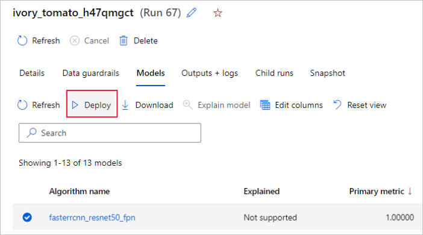
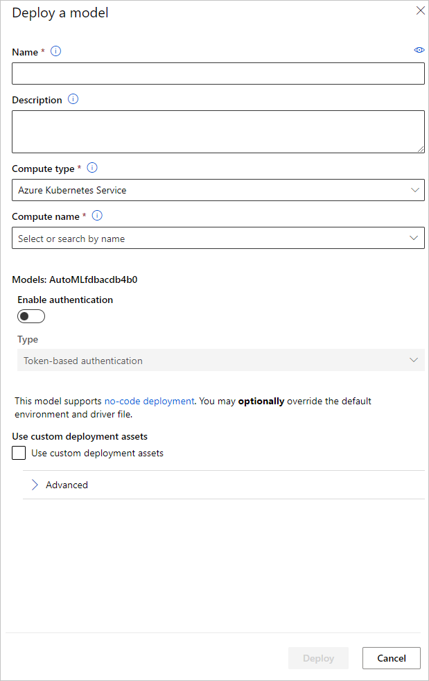

# Set up AutoML to train computer vision models with Python (v1)

[!INCLUDE [sdk v1](../includes/machine-learning-sdk-v1.md)]
    
    
[!INCLUDE [cli-version-info](../includes/machine-learning-cli-v1-deprecation.md)]


> [!IMPORTANT]
> This feature is currently in public preview. This preview version is provided without a service-level agreement. Certain features might not be supported or might have constrained capabilities. For more information, see [Supplemental Terms of Use for Microsoft Azure Previews](https://azure.microsoft.com/support/legal/preview-supplemental-terms/).

In this article, you learn how to train computer vision models on image data with automated ML in the [Azure Machine Learning Python SDK](/python/api/overview/azure/ml/).

Automated ML supports model training for computer vision tasks like image classification, object detection, and instance segmentation. Authoring AutoML models for computer vision tasks is currently supported via the Azure Machine Learning Python SDK. The resulting experimentation runs, models, and outputs are accessible from the Azure Machine Learning studio UI. [Learn more about automated ml for computer vision tasks on image data](../concept-automated-ml.md).

> [!NOTE]
> Automated ML for computer vision tasks is only available via the Azure Machine Learning Python SDK. 

## Prerequisites

* An Azure Machine Learning workspace. To create the workspace, see [Create workspace resources](../quickstart-create-resources.md).

* The Azure Machine Learning Python SDK installed.
    To install the SDK you can either, 
    * Create a compute instance, which automatically installs the SDK and is pre-configured for ML workflows. For more information, see [Create and manage an Azure Machine Learning compute instance](../how-to-create-compute-instance.md).

    * [Install the `automl` package yourself](https://github.com/Azure/azureml-examples/blob/v1-archive/v1/python-sdk/tutorials/automl-with-azureml/README.md#setup-using-a-local-conda-environment), which includes the [default installation](/python/api/overview/azure/ml/install#default-install) of the SDK.
    
    > [!NOTE]
    > Only Python 3.7 and 3.8 are compatible with automated ML support for computer vision tasks. 

## Select your task type
Automated ML for images supports the following task types:


Task type | AutoMLImage config syntax
---|---
 image classification | `ImageTask.IMAGE_CLASSIFICATION`
image classification multi-label | `ImageTask.IMAGE_CLASSIFICATION_MULTILABEL`
image object detection | `ImageTask.IMAGE_OBJECT_DETECTION`
image instance segmentation| `ImageTask.IMAGE_INSTANCE_SEGMENTATION`

This task type is a required parameter and is passed in using the `task` parameter in the [`AutoMLImageConfig`](/python/api/azureml-train-automl-client/azureml.train.automl.automlimageconfig.automlimageconfig). 

For example:

```python
from azureml.train.automl import AutoMLImageConfig
from azureml.automl.core.shared.constants import ImageTask
automl_image_config = AutoMLImageConfig(task=ImageTask.IMAGE_OBJECT_DETECTION)
```

## Training and validation data

In order to generate computer vision models, you need to bring labeled image data as input for model training in the form of an Azure Machine Learning [TabularDataset](/python/api/azureml-core/azureml.data.tabulardataset). You can either use a `TabularDataset` that you have [exported from a data labeling project](../how-to-manage-labeling-projects.md#export-the-labels), or create a new `TabularDataset` with your labeled training data. 

If your training data is in a different format (like, pascal VOC or COCO), you can apply the helper scripts included with the sample notebooks to convert the data to JSONL. Learn more about how to [prepare data for computer vision tasks with automated ML](../how-to-prepare-datasets-for-automl-images.md). 

> [!Warning]
> Creation of TabularDatasets from data in JSONL format is supported using the SDK only, for this capability. Creating the dataset via UI is not supported at this time. As of now, the UI doesn't recognize the StreamInfo datatype, which is the datatype used for image URLs in JSONL format.

> [!Note]
> The training dataset needs to have at least 10 images in order to be able to submit an AutoML run. 

### JSONL schema samples

The structure of the TabularDataset depends upon the task at hand. For computer vision task types, it consists of the following fields:

Field| Description
---|---
`image_url`| Contains filepath as a StreamInfo object
`image_details`|Image metadata information consists of height, width, and format. This field is optional and hence may or may not exist.
`label`| A json representation of the image label, based on the task type.

The following is a sample JSONL file for image classification:

```python
{
      "image_url": "AmlDatastore://image_data/Image_01.png",
      "image_details":
      {
          "format": "png",
          "width": "2230px",
          "height": "4356px"
      },
      "label": "cat"
  }
  {
      "image_url": "AmlDatastore://image_data/Image_02.jpeg",
      "image_details":
      {
          "format": "jpeg",
          "width": "3456px",
          "height": "3467px"
      },
      "label": "dog"
  }
  ```

  The following code is a sample JSONL file for object detection:

  ```python
  {
      "image_url": "AmlDatastore://image_data/Image_01.png",
      "image_details":
      {
          "format": "png",
          "width": "2230px",
          "height": "4356px"
      },
      "label":
      {
          "label": "cat",
          "topX": "1",
          "topY": "0",
          "bottomX": "0",
          "bottomY": "1",
          "isCrowd": "true",
      }
  }
  {
      "image_url": "AmlDatastore://image_data/Image_02.png",
      "image_details":
      {
          "format": "jpeg",
          "width": "1230px",
          "height": "2356px"
      },
      "label":
      {
          "label": "dog",
          "topX": "0",
          "topY": "1",
          "bottomX": "0",
          "bottomY": "1",
          "isCrowd": "false",
      }
  }
  ```


### Consume data

Once your data is in JSONL format, you can create a TabularDataset with the following code:

```python
ws = Workspace.from_config()
ds = ws.get_default_datastore()
from azureml.core import Dataset

training_dataset = Dataset.Tabular.from_json_lines_files(
        path=ds.path('odFridgeObjects/odFridgeObjects.jsonl'),
        set_column_types={'image_url': DataType.to_stream(ds.workspace)})
training_dataset = training_dataset.register(workspace=ws, name=training_dataset_name)
```

Automated ML does not impose any constraints on training or validation data size for computer vision tasks. Maximum dataset size is only limited by the storage layer behind the dataset (i.e. blob store). There is no minimum number of images or labels. However, we recommend to start with a minimum of 10-15 samples per label to ensure the output model is sufficiently trained. The higher the total number of labels/classes, the more samples you need per label.

Training data is a required and is passed in using the `training_data` parameter. You can optionally specify another TabularDataset as a validation dataset to be used for your model with the `validation_data` parameter of the AutoMLImageConfig. If no validation dataset is specified, 20% of your training data will be used for validation by default, unless you pass `validation_size` argument with a different value.

For example:

```python
from azureml.train.automl import AutoMLImageConfig
automl_image_config = AutoMLImageConfig(training_data=training_dataset)
```

## Compute to run experiment

Provide a [compute target](../v1/concept-azure-machine-learning-architecture.md#compute-targets) for automated ML to conduct model training. Automated ML models for computer vision tasks require GPU SKUs and support NC and ND families. We recommend the NCsv3-series (with v100 GPUs) for faster training. A compute target with a multi-GPU VM SKU leverages multiple GPUs to also speed up training. Additionally, when you set up a compute target with multiple nodes you can conduct faster model training through parallelism when tuning hyperparameters for your model.

> [!NOTE]
> If you are using a [compute instance](../concept-compute-instance.md) as your compute target, please make sure that multiple AutoML jobs are not run at the same time. Also, please make sure that `max_concurrent_iterations` is set to 1 in your [experiment resources](#resources-for-the-sweep).

The compute target is a required parameter and is passed in using the `compute_target` parameter of the `AutoMLImageConfig`. For example:

```python
from azureml.train.automl import AutoMLImageConfig
automl_image_config = AutoMLImageConfig(compute_target=compute_target)
```

## Configure model algorithms and hyperparameters

With support for computer vision tasks, you can control the model algorithm and sweep hyperparameters. These model algorithms and hyperparameters are passed in as the parameter space for the sweep.

The model algorithm is required and is passed in via `model_name` parameter. You can either specify a single `model_name` or choose between multiple. 

### Supported model algorithms

The following table summarizes the supported models for each computer vision task.

Task |  Model algorithms | String literal syntax<br> ***`default_model`\**** denoted with \*
---|----------|----------
Image classification<br> (multi-class and multi-label)| **MobileNet**: Light-weighted models for mobile applications <br> **ResNet**: Residual networks<br> **ResNeSt**: Split attention networks<br> **SE-ResNeXt50**: Squeeze-and-Excitation networks<br> **ViT**: Vision transformer networks| `mobilenetv2`   <br>`resnet18` <br>`resnet34` <br> `resnet50`  <br> `resnet101` <br> `resnet152`    <br> `resnest50` <br> `resnest101`  <br> `seresnext`  <br> `vits16r224` (small) <br> ***`vitb16r224`\**** (base) <br>`vitl16r224` (large)|
Object detection | **YOLOv5**: One stage object detection model   <br>  **Faster RCNN ResNet FPN**: Two stage object detection models  <br> **RetinaNet ResNet FPN**: address class imbalance with Focal Loss <br> <br>*Note: Refer to [`model_size` hyperparameter](../reference-automl-images-hyperparameters.md#model-specific-hyperparameters) for YOLOv5 model sizes.*| ***`yolov5`\**** <br> `fasterrcnn_resnet18_fpn` <br> `fasterrcnn_resnet34_fpn` <br> `fasterrcnn_resnet50_fpn` <br> `fasterrcnn_resnet101_fpn` <br> `fasterrcnn_resnet152_fpn` <br> `retinanet_resnet50_fpn` 
Instance segmentation | **MaskRCNN ResNet FPN**| `maskrcnn_resnet18_fpn` <br> `maskrcnn_resnet34_fpn` <br> ***`maskrcnn_resnet50_fpn`\****  <br> `maskrcnn_resnet101_fpn` <br> `maskrcnn_resnet152_fpn` <br>`maskrcnn_resnet50_fpn`


In addition to controlling the model algorithm, you can also tune hyperparameters used for model training. While many of the hyperparameters exposed are model-agnostic, there are instances where hyperparameters are task-specific or model-specific. [Learn more about the available hyperparameters for these instances](../reference-automl-images-hyperparameters.md). 

### Data augmentation 

In general, deep learning model performance can often improve with more data. Data augmentation is a practical technique to amplify the data size and variability of a dataset which helps to prevent overfitting and improve the model's generalization ability on unseen data. Automated ML applies different data augmentation techniques based on the computer vision task, before feeding input images to the model. Currently, there is no exposed hyperparameter to control data augmentations. 

|Task | Impacted dataset | Data augmentation technique(s) applied |
|-------|----------|---------|
|Image classification (multi-class and multi-label) | Training <br><br><br> Validation & Test| Random resize and crop, horizontal flip, color jitter (brightness, contrast, saturation, and hue), normalization using channel-wise ImageNet's mean and standard deviation <br><br><br>Resize, center crop, normalization |
|Object detection, instance segmentation| Training <br><br> Validation & Test |Random crop around bounding boxes, expand, horizontal flip, normalization, resize <br><br><br>Normalization, resize
|Object detection using yolov5| Training <br><br> Validation & Test  |Mosaic, random affine (rotation, translation, scale, shear), horizontal flip <br><br><br> Letterbox resizing|

## Configure your experiment settings

Before doing a large sweep to search for the optimal models and hyperparameters, we recommend trying the default values to get a first baseline. Next, you can explore multiple hyperparameters for the same model before sweeping over multiple models and their parameters. This way, you can employ a more iterative approach, because with multiple models and multiple hyperparameters for each, the search space grows exponentially and you need more iterations to find optimal configurations.

If you wish to use the default hyperparameter values for a given algorithm (say yolov5), you can specify the config for your AutoML Image runs as follows:

```python
from azureml.train.automl import AutoMLImageConfig
from azureml.train.hyperdrive import GridParameterSampling, choice
from azureml.automl.core.shared.constants import ImageTask

automl_image_config_yolov5 = AutoMLImageConfig(task=ImageTask.IMAGE_OBJECT_DETECTION,
                                               compute_target=compute_target,
                                               training_data=training_dataset,
                                               validation_data=validation_dataset,
                                               hyperparameter_sampling=GridParameterSampling({'model_name': choice('yolov5')}),
                                               iterations=1)
```

Once you've built a baseline model, you might want to optimize model performance in order to sweep over the model algorithm and hyperparameter space. You can use the following sample config to sweep over the hyperparameters for each algorithm, choosing from a range of values for learning_rate, optimizer, lr_scheduler, etc., to generate a model with the optimal primary metric. If hyperparameter values are not specified, then default values are used for the specified algorithm.

### Primary metric

The primary metric used for model optimization and hyperparameter tuning depends on the task type. Using other primary metric values is currently not supported. 

* `accuracy` for IMAGE_CLASSIFICATION
* `iou` for IMAGE_CLASSIFICATION_MULTILABEL
* `mean_average_precision` for IMAGE_OBJECT_DETECTION
* `mean_average_precision` for IMAGE_INSTANCE_SEGMENTATION
    
### Experiment budget

You can optionally specify the maximum time budget for your AutoML Vision experiment using `experiment_timeout_hours` - the amount of time in hours before the experiment terminates. If none specified, default experiment timeout is seven days (maximum 60 days).


## Sweeping hyperparameters for your model

When training computer vision models, model performance depends heavily on the hyperparameter values selected. Often, you might want to tune the hyperparameters to get optimal performance.
With support for computer vision tasks in automated ML, you can sweep hyperparameters to find the optimal settings for your model. This feature applies the hyperparameter tuning capabilities in Azure Machine Learning. [Learn how to tune hyperparameters](../how-to-tune-hyperparameters.md).

### Define the parameter search space

You can define the model algorithms and hyperparameters to sweep in the parameter space. 

* See [Configure model algorithms and hyperparameters](#configure-model-algorithms-and-hyperparameters) for the list of supported model algorithms for each task type. 
* See [Hyperparameters for computer vision tasks](../reference-automl-images-hyperparameters.md)  hyperparameters for each computer vision task type. 
* See [details on supported distributions for discrete and continuous hyperparameters](../how-to-tune-hyperparameters.md#define-the-search-space).

### Sampling methods for the sweep

When sweeping hyperparameters, you need to specify the sampling method to use for sweeping over the defined parameter space. Currently, the following sampling methods are supported with the `hyperparameter_sampling` parameter:

* [Random sampling](../how-to-tune-hyperparameters.md#random-sampling)
* [Grid sampling](../how-to-tune-hyperparameters.md#grid-sampling) 
* [Bayesian sampling](../how-to-tune-hyperparameters.md#bayesian-sampling) 
    
> [!NOTE]
> Currently only random and grid sampling support conditional hyperparameter spaces.

### Early termination policies

You can automatically end poorly performing runs with an early termination policy. Early termination improves computational efficiency, saving compute resources that would have been otherwise spent on less promising configurations. Automated ML for images supports the following early termination policies using the `early_termination_policy` parameter. If no termination policy is specified, all configurations are run to completion.

* [Bandit policy](../how-to-tune-hyperparameters.md#bandit-policy)
* [Median stopping policy](../how-to-tune-hyperparameters.md#median-stopping-policy)
* [Truncation selection policy](../how-to-tune-hyperparameters.md#truncation-selection-policy)

Learn more about [how to configure the early termination policy for your hyperparameter sweep](../how-to-tune-hyperparameters.md#early-termination).

### Resources for the sweep

You can control the resources spent on your hyperparameter sweep by specifying the `iterations` and the `max_concurrent_iterations` for the sweep.

Parameter | Detail
-----|----
`iterations` |  Required parameter for maximum number of configurations to sweep. Must be an integer between 1 and 1000. When exploring just the default hyperparameters for a given model algorithm, set this parameter to 1.
`max_concurrent_iterations`| Maximum number of runs that can run concurrently. If not specified, all runs launch in parallel. If specified, must be an integer between 1 and 100.  <br><br> **NOTE:** The number of concurrent runs is gated on the resources available in the specified compute target. Ensure that the compute target has the available resources for the desired concurrency.


> [!NOTE]
> For a complete sweep configuration sample, please refer to this [tutorial](../tutorial-auto-train-image-models.md#manual-hyperparameter-sweeping-for-image-tasks).

### Arguments

You can pass fixed settings or parameters that don't change during the parameter space sweep as arguments. Arguments are passed in name-value pairs and the name must be prefixed by a double dash. 

```python
from azureml.train.automl import AutoMLImageConfig
arguments = ["--early_stopping", 1, "--evaluation_frequency", 2]
automl_image_config = AutoMLImageConfig(arguments=arguments)
```

##  Incremental training (optional)

Once the training run is done, you have the option to further train the model by loading the trained model checkpoint. You can either use the same dataset or a different one for incremental training. 

There are two available options for incremental training. You can, 

* Pass the run ID that you want to load the checkpoint from.
* Pass the checkpoints through a FileDataset.

### Pass the checkpoint via run ID
To find the run ID from the desired model, you can use the following code. 

```python
# find a run id to get a model checkpoint from
target_checkpoint_run = automl_image_run.get_best_child()
```

To pass a checkpoint via the run ID, you need to use the `checkpoint_run_id` parameter.

```python
automl_image_config = AutoMLImageConfig(task='image-object-detection',
                                        compute_target=compute_target,
                                        training_data=training_dataset,
                                        validation_data=validation_dataset,
                                        checkpoint_run_id= target_checkpoint_run.id,
                                        primary_metric='mean_average_precision',
                                        **tuning_settings)

automl_image_run = experiment.submit(automl_image_config)
automl_image_run.wait_for_completion(wait_post_processing=True)
```

### Pass the checkpoint via FileDataset
To pass a checkpoint via a FileDataset, you need to use the `checkpoint_dataset_id` and `checkpoint_filename` parameters. 

```python
# download the checkpoint from the previous run
model_name = "outputs/model.pt"
model_local = "checkpoints/model_yolo.pt"
target_checkpoint_run.download_file(name=model_name, output_file_path=model_local)

# upload the checkpoint to the blob store
ds.upload(src_dir="checkpoints", target_path='checkpoints')

# create a FileDatset for the checkpoint and register it with your workspace
ds_path = ds.path('checkpoints/model_yolo.pt')
checkpoint_yolo = Dataset.File.from_files(path=ds_path)
checkpoint_yolo = checkpoint_yolo.register(workspace=ws, name='yolo_checkpoint')

automl_image_config = AutoMLImageConfig(task='image-object-detection',
                                        compute_target=compute_target,
                                        training_data=training_dataset,
                                        validation_data=validation_dataset,
                                        checkpoint_dataset_id= checkpoint_yolo.id,
                                        checkpoint_filename='model_yolo.pt',
                                        primary_metric='mean_average_precision',
                                        **tuning_settings)

automl_image_run = experiment.submit(automl_image_config)
automl_image_run.wait_for_completion(wait_post_processing=True)

```

## Submit the run

When you have your `AutoMLImageConfig` object ready, you can submit the experiment.

```python
ws = Workspace.from_config()
experiment = Experiment(ws, "Tutorial-automl-image-object-detection")
automl_image_run = experiment.submit(automl_image_config)
```

## Outputs and evaluation metrics

The automated ML training runs generates output model files, evaluation metrics, logs and deployment artifacts like the scoring file and the environment file which can be viewed from the outputs and logs and metrics tab of the child runs.

> [!TIP]
> Check how to navigate to the job results from the  [View run results](../how-to-understand-automated-ml.md#view-job-results) section.

For definitions and examples of the performance charts and metrics provided for each run, see [Evaluate automated machine learning experiment results](../how-to-understand-automated-ml.md#metrics-for-image-models-preview)

## Register and deploy model

Once the run completes, you can register the model that was created from the best run (configuration that resulted in the best primary metric)

```Python
best_child_run = automl_image_run.get_best_child()
model_name = best_child_run.properties['model_name']
model = best_child_run.register_model(model_name = model_name, model_path='outputs/model.pt')
```

After you register the model you want to use, you can deploy it as a web service on [Azure Container Instances (ACI)](../v1/how-to-deploy-azure-container-instance.md) or [Azure Kubernetes Service (AKS)](../v1/how-to-deploy-azure-kubernetes-service.md). ACI is the perfect option for testing deployments, while AKS is better suited for high-scale, production usage.

This example deploys the model as a web service in AKS. To deploy in AKS, first create an AKS compute cluster or use an existing AKS cluster. You can use either GPU or CPU VM SKUs for your deployment cluster. 

```python

from azureml.core.compute import ComputeTarget, AksCompute
from azureml.exceptions import ComputeTargetException

# Choose a name for your cluster
aks_name = "cluster-aks-gpu"

# Check to see if the cluster already exists
try:
    aks_target = ComputeTarget(workspace=ws, name=aks_name)
    print('Found existing compute target')
except ComputeTargetException:
    print('Creating a new compute target...')
    # Provision AKS cluster with GPU machine
    prov_config = AksCompute.provisioning_configuration(vm_size="STANDARD_NC6", 
                                                        location="eastus2")
    # Create the cluster
    aks_target = ComputeTarget.create(workspace=ws, 
                                      name=aks_name, 
                                      provisioning_configuration=prov_config)
    aks_target.wait_for_completion(show_output=True)
```

Next, you can define the inference configuration, that describes how to set up the web-service containing your model. You can use the scoring script and the environment from the training run in your inference config.

```python
from azureml.core.model import InferenceConfig

best_child_run.download_file('outputs/scoring_file_v_1_0_0.py', output_file_path='score.py')
environment = best_child_run.get_environment()
inference_config = InferenceConfig(entry_script='score.py', environment=environment)
```

You can then deploy the model as an AKS web service.

```python
# Deploy the model from the best run as an AKS web service
from azureml.core.webservice import AksWebservice
from azureml.core.webservice import Webservice
from azureml.core.model import Model
from azureml.core.environment import Environment

aks_config = AksWebservice.deploy_configuration(autoscale_enabled=True,                                                    
                                                cpu_cores=1,
                                                memory_gb=50,
                                                enable_app_insights=True)

aks_service = Model.deploy(ws,
                           models=[model],
                           inference_config=inference_config,
                           deployment_config=aks_config,
                           deployment_target=aks_target,
                           name='automl-image-test',
                           overwrite=True)
aks_service.wait_for_deployment(show_output=True)
print(aks_service.state)
```

Alternatively, you can deploy the model from the [Azure Machine Learning studio UI](https://ml.azure.com/). 
Navigate to the model you wish to deploy in the **Models** tab of the automated ML run and select the **Deploy**.  



You can configure the model deployment endpoint name and the inferencing cluster to use for your model deployment in the **Deploy a model** pane.



### Update inference configuration

In the previous step, we downloaded the scoring file `outputs/scoring_file_v_1_0_0.py` from the best model into a local `score.py` file and we used it to create an `InferenceConfig` object. This script can be modified to change the model specific inference settings if needed after it has been downloaded and before creating the `InferenceConfig`. For instance, this is the code section that initializes the model in the scoring file:
    
```
...
def init():
    ...
    try:
        logger.info("Loading model from path: {}.".format(model_path))
        model_settings = {...}
        model = load_model(TASK_TYPE, model_path, **model_settings)
        logger.info("Loading successful.")
    except Exception as e:
        logging_utilities.log_traceback(e, logger)
        raise
...
```

Each of the tasks (and some models) have a set of parameters in the `model_settings` dictionary. By default, we use the same values for the parameters that were used during the training and validation. Depending on the behavior that we need when using the model for inference, we can change these parameters. Below you can find a list of parameters for each task type and model.  

| Task | Parameter name | Default  |
|--------- |------------- | --------- |
|Image classification (multi-class and multi-label) | `valid_resize_size`<br>`valid_crop_size` | 256<br>224 |
|Object detection | `min_size`<br>`max_size`<br>`box_score_thresh`<br>`nms_iou_thresh`<br>`box_detections_per_img` | 600<br>1333<br>0.3<br>0.5<br>100 |
|Object detection using `yolov5`| `img_size`<br>`model_size`<br>`box_score_thresh`<br>`nms_iou_thresh` | 640<br>medium<br>0.1<br>0.5 |
|Instance segmentation| `min_size`<br>`max_size`<br>`box_score_thresh`<br>`nms_iou_thresh`<br>`box_detections_per_img`<br>`mask_pixel_score_threshold`<br>`max_number_of_polygon_points`<br>`export_as_image`<br>`image_type` | 600<br>1333<br>0.3<br>0.5<br>100<br>0.5<br>100<br>False<br>JPG|

For a detailed description on task specific hyperparameters, please refer to [Hyperparameters for computer vision tasks in automated machine learning](../reference-automl-images-hyperparameters.md).
    
If you want to use tiling, and want to control tiling behavior, the following parameters are available: `tile_grid_size`, `tile_overlap_ratio` and `tile_predictions_nms_thresh`. For more details on these parameters please check [Train a small object detection model using AutoML](../how-to-use-automl-small-object-detect.md).

## Example notebooks
Review detailed code examples and use cases in the [GitHub notebook repository for automated machine learning samples](https://github.com/Azure/azureml-examples/tree/v1-archive/v1/python-sdk/tutorials/automl-with-azureml). Please check the folders with 'image-' prefix for samples specific to building computer vision models.


## Next steps

* [Tutorial: Train an object detection model with AutoML and Python](../tutorial-auto-train-image-models.md).
* [Make predictions with ONNX on computer vision models from AutoML](../how-to-inference-onnx-automl-image-models.md) 
* [Troubleshoot automated ML experiments](how-to-troubleshoot-auto-ml.md).
