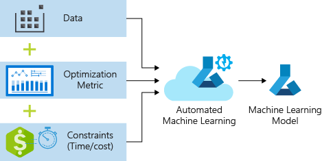

# Train a regression model with AutoML and Python (SDK v1)

[!INCLUDE [sdk v1](../includes/machine-learning-sdk-v1.md)]

In this article, you learn how to train a regression model with the Azure Machine Learning Python SDK using Azure Machine Learning automated ML. This regression model predicts NYC taxi fares. 

This process accepts training data and configuration settings, and automatically iterates through combinations of different feature normalization/standardization methods, models, and hyperparameter settings to arrive at the best model. 



You'll write code using the Python SDK in this article.  You'll learn the following tasks:

> [!div class="checklist"]
> * Download, transform, and clean data using Azure Open Datasets
> * Train an automated machine learning regression model
> * Calculate model accuracy

For no-code AutoML, try the following tutorials: 

* [Tutorial: Train no-code classification models](../tutorial-first-experiment-automated-ml.md)

* [Tutorial: Forecast demand with automated machine learning](../tutorial-automated-ml-forecast.md)

## Prerequisites

If you don't have an Azure subscription, create a free account before you begin. Try the [free or paid version](https://azure.microsoft.com/free/) of Azure Machine Learning today.

* Complete the [Quickstart: Get started with Azure Machine Learning](../quickstart-create-resources.md) if you don't already have an Azure Machine Learning workspace or a compute instance.
* After you complete the quickstart:
    1. Select **Notebooks** in the studio.
    1. Select the **Samples** tab.
    1. Open the *SDK v1/tutorials/regression-automl-nyc-taxi-data/regression-automated-ml.ipynb* notebook.
    1. To run each cell in the tutorial, select **Clone this notebook**

This article is also available on [GitHub](https://github.com/Azure/MachineLearningNotebooks/tree/master/tutorials) if you wish to run it in your own [local environment](how-to-configure-environment.md). 
To get the required packages, 
* [Install the full `automl` client](https://github.com/Azure/azureml-examples/blob/v1-archive/v1/python-sdk/tutorials/automl-with-azureml/README.md#setup-using-a-local-conda-environment).
* Run `pip install azureml-opendatasets azureml-widgets` to get the required packages.

## Download and prepare data

Import the necessary packages. The Open Datasets package contains a class representing each data source (`NycTlcGreen` for example) to easily filter date parameters before downloading.

```python
from azureml.opendatasets import NycTlcGreen
import pandas as pd
from datetime import datetime
from dateutil.relativedelta import relativedelta
```

Begin by creating a dataframe to hold the taxi data. When working in a non-Spark environment, Open Datasets only allows downloading one month of data at a time with certain classes to avoid `MemoryError` with large datasets.

To download taxi data, iteratively fetch one month at a time, and before appending it to `green_taxi_df` randomly sample 2,000 records from each month to avoid bloating the dataframe. Then preview the data.


```python
green_taxi_df = pd.DataFrame([])
start = datetime.strptime("1/1/2015","%m/%d/%Y")
end = datetime.strptime("1/31/2015","%m/%d/%Y")

for sample_month in range(12):
    temp_df_green = NycTlcGreen(start + relativedelta(months=sample_month), end + relativedelta(months=sample_month)) \
        .to_pandas_dataframe()
    green_taxi_df = green_taxi_df.append(temp_df_green.sample(2000))

green_taxi_df.head(10)
```

|vendorID| lpepPickupDatetime|    lpepDropoffDatetime|    passengerCount|    tripDistance|    puLocationId|    doLocationId|    pickupLongitude|    pickupLatitude|    dropoffLongitude    |...|    paymentType    |fareAmount    |extra|    mtaTax|    improvementSurcharge|    tipAmount|    tollsAmount|    ehailFee|    totalAmount|    tripType|
|----|----|----|----|----|----|---|--|---|---|---|----|----|----|--|---|----|-----|----|----|----|
|131969|2|2015-01-11 05:34:44|2015-01-11 05:45:03|3|4.84|None|None|-73.88|40.84|-73.94|...|2|15.00|0.50|0.50|0.3|0.00|0.00|nan|16.30|
|1129817|2|2015-01-20 16:26:29|2015-01-20 16:30:26|1|0.69|None|None|-73.96|40.81|-73.96|...|2|4.50|1.00|0.50|0.3|0.00|0.00|nan|6.30|
|1278620|2|2015-01-01 05:58:10|2015-01-01 06:00:55|1|0.45|None|None|-73.92|40.76|-73.91|...|2|4.00|0.00|0.50|0.3|0.00|0.00|nan|4.80|
|348430|2|2015-01-17 02:20:50|2015-01-17 02:41:38|1|0.00|None|None|-73.81|40.70|-73.82|...|2|12.50|0.50|0.50|0.3|0.00|0.00|nan|13.80|
1269627|1|2015-01-01 05:04:10|2015-01-01 05:06:23|1|0.50|None|None|-73.92|40.76|-73.92|...|2|4.00|0.50|0.50|0|0.00|0.00|nan|5.00|
|811755|1|2015-01-04 19:57:51|2015-01-04 20:05:45|2|1.10|None|None|-73.96|40.72|-73.95|...|2|6.50|0.50|0.50|0.3|0.00|0.00|nan|7.80|
|737281|1|2015-01-03 12:27:31|2015-01-03 12:33:52|1|0.90|None|None|-73.88|40.76|-73.87|...|2|6.00|0.00|0.50|0.3|0.00|0.00|nan|6.80|
|113951|1|2015-01-09 23:25:51|2015-01-09 23:39:52|1|3.30|None|None|-73.96|40.72|-73.91|...|2|12.50|0.50|0.50|0.3|0.00|0.00|nan|13.80|
|150436|2|2015-01-11 17:15:14|2015-01-11 17:22:57|1|1.19|None|None|-73.94|40.71|-73.95|...|1|7.00|0.00|0.50|0.3|1.75|0.00|nan|9.55|
|432136|2|2015-01-22 23:16:33    2015-01-22 23:20:13    1    0.65|None|None|-73.94|40.71|-73.94|...|2|5.00|0.50|0.50|0.3|0.00|0.00|nan|6.30|

Remove some of the columns that you won't need for training or additional feature building.  Automate machine learning will automatically handle time-based features such as **lpepPickupDatetime**.

```python
columns_to_remove = ["lpepDropoffDatetime", "puLocationId", "doLocationId", "extra", "mtaTax",
                     "improvementSurcharge", "tollsAmount", "ehailFee", "tripType", "rateCodeID",
                     "storeAndFwdFlag", "paymentType", "fareAmount", "tipAmount"
                    ]
for col in columns_to_remove:
    green_taxi_df.pop(col)

green_taxi_df.head(5)
```

### Cleanse data

Run the `describe()` function on the new dataframe to see summary statistics for each field.

```python
green_taxi_df.describe()
```

|vendorID|passengerCount|tripDistance|pickupLongitude|pickupLatitude|dropoffLongitude|dropoffLatitude|    totalAmount|month_num    day_of_month|day_of_week|hour_of_day
|----|----|---|---|----|---|---|---|---|---|---|
|count|48000.00|48000.00|48000.00|48000.00|48000.00|48000.00|48000.00|48000.00|48000.00|48000.00|
|mean|1.78|1.37|2.87|-73.83|40.69|-73.84|40.70|14.75|6.50|15.13|
|std|0.41|1.04|2.93|2.76|1.52|2.61|1.44|12.08|3.45|8.45|
|min|1.00|0.00|0.00|-74.66|0.00|-74.66|0.00|-300.00|1.00|1.00|
|25%|2.00|1.00|1.06|-73.96|40.70|-73.97|40.70|7.80|3.75|8.00|
|50%|2.00|1.00|1.90|-73.94|40.75|-73.94|40.75|11.30|6.50|15.00|
|75%|2.00|1.00|3.60|-73.92|40.80|-73.91|40.79|17.80|9.25|22.00|
|max|2.00|9.00|97.57|0.00|41.93|0.00|41.94|450.00|12.00|30.00|


From the summary statistics, you see that there are several fields that have outliers or values that will reduce model accuracy. First filter the lat/long fields to be within the bounds of the Manhattan area. This will filter out longer taxi trips or trips that are outliers in respect to their relationship with other features.

Additionally filter the `tripDistance` field to be greater than zero but less than 31 miles (the haversine distance between the two lat/long pairs). This eliminates long outlier trips that have inconsistent trip cost.

Lastly, the `totalAmount` field has negative values for the taxi fares, which don't make sense in the context of our model, and the `passengerCount` field has bad data with the minimum values being zero.

Filter out these anomalies using query functions, and then remove the last few columns unnecessary for training.


```python
final_df = green_taxi_df.query("pickupLatitude>=40.53 and pickupLatitude<=40.88")
final_df = final_df.query("pickupLongitude>=-74.09 and pickupLongitude<=-73.72")
final_df = final_df.query("tripDistance>=0.25 and tripDistance<31")
final_df = final_df.query("passengerCount>0 and totalAmount>0")

columns_to_remove_for_training = ["pickupLongitude", "pickupLatitude", "dropoffLongitude", "dropoffLatitude"]
for col in columns_to_remove_for_training:
    final_df.pop(col)
```

Call `describe()` again on the data to ensure cleansing worked as expected. You now have a prepared and cleansed set of taxi, holiday, and weather data to use for machine learning model training.

```python
final_df.describe()
```

## Configure workspace

Create a workspace object from the existing workspace. A [Workspace](/python/api/azureml-core/azureml.core.workspace.workspace) is a class that accepts your Azure subscription and resource information. It also creates a cloud resource to monitor and track your model runs. `Workspace.from_config()` reads the file **config.json** and loads the authentication details into an object named `ws`. `ws` is used throughout the rest of the code in this article.

```python
from azureml.core.workspace import Workspace
ws = Workspace.from_config()
```

## Split the data into train and test sets

Split the data into training and test sets by using the `train_test_split` function in the `scikit-learn` library. This function segregates the data into the x (**features**) data set for model training and the y (**values to predict**) data set for testing.

The `test_size` parameter determines the percentage of data to allocate to testing. The `random_state` parameter sets a seed to the random generator, so that your train-test splits are deterministic.

```python
from sklearn.model_selection import train_test_split

x_train, x_test = train_test_split(final_df, test_size=0.2, random_state=223)
```

The purpose of this step is to have data points to test the finished model that haven't been used to train the model, in order to measure true accuracy.

In other words, a well-trained model should be able to accurately make predictions from data it hasn't already seen. You now have data prepared for auto-training a machine learning model.

## Automatically train a model

To automatically train a model, take the following steps:
1. Define settings for the experiment run. Attach your training data to the configuration, and modify settings that control the training process.
1. Submit the experiment for model tuning. After submitting the experiment, the process iterates through different machine learning algorithms and hyperparameter settings, adhering to your defined constraints. It chooses the best-fit model by optimizing an accuracy metric.

### Define training settings

Define the experiment parameter and model settings for training. View the full list of [settings](how-to-configure-auto-train.md). Submitting the experiment with these default settings will take approximately 5-20 min, but if you want a shorter run time, reduce the `experiment_timeout_hours` parameter.

|Property| Value in this article |Description|
|----|----|---|
|**iteration_timeout_minutes**|10|Time limit in minutes for each iteration. Increase this value for larger datasets that need more time for each iteration.|
|**experiment_timeout_hours**|0.3|Maximum amount of time in hours that all iterations combined can take before the experiment terminates.|
|**enable_early_stopping**|True|Flag to enable early termination if the score is not improving in the short term.|
|**primary_metric**| spearman_correlation | Metric that you want to optimize. The best-fit model will be chosen based on this metric.|
|**featurization**| auto | By using **auto**, the experiment can preprocess the input data (handling missing data, converting text to numeric, etc.)|
|**verbosity**| logging.INFO | Controls the level of logging.|
|**n_cross_validations**|5|Number of cross-validation splits to perform when validation data is not specified.|

```python
import logging

automl_settings = {
    "iteration_timeout_minutes": 10,
    "experiment_timeout_hours": 0.3,
    "enable_early_stopping": True,
    "primary_metric": 'spearman_correlation',
    "featurization": 'auto',
    "verbosity": logging.INFO,
    "n_cross_validations": 5
}
```

Use your defined training settings as a `**kwargs` parameter to an `AutoMLConfig` object. Additionally, specify your training data and the type of model, which is `regression` in this case.

```python
from azureml.train.automl import AutoMLConfig

automl_config = AutoMLConfig(task='regression',
                             debug_log='automated_ml_errors.log',
                             training_data=x_train,
                             label_column_name="totalAmount",
                             **automl_settings)
```

> [!NOTE]
> Automated machine learning pre-processing steps (feature normalization, handling missing data,
> converting text to numeric, etc.) become part of the underlying model. When using the model for
> predictions, the same pre-processing steps applied during training are applied to
> your input data automatically.

### Train the automatic regression model

Create an experiment object in your workspace. An experiment acts as a container for your individual jobs. Pass the defined `automl_config` object to the experiment, and set the output to `True` to view progress during the job.

After starting the experiment, the output shown updates live as the experiment runs. For each iteration, you see the model type, the run duration, and the training accuracy. The field `BEST` tracks the best running training score based on your metric type.

```python
from azureml.core.experiment import Experiment
experiment = Experiment(ws, "Tutorial-NYCTaxi")
local_run = experiment.submit(automl_config, show_output=True)
```

```output
Running on local machine
Parent Run ID: AutoML_1766cdf7-56cf-4b28-a340-c4aeee15b12b
Current status: DatasetFeaturization. Beginning to featurize the dataset.
Current status: DatasetEvaluation. Gathering dataset statistics.
Current status: FeaturesGeneration. Generating features for the dataset.
Current status: DatasetFeaturizationCompleted. Completed featurizing the dataset.
Current status: DatasetCrossValidationSplit. Generating individually featurized CV splits.
Current status: ModelSelection. Beginning model selection.

****************************************************************************************************
ITERATION: The iteration being evaluated.
PIPELINE: A summary description of the pipeline being evaluated.
DURATION: Time taken for the current iteration.
METRIC: The result of computing score on the fitted pipeline.
BEST: The best observed score thus far.
****************************************************************************************************

 ITERATION   PIPELINE                                       DURATION      METRIC      BEST
         0   StandardScalerWrapper RandomForest             0:00:16       0.8746    0.8746
         1   MinMaxScaler RandomForest                      0:00:15       0.9468    0.9468
         2   StandardScalerWrapper ExtremeRandomTrees       0:00:09       0.9303    0.9468
         3   StandardScalerWrapper LightGBM                 0:00:10       0.9424    0.9468
         4   RobustScaler DecisionTree                      0:00:09       0.9449    0.9468
         5   StandardScalerWrapper LassoLars                0:00:09       0.9440    0.9468
         6   StandardScalerWrapper LightGBM                 0:00:10       0.9282    0.9468
         7   StandardScalerWrapper RandomForest             0:00:12       0.8946    0.9468
         8   StandardScalerWrapper LassoLars                0:00:16       0.9439    0.9468
         9   MinMaxScaler ExtremeRandomTrees                0:00:35       0.9199    0.9468
        10   RobustScaler ExtremeRandomTrees                0:00:19       0.9411    0.9468
        11   StandardScalerWrapper ExtremeRandomTrees       0:00:13       0.9077    0.9468
        12   StandardScalerWrapper LassoLars                0:00:15       0.9433    0.9468
        13   MinMaxScaler ExtremeRandomTrees                0:00:14       0.9186    0.9468
        14   RobustScaler RandomForest                      0:00:10       0.8810    0.9468
        15   StandardScalerWrapper LassoLars                0:00:55       0.9433    0.9468
        16   StandardScalerWrapper ExtremeRandomTrees       0:00:13       0.9026    0.9468
        17   StandardScalerWrapper RandomForest             0:00:13       0.9140    0.9468
        18   VotingEnsemble                                 0:00:23       0.9471    0.9471
        19   StackEnsemble                                  0:00:27       0.9463    0.9471
```

## Explore the results

Explore the results of automatic training with a [Jupyter widget](/python/api/azureml-widgets/azureml.widgets). The widget allows you to see a graph and table of all individual job iterations, along with training accuracy metrics and metadata. Additionally, you can filter on different accuracy metrics than your primary metric with the dropdown selector.

```python
from azureml.widgets import RunDetails
RunDetails(local_run).show()
```


### Retrieve the best model

Select the best model from your iterations. The `get_output` function returns the best run and the fitted model for the last fit invocation. By using the overloads on `get_output`, you can retrieve the best run and fitted model for any logged metric or a particular iteration.

```python
best_run, fitted_model = local_run.get_output()
print(best_run)
print(fitted_model)
```

### Test the best model accuracy

Use the best model to run predictions on the test data set to predict taxi fares. The function `predict` uses the best model and predicts the values of y, **trip cost**, from the `x_test` data set. Print the first 10 predicted cost values from `y_predict`.

```python
y_test = x_test.pop("totalAmount")

y_predict = fitted_model.predict(x_test)
print(y_predict[:10])
```

Calculate the `root mean squared error` of the results. Convert the `y_test` dataframe to a list to compare to the predicted values. The function `mean_squared_error` takes two arrays of values and calculates the average squared error between them. Taking the square root of the result gives an error in the same units as the y variable, **cost**. It indicates roughly how far the taxi fare predictions are from the actual fares.

```python
from sklearn.metrics import mean_squared_error
from math import sqrt

y_actual = y_test.values.flatten().tolist()
rmse = sqrt(mean_squared_error(y_actual, y_predict))
rmse
```

Run the following code to calculate mean absolute percent error (MAPE) by using the full `y_actual` and `y_predict` data sets. This metric calculates an absolute difference between each predicted and actual value and sums all the differences. Then it expresses that sum as a percent of the total of the actual values.

```python
sum_actuals = sum_errors = 0

for actual_val, predict_val in zip(y_actual, y_predict):
    abs_error = actual_val - predict_val
    if abs_error < 0:
        abs_error = abs_error * -1

    sum_errors = sum_errors + abs_error
    sum_actuals = sum_actuals + actual_val

mean_abs_percent_error = sum_errors / sum_actuals
print("Model MAPE:")
print(mean_abs_percent_error)
print()
print("Model Accuracy:")
print(1 - mean_abs_percent_error)
```

```output
Model MAPE:
0.14353867606052823

Model Accuracy:
0.8564613239394718
```


From the two prediction accuracy metrics, you see that the model is fairly good at predicting taxi fares from the data set's features, typically within +- $4.00, and approximately 15% error.

The traditional machine learning model development process is highly resource-intensive, and requires significant domain knowledge and time investment to run and compare the results of dozens of models. Using automated machine learning is a great way to rapidly test many different models for your scenario.

## Clean up resources

Do not complete this section if you plan on running other Azure Machine Learning tutorials.

### Stop the compute instance

[!INCLUDE [aml-stop-server](../includes/aml-stop-server.md)]

### Delete everything

If you don't plan to use the resources you created, delete them, so you don't incur any charges.

1. In the Azure portal, select **Resource groups** on the far left.
1. From the list, select the resource group you created.
1. Select **Delete resource group**.
1. Enter the resource group name. Then select **Delete**.

You can also keep the resource group but delete a single workspace. Display the workspace properties and select **Delete**.

## Next steps

In this automated machine learning article, you did the following tasks:

> [!div class="checklist"]
> * Configured a workspace and prepared data for an experiment.
> * Trained by using an automated regression model locally with custom parameters.
> * Explored and reviewed training results.

[Set up AutoML to train computer vision models with Python (v1)](how-to-auto-train-image-models.md)
