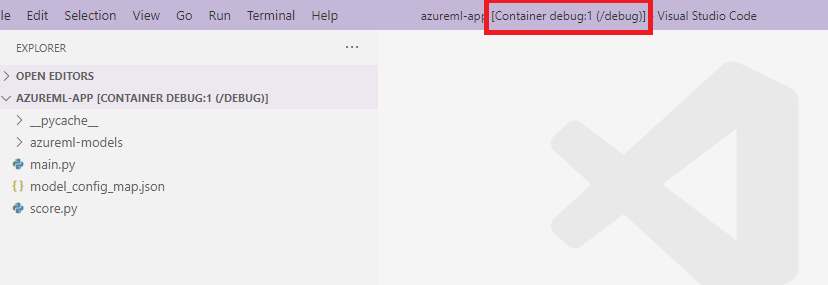
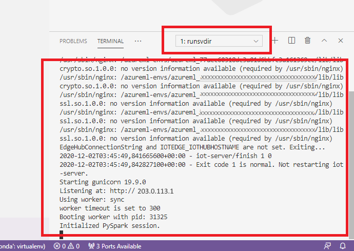
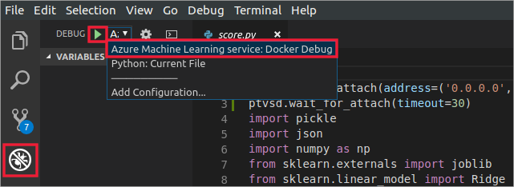
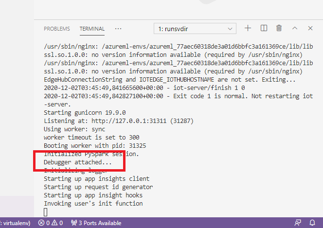
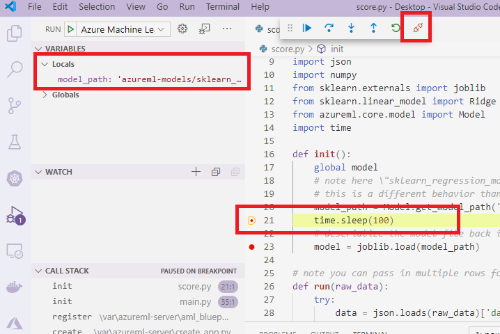

# Interactive debugging with Visual Studio Code

[!INCLUDE [sdk v1](../includes/machine-learning-sdk-v1.md)]

Learn how to interactively debug Azure Machine Learning experiments, pipelines, and deployments using Visual Studio Code (VS Code) and [debugpy](https://github.com/microsoft/debugpy/).

## Run and debug experiments locally

Use the Azure Machine Learning extension to validate, run, and debug your machine learning experiments before submitting them to the cloud.

### Prerequisites

* Azure Machine Learning VS Code extension (preview). For more information, see [Set up Azure Machine Learning VS Code extension](../how-to-setup-vs-code.md).

    > [!IMPORTANT]
    > The Azure Machine Learning VS Code extension uses the CLI (v2) by default. The instructions in this guide use 1.0 CLI. To switch to the 1.0 CLI, set the `azureML.CLI Compatibility Mode` setting in Visual Studio Code to `1.0`. For more information on modifying your settings in Visual Studio Code, see the [user and workspace settings documentation](https://code.visualstudio.com/docs/getstarted/settings).

    [!INCLUDE [machine-learning-preview-generic-disclaimer](../includes/machine-learning-preview-generic-disclaimer.md)]

* [Docker](https://www.docker.com/get-started)
  * Docker Desktop for Mac and Windows
  * Docker Engine for Linux.

    > [!NOTE]
    > On Windows, make sure to [configure Docker to use Linux containers](https://docs.docker.com/docker-for-windows/#switch-between-windows-and-linux-containers).

    > [!TIP]
    > For Windows, although not required, it's highly recommended to [use Docker with Windows Subsystem for Linux (WSL) 2](/windows/wsl/tutorials/wsl-containers#install-docker-desktop).

* [Python 3](https://www.python.org/downloads/)

### Debug experiment locally

> [!IMPORTANT]
> Before running your experiment locally make sure that:
>
> * Docker is running.
> * The `azureML.CLI Compatibility Mode` setting in Visual Studio Code is set to `1.0` as specified in the prerequisites

1. In VS Code, open the Azure Machine Learning extension view.
1. Expand the subscription node containing your workspace. If you don't already have one, you can [create an Azure Machine Learning workspace](../how-to-manage-resources-vscode.md#create-a-workspace) using the extension.
1. Expand your workspace node.
1. Right-click the **Experiments** node and select **Create experiment**. When the prompt appears, provide a name for your experiment.
1. Expand the **Experiments** node, right-click the experiment you want to run and select **Run Experiment**.
1. From the list of options, select **Locally**.
1. **First time use on Windows only**. When prompted to allow File Share, select **Yes**. When you enable file share, it allows Docker to mount the directory containing your script to the container. Additionally, it also allows Docker to store the logs and outputs from your run in a temporary directory on your system.
1. Select **Yes** to debug your experiment. Otherwise, select **No**. Selecting no will run your experiment locally without attaching to the debugger.
1. Select **Create new Run Configuration** to create your run configuration. The run configuration defines the script you want to run, dependencies, and datasets used. Alternatively, if you already have one, select it from the dropdown.
    1. Choose your environment. You can choose from any of the [Azure Machine Learning curated](../resource-curated-environments.md) or create your own.
    1. Provide the name of the script you want to run. The path is relative to the directory opened in VS Code.
    1. Choose whether you want to use an Azure Machine Learning dataset or not. You can create [Azure Machine Learning datasets](../how-to-manage-resources-vscode.md#create-dataset) using the extension.
    1. Debugpy is required in order to attach the debugger to the container running your experiment. To add debugpy as a dependency,select **Add Debugpy**. Otherwise, select **Skip**. Not adding debugpy as a dependency runs your experiment without attaching to the debugger.
    1. A configuration file containing your run configuration settings opens in the editor. If you're satisfied with the settings, select **Submit experiment**. Alternatively, you open the command palette (**View > Command Palette**) from the menu bar and enter the `AzureML: Submit experiment` command into the text box.
1. Once your experiment is submitted, a Docker image containing your script and the configurations specified in your run configuration is created.

    When the Docker image build process begins, the contents of the `60_control_log.txt` file stream to the output console in VS Code.

    > [!NOTE]
    > The first time your Docker image is created can take several minutes.

1. Once your image is built, a prompt appears to start the debugger. Set your breakpoints in your script and select **Start debugger** when you're ready to start debugging. Doing so attaches the VS Code debugger to the container running your experiment. Alternatively, in the Azure Machine Learning extension, hover over the node for your current run and select the play icon to start the debugger.

    > [!IMPORTANT]
    > You cannot have multiple debug sessions for a single experiment. You can however debug two or more experiments using multiple VS Code instances.

At this point, you should be able to step-through and debug your code using VS Code.

If at any point you want to cancel your run, right-click your run node and select **Cancel run**.

Similar to remote experiment runs, you can expand your run node to inspect the logs and outputs.

> [!TIP]
> Docker images that use the same dependencies defined in your environment are reused between runs. However, if you run an experiment using a new or different environment, a new image is created. Since these images are saved to your local storage, it's recommended to remove old or unused Docker images. To remove images from your system, use the [Docker CLI](https://docs.docker.com/engine/reference/commandline/rmi/) or the [VS Code Docker extension](https://code.visualstudio.com/docs/containers/overview).

## Debug and troubleshoot machine learning pipelines

In some cases, you may need to interactively debug the Python code used in your ML pipeline. By using VS Code and debugpy, you can attach to the code as it runs in the training environment.

### Prerequisites

* An __Azure Machine Learning workspace__ that is configured to use an __Azure Virtual Network__.
* An __Azure Machine Learning pipeline__ that uses Python scripts as part of the pipeline steps. For example, a PythonScriptStep.
* An Azure Machine Learning Compute cluster, which is __in the virtual network__ and is __used by the pipeline for training__.
* A __development environment__ that is __in the virtual network__. The development environment might be one of the following:

  * An Azure Virtual Machine in the virtual network
  * A Compute instance of Notebook VM in the virtual network
  * A client machine that has private network connectivity to the virtual network, either by VPN or via ExpressRoute.

For more information on using an Azure Virtual Network with Azure Machine Learning, see [Virtual network isolation and privacy overview](../how-to-network-security-overview.md).

> [!TIP]
> Although you can work with Azure Machine Learning resources that are not behind a virtual network, using a virtual network is recommended.

### How it works

Your ML pipeline steps run Python scripts. These scripts are modified to perform the following actions:

1. Log the IP address of the host that they're running on. You use the IP address to connect the debugger to the script.

2. Start the debugpy debug component, and wait for a debugger to connect.

3. From your development environment, you monitor the logs created by the training process to find the IP address where the script is running.

4. You tell VS Code the IP address to connect the debugger to by using a `launch.json` file.

5. You attach the debugger and interactively step through the script.

### Configure Python scripts

To enable debugging, make the following changes to the Python script(s) used by steps in your ML pipeline:

1. Add the following import statements:

    ```python
    import argparse
    import os
    import debugpy
    import socket
    from azureml.core import Run
    ```

1. Add the following arguments. These arguments allow you to enable the debugger as needed, and set the timeout for attaching the debugger:

    ```python
    parser.add_argument('--remote_debug', action='store_true')
    parser.add_argument('--remote_debug_connection_timeout', type=int,
                        default=300,
                        help=f'Defines how much time the Azure Machine Learning compute target '
                        f'will await a connection from a debugger client (VSCODE).')
    parser.add_argument('--remote_debug_client_ip', type=str,
                        help=f'Defines IP Address of VS Code client')
    parser.add_argument('--remote_debug_port', type=int,
                        default=5678,
                        help=f'Defines Port of VS Code client')
    ```

1. Add the following statements. These statements load the current run context so that you can log the IP address of the node that the code is running on:

    ```python
    global run
    run = Run.get_context()
    ```

1. Add an `if` statement that starts debugpy and waits for a debugger to attach. If no debugger attaches before the timeout, the script continues as normal. Make sure to replace the `HOST` and `PORT` values is the `listen` function with your own.

    ```python
    if args.remote_debug:
        print(f'Timeout for debug connection: {args.remote_debug_connection_timeout}')
        # Log the IP and port
        try:
            ip = args.remote_debug_client_ip
        except:
            print("Need to supply IP address for VS Code client")
        print(f'ip_address: {ip}')
        debugpy.listen(address=(ip, args.remote_debug_port))
        # Wait for the timeout for debugger to attach
        debugpy.wait_for_client()
        print(f'Debugger attached = {debugpy.is_client_connected()}')
    ```

The following Python example shows a simple `train.py` file that enables debugging:

```python
# Copyright (c) Microsoft. All rights reserved.
# Licensed under the MIT license.

import argparse
import os
import debugpy
import socket
from azureml.core import Run

print("In train.py")
print("As a data scientist, this is where I use my training code.")

parser = argparse.ArgumentParser("train")

parser.add_argument("--input_data", type=str, help="input data")
parser.add_argument("--output_train", type=str, help="output_train directory")

# Argument check for remote debugging
parser.add_argument('--remote_debug', action='store_true')
parser.add_argument('--remote_debug_connection_timeout', type=int,
                    default=300,
                    help=f'Defines how much time the Azure Machine Learning compute target '
                    f'will await a connection from a debugger client (VSCODE).')
parser.add_argument('--remote_debug_client_ip', type=str,
                    help=f'Defines IP Address of VS Code client')
parser.add_argument('--remote_debug_port', type=int,
                    default=5678,
                    help=f'Defines Port of VS Code client')

# Get run object, so we can find and log the IP of the host instance
global run
run = Run.get_context()

args = parser.parse_args()

# Start debugger if remote_debug is enabled
if args.remote_debug:
    print(f'Timeout for debug connection: {args.remote_debug_connection_timeout}')
    # Log the IP and port
    ip = socket.gethostbyname(socket.gethostname())
    # try:
    #     ip = args.remote_debug_client_ip
    # except:
    #     print("Need to supply IP address for VS Code client")
    print(f'ip_address: {ip}')
    debugpy.listen(address=(ip, args.remote_debug_port))
    # Wait for the timeout for debugger to attach
    debugpy.wait_for_client()
    print(f'Debugger attached = {debugpy.is_client_connected()}')

print("Argument 1: %s" % args.input_data)
print("Argument 2: %s" % args.output_train)

if not (args.output_train is None):
    os.makedirs(args.output_train, exist_ok=True)
    print("%s created" % args.output_train)
```

### Configure ML pipeline

To provide the Python packages needed to start debugpy and get the run context, create an environment
and set `pip_packages=['debugpy', 'azureml-sdk==<SDK-VERSION>']`. Change the SDK version to match the one you're using. The following code snippet demonstrates how to create an environment:

```python
# Use a RunConfiguration to specify some additional requirements for this step.
from azureml.core.runconfig import RunConfiguration
from azureml.core.conda_dependencies import CondaDependencies
from azureml.core.runconfig import DEFAULT_CPU_IMAGE

# create a new runconfig object
run_config = RunConfiguration()

# enable Docker 
run_config.environment.docker.enabled = True

# set Docker base image to the default CPU-based image
run_config.environment.docker.base_image = DEFAULT_CPU_IMAGE

# use conda_dependencies.yml to create a conda environment in the Docker image for execution
run_config.environment.python.user_managed_dependencies = False

# specify CondaDependencies obj
run_config.environment.python.conda_dependencies = CondaDependencies.create(conda_packages=['scikit-learn'],
                                                                           pip_packages=['debugpy', 'azureml-sdk==<SDK-VERSION>'])
```

In the [Configure Python scripts](#configure-python-scripts) section, new arguments were added to the scripts used by your ML pipeline steps. The following code snippet demonstrates how to use these arguments to enable debugging for the component and set a timeout. It also demonstrates how to use the environment created earlier by setting `runconfig=run_config`:

```python
# Use RunConfig from a pipeline step
step1 = PythonScriptStep(name="train_step",
                         script_name="train.py",
                         arguments=['--remote_debug', '--remote_debug_connection_timeout', 300,'--remote_debug_client_ip','<VS-CODE-CLIENT-IP>','--remote_debug_port',5678],
                         compute_target=aml_compute,
                         source_directory=source_directory,
                         runconfig=run_config,
                         allow_reuse=False)
```

When the pipeline runs, each step creates a child run. If debugging is enabled, the modified script logs information similar to the following text in the `70_driver_log.txt` for the child run:

```text
Timeout for debug connection: 300
ip_address: 10.3.0.5
```

Save the `ip_address` value. It's used in the next section.

> [!TIP]
> You can also find the IP address from the run logs for the child run for this pipeline step. For more information on viewing this information, see [Monitor Azure Machine Learning experiment runs and metrics](how-to-log-view-metrics.md).

### Configure development environment

1. To install debugpy on your VS Code development environment, use the following command:

    ```bash
    python -m pip install --upgrade debugpy
    ```

    For more information on using debugpy with VS Code, see [Remote Debugging](https://code.visualstudio.com/docs/python/debugging#_debugging-by-attaching-over-a-network-connection).

1. To configure VS Code to communicate with the Azure Machine Learning compute that is running the debugger, create a new debug configuration:

    1. From VS Code, select the __Debug__ menu and then select __Open configurations__. A file named __launch.json__ opens.

    1. In the __launch.json__ file, find the line that contains `"configurations": [`, and insert the following text after it. Change the `"host": "<IP-ADDRESS>"` entry to the IP address returned in your logs from the previous section. Change the `"localRoot": "${workspaceFolder}/code/step"` entry to a local directory that contains a copy of the script being debugged:

        ```json
        {
            "name": "Azure Machine Learning Compute: remote debug",
            "type": "python",
            "request": "attach",
            "port": 5678,
            "host": "<IP-ADDRESS>",
            "redirectOutput": true,
            "pathMappings": [
                {
                    "localRoot": "${workspaceFolder}/code/step1",
                    "remoteRoot": "."
                }
            ]
        }
        ```

        > [!IMPORTANT]
        > If there are already other entries in the configurations section, add a comma (,) after the code that you inserted.

        > [!TIP]
        > The best practice, especially for pipelines is to keep the resources for scripts in separate directories so that code is relevant only for each of the steps. In this example the `localRoot` example value references `/code/step1`.
        >
        > If you are debugging multiple scripts, in different directories, create a separate configuration section for each script.

    1. Save the __launch.json__ file.

### Connect the debugger

1. Open VS Code and open a local copy of the script.
2. Set breakpoints where you want the script to stop once you've attached.
3. While the child process is running the script, and the `Timeout for debug connection` is displayed in the logs, use the F5 key or select __Debug__. When prompted, select the __Azure Machine Learning Compute: remote debug__ configuration. You can also select the debug icon from the side bar, the __Azure Machine Learning: remote debug__ entry from the Debug dropdown menu, and then use the green arrow to attach the debugger.

    At this point, VS Code connects to debugpy on the compute node and stops at the breakpoint you set previously. You can now step through the code as it runs, view variables, etc.

    > [!NOTE]
    > If the log displays an entry stating `Debugger attached = False`, then the timeout has expired and the script continued without the debugger. Submit the pipeline again and connect the debugger after the `Timeout for debug connection` message, and before the timeout expires.

## Debug and troubleshoot deployments

In some cases, you may need to interactively debug the Python code contained in your model deployment. For example, if the entry script is failing and the reason can't be determined by extra logging. By using VS Code and the debugpy, you can attach to the code running inside the Docker container.

> [!TIP]
> If you're using managed online endpoints and deployments locally, see [Debug managed online endpoints locally in Visual Studio Code (preview)](../how-to-debug-managed-online-endpoints-visual-studio-code.md).

> [!IMPORTANT]
> This method of debugging does not work when using `Model.deploy()` and `LocalWebservice.deploy_configuration` to deploy a model locally. Instead, you must create an image using the [Model.package()](/python/api/azureml-core/azureml.core.model.model#package-workspace--models--inference-config-none--generate-dockerfile-false-) method.

Local web service deployments require a working Docker installation on your local system. For more information on using Docker, see the [Docker Documentation](https://docs.docker.com/). When working with compute instances, Docker is already installed.

### Configure development environment

1. To install debugpy on your local VS Code development environment, use the following command:

    ```bash
    python -m pip install --upgrade debugpy
    ```

    For more information on using debugpy with VS Code, see [Remote Debugging](https://code.visualstudio.com/docs/python/debugging#_debugging-by-attaching-over-a-network-connection).

1. To configure VS Code to communicate with the Docker image, create a new debug configuration:

    1. From VS Code, select the __Debug__ menu in the __Run__ extention and then select __Open configurations__. A file named __launch.json__ opens.

    1. In the __launch.json__ file, find the __"configurations"__ item (the line that contains `"configurations": [`), and insert the following text after it. 

        ```json
        {
            "name": "Azure Machine Learning Deployment: Docker Debug",
            "type": "python",
            "request": "attach",
            "connect": {
                "port": 5678,
                "host": "0.0.0.0",
            },
            "pathMappings": [
                {
                    "localRoot": "${workspaceFolder}",
                    "remoteRoot": "/var/azureml-app"
                }
            ]
        }
        ```
        After insertion, the __launch.json__ file should be similar to the following:
        ```json
        {
        // Use IntelliSense to learn about possible attributes.
        // Hover to view descriptions of existing attributes.
        // For more information, visit: https://go.microsoft.com/fwlink/linkid=830387
        "version": "0.2.0",
        "configurations": [
            {
                "name": "Python: Current File",
                "type": "python",
                "request": "launch",
                "program": "${file}",
                "console": "integratedTerminal"
            },
            {
                "name": "Azure Machine Learning Deployment: Docker Debug",
                "type": "python",
                "request": "attach",
                "connect": {
                    "port": 5678,
                    "host": "0.0.0.0"
                    },
                "pathMappings": [
                    {
                        "localRoot": "${workspaceFolder}",
                        "remoteRoot": "/var/azureml-app"
                    }
                ]
            }
            ]
        }
        ```

        > [!IMPORTANT]
        > If there are already other entries in the configurations section, add a comma ( __,__ ) after the code that you inserted.

        This section attaches to the Docker container using port __5678__.

    1. Save the __launch.json__ file.

### Create an image that includes debugpy

1. Modify the conda environment for your deployment so that it includes debugpy. The following example demonstrates adding it using the `pip_packages` parameter:

    ```python
    from azureml.core.conda_dependencies import CondaDependencies 


    # Usually a good idea to choose specific version numbers
    # so training is made on same packages as scoring
    myenv = CondaDependencies.create(conda_packages=['numpy==1.15.4',
                                'scikit-learn==0.19.1', 'pandas==0.23.4'],
                                 pip_packages = ['azureml-defaults==1.0.83', 'debugpy'])

    with open("myenv.yml","w") as f:
        f.write(myenv.serialize_to_string())
    ```

1. To start debugpy and wait for a connection when the service starts, add the following to the top of your `score.py` file:

    ```python
    import debugpy
    # Allows other computers to attach to debugpy on this IP address and port.
    debugpy.listen(('0.0.0.0', 5678))
    # Wait 30 seconds for a debugger to attach. If none attaches, the script continues as normal.
    debugpy.wait_for_client()
    print("Debugger attached...")
    ```

1. Create an image based on the environment definition and pull the image to the local registry. 

    > [!NOTE]
    > This example assumes that `ws` points to your Azure Machine Learning workspace, and that `model` is the model being deployed. The `myenv.yml` file contains the conda dependencies created in step 1.

    ```python
    from azureml.core.conda_dependencies import CondaDependencies
    from azureml.core.model import InferenceConfig
    from azureml.core.environment import Environment


    myenv = Environment.from_conda_specification(name="env", file_path="myenv.yml")
    myenv.docker.base_image = None
    myenv.docker.base_dockerfile = "FROM mcr.microsoft.com/azureml/openmpi3.1.2-ubuntu18.04:latest"
    inference_config = InferenceConfig(entry_script="score.py", environment=myenv)
    package = Model.package(ws, [model], inference_config)
    package.wait_for_creation(show_output=True)  # Or show_output=False to hide the Docker build logs.
    package.pull()
    ```

    Once the image has been created and downloaded (this process may take more than 10 minutes), the image path (includes repository, name, and tag, which in this case is also its digest) is finally displayed in a message similar to the following:

    ```text
    Status: Downloaded newer image for myregistry.azurecr.io/package@sha256:<image-digest>
    ```

1. To make it easier to work with the image locally, you can use the following command to add a tag for this image. Replace `myimagepath` in the following command with the location value from the previous step.

    ```bash
    docker tag myimagepath debug:1
    ```

    For the rest of the steps, you can refer to the local image as `debug:1` instead of the full image path value.

### Debug the service

> [!TIP]
> If you set a timeout for the debugpy connection in the `score.py` file, you must connect VS Code to the debug session before the timeout expires. Start VS Code, open the local copy of `score.py`, set a breakpoint, and have it ready to go before using the steps in this section.
>
> For more information on debugging and setting breakpoints, see [Debugging](https://code.visualstudio.com/Docs/editor/debugging).

1. To start a Docker container using the image, use the following command:

    ```bash
    docker run -it --name debug -p 8000:5001 -p 5678:5678 -v <my_local_path_to_score.py>:/var/azureml-app/score.py debug:1 /bin/bash
    ```

    This command attaches your `score.py` locally to the one in the container. Therefore, any changes made in the editor are automatically reflected in the container

2. For a better experience, you can go into the container with a new VS Code interface. Select the `Docker` extention from the VS Code side bar, find your local container created, in this documentation its `debug:1`. Right-click this container and select `"Attach Visual Studio Code"`, then a new VS Code interface will be opened automatically, and this interface shows the inside of your created container.

    

3. Inside the container, run the following command in the shell

    ```bash
    runsvdir /var/runit
    ```
    Then you can see the following output in the shell inside your container:

    

4. To attach VS Code to debugpy inside the container, open VS Code, and use the F5 key or select __Debug__. When prompted, select the __Azure Machine Learning Deployment: Docker Debug__ configuration. You can also select the __Run__ extention icon from the side bar, the __Azure Machine Learning Deployment: Docker Debug__ entry from the Debug dropdown menu, and then use the green arrow to attach the debugger.

    
    
    After you select the green arrow and attach the debugger, in the container VS Code interface you can see some new information:
    
    
    
    Also, in your main VS Code interface, what you can see is following:

    

And now, the local `score.py` which is attached to the container has already stopped at the breakpoints where you set. At this point, VS Code connects to debugpy inside the Docker container and stops the Docker container at the breakpoint you set previously. You can now step through the code as it runs, view variables, etc.

For more information on using VS Code to debug Python, see [Debug your Python code](https://code.visualstudio.com/docs/python/debugging).

### Stop the container

To stop the container, use the following command:

```bash
docker stop debug
```

## Next steps

Now that you've set up VS Code Remote, you can use a compute instance as remote compute from VS Code to interactively debug your code. 

Learn more about troubleshooting:

* [Local model deployment](how-to-troubleshoot-deployment-local.md)
* [Remote model deployment](how-to-troubleshoot-deployment.md)
* [Machine learning pipelines](how-to-debug-pipelines.md)
* [ParallelRunStep](how-to-debug-parallel-run-step.md)
