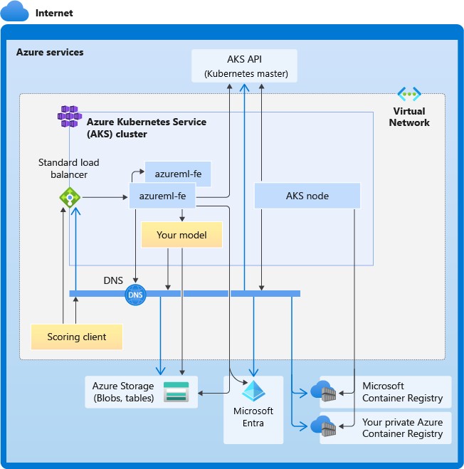

# Deploy a model to an Azure Kubernetes Service cluster with v1

[!INCLUDE [deploy-v1](../includes/machine-learning-deploy-v1.md)]


Learn how to use Azure Machine Learning to deploy a model as a web service on Azure Kubernetes Service (AKS). Azure Kubernetes Service is good for high-scale production deployments. Use Azure Kubernetes service if you need one or more of the following capabilities:

- __Fast response time__
- __Autoscaling__ of the deployed service
- __Logging__
- __Model data collection__
- __Authentication__
- __TLS termination__
- __Hardware acceleration__ options such as GPU and field-programmable gate arrays (FPGA)

When deploying to Azure Kubernetes Service, you deploy to an AKS cluster that is __connected to your workspace__. For information on connecting an AKS cluster to your workspace, see [Create and attach an Azure Kubernetes Service cluster](../how-to-create-attach-kubernetes.md).

> [!IMPORTANT]
> We recommend that you debug locally before deploying to the web service. For more information, see [Debug Locally](how-to-troubleshoot-deployment-local.md)
>
> You can also refer to Azure Machine Learning - [Deploy to Local Notebook](https://github.com/Azure/MachineLearningNotebooks/tree/master/how-to-use-azureml/deployment/deploy-to-local)

[!INCLUDE [endpoints-option](../includes/machine-learning-endpoints-preview-note.md)]

## Prerequisites

- An Azure Machine Learning workspace. For more information, see [Create an Azure Machine Learning workspace](../how-to-manage-workspace.md).

- A machine learning model registered in your workspace. If you don't have a registered model, see [How and where to deploy models](how-to-deploy-and-where.md).

- The [Azure CLI extension (v1) for Machine Learning service](reference-azure-machine-learning-cli.md), [Azure Machine Learning Python SDK](/python/api/overview/azure/ml/intro), or the [Azure Machine Learning Visual Studio Code extension](../how-to-setup-vs-code.md).

    [!INCLUDE [cli v1 deprecation](../includes/machine-learning-cli-v1-deprecation.md)]

- The __Python__ code snippets in this article assume that the following variables are set:

    * `ws` - Set to your workspace.
    * `model` - Set to your registered model.
    * `inference_config` - Set to the inference configuration for the model.

    For more information on setting these variables, see [How and where to deploy models](how-to-deploy-and-where.md).

- The __CLI__ snippets in this article assume that you've created an `inferenceconfig.json` document. For more information on creating this document, see [How and where to deploy models](how-to-deploy-and-where.md).

- An Azure Kubernetes Service cluster connected to your workspace. For more information, see [Create and attach an Azure Kubernetes Service cluster](../how-to-create-attach-kubernetes.md).

    - If you want to deploy models to GPU nodes or FPGA nodes (or any specific SKU), then you must create a cluster with the specific SKU. There's no support for creating a secondary node pool in an existing cluster and deploying models in the secondary node pool.

## Understand the deployment processes

The word "deployment" is used in both Kubernetes and Azure Machine Learning. "Deployment" has different meanings in these two contexts. In Kubernetes, a `Deployment` is a concrete entity, specified with a declarative YAML file. A Kubernetes `Deployment` has a defined lifecycle and concrete relationships to other Kubernetes entities such as `Pods` and `ReplicaSets`. You can learn about Kubernetes from docs and videos at [What is Kubernetes?](https://aka.ms/k8slearning).

In Azure Machine Learning, "deployment" is used in the more general sense of making available and cleaning up your project resources. The steps that Azure Machine Learning considers part of deployment are:

1. Zipping the files in your project folder, ignoring those specified in .amlignore or .gitignore
1. Scaling up your compute cluster (Relates to Kubernetes)
1. Building or downloading the dockerfile to the compute node (Relates to Kubernetes)
    1. The system calculates a hash of: 
        - The base image 
        - Custom docker steps (see [Deploy a model using a custom Docker base image](../how-to-deploy-custom-container.md))
        - The conda definition YAML (see [Create & use software environments in Azure Machine Learning](../how-to-use-environments.md))
    1. The system uses this hash as the key in a lookup of the workspace Azure Container Registry (ACR)
    1. If it isn't found, it looks for a match in the global ACR
    1. If it isn't found, the system builds a new image (which will be cached and pushed to the workspace ACR)
1. Downloading your zipped project file to temporary storage on the compute node
1. Unzipping the project file
1. The compute node executing `python <entry script> <arguments>`
1. Saving logs, model files, and other files written to `./outputs` to the storage account associated with the workspace
1. Scaling down compute, including removing temporary storage (Relates to Kubernetes)

### Azure Machine Learning router

The front-end component (azureml-fe) that routes incoming inference requests to deployed services automatically scales as needed. Scaling of azureml-fe is based on the AKS cluster purpose and size (number of nodes). The cluster purpose and nodes are configured when you [create or attach an AKS cluster](../how-to-create-attach-kubernetes.md). There's one azureml-fe service per cluster, which may be running on multiple pods.

> [!IMPORTANT]
> When using a cluster configured as __dev-test__, the self-scaler is **disabled**. Even for FastProd/DenseProd clusters, Self-Scaler is only enabled when telemetry shows that it's needed.

> [!NOTE]
> The maximum request payload is 100MB.

Azureml-fe scales both up (vertically) to use more cores, and out (horizontally) to use more pods. When making the decision to scale up, the time that it takes to route incoming inference requests is used. If this time exceeds the threshold, a scale-up occurs. If the time to route incoming requests continues to exceed the threshold, a scale-out occurs.

When scaling down and in, CPU usage is used. If the CPU usage threshold is met, the front end will first be scaled down. If the CPU usage drops to the scale-in threshold, a scale-in operation happens. Scaling up and out will only occur if there are enough cluster resources available.

When scale-up or scale-down, azureml-fe pods will be restarted to apply the cpu/memory changes. Inferencing requests aren't affected by the restarts.


<a id="connectivity"></a>

## Understand connectivity requirements for AKS inferencing cluster

When Azure Machine Learning creates or attaches an AKS cluster, AKS cluster is deployed with one of the following two network models:
* Kubenet networking - The network resources are typically created and configured as the AKS cluster is deployed.
* Azure Container Networking Interface (CNI) networking - The AKS cluster is connected to an existing virtual network resource and configurations.

For Kubenet networking, the network is created and configured properly for Azure Machine Learning service. For the CNI networking, you need to understand the connectivity requirements and ensure DNS resolution and outbound connectivity for AKS inferencing. For example, you may be using a firewall to block network traffic.

The following diagram shows the connectivity requirements for AKS inferencing. Black arrows represent actual communication, and blue arrows represent the domain names. You may need to add entries for these hosts to your firewall or to your custom DNS server.

 

For general AKS connectivity requirements, see [Control egress traffic for cluster nodes in Azure Kubernetes Service](../../aks/limit-egress-traffic.md).

For accessing Azure Machine Learning services behind a firewall, see [How to access azureml behind firewall](../how-to-access-azureml-behind-firewall.md).

### Overall DNS resolution requirements

DNS resolution within an existing VNet is under your control. For example, a firewall or custom DNS server. The following hosts must be reachable:

| Host name | Used by |
| ----- | ----- |
| `<cluster>.hcp.<region>.azmk8s.io` | AKS API server |
| `mcr.microsoft.com` | Microsoft Container Registry (MCR) |
| `<ACR name>.azurecr.io` | Your Azure Container Registry (ACR) |
| `<account>.table.core.windows.net` | Azure Storage Account (table storage) |
| `<account>.blob.core.windows.net` | Azure Storage Account (blob storage) |
| `api.azureml.ms` | Azure Active Directory (Azure AD) authentication |
| `ingest-vienna<region>.kusto.windows.net` | Kusto endpoint for uploading telemetry |
| `<leaf-domain-label + auto-generated suffix>.<region>.cloudapp.azure.com` | Endpoint domain name, if you autogenerated by Azure Machine Learning. If you used a custom domain name, you don't need this entry. |

### Connectivity requirements in chronological order: from cluster creation to model deployment

In the process of AKS create or attach, Azure Machine Learning router (azureml-fe) is deployed into the AKS cluster. In order to deploy Azure Machine Learning router, AKS node should be able to:
* Resolve DNS for AKS API server
* Resolve DNS for MCR in order to download docker images for Azure Machine Learning router
* Download images from MCR, where outbound connectivity is required

Right after azureml-fe is deployed, it will attempt to start and this requires to:
* Resolve DNS for AKS API server
* Query AKS API server to discover other instances of itself (it's a multi-pod service)
* Connect to other instances of itself

Once azureml-fe is started, it requires the following connectivity to function properly:
* Connect to Azure Storage to download dynamic configuration
* Resolve DNS for Azure AD authentication server api.azureml.ms and communicate with it when the deployed service uses Azure AD authentication.
* Query AKS API server to discover deployed models
* Communicate to deployed model PODs

At model deployment time, for a successful model deployment AKS node should be able to: 
* Resolve DNS for customer's ACR
* Download images from customer's ACR
* Resolve DNS for Azure BLOBs where model is stored
* Download models from Azure BLOBs

After the model is deployed and service starts, azureml-fe will automatically discover it using AKS API, and will be ready to route request to it. It must be able to communicate to model PODs.
>[!Note]
>If the deployed model requires any connectivity (e.g. querying external database or other REST service, downloading a BLOB etc), then both DNS resolution and outbound communication for these services should be enabled.

## Deploy to AKS

To deploy a model to Azure Kubernetes Service, create a __deployment configuration__ that describes the compute resources needed. For example, number of cores and memory. You also need an __inference configuration__, which describes the environment needed to host the model and web service. For more information on creating the inference configuration, see [How and where to deploy models](how-to-deploy-and-where.md).

> [!NOTE]
> The number of models to be deployed is limited to 1,000 models per deployment (per container).

<a id="using-the-cli"></a>

# [Python SDK](#tab/python)

[!INCLUDE [sdk v1](../includes/machine-learning-sdk-v1.md)]

```python
from azureml.core.webservice import AksWebservice, Webservice
from azureml.core.model import Model
from azureml.core.compute import AksCompute

aks_target = AksCompute(ws,"myaks")
# If deploying to a cluster configured for dev/test, ensure that it was created with enough
# cores and memory to handle this deployment configuration. Note that memory is also used by
# things such as dependencies and AML components.
deployment_config = AksWebservice.deploy_configuration(cpu_cores = 1, memory_gb = 1)
service = Model.deploy(ws, "myservice", [model], inference_config, deployment_config, aks_target)
service.wait_for_deployment(show_output = True)
print(service.state)
print(service.get_logs())
```

For more information on the classes, methods, and parameters used in this example, see the following reference documents:

* [AksCompute](/python/api/azureml-core/azureml.core.compute.aks.akscompute)
* [AksWebservice.deploy_configuration](/python/api/azureml-core/azureml.core.webservice.aks.aksservicedeploymentconfiguration)
* [Model.deploy](/python/api/azureml-core/azureml.core.model.model#deploy-workspace--name--models--inference-config-none--deployment-config-none--deployment-target-none--overwrite-false-)
* [Webservice.wait_for_deployment](/python/api/azureml-core/azureml.core.webservice%28class%29#wait-for-deployment-show-output-false-)

# [Azure CLI](#tab/azure-cli)

[!INCLUDE [cli v1](../includes/machine-learning-cli-v1.md)]

To deploy using the CLI, use the following command. Replace `myaks` with the name of the AKS compute target. Replace `mymodel:1` with the name and version of the registered model. Replace `myservice` with the name to give this service:

```azurecli-interactive
az ml model deploy --ct myaks -m mymodel:1 -n myservice --ic inferenceconfig.json --dc deploymentconfig.json
```

[!INCLUDE [deploymentconfig](../includes/machine-learning-service-aks-deploy-config.md)]

For more information, see the [az ml model deploy](/cli/azure/ml/model#az-ml-model-deploy) reference.

# [Visual Studio Code](#tab/visual-studio-code)

For information on using VS Code, see [deploy to AKS via the VS Code extension](../how-to-manage-resources-vscode.md).

> [!IMPORTANT]
> Deploying through VS Code requires the AKS cluster to be created or attached to your workspace in advance.

---

### Autoscaling

[!INCLUDE [sdk v1](../includes/machine-learning-sdk-v1.md)]

The component that handles autoscaling for Azure Machine Learning model deployments is azureml-fe, which is a smart request router. Since all inference requests go through it, it has the necessary data to automatically scale the deployed model(s).

> [!IMPORTANT]
> * **Do not enable Kubernetes Horizontal Pod Autoscaler (HPA) for model deployments**. Doing so would cause the two auto-scaling components to compete with each other. Azureml-fe is designed to auto-scale models deployed by Azure Machine Learning, where HPA would have to guess or approximate model utilization from a generic metric like CPU usage or a custom metric configuration.
> 
> * **Azureml-fe does not scale the number of nodes in an AKS cluster**, because this could lead to unexpected cost increases. Instead, **it scales the number of replicas for the model** within the physical cluster boundaries. If you need to scale the number of nodes within the cluster, you can manually scale the cluster or [configure the AKS cluster autoscaler](../../aks/cluster-autoscaler.md).

Autoscaling can be controlled by setting `autoscale_target_utilization`, `autoscale_min_replicas`, and `autoscale_max_replicas` for the AKS web service. The following example demonstrates how to enable autoscaling:

```python
aks_config = AksWebservice.deploy_configuration(autoscale_enabled=True, 
                                                autoscale_target_utilization=30,
                                                autoscale_min_replicas=1,
                                                autoscale_max_replicas=4)
```

Decisions to scale up/down is based off of utilization of the current container replicas. The number of replicas that are busy (processing a request) divided by the total number of current replicas is the current utilization. If this number exceeds `autoscale_target_utilization`, then more replicas are created. If it's lower, then replicas are reduced. By default, the target utilization is 70%.

Decisions to add replicas are eager and fast (around 1 second). Decisions to remove replicas are conservative (around 1 minute).

You can calculate the required replicas by using the following code:

```python
from math import ceil
# target requests per second
targetRps = 20
# time to process the request (in seconds)
reqTime = 10
# Maximum requests per container
maxReqPerContainer = 1
# target_utilization. 70% in this example
targetUtilization = .7

concurrentRequests = targetRps * reqTime / targetUtilization

# Number of container replicas
replicas = ceil(concurrentRequests / maxReqPerContainer)
```

For more information on setting `autoscale_target_utilization`, `autoscale_max_replicas`, and `autoscale_min_replicas`, see the [AksWebservice](/python/api/azureml-core/azureml.core.webservice.akswebservice) module reference.

## Web service authentication

When deploying to Azure Kubernetes Service, __key-based__ authentication is enabled by default. You can also enable __token-based__ authentication. Token-based authentication requires clients to use an Azure Active Directory account to request an authentication token, which is used to make requests to the deployed service.

To __disable__ authentication, set the `auth_enabled=False` parameter when creating the deployment configuration. The following example disables authentication using the SDK:

```python
deployment_config = AksWebservice.deploy_configuration(cpu_cores=1, memory_gb=1, auth_enabled=False)
```

For information on authenticating from a client application, see the [Consume an Azure Machine Learning model deployed as a web service](how-to-consume-web-service.md).

### Authentication with keys

If key authentication is enabled, you can use the `get_keys` method to retrieve a primary and secondary authentication key:

```python
primary, secondary = service.get_keys()
print(primary)
```

> [!IMPORTANT]
> If you need to regenerate a key, use [`service.regen_key`](/python/api/azureml-core/azureml.core.webservice%28class%29)

### Authentication with tokens

To enable token authentication, set the `token_auth_enabled=True` parameter when you're creating or updating a deployment. The following example enables token authentication using the SDK:

```python
deployment_config = AksWebservice.deploy_configuration(cpu_cores=1, memory_gb=1, token_auth_enabled=True)
```

If token authentication is enabled, you can use the `get_token` method to retrieve a JWT token and that token's expiration time:

```python
token, refresh_by = service.get_token()
print(token)
```

> [!IMPORTANT]
> You will need to request a new token after the token's `refresh_by` time.
>
> Microsoft strongly recommends that you create your Azure Machine Learning workspace in the same region as your Azure Kubernetes Service cluster. To authenticate with a token, the web service will make a call to the region in which your Azure Machine Learning workspace is created. If your workspace's region is unavailable, then you will not be able to fetch a token for your web service even, if your cluster is in a different region than your workspace. This effectively results in Token-based Authentication being unavailable until your workspace's region is available again. In addition, the greater the distance between your cluster's region and your workspace's region, the longer it will take to fetch a token.
>
> To retrieve a token, you must use the Azure Machine Learning SDK or the [az ml service get-access-token](/cli/azure/ml(v1)/computetarget/create#az-ml-service-get-access-token) command.


### Vulnerability scanning

Microsoft Defender for Cloud provides unified security management and advanced threat protection across hybrid cloud workloads. You should allow Microsoft Defender for Cloud to scan your resources and follow its recommendations. For more, see [Azure Kubernetes Services integration with Defender for Cloud](../../security-center/defender-for-kubernetes-introduction.md).

## Next steps

* [Use Azure RBAC for Kubernetes authorization](../../aks/manage-azure-rbac.md)
* [Secure inferencing environment with Azure Virtual Network](how-to-secure-inferencing-vnet.md)
* [How to deploy a model using a custom Docker image](../how-to-deploy-custom-container.md)
* [Deployment troubleshooting](how-to-troubleshoot-deployment.md)
* [Update web service](../how-to-deploy-update-web-service.md)
* [Use TLS to secure a web service through Azure Machine Learning](how-to-secure-web-service.md)
* [Consume a ML Model deployed as a web service](how-to-consume-web-service.md)
* [Monitor your Azure Machine Learning models with Application Insights](../how-to-enable-app-insights.md)
* [Collect data for models in production](how-to-enable-data-collection.md)