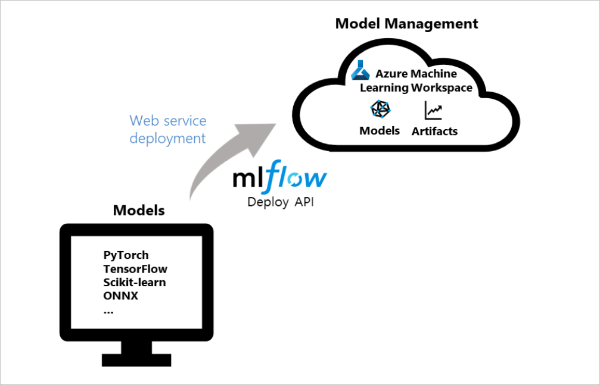

# Deploy MLflow models as Azure web services

[!INCLUDE [sdk v1](../includes/machine-learning-sdk-v1.md)]

In this article, learn how to deploy your [MLflow](https://www.mlflow.org) model as an Azure web service, so you can leverage and apply Azure Machine Learning's model management and data drift detection capabilities to your production models. See [MLflow and Azure Machine Learning](concept-mlflow.md) for additional MLflow and Azure Machine Learning functionality integrations.

Azure Machine Learning offers deployment configurations for:
* Azure Container Instance (ACI) which is a suitable choice for a quick dev-test deployment.
* Azure Kubernetes Service (AKS) which is recommended for scalable production deployments.

[!INCLUDE [endpoints-option](../includes/machine-learning-endpoints-preview-note.md)]

> [!TIP]
> The information in this document is primarily for data scientists and developers who want to deploy their MLflow model to an Azure Machine Learning web service endpoint. If you are an administrator interested in monitoring resource usage and events from Azure Machine Learning, such as quotas, completed training runs, or completed model deployments, see [Monitoring Azure Machine Learning](../monitor-azure-machine-learning.md).

## MLflow with Azure Machine Learning deployment

MLflow is an open-source library for managing the life cycle of your machine learning experiments. Its integration with Azure Machine Learning allows for you to extend this management beyond model training to the deployment phase of your production model.

The following diagram demonstrates that with the MLflow deploy API and Azure Machine Learning, you can deploy models created with popular frameworks, like PyTorch, Tensorflow, scikit-learn, etc., as Azure web services and manage them in your workspace. 



## Prerequisites

* A machine learning model. If you don't have a trained model, find the notebook example that best fits your compute scenario in [this repo](https://github.com/Azure/MachineLearningNotebooks/tree/master/how-to-use-azureml/ml-frameworks/using-mlflow) and follow its instructions. 
* [Set up the MLflow Tracking URI to connect Azure Machine Learning](how-to-use-mlflow.md#track-runs-from-your-local-machine-or-remote-compute).
* Install the `azureml-mlflow` package. 
    * This package automatically brings in `azureml-core` of the [The Azure Machine Learning Python SDK](/python/api/overview/azure/ml/install), which provides the connectivity for MLflow to access your workspace.
* See which [access permissions you need to perform your MLflow operations with your workspace](../how-to-assign-roles.md#mlflow-operations). 

## Deploy to Azure Container Instance (ACI)

To deploy your MLflow model to an Azure Machine Learning web service, your model must be set up with the [MLflow Tracking URI to connect with Azure Machine Learning](how-to-use-mlflow.md). 

In order to deploy to ACI, you don't need to define any deployment configuration, the service will default to an ACI deployment when a config is not provided.
Then, register and deploy the model in one step with MLflow's [deploy](https://www.mlflow.org/docs/latest/python_api/mlflow.azureml.html#mlflow.azureml.deploy) method for Azure Machine Learning. 


```python
from mlflow.deployments import get_deploy_client

# set the tracking uri as the deployment client
client = get_deploy_client(mlflow.get_tracking_uri())

# set the model path 
model_path = "model"

# define the model path and the name is the service name
# the model gets registered automatically and a name is autogenerated using the "name" parameter below 
client.create_deployment(name="mlflow-test-aci", model_uri='runs:/{}/{}'.format(run.id, model_path))
```

### Customize deployment configuration

If you prefer not to use the defaults, you can set up your deployment configuration with a deployment config json file that uses parameters from the [deploy_configuration()](/python/api/azureml-core/azureml.core.webservice.aciwebservice#deploy-configuration-cpu-cores-none--memory-gb-none--tags-none--properties-none--description-none--location-none--auth-enabled-none--ssl-enabled-none--enable-app-insights-none--ssl-cert-pem-file-none--ssl-key-pem-file-none--ssl-cname-none--dns-name-label-none-) method as reference. 

For your deployment config json file, each of the deployment config parameters need to be defined in the form of a dictionary. The following is an example. [Learn more about what your deployment configuration json file can contain](reference-azure-machine-learning-cli.md#azure-container-instance-deployment-configuration-schema).


### Azure Container Instance deployment configuration schema
```json
{"computeType": "aci",
 "containerResourceRequirements": {"cpu": 1, "memoryInGB": 1},
 "location": "eastus2"
}
```

Your json file can then be used to create your deployment.

```python
# set the deployment config
deploy_path = "deployment_config.json"
test_config = {'deploy-config-file': deploy_path}

client.create_deployment(model_uri='runs:/{}/{}'.format(run.id, model_path),
                         config=test_config,
                         name="mlflow-test-aci")                                       
```


## Deploy to Azure Kubernetes Service (AKS)

To deploy your MLflow model to an Azure Machine Learning web service, your model must be set up with the [MLflow Tracking URI to connect with Azure Machine Learning](how-to-use-mlflow.md). 

To deploy to AKS, first create an AKS cluster. Create an AKS cluster using the [ComputeTarget.create()](/python/api/azureml-core/azureml.core.computetarget#create-workspace--name--provisioning-configuration-) method. It may take 20-25 minutes to create a new cluster.

```python
from azureml.core.compute import AksCompute, ComputeTarget

# Use the default configuration (can also provide parameters to customize)
prov_config = AksCompute.provisioning_configuration()

aks_name = 'aks-mlflow'

# Create the cluster
aks_target = ComputeTarget.create(workspace=ws, 
                                  name=aks_name, 
                                  provisioning_configuration=prov_config)

aks_target.wait_for_completion(show_output = True)

print(aks_target.provisioning_state)
print(aks_target.provisioning_errors)
```
Create a deployment config json using [deploy_configuration()](/python/api/azureml-core/azureml.core.webservice.aks.aksservicedeploymentconfiguration#parameters) method values as a reference. Each of the deployment config parameters simply need to be defined as a dictionary. Here's an example below:

```json
{"computeType": "aks", "computeTargetName": "aks-mlflow"}
```

Then, register and deploy the model in one step with MLflow's [deployment client](https://www.mlflow.org/docs/latest/python_api/mlflow.deployments.html). 

```python
from mlflow.deployments import get_deploy_client

# set the tracking uri as the deployment client
client = get_deploy_client(mlflow.get_tracking_uri())

# set the model path 
model_path = "model"

# set the deployment config
deploy_path = "deployment_config.json"
test_config = {'deploy-config-file': deploy_path}

# define the model path and the name is the service name
# the model gets registered automatically and a name is autogenerated using the "name" parameter below 
client.create_deployment(model_uri='runs:/{}/{}'.format(run.id, model_path),
                         config=test_config,
                         name="mlflow-test-aci")
```

The service deployment can take several minutes.

## Clean up resources

If you don't plan to use your deployed web service, use `service.delete()` to delete it from your notebook.  For more information, see the documentation for [WebService.delete()](/python/api/azureml-core/azureml.core.webservice%28class%29#delete--).

## Example notebooks

The [MLflow with Azure Machine Learning notebooks](https://github.com/Azure/MachineLearningNotebooks/tree/master/how-to-use-azureml/ml-frameworks/using-mlflow) demonstrate and expand upon concepts presented in this article.

> [!NOTE]
> A community-driven repository of examples using mlflow can be found at https://github.com/Azure/azureml-examples.

## Next steps

* [Manage your models](concept-model-management-and-deployment.md).
* Monitor your production models for [data drift](how-to-enable-data-collection.md).
* [Track Azure Databricks runs with MLflow](../how-to-use-mlflow-azure-databricks.md).
