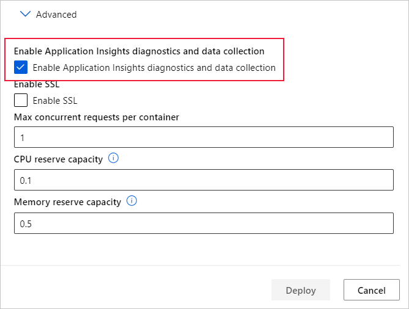
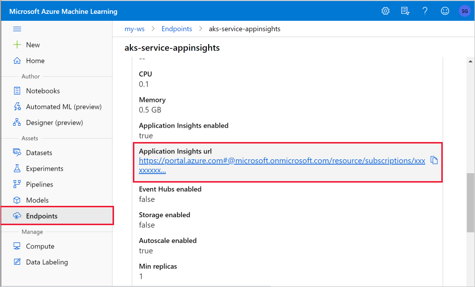
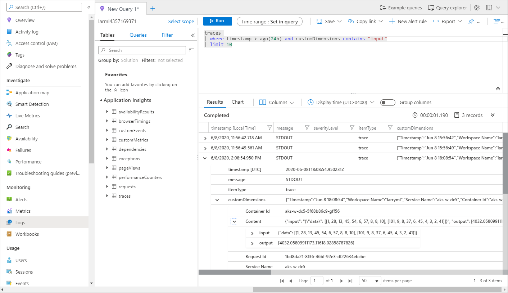

# Monitor and collect data from ML web service endpoints

[!INCLUDE [sdk v1](../includes/machine-learning-sdk-v1.md)]

In this article, you learn how to collect data from models deployed to web service endpoints in Azure Kubernetes Service (AKS) or Azure Container Instances (ACI). Use [Azure Application Insights](../../azure-monitor/app/app-insights-overview.md) to collect the following data from an endpoint:
* Output data
* Responses
* Request rates, response times, and failure rates
* Dependency rates, response times, and failure rates
* Exceptions

The [enable-app-insights-in-production-service.ipynb](https://github.com/Azure/MachineLearningNotebooks/blob/master/how-to-use-azureml/deployment/enable-app-insights-in-production-service/enable-app-insights-in-production-service.ipynb) notebook demonstrates concepts in this article.
 
[!INCLUDE [aml-clone-in-azure-notebook](../includes/aml-clone-for-examples.md)]

> [!IMPORTANT]
> The information in this article relies on the Azure Application Insights instance that was created with your workspace. If you deleted this Application Insights instance, there is no way to re-create it other than deleting and recreating the workspace.

> [!TIP]
> If you are using online endpoints instead, use the information in the [Monitor online endpoints](../how-to-monitor-online-endpoints.md) article instead. 
 
## Prerequisites

* An Azure subscription - try the [free or paid version of Azure Machine Learning](https://azure.microsoft.com/free/).

* An Azure Machine Learning workspace, a local directory that contains your scripts, and the Azure Machine Learning SDK for Python installed. To learn more, see [How to configure a development environment](how-to-configure-environment.md).

* A trained machine learning model. To learn more, see the [Train image classification model](../tutorial-train-deploy-notebook.md) tutorial.

<a name="python"></a>

## Configure logging with the Python SDK

In this section, you learn how to enable Application Insight logging by using the Python SDK. 

### Update a deployed service

Use the following steps to update an existing web service:

1. Identify the service in your workspace. The value for `ws` is the name of your workspace

    ```python
    from azureml.core.webservice import Webservice
    aks_service= Webservice(ws, "my-service-name")
    ```
2. Update your service and enable Azure Application Insights

    ```python
    aks_service.update(enable_app_insights=True)
    ```

### Log custom traces in your service

> [!IMPORTANT]
> Azure Application Insights only logs payloads of up to 64kb. If this limit is reached, you may see errors such as out of memory, or no information may be logged. If the data you want to log is larger 64kb, you should instead store it to blob storage using the information in [Collect Data for models in production](how-to-enable-data-collection.md).
>
> For more complex situations, like model tracking within an AKS deployment, we recommend using a third-party library like [OpenCensus](https://opencensus.io).

To log custom traces, follow the standard deployment process for AKS or ACI in the [How to deploy and where](how-to-deploy-and-where.md) document. Then, use the following steps:

1. Update the scoring file by adding print statements to send data to Application Insights during inference. For more complex information, such as the request data and the response, use a JSON structure. 

    The following example `score.py` file logs when the model was initialized, input and output during inference, and the time any errors occur.

    
    ```python
    import pickle
    import json
    import numpy 
    from sklearn.externals import joblib
    from sklearn.linear_model import Ridge
    from azureml.core.model import Model
    import time

    def init():
        global model
        #Print statement for appinsights custom traces:
        print ("model initialized" + time.strftime("%H:%M:%S"))
        
        # note here "sklearn_regression_model.pkl" is the name of the model registered under the workspace
        # this call should return the path to the model.pkl file on the local disk.
        model_path = Model.get_model_path(model_name = 'sklearn_regression_model.pkl')
        
        # deserialize the model file back into a sklearn model
        model = joblib.load(model_path)
    

    # note you can pass in multiple rows for scoring
    def run(raw_data):
        try:
            data = json.loads(raw_data)['data']
            data = numpy.array(data)
            result = model.predict(data)
            # Log the input and output data to appinsights:
            info = {
                "input": raw_data,
                "output": result.tolist()
                }
            print(json.dumps(info))
            # you can return any datatype as long as it is JSON-serializable
            return result.tolist()
        except Exception as e:
            error = str(e)
            print (error + time.strftime("%H:%M:%S"))
            return error
    ```

2. Update the service configuration, and make sure to enable Application Insights.
    
    ```python
    config = Webservice.deploy_configuration(enable_app_insights=True)
    ```

3. Build an image and deploy it on AKS or ACI. For more information, see [How to deploy and where](how-to-deploy-and-where.md).


### Disable tracking in Python

To disable Azure Application Insights, use the following code:

```python 
## replace <service_name> with the name of the web service
<service_name>.update(enable_app_insights=False)
```

<a name="studio"></a>

## Configure logging with Azure Machine Learning studio

You can also enable Azure Application Insights from Azure Machine Learning studio. When you're ready to deploy your model as a web service, use the following steps to enable Application Insights:

1. Sign in to the studio at https://ml.azure.com.
1. Go to **Models** and select the model you want to deploy.
1. Select  **+Deploy**.
1. Populate the **Deploy model** form.
1. Expand the **Advanced** menu.

    
1. Select **Enable Application Insights diagnostics and data collection**.

    

## View metrics and logs

### Query logs for deployed models

Logs of online endpoints are customer data. You can use the `get_logs()` function to retrieve logs from a previously deployed web service. The logs may contain detailed information about any errors that occurred during deployment.

```python
from azureml.core import Workspace
from azureml.core.webservice import Webservice

ws = Workspace.from_config()

# load existing web service
service = Webservice(name="service-name", workspace=ws)
logs = service.get_logs()
```

If you have multiple Tenants, you may need to add the following authenticate code before `ws = Workspace.from_config()`

```python
from azureml.core.authentication import InteractiveLoginAuthentication
interactive_auth = InteractiveLoginAuthentication(tenant_id="the tenant_id in which your workspace resides")
```

### View logs in the studio

Azure Application Insights stores your service logs in the same resource group as the Azure Machine Learning workspace. Use the following steps to view your data using the studio:

1. Go to your Azure Machine Learning workspace in the [studio](https://ml.azure.com/).
1. Select **Endpoints**.
1. Select the deployed service.
1. Select the **Application Insights url** link.

    [](././media/how-to-enable-app-insights/appinsightsloc.png#lightbox)

1. In Application Insights, from the **Overview** tab or the __Monitoring__ section, select __Logs__.

    [](./media/how-to-enable-app-insights/overview.png#lightbox)

1. To view information logged from the score.py file, look at the __traces__ table. The following query searches for logs where the __input__ value was logged:

    ```kusto
    traces
    | where customDimensions contains "input"
    | limit 10
    ```

   [](././media/how-to-enable-app-insights/model-data-trace.png#lightbox)

For more information on how to use Azure Application Insights, see [What is Application Insights?](../../azure-monitor/app/app-insights-overview.md).

## Web service metadata and response data

> [!IMPORTANT]
> Azure Application Insights only logs payloads of up to 64kb. If this limit is reached then you may see errors such as out of memory, or no information may be logged.

To log web service request information, add `print` statements to your score.py file. Each `print` statement results in one entry in the Application Insights trace table under the message `STDOUT`. Application Insights stores the `print` statement outputs in  `customDimensions` and in the `Contents` trace table. Printing JSON strings produces a hierarchical data structure in the trace output under `Contents`.

## Export data for retention and processing

>[!Important]
> Azure Application Insights only supports exports to blob storage. For more information on the limits of this implementation, see [Export telemetry from App Insights](/previous-versions/azure/azure-monitor/app/export-telemetry#continuous-export-advanced-storage-configuration).

Use Application Insights' [continuous export](/previous-versions/azure/azure-monitor/app/export-telemetry) to export data to a blob storage account where you can define retention settings. Application Insights exports the data in JSON format. 

:::image type="content" source="media/how-to-enable-app-insights/continuous-export-setup.png" alt-text="Continuous export":::

## Next steps

In this article, you learned how to enable logging and view logs for web service endpoints. Try these articles for next steps:


* [How to deploy a model to an AKS cluster](how-to-deploy-azure-kubernetes-service.md)

* [How to deploy a model to Azure Container Instances](how-to-deploy-azure-container-instance.md)

* [MLOps: Manage, deploy, and monitor models with Azure Machine Learning](concept-model-management-and-deployment.md) to learn more about leveraging data collected from models in production. Such data can help to continually improve your machine learning process.
