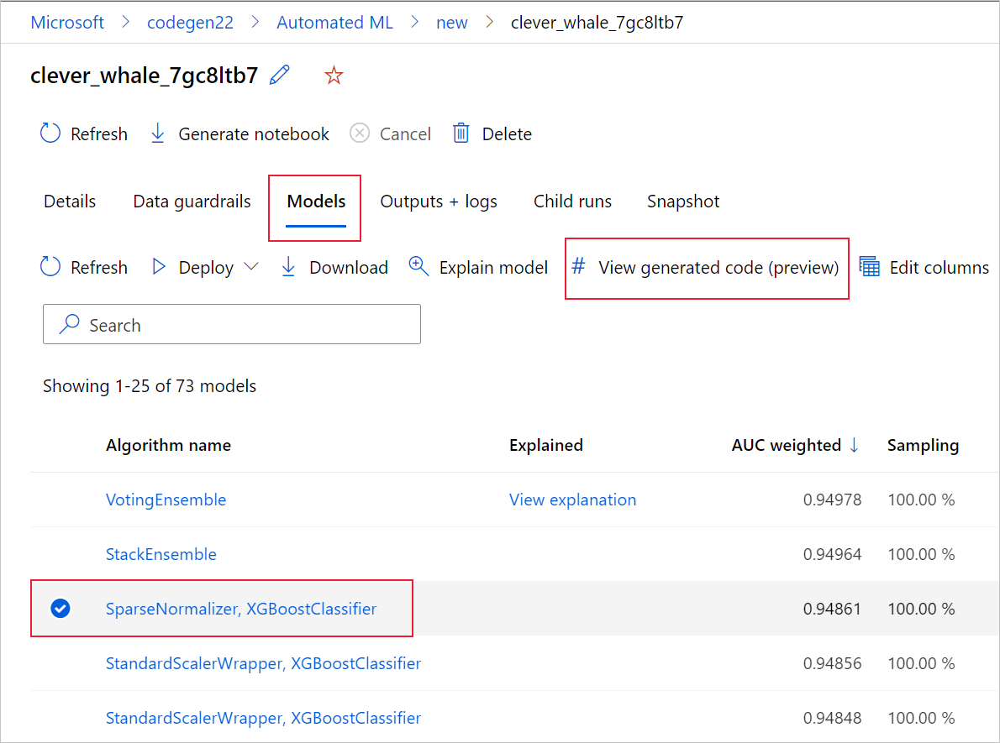
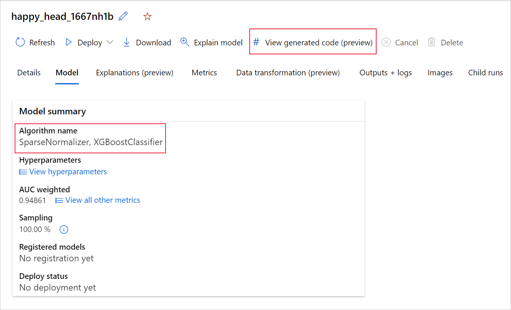

#  View training code for an Automated ML model

In this article, you learn how to view the generated training code from any automated machine learning trained model. 

Code generation for automated ML trained models allows you to see the following details that automated ML uses to train and build the model for a specific run.

* Data preprocessing
* Algorithm selection
* Featurization
* Hyperparameters 

You can select any automated ML trained model, recommended or child run, and view the generated Python training code that created that specific model.

With the generated model's training code you can, 

* **Learn** what featurization process and hyperparameters the model algorithm uses.
* **Track/version/audit** trained models. Store versioned code to track what specific training code is used with the model that's to be deployed to production.
* **Customize** the training code by changing hyperparameters or applying your ML and algorithms skills/experience, and retrain a new model with your customized code.

The following diagram illustrates that you can generate the code for automated ML experiments with all task types. First select a model. The model you selected will be highlighted, then Azure Machine Learning copies the code files used to create the model, and displays them into your notebooks shared folder. From here, you can view and customize the code as needed. 

:::image type="content" source="media/how-to-generate-automl-training-code/code-generation-demonstration.png" alt-text="Screenshot showing models tab, as well as having a model selected, as explained in the above text.":::

## Prerequisites

* An Azure Machine Learning workspace. To create the workspace, see [Create workspace resources](../quickstart-create-resources.md).

* This article assumes some familiarity with setting up an automated machine learning experiment. Follow the [tutorial](../tutorial-auto-train-image-models.md) or [how-to](how-to-configure-auto-train.md) to see the main automated machine learning experiment design patterns.

* Automated ML code generation is only available for experiments run on remote Azure Machine Learning compute targets. Code generation isn't supported for local runs.

* All automated ML runs triggered through Azure Machine Learning studio, SDKv2 or CLIv2 will have code generation enabled.

## Get generated code and model artifacts
By default, each automated ML trained model generates its training code after training completes. Automated ML saves this code in the experiment's `outputs/generated_code` for that specific model. You can view them in the Azure Machine Learning studio UI on the **Outputs + logs** tab of the selected model. 

* **script.py** This is the model's training code that you likely want to analyze with the featurization steps, specific algorithm used, and hyperparameters.

* **script_run_notebook.ipynb** Notebook with boiler-plate code to run the model's training code (script.py) in Azure Machine Learning compute through Azure Machine Learning SDKv2.

After the automated ML training run completes, there are you can access the `script.py` and the `script_run_notebook.ipynb` files via the Azure Machine Learning studio UI. 

To do so, navigate to the **Models** tab of the automated ML experiment parent run's page. After you select one of the trained models, you can select the **View generated code** button. This button redirects you to the **Notebooks** portal extension, where you can view, edit and run the generated code for that particular selected model.



You can also access to the model's generated code from the top of the child run's page once you navigate into that child run's page of a particular model.



If you're using the Python SDKv2, you can also download the "script.py" and the "script_run_notebook.ipynb" by retrieving the best run via MLFlow & downloading the resulting artifacts. 

## Limitations

There's a known issue when selecting **View Generated Code**. This action fails to redirect to the Notebooks portal when the storage is behind a VNet. As a workaround, the user can manually download the **script.py** and the **script_run_notebook.ipynb** files by navigating to the **Outputs + Logs** tab under the **outputs>generated_code** folder. These files can be uploaded manually to the notebooks folder to run or edit them. Follow this link to learn more about [VNets](../how-to-enable-studio-virtual-network.md) in Azure Machine Learning. 

:::image type="content" source="media/how-to-generate-automl-training-code/view-generated-code.png" alt-text="Screenshot showing Outputs and Logs tab, as well as having the outputs and generated code folder selected, as explained in the above text.":::


## script.py

The `script.py` file contains the core logic needed to train a model with the previously used hyperparameters. While intended to be executed in the context of an Azure Machine Learning script run, with some modifications, the model's training code can also be run standalone in your own on-premises environment.

The script can roughly be broken down into several the following parts: data loading, data preparation, data featurization, preprocessor/algorithm specification, and training.

### Data loading

The function `get_training_dataset()` loads the previously used dataset. It assumes that the script is run in an Azure Machine Learning script run under the same workspace as the original experiment.

```python
def get_training_dataset(dataset_id):
    from azureml.core.dataset import Dataset
    from azureml.core.run import Run
    
    logger.info("Running get_training_dataset")
    ws = Run.get_context().experiment.workspace
    dataset = Dataset.get_by_id(workspace=ws, id=dataset_id)
    return dataset.to_pandas_dataframe()
```

When running as part of a script run, `Run.get_context().experiment.workspace` retrieves the correct workspace. However, if this script is run inside of a different workspace or run locally, you need to modify the script to [explicitly specify the appropriate workspace](/python/api/azureml-core/azureml.core.workspace.workspace).

Once the workspace has been retrieved, the original dataset is retrieved by its ID. Another dataset with exactly the same structure could also be specified by ID or name with the [`get_by_id()`](/python/api/azureml-core/azureml.core.dataset.dataset#get-by-id-workspace--id-) or [`get_by_name()`](/python/api/azureml-core/azureml.core.dataset.dataset#get-by-name-workspace--name--version--latest--), respectively. You can find the ID later on in the script, in a similar section as the following code.

```python
if __name__ == '__main__':
    parser = argparse.ArgumentParser()
    parser.add_argument('--training_dataset_id', type=str, default='xxxxxxxx-xxxx-xxxx-xxxx-xxxxxxxxxxx', help='Default training dataset id is populated from the parent run')
    args = parser.parse_args()
    
    main(args.training_dataset_id)
```

You can also opt to replace this entire function with your own data loading mechanism; the only constraints are that the return value must be a Pandas dataframe and that the data must have the same shape as in the original experiment.

### Data preparation code

The function `prepare_data()` cleans the data, splits out the feature and sample weight columns and prepares the data for use in training.
This function can vary depending on the type of dataset and the experiment task type: classification, regression, time-series forecasting, images or NLP tasks.

The following example shows that in general, the dataframe from the data loading step is passed in. The label column and sample weights, if originally specified, are extracted and rows containing `NaN` are dropped from the input data.

```python
def prepare_data(dataframe):
    from azureml.training.tabular.preprocessing import data_cleaning
    
    logger.info("Running prepare_data")
    label_column_name = 'y'
    
    # extract the features, target and sample weight arrays
    y = dataframe[label_column_name].values
    X = dataframe.drop([label_column_name], axis=1)
    sample_weights = None
    X, y, sample_weights = data_cleaning._remove_nan_rows_in_X_y(X, y, sample_weights,
     is_timeseries=False, target_column=label_column_name)
    
    return X, y, sample_weights
```

If you want to do any more data preparation, it can be done in this step by adding your custom data preparation code.

### Data featurization code

The function `generate_data_transformation_config()` specifies the featurization step in the final scikit-learn pipeline. The featurizers from the original experiment are reproduced here, along with their parameters.

For example, possible data transformation that can happen in this function can be based on imputers like, `SimpleImputer()` and `CatImputer()`, or transformers such as `StringCastTransformer()` and `LabelEncoderTransformer()`. 

The following is a transformer of type `StringCastTransformer()` that can be used to transform a set of columns. In this case, the set indicated by `column_names`.

```python    
def get_mapper_0(column_names):
    # ... Multiple imports to package dependencies, removed for simplicity ...
    
    definition = gen_features(
        columns=column_names,
        classes=[
            {
                'class': StringCastTransformer,
            },
            {
                'class': CountVectorizer,
                'analyzer': 'word',
                'binary': True,
                'decode_error': 'strict',
                'dtype': numpy.uint8,
                'encoding': 'utf-8',
                'input': 'content',
                'lowercase': True,
                'max_df': 1.0,
                'max_features': None,
                'min_df': 1,
                'ngram_range': (1, 1),
                'preprocessor': None,
                'stop_words': None,
                'strip_accents': None,
                'token_pattern': '(?u)\\b\\w\\w+\\b',
                'tokenizer': wrap_in_lst,
                'vocabulary': None,
            },
        ]
    )
    mapper = DataFrameMapper(features=definition, input_df=True, sparse=True)
    
    return mapper
```

If you have many columns that need to have the same featurization/transformation applied (for example, 50 columns in several column groups), these columns are handled by grouping based on type. 

In the following example, notice that each group has a unique mapper applied. This mapper is then applied to each of the columns of that group.

```python
def generate_data_transformation_config():
    from sklearn.pipeline import FeatureUnion
    
    column_group_1 = [['id'], ['ps_reg_01'], ['ps_reg_02'], ['ps_reg_03'], ['ps_car_11_cat'], ['ps_car_12'], ['ps_car_13'], ['ps_car_14'], ['ps_car_15'], ['ps_calc_01'], ['ps_calc_02'], ['ps_calc_03']]
    
    column_group_2 = ['ps_ind_06_bin', 'ps_ind_07_bin', 'ps_ind_08_bin', 'ps_ind_09_bin', 'ps_ind_10_bin', 'ps_ind_11_bin', 'ps_ind_12_bin', 'ps_ind_13_bin', 'ps_ind_16_bin', 'ps_ind_17_bin', 'ps_ind_18_bin', 'ps_car_08_cat', 'ps_calc_15_bin', 'ps_calc_16_bin', 'ps_calc_17_bin', 'ps_calc_18_bin', 'ps_calc_19_bin', 'ps_calc_20_bin']
    
    column_group_3 = ['ps_ind_01', 'ps_ind_02_cat', 'ps_ind_03', 'ps_ind_04_cat', 'ps_ind_05_cat', 'ps_ind_14', 'ps_ind_15', 'ps_car_01_cat', 'ps_car_02_cat', 'ps_car_03_cat', 'ps_car_04_cat', 'ps_car_05_cat', 'ps_car_06_cat', 'ps_car_07_cat', 'ps_car_09_cat', 'ps_car_10_cat', 'ps_car_11', 'ps_calc_04', 'ps_calc_05', 'ps_calc_06', 'ps_calc_07', 'ps_calc_08', 'ps_calc_09', 'ps_calc_10', 'ps_calc_11', 'ps_calc_12', 'ps_calc_13', 'ps_calc_14']
    
    feature_union = FeatureUnion([
        ('mapper_0', get_mapper_0(column_group_1)),
        ('mapper_1', get_mapper_1(column_group_3)),
        ('mapper_2', get_mapper_2(column_group_2)),
    ])
    return feature_union
```

This approach allows you to have a more streamlined code, by not having a transformer's code-block for each column, which can be especially cumbersome even when you have tens or hundreds of columns in your dataset.

With classification and regression tasks, [`FeatureUnion`] is used for featurizers.
For time-series forecasting models, multiple time series-aware featurizers are collected into a scikit-learn pipeline, then wrapped in the `TimeSeriesTransformer`.
Any user provided featurizations for time series forecasting models happens before the ones provided by automated ML. 

### Preprocessor specification code

The function `generate_preprocessor_config()`, if present, specifies a preprocessing step to be done after featurization in the final scikit-learn pipeline.

Normally, this preprocessing step only consists of data standardization/normalization that's accomplished with [`sklearn.preprocessing`](https://scikit-learn.org/stable/modules/preprocessing.html).

Automated ML only specifies a preprocessing step for nonensemble classification and regression models.

Here's an example of a generated preprocessor code:

```python
def generate_preprocessor_config():
    from sklearn.preprocessing import MaxAbsScaler
    
    preproc = MaxAbsScaler(
        copy=True
    )
    
    return preproc
```

### Algorithm and hyperparameters specification code

The algorithm and hyperparameters specification code is likely what many ML professionals are most interested in. 

The `generate_algorithm_config()` function specifies the actual algorithm and hyperparameters for training the model as the last stage of the final scikit-learn pipeline. 

The following example uses an XGBoostClassifier algorithm with specific hyperparameters.

```python
def generate_algorithm_config():
    from xgboost.sklearn import XGBClassifier
    
    algorithm = XGBClassifier(
        base_score=0.5,
        booster='gbtree',
        colsample_bylevel=1,
        colsample_bynode=1,
        colsample_bytree=1,
        gamma=0,
        learning_rate=0.1,
        max_delta_step=0,
        max_depth=3,
        min_child_weight=1,
        missing=numpy.nan,
        n_estimators=100,
        n_jobs=-1,
        nthread=None,
        objective='binary:logistic',
        random_state=0,
        reg_alpha=0,
        reg_lambda=1,
        scale_pos_weight=1,
        seed=None,
        silent=None,
        subsample=1,
        verbosity=0,
        tree_method='auto',
        verbose=-10
    )
    
    return algorithm
```

The generated code in most cases uses open source software (OSS) packages and classes. There are instances where intermediate wrapper classes are used to simplify more complex code. For example, XGBoost classifier and other commonly used libraries like LightGBM or Scikit-Learn algorithms can be applied. 

As an ML Professional, you're able to customize that algorithm's configuration code by tweaking its hyperparameters as needed based on your skills and experience for that algorithm and your particular ML problem.

For ensemble models, `generate_preprocessor_config_N()` (if needed) and `generate_algorithm_config_N()` are defined for each learner in the ensemble model, where `N` represents the placement of each learner in the ensemble model's list. For stack ensemble models, the meta learner `generate_algorithm_config_meta()` is defined.

### End to end training code

Code generation emits `build_model_pipeline()` and `train_model()` for defining the scikit-learn pipeline and for calling `fit()` on it, respectively.

```python
def build_model_pipeline():
    from sklearn.pipeline import Pipeline
    
    logger.info("Running build_model_pipeline")
    pipeline = Pipeline(
        steps=[
            ('featurization', generate_data_transformation_config()),
            ('preproc', generate_preprocessor_config()),
            ('model', generate_algorithm_config()),
        ]
    )
    
    return pipeline
```

The scikit-learn pipeline includes the featurization step, a preprocessor (if used), and the algorithm or model.

For time-series forecasting models, the scikit-learn pipeline is wrapped in a `ForecastingPipelineWrapper`, which has some additional logic needed to properly handle time-series data depending on the applied algorithm.
For all task types, we use `PipelineWithYTransformer` in cases where the label column needs to be encoded.

Once you have the scikit-Learn pipeline, all that is left to call is the `fit()` method to train the model:

```python
def train_model(X, y, sample_weights):
    
    logger.info("Running train_model")
    model_pipeline = build_model_pipeline()
    
    model = model_pipeline.fit(X, y)
    return model
```

The return value from `train_model()` is the model fitted/trained on the input data.

The main code that runs all the previous functions is the following:

```python
def main(training_dataset_id=None):
    from azureml.core.run import Run
    
    # The following code is for when running this code as part of an Azure Machine Learning script run.
    run = Run.get_context()
    setup_instrumentation(run)
    
    df = get_training_dataset(training_dataset_id)
    X, y, sample_weights = prepare_data(df)
    split_ratio = 0.1
    try:
        (X_train, y_train, sample_weights_train), (X_valid, y_valid, sample_weights_valid) = split_dataset(X, y, sample_weights, split_ratio, should_stratify=True)
    except Exception:
        (X_train, y_train, sample_weights_train), (X_valid, y_valid, sample_weights_valid) = split_dataset(X, y, sample_weights, split_ratio, should_stratify=False)

    model = train_model(X_train, y_train, sample_weights_train)
    
    metrics = calculate_metrics(model, X, y, sample_weights, X_test=X_valid, y_test=y_valid)
    
    print(metrics)
    for metric in metrics:
        run.log(metric, metrics[metric])
```

Once you have the trained model, you can use it for making predictions with the predict() method. If your experiment is for a time series model, use the forecast() method for predictions. 

```python
y_pred = model.predict(X)
```

Finally, the model is serialized and saved as a `.pkl` file named "model.pkl":

```python
    with open('model.pkl', 'wb') as f:
        pickle.dump(model, f)
    run.upload_file('outputs/model.pkl', 'model.pkl')
```

## script_run_notebook.ipynb

The `script_run_notebook.ipynb` notebook serves as an easy way to execute `script.py` on an Azure Machine Learning compute.
This notebook is similar to the existing automated ML sample notebooks however, there are a couple of key differences as explained in the following sections.

### Environment

Typically, the training environment for an automated ML run is automatically set by the SDK. However, when running a custom script run like the generated code, automated ML is no longer driving the process, so the environment must be specified for the command job to succeed.

Code generation reuses the environment that was used in the original automated ML experiment, if possible. Doing so guarantees that the training script run doesn't fail due to missing dependencies, and has a side benefit of not needing a Docker image rebuild, which saves time and compute resources.

If you make changes to `script.py` that require additional dependencies, or you would like to use your own environment, you need to update the environment in the `script_run_notebook.ipynb` accordingly.


### Submit the experiment

Since the generated code isn't driven by automated ML anymore, instead of creating and submitting an AutoML Job, you need to create a `Command Job` and provide the generated code (script.py) to it. 

The following example contains the parameters and regular dependencies needed to run a Command Job, such as compute, environment, etc.
```python
from azure.ai.ml import command, Input

# To test with new training / validation datasets, replace the default dataset id(s) taken from parent run below
training_dataset_id = '<DATASET_ID>'

dataset_arguments = {'training_dataset_id': training_dataset_id}
command_str = 'python script.py --training_dataset_id ${{inputs.training_dataset_id}}'

command_job = command(
    code=project_folder,
    command=command_str,
    environment='AutoML-Non-Prod-DNN:25',
    inputs=dataset_arguments,
    compute='automl-e2e-cl2',
    experiment_name='build_70775722_9249eda8'
)
 
returned_job = ml_client.create_or_update(command_job)
print(returned_job.studio_url) # link to naviagate to submitted run in Azure Machine Learning Studio
```

## Next steps

* Learn more about [how and where to deploy a model](how-to-deploy-and-where.md).
* See how to [enable interpretability features](how-to-machine-learning-interpretability-automl.md) specifically within automated ML experiments.
