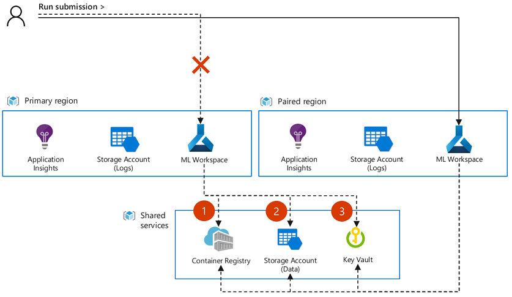

# Failover for business continuity and disaster recovery

To maximize your uptime, plan ahead to maintain business continuity and prepare for disaster recovery with Azure Machine Learning. 

Microsoft strives to ensure that Azure services are always available. However, unplanned service outages may occur. We recommend having a disaster recovery plan in place for handling regional service outages. In this article, you'll learn how to:

* Plan for a multi-regional deployment of Azure Machine Learning and associated resources.
* Maximize chances to recover logs, notebooks, docker images, and other metadata.
* Design for high availability of your solution.
* Initiate a failover to another region.

> [!IMPORTANT]
> Azure Machine Learning itself does not provide automatic failover or disaster recovery. Backup and restore of workspace metadata such as run history is unavailable.

In case you have accidentally deleted your workspace or corresponding components, this article also provides you with currently supported recovery options.

## Understand Azure services for Azure Machine Learning

Azure Machine Learning depends on multiple Azure services. Some of these services are provisioned in your subscription. You're responsible for the high-availability configuration of these services. Other services are created in a Microsoft subscription and are managed by Microsoft. 

Azure services include:

* **Azure Machine Learning infrastructure**: A Microsoft-managed environment for the Azure Machine Learning workspace.

* **Associated resources**: Resources provisioned in your subscription during Azure Machine Learning workspace creation. These resources include Azure Storage, Azure Key Vault, Azure Container Registry, and Application Insights.
  * Default storage has data such as model, training log data, and dataset.
  * Key Vault has credentials for Azure Storage, Container Registry, and data stores.
  * Container Registry has a Docker image for training and inferencing environments.
  * Application Insights is for monitoring Azure Machine Learning.

* **Compute resources**: Resources you create after workspace deployment. For example, you might create a compute instance or compute cluster to train a Machine Learning model.
  * Compute instance and compute cluster: Microsoft-managed model development environments.
  * Other resources: Microsoft computing resources that you can attach to Azure Machine Learning, such as Azure Kubernetes Service (AKS), Azure Databricks, Azure Container Instances, and Azure HDInsight. You're responsible for configuring high-availability settings for these resources.

* **Other data stores**: Azure Machine Learning can mount other data stores such as Azure Storage, Azure Data Lake Storage, and Azure SQL Database for training data.  These data stores are provisioned within your subscription. You're responsible for configuring their high-availability settings.

The following table shows the Azure services are managed by Microsoft and which are managed by you. It also indicates the services that are highly available by default.

| Service | Managed by | High availability by default |
| ----- | ----- | ----- |
| **Azure Machine Learning infrastructure** | Microsoft | |
| **Associated resources** |
| Azure Storage | You | |
| Key Vault | You | ✓ |
| Container Registry | You | |
| Application Insights | You | NA |
| **Compute resources** |
| Compute instance | Microsoft |  |
| Compute cluster | Microsoft |  |
| Other compute resources such as AKS,  Azure Databricks, Container Instances, HDInsight | You |  |
| **Other data stores** such as Azure Storage, SQL Database,  Azure Database for PostgreSQL, Azure Database for MySQL,  Azure Databricks File System | You | |

The rest of this article describes the actions you need to take to make each of these services highly available.

## Plan for multi-regional deployment

A multi-regional deployment relies on creation of Azure Machine Learning and other resources (infrastructure) in two Azure regions. If a regional outage occurs, you can switch to the other region. When planning on where to deploy your resources, consider:

* __Regional availability__: Use regions that are close to your users. To check regional availability for Azure Machine Learning, see [Azure products by region](https://azure.microsoft.com/global-infrastructure/services/).
* __Azure paired regions__: Paired regions coordinate platform updates and prioritize recovery efforts where needed. For more information, see [Azure paired regions](../../availability-zones/cross-region-replication-azure.md).
* __Service availability__: Decide whether the resources used by your solution should be hot/hot, hot/warm, or hot/cold.
    
    * __Hot/hot__: Both regions are active at the same time, with one region ready to begin use immediately.
    * __Hot/warm__: Primary region active, secondary region has critical resources (for example, deployed models) ready to start. Non-critical resources would need to be manually deployed in the secondary region.
    * __Hot/cold__: Primary region active, secondary region has Azure Machine Learning and other resources deployed, along with needed data. Resources such as models, model deployments, or pipelines would need to be manually deployed.

> [!TIP]
> Depending on your business requirements, you may decide to treat different Azure Machine Learning resources differently. For example, you may want to use hot/hot for deployed models (inference), and hot/cold for experiments (training).

Azure Machine Learning builds on top of other services. Some services can be configured to replicate to other regions. Others you must manually create in multiple regions. The following table provides a list of services, who is responsible for replication, and an overview of the configuration:

| Azure service | Geo-replicated by | Configuration |
| ----- | ----- | ----- |
| Machine Learning workspace | You | Create a workspace in the selected regions. |
| Machine Learning compute | You | Create the compute resources in the selected regions. For compute resources that can dynamically scale, make sure that both regions provide sufficient compute quota for your needs. |
| Key Vault | Microsoft | Use the same Key Vault instance with the Azure Machine Learning workspace and resources in both regions. Key Vault automatically fails over to a secondary region. For more information, see [Azure Key Vault availability and redundancy](../../key-vault/general/disaster-recovery-guidance.md).|
| Container Registry | Microsoft | Configure the Container Registry instance to geo-replicate registries to the paired region for Azure Machine Learning. Use the same instance for both workspace instances. For more information, see [Geo-replication in Azure Container Registry](../../container-registry/container-registry-geo-replication.md). |
| Storage Account | You | Azure Machine Learning does not support __default storage-account__ failover using geo-redundant storage (GRS), geo-zone-redundant storage (GZRS), read-access geo-redundant storage (RA-GRS), or read-access geo-zone-redundant storage (RA-GZRS). Create a separate storage account for the default storage of each workspace.  Create separate storage accounts or services for other data storage. For more information, see [Azure Storage redundancy](../../storage/common/storage-redundancy.md). |
| Application Insights | You | Create Application Insights for the workspace in both regions. To adjust the data-retention period and details, see [Data collection, retention, and storage in Application Insights](../../azure-monitor/app/data-retention-privacy.md#how-long-is-the-data-kept). |

To enable fast recovery and restart in the secondary region, we recommend the following development practices:

* Use Azure Resource Manager templates. Templates are 'infrastructure-as-code', and allow you to quickly deploy services in both regions.
* To avoid drift between the two regions, update your continuous integration and deployment pipelines to deploy to both regions.
* When automating deployments, include the configuration of workspace attached compute resources such as Azure Kubernetes Service.
* Create role assignments for users in both regions.
* Create network resources such as Azure Virtual Networks and private endpoints for both regions. Make sure that users have access to both network environments. For example, VPN and DNS configurations for both virtual networks.

### Compute and data services

Depending on your needs, you may have more compute or data services that are used by Azure Machine Learning. For example, you may use Azure Kubernetes Services or Azure SQL Database. Use the following information to learn how to configure these services for high availability.

__Compute resources__

* **Azure Kubernetes Service**: See [Best practices for business continuity and disaster recovery in Azure Kubernetes Service (AKS)](../../aks/operator-best-practices-multi-region.md) and [Create an Azure Kubernetes Service (AKS) cluster that uses availability zones](../../aks/availability-zones.md). If the AKS cluster was created by using the Azure Machine Learning Studio, SDK, or CLI, cross-region high availability is not supported.
* **Azure Databricks**: See [Regional disaster recovery for Azure Databricks clusters](/azure/databricks/scenarios/howto-regional-disaster-recovery).
* **Container Instances**: An orchestrator is responsible for failover. See [Azure Container Instances and container orchestrators](../../container-instances/container-instances-orchestrator-relationship.md).
* **HDInsight**: See [High availability services supported by Azure HDInsight](../../hdinsight/hdinsight-high-availability-components.md).

__Data services__

* **Azure Blob container / Azure Files / Data Lake Storage Gen2**: See [Azure Storage redundancy](../../storage/common/storage-redundancy.md).
* **Data Lake Storage Gen1**: See [High availability and disaster recovery guidance for Data Lake Storage Gen1](../../data-lake-store/data-lake-store-disaster-recovery-guidance.md).
* **SQL Database**: See [High availability for Azure SQL Database and SQL Managed Instance](/azure/azure-sql/database/high-availability-sla).
* **Azure Database for PostgreSQL**: See [High availability concepts in Azure Database for PostgreSQL - Single Server](../../postgresql/concepts-high-availability.md).
* **Azure Database for MySQL**: See [Understand business continuity in Azure Database for MySQL](../../mysql/concepts-business-continuity.md).
* **Azure Databricks File System**: See [Regional disaster recovery for Azure Databricks clusters](/azure/databricks/scenarios/howto-regional-disaster-recovery).

> [!TIP]
> If you provide your own customer-managed key to deploy an Azure Machine Learning workspace, Azure Cosmos DB is also provisioned within your subscription. In that case, you're responsible for configuring its high-availability settings. See [High availability with Azure Cosmos DB](../../cosmos-db/high-availability.md).

## Design for high availability

### Deploy critical components to multiple regions

Determine the level of business continuity that you are aiming for. The level may differ between the components of your solution. For example, you may want to have a hot/hot configuration for production pipelines or model deployments, and hot/cold for experimentation.

### Manage training data on isolated storage

By keeping your data storage isolated from the default storage the workspace uses for logs, you can:

* Attach the same storage instances as datastores to the primary and secondary workspaces.
* Make use of geo-replication for data storage accounts and maximize your uptime.

### Manage machine learning assets as code

> [!NOTE]
> Backup and restore of workspace metadata such as run history, models and environments is unavailable. Specifying assets and configurations as code using YAML specs, will help you re-recreate assets across workspaces in case of a disaster.

Jobs in Azure Machine Learning are defined by a job specification. This specification includes dependencies on input artifacts that are managed on a workspace-instance level, including environments, datasets, and compute. For multi-region job submission and deployments, we recommend the following practices:

* Manage your code base locally, backed by a Git repository.
    * Export important notebooks from Azure Machine Learning studio.
    * Export pipelines authored in studio as code.

      > [!NOTE]
      > Pipelines created in studio designer cannot currently be exported as code.

* Manage configurations as code.

    * Avoid hardcoded references to the workspace. Instead, configure a reference to the workspace instance using a [config file](../how-to-configure-environment.md#local-and-dsvm-only-create-a-workspace-configuration-file) and use [Workspace.from_config()](/python/api/azureml-core/azureml.core.workspace.workspace#remarks) to initialize the workspace. To automate the process, use the [Azure CLI extension for machine learning](reference-azure-machine-learning-cli.md) command [az ml folder attach](/cli/azure/ml(v1)/folder#az-ml(v1)-folder-attach).
    * Use job submission helpers such as [ScriptRunConfig](/python/api/azureml-core/azureml.core.scriptrunconfig) and [Pipeline](/python/api/azureml-pipeline-core/azureml.pipeline.core.pipeline(class)).
    * Use [Environments.save_to_directory()](/python/api/azureml-core/azureml.core.environment(class)#save-to-directory-path--overwrite-false-) to save your environment definitions.
    * Use a Dockerfile if you use custom Docker images.
    * Use the [Dataset](/python/api/azureml-core/azureml.core.dataset(class)) class to define the collection of data [paths](/python/api/azureml-core/azureml.data.datapath) used by your solution.
    * Use the [Inferenceconfig](/python/api/azureml-core/azureml.core.model.inferenceconfig) class to deploy models as inference endpoints.

## Initiate a failover

### Continue work in the failover workspace

When your primary workspace becomes unavailable, you can switch over the secondary workspace to continue experimentation and development. Azure Machine Learning does not automatically submit jobs to the secondary workspace if there is an outage. Update your code configuration to point to the new workspace resource. We recommend to avoiding hardcoding workspace references. Instead, use a [workspace config file](../how-to-configure-environment.md#local-and-dsvm-only-create-a-workspace-configuration-file) to minimize manual user steps when changing workspaces. Make sure to also update any automation, such as continuous integration and deployment pipelines to the new workspace.

Azure Machine Learning cannot sync or recover artifacts or metadata between workspace instances. Dependent on your application deployment strategy, you might have to move artifacts or recreate experimentation inputs such as dataset objects in the failover workspace in order to continue job submission. In case you have configured your primary workspace and secondary workspace resources to share associated resources with geo-replication enabled, some objects might be directly available to the failover workspace. For example, if both workspaces share the same docker images, configured datastores, and Azure Key Vault resources. The following diagram shows a configuration where two workspaces share the same images (1), datastores (2), and Key Vault (3).

> [!NOTE]
> Any jobs that are running when a service outage occurs will not automatically transition to the secondary workspace. It is also unlikely that the jobs will resume and finish successfully in the primary workspace once the outage is resolved. Instead, these jobs must be resubmitted, either in the secondary workspace or in the primary (once the outage is resolved).

### Moving artifacts between workspaces

Depending on your recovery approach, you may need to copy artifacts such as dataset and model objects between the workspaces to continue your work. Currently, the portability of artifacts between workspaces is limited. We recommend managing artifacts as code where possible so that they can be recreated in the failover instance.

The following artifacts can be exported and imported between workspaces by using the [Azure CLI extension for machine learning](reference-azure-machine-learning-cli.md):

| Artifact | Export | Import |
| ----- | ----- | ----- |
| Models | [az ml model download --model-id {ID} --target-dir {PATH}](/cli/azure/ml/model#az-ml-model-download) | [az ml model register –name {NAME} --path {PATH}](/cli/azure/ml/model) |
| Environments | [az ml environment download -n {NAME} -d {PATH}](/cli/azure/ml/environment#ml-az-ml-environment-download) | [az ml environment register -d {PATH}](/cli/azure/ml/environment#ml-az-ml-environment-register) |
| Azure Machine Learning pipelines (code-generated) | [az ml pipeline get --path {PATH}](/cli/azure/ml(v1)/pipeline#az-ml(v1)-pipeline-get) | [az ml pipeline create --name {NAME} -y {PATH}](/cli/azure/ml(v1)/pipeline#az-ml(v1)-pipeline-create)

> [!TIP]
> * __Registered datasets__ cannot be downloaded or moved. This includes datasets generated by Azure Machine Learning, such as intermediate pipeline datasets. However datasets that refer to a shared file location that both workspaces can access, or where the underlying data storage is replicated, can be registered on both workspaces. Use the [az ml dataset register](/cli/azure/ml(v1)/dataset#ml-az-ml-dataset-register) to register a dataset.
> * __Job outputs__ are stored in the default storage account associated with a workspace. While job outputs might become inaccessible from the studio UI in the case of a service outage, you can directly access the data through the storage account. For more information on working with data stored in blobs, see [Create, download, and list blobs with Azure CLI](../../storage/blobs/storage-quickstart-blobs-cli.md).

## Recovery options

### Workspace deletion

If you accidentally deleted your workspace, you might able to recover it. For recovery steps, see [Recover workspace data after accidental deletion with soft delete](../concept-soft-delete.md). 

Even if your workspace cannot be recovered, you may still be able to retrieve your notebooks from the workspace-associated Azure storage resource by following these steps:
* In the [Azure portal](https://portal.azure.com) navigate to the storage account that was linked to the deleted Azure Machine Learning workspace.
* In the Data storage section on the left, click on **File shares**.
* Your notebooks are located on the file share with the name that contains your workspace ID. 

## Next steps

To learn about repeatable infrastructure deployments with Azure Machine Learning, use an [Azure Resource Manager template](../tutorial-create-secure-workspace-template.md).

