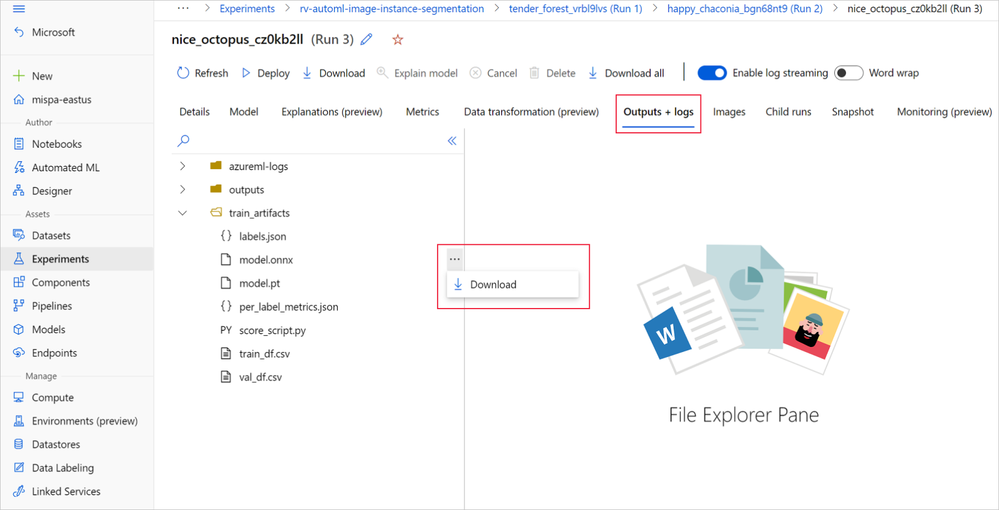

# Make predictions with ONNX on computer vision models from AutoML (v1)

[!INCLUDE [sdk v1](../includes/machine-learning-sdk-v1.md)]


  

[!INCLUDE [cli-version-info](../includes/machine-learning-cli-version-1-only.md)] 

  

In this article, you learn how to use Open Neural Network Exchange (ONNX) to make predictions on computer vision models generated from automated machine learning (AutoML) in Azure Machine Learning. 

To use ONNX for predictions, you need to: 
 
1. Download ONNX model files from an AutoML training run.
1. Understand the inputs and outputs of an ONNX model.
1. Preprocess your data so it's in the required format for input images.
1. Perform inference with ONNX Runtime for Python.
1. Visualize predictions for object detection and instance segmentation tasks.

[ONNX](https://onnx.ai/about.html) is an open standard for machine learning and deep learning models. It enables model import and export (interoperability) across the popular AI frameworks. For more details, explore the [ONNX GitHub project](https://github.com/onnx/onnx).

[ONNX Runtime](https://onnxruntime.ai/index.html) is an open-source project that supports cross-platform inference. ONNX Runtime provides APIs across programming languages (including Python, C++, C#, C, Java, and JavaScript). You can use these APIs to perform inference on input images. After you have the model that has been exported to ONNX format, you can use these APIs on any programming language that your project needs. 

In this guide, you'll learn how to use [Python APIs for ONNX Runtime](https://onnxruntime.ai/docs/get-started/with-python.html) to make predictions on images for popular vision tasks. You can use these ONNX exported models across languages.

## Prerequisites

* Get an AutoML-trained computer vision model for any of the supported image tasks: classification, object detection, or instance segmentation. [Learn more about AutoML support for computer vision tasks](how-to-auto-train-image-models.md).

* Install the [onnxruntime](https://onnxruntime.ai/docs/get-started/with-python.html) package. The methods in this article have been tested with versions 1.3.0 to 1.8.0.


## Download ONNX model files

You can download ONNX model files from AutoML runs by using the Azure Machine Learning studio UI or the Azure Machine Learning Python SDK. We recommend downloading via the SDK with the experiment name and parent run ID.


### Azure Machine Learning studio

On Azure Machine Learning studio, go to your experiment by using the hyperlink to the experiment generated in the training notebook, or by selecting the experiment name on the **Experiments** tab under **Assets**. Then select the best child run. 

Within the best child run, go to **Outputs+logs** > **train_artifacts**. Use the **Download** button to manually download the following files:

- *labels.json*: File that contains all the classes or labels in the training dataset.
- *model.onnx*: Model in ONNX format. 



Save the downloaded model files in a directory. The example in this article uses the *./automl_models* directory. 

### Azure Machine Learning Python SDK

With the SDK, you can select the best child run (by primary metric) with the experiment name and parent run ID. Then, you can download the *labels.json* and *model.onnx* files.

The following code returns the best child run based on the relevant primary metric.

```python
from azureml.train.automl.run import AutoMLRun

# Select the best child run
run_id = '' # Specify the run ID
automl_image_run = AutoMLRun(experiment=experiment, run_id=run_id)
best_child_run = automl_image_run.get_best_child()
```

Download the *labels.json* file, which contains all the classes and labels in the training dataset.

```python
labels_file = 'automl_models/labels.json'
best_child_run.download_file(name='train_artifacts/labels.json', output_file_path=labels_file)

```

Download the *model.onnx* file.

```python
onnx_model_path = 'automl_models/model.onnx'
best_child_run.download_file(name='train_artifacts/model.onnx', output_file_path=onnx_model_path)
```

### Model generation for batch scoring

By default, AutoML for Images supports batch scoring for classification. But object detection and instance segmentation models don't support batch inferencing. In case of batch inference for object detection and instance segmentation, use the following procedure to generate an ONNX model for the required batch size. Models generated for a specific batch size don't work for other batch sizes.


```python
from azureml.core.script_run_config import ScriptRunConfig
from azureml.train.automl.run import AutoMLRun
from azureml.core.workspace import Workspace
from azureml.core import Experiment

# specify experiment name
experiment_name = ''
# specify workspace parameters
subscription_id = ''
resource_group = ''
workspace_name = ''
# load the workspace and compute target
ws = ''
compute_target = ''
experiment = Experiment(ws, name=experiment_name)

# specify the run id of the automl run
run_id = ''
automl_image_run = AutoMLRun(experiment=experiment, run_id=run_id)
best_child_run = automl_image_run.get_best_child()
```

Use the following model specific arguments to submit the script. For more details on arguments, refer to [model specific hyperparameters](reference-automl-images-hyperparameters.md#model-specific-hyperparameters) and for supported object detection model names refer to the [supported model algorithm section](how-to-auto-train-image-models.md#supported-model-algorithms).

To get the argument values needed to create the batch scoring model, refer to the scoring scripts generated under the outputs folder of the AutoML training runs. Use the hyperparameter values available in the model settings variable inside the scoring file for the best child run.

# [Multi-class image classification ](#tab/multi-class)
For multi-class image classification, the generated ONNX model for the best child-run supports batch scoring by default. Therefore, no model specific arguments are needed for this task type and you can skip to the [Load the labels and ONNX model files](#load-the-labels-and-onnx-model-files) section. 

# [Multi-label image classification ](#tab/multi-label)
For multi-label image classification, the generated ONNX model for the best child-run supports batch scoring by default. Therefore, no model specific arguments are needed for this task type and you can skip to the [Load the labels and ONNX model files](#load-the-labels-and-onnx-model-files) section. 

# [Object detection with Faster R-CNN or RetinaNet](#tab/object-detect-cnn)
```python
arguments = ['--model_name', 'fasterrcnn_resnet34_fpn',  # enter the faster rcnn or retinanet model name
             '--batch_size', 8,  # enter the batch size of your choice
             '--height_onnx', 600,  # enter the height of input to ONNX model
             '--width_onnx', 800,  # enter the width of input to ONNX model
             '--experiment_name', experiment_name,
             '--subscription_id', subscription_id,
             '--resource_group', resource_group,
             '--workspace_name', workspace_name,
             '--run_id', run_id,
             '--task_type', 'image-object-detection',
             '--min_size', 600,  # minimum size of the image to be rescaled before feeding it to the backbone
             '--max_size', 1333,  # maximum size of the image to be rescaled before feeding it to the backbone
             '--box_score_thresh', 0.3,  # threshold to return proposals with a classification score > box_score_thresh
             '--box_nms_thresh', 0.5,  # NMS threshold for the prediction head
             '--box_detections_per_img', 100  # maximum number of detections per image, for all classes
             ]
```

# [Object detection with YOLO](#tab/object-detect-yolo)

```python
arguments = ['--model_name', 'yolov5',  # enter the yolo model name
             '--batch_size', 8,  # enter the batch size of your choice
             '--height_onnx', 640,  # enter the height of input to ONNX model
             '--width_onnx', 640,  # enter the width of input to ONNX model
             '--experiment_name', experiment_name,
             '--subscription_id', subscription_id,
             '--resource_group', resource_group,
             '--workspace_name', workspace_name,
             '--run_id', run_id,
             '--task_type', 'image-object-detection',
             '--img_size', 640,  # image size for inference
             '--model_size', 'medium',  # size of the yolo model
             '--box_score_thresh', 0.1,  # threshold to return proposals with a classification score > box_score_thresh
             '--box_iou_thresh', 0.5  # IOU threshold used during inference in nms post processing
             ]
```

# [Instance segmentation](#tab/instance-segmentation)

```python
arguments = ['--model_name', 'maskrcnn_resnet50_fpn',  # enter the maskrcnn model name
             '--batch_size', 8,  # enter the batch size of your choice
             '--height_onnx', 600,  # enter the height of input to ONNX model
             '--width_onnx', 800,  # enter the width of input to ONNX model
             '--experiment_name', experiment_name,
             '--subscription_id', subscription_id,
             '--resource_group', resource_group,
             '--workspace_name', workspace_name,
             '--run_id', run_id,
             '--task_type', 'image-instance-segmentation',
             '--min_size', 600,  # minimum size of the image to be rescaled before feeding it to the backbone
             '--max_size', 1333,  # maximum size of the image to be rescaled before feeding it to the backbone
             '--box_score_thresh', 0.3,  # threshold to return proposals with a classification score > box_score_thresh
             '--box_nms_thresh', 0.5,  # NMS threshold for the prediction head
             '--box_detections_per_img', 100  # maximum number of detections per image, for all classes
             ]
```

---

Download and keep the `ONNX_batch_model_generator_automl_for_images.py` file in the current directory and submit the script. Use [ScriptRunConfig](/python/api/azureml-core/azureml.core.scriptrunconfig) to submit the script `ONNX_batch_model_generator_automl_for_images.py` available in the [azureml-examples GitHub repository](https://github.com/Azure/azureml-examples/tree/v1-archive/v1/python-sdk/tutorials/automl-with-azureml), to generate an ONNX model of a specific batch size. In the following code, the trained model environment is used to submit this script to generate and save the ONNX model to the outputs directory. 
```python
script_run_config = ScriptRunConfig(source_directory='.',
                                    script='ONNX_batch_model_generator_automl_for_images.py',
                                    arguments=arguments,
                                    compute_target=compute_target,
                                    environment=best_child_run.get_environment())

remote_run = experiment.submit(script_run_config)
remote_run.wait_for_completion(wait_post_processing=True)
``` 

Once the batch model is generated, either download it from **Outputs+logs** > **outputs** manually, or use the following method:
```python
batch_size= 8  # use the batch size used to generate the model
onnx_model_path = 'automl_models/model.onnx'  # local path to save the model
remote_run.download_file(name='outputs/model_'+str(batch_size)+'.onnx', output_file_path=onnx_model_path)
```

After the model downloading step, you use the ONNX Runtime Python package to perform inferencing by using the *model.onnx* file. For demonstration purposes, this article uses the datasets from [How to prepare image datasets](how-to-prepare-datasets-for-automl-images.md) for each vision task. 

We've trained the models for all vision tasks with their respective datasets to demonstrate ONNX model inference.
 
## Load the labels and ONNX model files

The following code snippet loads *labels.json*, where class names are ordered. That is, if the ONNX model predicts a label ID as 2, then it corresponds to the label name given at the third index in the *labels.json* file.

```python
import json
import onnxruntime

labels_file = "automl_models/labels.json"
with open(labels_file) as f:
    classes = json.load(f)
print(classes)
try:
    session = onnxruntime.InferenceSession(onnx_model_path)
    print("ONNX model loaded...")
except Exception as e: 
    print("Error loading ONNX file: ",str(e))
```

## Get expected input and output details for an ONNX model

When you have the model, it's important to know some model-specific and task-specific details. These details include the number of inputs and number of outputs, expected input shape or format for preprocessing the image, and output shape so you know the model-specific or task-specific outputs.

```python
sess_input = session.get_inputs()
sess_output = session.get_outputs()
print(f"No. of inputs : {len(sess_input)}, No. of outputs : {len(sess_output)}")

for idx, input_ in enumerate(range(len(sess_input))):
    input_name = sess_input[input_].name
    input_shape = sess_input[input_].shape
    input_type = sess_input[input_].type
    print(f"{idx} Input name : { input_name }, Input shape : {input_shape}, \
    Input type  : {input_type}")  

for idx, output in enumerate(range(len(sess_output))):
    output_name = sess_output[output].name
    output_shape = sess_output[output].shape
    output_type = sess_output[output].type
    print(f" {idx} Output name : {output_name}, Output shape : {output_shape}, \
    Output type  : {output_type}") 
``` 

### Expected input and output formats for the ONNX model

Every ONNX model has a predefined set of input and output formats.

# [Multi-class image classification](#tab/multi-class)

This example applies the model trained on the [fridgeObjects](https://cvbp-secondary.z19.web.core.windows.net/datasets/image_classification/fridgeObjects.zip) dataset with 134 images and 4 classes/labels to explain ONNX model inference. For more information on training an image classification task, see the [multi-class image classification notebook](https://github.com/Azure/azureml-examples/tree/v1-archive/v1/python-sdk/tutorials/automl-with-azureml/image-classification-multiclass).

### Input format
    
The input is a preprocessed image.

| Input name  | Input shape  | Input type | Description |
| -------- |----------:|-----|--------|
| input1 | `(batch_size, num_channels, height, width)` | ndarray(float) | Input is a preprocessed image, with the shape `(1, 3, 224, 224)` for a batch size of 1, and a height and width of 224. These numbers correspond to the values used for `crop_size` in the training example. |
    

### Output format

The output is an array of logits for all the classes/labels.
         
| Output name   | Output shape  | Output type | Description |
| -------- |----------|-----|------|
| output1 | `(batch_size, num_classes)` | ndarray(float) | Model returns logits (without `softmax`). For instance, for batch size 1 and 4 classes, it returns `(1, 4)`. |

# [Multi-label image classification](#tab/multi-label)

This example uses the model trained on the [multi-label fridgeObjects dataset](https://cvbp-secondary.z19.web.core.windows.net/datasets/image_classification/multilabelFridgeObjects.zip) with 128 images and 4 classes/labels to explain ONNX model inference. For more information on model training for multi-label image classification, see the [multi-label image classification notebook](https://github.com/Azure/azureml-examples/tree/v1-archive/v1/python-sdk/tutorials/automl-with-azureml/image-classification-multilabel).

### Input format

Input is a preprocessed image.

| Input name       | Input shape  | Input type | Description |
| -------- |----------|-----|--------|
| input1 | `(batch_size, num_channels, height, width)` | ndarray(float) | Input is a preprocessed image, with the shape `(1, 3, 224, 224)` for a batch size of 1, and a height and width of 224. These numbers correspond to the values used for `crop_size` in the training example. |
        
### Output format

The output is an array of logits for all the classes/labels.
    
      
| Output name       | Output shape  | Output type | Description |
| -------- |----------|-----|------
| output1 | `(batch_size, num_classes)` | ndarray(float) | Model returns logits (without `sigmoid`). For instance, for batch size 1 and 4 classes, it returns `(1, 4)`. |


# [Object detection with Faster R-CNN or RetinaNet](#tab/object-detect-cnn)

This object detection example uses the model trained on the [fridgeObjects detection dataset](https://cvbp-secondary.z19.web.core.windows.net/datasets/object_detection/odFridgeObjects.zip) of 128 images and 4 classes/labels to explain ONNX model inference. This example trains Faster R-CNN models to demonstrate inference steps. For more information on training object detection models, see the [object detection notebook](https://github.com/Azure/azureml-examples/tree/v1-archive/v1/python-sdk/tutorials/automl-with-azureml/image-object-detection).

### Input format

Input is a preprocessed image.

| Input name       | Input shape  | Input type | Description |
| -------- |----------|-----|--------|
| Input | `(batch_size, num_channels, height, width)` | ndarray(float) | Input is a preprocessed image, with the shape `(1, 3, 600, 800)` for a batch size of 1, and a height of 600 and width of 800.|
        
    
### Output format

The output is a tuple of `output_names` and predictions. Here, `output_names` and `predictions` are lists with length 3*`batch_size` each. For Faster R-CNN order of outputs are boxes, labels and scores, whereas for RetinaNet outputs are boxes, scores, labels. 
  
| Output name       | Output shape  | Output type | Description |
| -------- |----------|-----|------|
| `output_names` | `(3*batch_size)` | List of keys | For a batch size of 2, `output_names` will be `['boxes_0', 'labels_0', 'scores_0', 'boxes_1', 'labels_1', 'scores_1']` |
| `predictions` | `(3*batch_size)` | List of ndarray(float) | For a batch size of 2, `predictions` will take the shape of `[(n1_boxes, 4), (n1_boxes), (n1_boxes), (n2_boxes, 4), (n2_boxes), (n2_boxes)]`. Here, values at each index correspond to same index in `output_names`. |


The following table describes boxes, labels and scores returned for each sample in the batch of images.

| Name       | Shape  | Type | Description |
| -------- |----------|-----|------|
| Boxes | `(n_boxes, 4)`, where each box has `x_min, y_min, x_max, y_max` | ndarray(float) | Model returns *n* boxes with their top-left and bottom-right coordinates. |
| Labels | `(n_boxes)`| ndarray(float) | Label or class ID of an object in each box. |  
| Scores | `(n_boxes)` | ndarray(float) | Confidence score of an object in each box. |    


# [Object detection with YOLO](#tab/object-detect-yolo)

This object detection example uses the model trained on the [fridgeObjects detection dataset](https://cvbp-secondary.z19.web.core.windows.net/datasets/object_detection/odFridgeObjects.zip) of 128 images and 4 classes/labels to explain ONNX model inference. This example trains YOLO models to demonstrate inference steps. For more information on training object detection models, see the [object detection notebook](https://github.com/Azure/azureml-examples/tree/v1-archive/v1/python-sdk/tutorials/automl-with-azureml/image-object-detection). 

### Input format

The input is a preprocessed image, with the shape `(1, 3, 640, 640)` for a batch size of 1, and a height and width of 640. These numbers correspond to the values used in the training example.        

| Input name       | Input shape  | Input type | Description |
| -------- |----------|-----|--------|
| Input | `(batch_size, num_channels, height, width)` | ndarray(float) | Input is a preprocessed image, with the shape `(1, 3, 640, 640)` for a batch size of 1, and a height of 640 and width of 640.|
        
### Output format
ONNX model predictions contain multiple outputs. The first output is needed to perform non-max suppression for  detections. For ease of use, automated ML displays the output format after the NMS postprocessing step. The output after NMS is a list of boxes, labels, and scores for each sample in the batch. 


| Output name       | Output shape  | Output type | Description |
| -------- |----------|-----|------|
| Output | `(batch_size)`| List of ndarray(float) | Model returns box detections for each sample in the batch |

Each cell in the list indicates box detections of a sample with shape `(n_boxes, 6)`, where each box has `x_min, y_min, x_max, y_max, confidence_score, class_id`.

# [Instance segmentation](#tab/instance-segmentation)

For this instance segmentation example, you use the Mask R-CNN model that has been trained on the [fridgeObjects dataset](https://cvbp-secondary.z19.web.core.windows.net/datasets/object_detection/odFridgeObjectsMask.zip) with 128 images and 4 classes/labels to explain ONNX model inference. For more information on training of the instance segmentation model, see the [instance segmentation notebook](https://github.com/Azure/azureml-examples/tree/v1-archive/v1/python-sdk/tutorials/automl-with-azureml/image-instance-segmentation).

>[!IMPORTANT]
> Only Mask R-CNN is supported for instance segmentation tasks. The input and output formats are based on Mask R-CNN only.

### Input format

The input is a preprocessed image. The ONNX model for Mask R-CNN has been exported to work with images of different shapes. We recommend that you resize them to a fixed size that's consistent with training image sizes, for better performance.
    
| Input name       | Input shape  | Input type | Description |
| -------- |----------|-----|--------|
| Input | `(batch_size, num_channels, height, width)` | ndarray(float) | Input is a preprocessed image, with shape `(1, 3, input_image_height, input_image_width)` for a batch size of 1, and a height and width similar to an input image. |
        
    
### Output format

The output is a tuple of `output_names` and predictions. Here, `output_names` and `predictions` are lists with length 4*`batch_size` each. 
  
| Output name       | Output shape  | Output type | Description |
| -------- |----------|-----|------|
| `output_names` | `(4*batch_size)` | List of keys | For a batch size of 2, `output_names` will be `['boxes_0', 'labels_0', 'scores_0', 'masks_0', 'boxes_1', 'labels_1', 'scores_1', 'masks_1']` |
| `predictions` | `(4*batch_size)` | List of ndarray(float) | For a batch size of 2, `predictions` will take the shape of `[(n1_boxes, 4), (n1_boxes), (n1_boxes), (n1_boxes, 1, height_onnx, width_onnx), (n2_boxes, 4), (n2_boxes), (n2_boxes), (n2_boxes, 1, height_onnx, width_onnx)]`. Here, values at each index correspond to same index in `output_names`. |

| Name       | Shape  | Type | Description |
| -------- |----------|-----|------|
| Boxes | `(n_boxes, 4)`, where each box has `x_min, y_min, x_max, y_max` | ndarray(float) | Model returns *n* boxes with their top-left and bottom-right coordinates. |
| Labels | `(n_boxes)`| ndarray(float) | Label or class ID of an object in each box. |  
| Scores | `(n_boxes)` | ndarray(float) | Confidence score of an object in each box. |    
| Masks | `(n_boxes, 1, height_onnx, width_onnx)` | ndarray(float) | Masks (polygons) of detected objects with the shape height and width of an input image. |    

---

## Preprocessing

# [Multi-class image classification](#tab/multi-class)

Perform the following preprocessing steps for the ONNX model inference:

1. Convert the image to RGB.
2. Resize the image to `valid_resize_size` and `valid_resize_size` values that correspond to the values used in the transformation of the validation dataset during training. The default value for `valid_resize_size` is 256.
3. Center crop the image to `height_onnx_crop_size` and `width_onnx_crop_size`. It corresponds to `valid_crop_size` with the default value of 224.
4. Change `HxWxC` to `CxHxW`.
5. Convert to float type.
6. Normalize with ImageNet's `mean` = `[0.485, 0.456, 0.406]` and `std` = `[0.229, 0.224, 0.225]`.

If you chose different values for the [hyperparameters](reference-automl-images-hyperparameters.md) `valid_resize_size` and `valid_crop_size` during training, then those values should be used.

Get the input shape needed for the ONNX model.

```python
batch, channel, height_onnx_crop_size, width_onnx_crop_size = session.get_inputs()[0].shape
batch, channel, height_onnx_crop_size, width_onnx_crop_size
```

### Without PyTorch

```python
import glob
import numpy as np
from PIL import Image

def preprocess(image, resize_size, crop_size_onnx):
    """Perform pre-processing on raw input image
    
    :param image: raw input image
    :type image: PIL image
    :param resize_size: value to resize the image
    :type image: Int
    :param crop_size_onnx: expected height of an input image in onnx model
    :type crop_size_onnx: Int
    :return: pre-processed image in numpy format
    :rtype: ndarray 1xCxHxW
    """

    image = image.convert('RGB')
    # resize
    image = image.resize((resize_size, resize_size))
    #  center  crop
    left = (resize_size - crop_size_onnx)/2
    top = (resize_size - crop_size_onnx)/2
    right = (resize_size + crop_size_onnx)/2
    bottom = (resize_size + crop_size_onnx)/2
    image = image.crop((left, top, right, bottom))

    np_image = np.array(image)
    # HWC -> CHW
    np_image = np_image.transpose(2, 0, 1) # CxHxW
    # normalize the image
    mean_vec = np.array([0.485, 0.456, 0.406])
    std_vec = np.array([0.229, 0.224, 0.225])
    norm_img_data = np.zeros(np_image.shape).astype('float32')
    for i in range(np_image.shape[0]):
        norm_img_data[i,:,:] = (np_image[i,:,:]/255 - mean_vec[i])/std_vec[i]
             
    np_image = np.expand_dims(norm_img_data, axis=0) # 1xCxHxW
    return np_image

# following code loads only batch_size number of images for demonstrating ONNX inference
# make sure that the data directory has at least batch_size number of images

test_images_path = "automl_models_multi_cls/test_images_dir/*" # replace with path to images
# Select batch size needed
batch_size = 8
# you can modify resize_size based on your trained model
resize_size = 256
# height and width will be the same for classification
crop_size_onnx = height_onnx_crop_size 

image_files = glob.glob(test_images_path)
img_processed_list = []
for i in range(batch_size):
    img = Image.open(image_files[i])
    img_processed_list.append(preprocess(img, resize_size, crop_size_onnx))
    
if len(img_processed_list) > 1:
    img_data = np.concatenate(img_processed_list)
elif len(img_processed_list) == 1:
    img_data = img_processed_list[0]
else:
    img_data = None

assert batch_size == img_data.shape[0]
```

### With PyTorch

```python
import glob
import torch
import numpy as np
from PIL import Image
from torchvision import transforms

def _make_3d_tensor(x) -> torch.Tensor:
    """This function is for images that have less channels.

    :param x: input tensor
    :type x: torch.Tensor
    :return: return a tensor with the correct number of channels
    :rtype: torch.Tensor
    """
    return x if x.shape[0] == 3 else x.expand((3, x.shape[1], x.shape[2]))

def preprocess(image, resize_size, crop_size_onnx):
    transform = transforms.Compose([
        transforms.Resize(resize_size),
        transforms.CenterCrop(crop_size_onnx),
        transforms.ToTensor(),
        transforms.Lambda(_make_3d_tensor),
        transforms.Normalize([0.485, 0.456, 0.406], [0.229, 0.224, 0.225])])
    
    img_data = transform(image)
    img_data = img_data.numpy()
    img_data = np.expand_dims(img_data, axis=0)
    return img_data

# following code loads only batch_size number of images for demonstrating ONNX inference
# make sure that the data directory has at least batch_size number of images

test_images_path = "automl_models_multi_cls/test_images_dir/*" # replace with path to images
# Select batch size needed
batch_size = 8
# you can modify resize_size based on your trained model
resize_size = 256
# height and width will be the same for classification
crop_size_onnx = height_onnx_crop_size 

image_files = glob.glob(test_images_path)
img_processed_list = []
for i in range(batch_size):
    img = Image.open(image_files[i])
    img_processed_list.append(preprocess(img, resize_size, crop_size_onnx))
    
if len(img_processed_list) > 1:
    img_data = np.concatenate(img_processed_list)
elif len(img_processed_list) == 1:
    img_data = img_processed_list[0]
else:
    img_data = None

assert batch_size == img_data.shape[0]
```

# [Multi-label image classification](#tab/multi-label)

Perform the following preprocessing steps for the ONNX model inference. These steps are the same for multi-class image classification.

1. Convert the image to RGB.
2. Resize the image to `valid_resize_size` and `valid_resize_size` values that correspond to the values used in the transformation of the validation dataset during training. The default value for `valid_resize_size` is 256.
3. Center crop the image to `height_onnx_crop_size` and `width_onnx_crop_size`. This corresponds to `valid_crop_size` with the default value of 224.
4. Change `HxWxC` to `CxHxW`.
5. Convert to float type.
6. Normalize with ImageNet's `mean` = `[0.485, 0.456, 0.406]` and `std` = `[0.229, 0.224, 0.225]`.

If you chose different values for the [hyperparameters](reference-automl-images-hyperparameters.md) `valid_resize_size` and `valid_crop_size` during training, then those values should be used.

Get the input shape needed for the ONNX model.

```python
batch, channel, height_onnx_crop_size, width_onnx_crop_size = session.get_inputs()[0].shape
batch, channel, height_onnx_crop_size, width_onnx_crop_size
```

### Without PyTorch

```python
import glob
import numpy as np
from PIL import Image

def preprocess(image, resize_size, crop_size_onnx):
    """Perform pre-processing on raw input image
    
    :param image: raw input image
    :type image: PIL image
    :param resize_size: value to resize the image
    :type image: Int
    :param crop_size_onnx: expected height of an input image in onnx model
    :type crop_size_onnx: Int
    :return: pre-processed image in numpy format
    :rtype: ndarray 1xCxHxW
    """

    image = image.convert('RGB')
    # resize
    image = image.resize((resize_size, resize_size))
    # center  crop
    left = (resize_size - crop_size_onnx)/2
    top = (resize_size - crop_size_onnx)/2
    right = (resize_size + crop_size_onnx)/2
    bottom = (resize_size + crop_size_onnx)/2
    image = image.crop((left, top, right, bottom))

    np_image = np.array(image)
    # HWC -> CHW
    np_image = np_image.transpose(2, 0, 1) # CxHxW

    # normalize the image
    mean_vec = np.array([0.485, 0.456, 0.406])
    std_vec = np.array([0.229, 0.224, 0.225])
    norm_img_data = np.zeros(np_image.shape).astype('float32')
    for i in range(np_image.shape[0]):
        norm_img_data[i,:,:] = (np_image[i,:,:] / 255 - mean_vec[i]) / std_vec[i]    
    np_image = np.expand_dims(norm_img_data, axis=0) # 1xCxHxW
    return np_image

# following code loads only batch_size number of images for demonstrating ONNX inference
# make sure that the data directory has at least batch_size number of images

test_images_path = "automl_models_multi_label/test_images_dir/*" # replace with path to images
# Select batch size needed
batch_size = 8
# you can modify resize_size based on your trained model
resize_size = 256
# height and width will be the same for classification
crop_size_onnx = height_onnx_crop_size 

image_files = glob.glob(test_images_path)
img_processed_list = []
for i in range(batch_size):
    img = Image.open(image_files[i])
    img_processed_list.append(preprocess(img, resize_size, crop_size_onnx))
    
if len(img_processed_list) > 1:
    img_data = np.concatenate(img_processed_list)
elif len(img_processed_list) == 1:
    img_data = img_processed_list[0]
else:
    img_data = None

assert batch_size == img_data.shape[0]

```

### With PyTorch

```python
import glob
import torch
import numpy as np
from PIL import Image
from torchvision import transforms

def _make_3d_tensor(x) -> torch.Tensor:
    """This function is for images that have less channels.

    :param x: input tensor
    :type x: torch.Tensor
    :return: return a tensor with the correct number of channels
    :rtype: torch.Tensor
    """
    return x if x.shape[0] == 3 else x.expand((3, x.shape[1], x.shape[2]))

def preprocess(image, resize_size, crop_size_onnx):
    """Perform pre-processing on raw input image
    
    :param image: raw input image
    :type image: PIL image
    :param resize_size: value to resize the image
    :type image: Int
    :param crop_size_onnx: expected height of an input image in onnx model
    :type crop_size_onnx: Int
    :return: pre-processed image in numpy format
    :rtype: ndarray 1xCxHxW
    """
    transform = transforms.Compose([
        transforms.Resize(resize_size),
        transforms.CenterCrop(crop_size_onnx),
        transforms.ToTensor(),
        transforms.Lambda(_make_3d_tensor),
        transforms.Normalize([0.485, 0.456, 0.406], [0.229, 0.224, 0.225])])
    
    img_data = transform(image)
    img_data = img_data.numpy()
    img_data = np.expand_dims(img_data, axis=0)
    
    return img_data

# following code loads only batch_size number of images for demonstrating ONNX inference
# make sure that the data directory has at least batch_size number of images

test_images_path = "automl_models_multi_label/test_images_dir/*" # replace with path to images
# Select batch size needed
batch_size = 8
# you can modify resize_size based on your trained model
resize_size = 256
# height and width will be the same for classification
crop_size_onnx = height_onnx_crop_size 

image_files = glob.glob(test_images_path)
img_processed_list = []
for i in range(batch_size):
    img = Image.open(image_files[i])
    img_processed_list.append(preprocess(img, resize_size, crop_size_onnx))
    
if len(img_processed_list) > 1:
    img_data = np.concatenate(img_processed_list)
elif len(img_processed_list) == 1:
    img_data = img_processed_list[0]
else:
    img_data = None

assert batch_size == img_data.shape[0]
```

# [Object detection with Faster R-CNN or RetinaNet](#tab/object-detect-cnn)

For object detection with the Faster R-CNN algorithm, follow the same preprocessing steps as image classification, except for image cropping. You can resize the image with height `600` and width `800`. You can get the expected input height and width with the following code.

```python
batch, channel, height_onnx, width_onnx = session.get_inputs()[0].shape
batch, channel, height_onnx, width_onnx
```

Then, perform the preprocessing steps.

```python
import glob
import numpy as np
from PIL import Image

def preprocess(image, height_onnx, width_onnx):
    """Perform pre-processing on raw input image
    
    :param image: raw input image
    :type image: PIL image
    :param height_onnx: expected height of an input image in onnx model
    :type height_onnx: Int
    :param width_onnx: expected width of an input image in onnx model
    :type width_onnx: Int
    :return: pre-processed image in numpy format
    :rtype: ndarray 1xCxHxW
    """

    image = image.convert('RGB')
    image = image.resize((width_onnx, height_onnx))
    np_image = np.array(image)
    # HWC -> CHW
    np_image = np_image.transpose(2, 0, 1) # CxHxW
    # normalize the image
    mean_vec = np.array([0.485, 0.456, 0.406])
    std_vec = np.array([0.229, 0.224, 0.225])
    norm_img_data = np.zeros(np_image.shape).astype('float32')
    for i in range(np_image.shape[0]):
        norm_img_data[i,:,:] = (np_image[i,:,:] / 255 - mean_vec[i]) / std_vec[i]
    np_image = np.expand_dims(norm_img_data, axis=0) # 1xCxHxW
    return np_image

# following code loads only batch_size number of images for demonstrating ONNX inference
# make sure that the data directory has at least batch_size number of images

test_images_path = "automl_models_od/test_images_dir/*" # replace with path to images
image_files = glob.glob(test_images_path)
img_processed_list = []
for i in range(batch_size):
    img = Image.open(image_files[i])
    img_processed_list.append(preprocess(img, height_onnx, width_onnx))
    
if len(img_processed_list) > 1:
    img_data = np.concatenate(img_processed_list)
elif len(img_processed_list) == 1:
    img_data = img_processed_list[0]
else:
    img_data = None

assert batch_size == img_data.shape[0]
```

# [Object detection with YOLO](#tab/object-detect-yolo)

For object detection with the YOLO algorithm, follow the same preprocessing steps as image classification, except for image cropping. You can resize the image with height `600` and width `800`, and get the expected input height and width with the following code.

```python
batch, channel, height_onnx, width_onnx = session.get_inputs()[0].shape
batch, channel, height_onnx, width_onnx
```

For preprocessing required for YOLO, refer to [yolo_onnx_preprocessing_utils.py](https://github.com/Azure/azureml-examples/tree/v1-archive/v1/python-sdk/tutorials/automl-with-azureml/image-object-detection).

```python
import glob
import numpy as np
from yolo_onnx_preprocessing_utils import preprocess

# use height and width based on the generated model
test_images_path = "automl_models_od_yolo/test_images_dir/*" # replace with path to images
image_files = glob.glob(test_images_path)
img_processed_list = []
pad_list = []
for i in range(batch_size):
    img_processed, pad = preprocess(image_files[i])
    img_processed_list.append(img_processed)
    pad_list.append(pad)
    
if len(img_processed_list) > 1:
    img_data = np.concatenate(img_processed_list)
elif len(img_processed_list) == 1:
    img_data = img_processed_list[0]
else:
    img_data = None

assert batch_size == img_data.shape[0]
```

# [Instance segmentation](#tab/instance-segmentation)
>[!IMPORTANT]
> Only Mask R-CNN is supported for instance segmentation tasks. The preprocessing steps are based on Mask R-CNN only.

Perform the following preprocessing steps for the ONNX model inference:

1. Convert the image to RGB.
2. Resize the image. 
3. Change `HxWxC` to `CxHxW`.
4. Convert to float type.
5. Normalize with ImageNet's `mean` = `[0.485, 0.456, 0.406]` and `std` = `[0.229, 0.224, 0.225]`.

For `resize_height` and `resize_width`, you can also use the values that you used during training, bounded by the `min_size` and `max_size` [hyperparameters](reference-automl-images-hyperparameters.md) for Mask R-CNN.

```python
import glob
import numpy as np
from PIL import Image

def preprocess(image, resize_height, resize_width):
    """Perform pre-processing on raw input image
    
    :param image: raw input image
    :type image: PIL image
    :param resize_height: resize height of an input image
    :type resize_height: Int
    :param resize_width: resize width of an input image
    :type resize_width: Int
    :return: pre-processed image in numpy format
    :rtype: ndarray of shape 1xCxHxW
    """

    image = image.convert('RGB')
    image = image.resize((resize_width, resize_height))
    np_image = np.array(image)
    # HWC -> CHW
    np_image = np_image.transpose(2, 0, 1)  # CxHxW
    # normalize the image
    mean_vec = np.array([0.485, 0.456, 0.406])
    std_vec = np.array([0.229, 0.224, 0.225])
    norm_img_data = np.zeros(np_image.shape).astype('float32')
    for i in range(np_image.shape[0]):
        norm_img_data[i,:,:] = (np_image[i,:,:]/255 - mean_vec[i])/std_vec[i]
    np_image = np.expand_dims(norm_img_data, axis=0)  # 1xCxHxW
    return np_image

# following code loads only batch_size number of images for demonstrating ONNX inference
# make sure that the data directory has at least batch_size number of images
# use height and width based on the trained model
# use height and width based on the generated model
test_images_path = "automl_models_is/test_images_dir/*" # replace with path to images
image_files = glob.glob(test_images_path)
img_processed_list = []
for i in range(batch_size):
    img = Image.open(image_files[i])
    img_processed_list.append(preprocess(img, height_onnx, width_onnx))
    
if len(img_processed_list) > 1:
    img_data = np.concatenate(img_processed_list)
elif len(img_processed_list) == 1:
    img_data = img_processed_list[0]
else:
    img_data = None

assert batch_size == img_data.shape[0]
```

---

## Inference with ONNX Runtime

Inferencing with ONNX Runtime differs for each computer vision task.

# [Multi-class image classification](#tab/multi-class)

```python
def get_predictions_from_ONNX(onnx_session, img_data):
    """Perform predictions with ONNX runtime
    
    :param onnx_session: onnx model session
    :type onnx_session: class InferenceSession
    :param img_data: pre-processed numpy image
    :type img_data: ndarray with shape 1xCxHxW
    :return: scores with shapes
            (1, No. of classes in training dataset) 
    :rtype: numpy array
    """

    sess_input = onnx_session.get_inputs()
    sess_output = onnx_session.get_outputs()
    print(f"No. of inputs : {len(sess_input)}, No. of outputs : {len(sess_output)}")    
    # predict with ONNX Runtime
    output_names = [ output.name for output in sess_output]
    scores = onnx_session.run(output_names=output_names,\
                                               input_feed={sess_input[0].name: img_data})
    
    return scores[0]

scores = get_predictions_from_ONNX(session, img_data)
```

# [Multi-label image classification](#tab/multi-label)

```python
def get_predictions_from_ONNX(onnx_session,img_data):
    """Perform predictions with ONNX runtime
    
    :param onnx_session: onnx model session
    :type onnx_session: class InferenceSession
    :param img_data: pre-processed numpy image
    :type img_data: ndarray with shape 1xCxHxW
    :return: scores with shapes
            (1, No. of classes in training dataset) 
    :rtype: numpy array
    """
    
    sess_input = onnx_session.get_inputs()
    sess_output = onnx_session.get_outputs()
    print(f"No. of inputs : {len(sess_input)}, No. of outputs : {len(sess_output)}")    
    # predict with ONNX Runtime
    output_names = [ output.name for output in sess_output]
    scores = onnx_session.run(output_names=output_names,\
                                               input_feed={sess_input[0].name: img_data})
    
    return scores[0]

scores = get_predictions_from_ONNX(session, img_data)
```

# [Object detection with Faster R-CNN or RetinaNet](#tab/object-detect-cnn)

```python
def get_predictions_from_ONNX(onnx_session, img_data):
    """perform predictions with ONNX runtime
    
    :param onnx_session: onnx model session
    :type onnx_session: class InferenceSession
    :param img_data: pre-processed numpy image
    :type img_data: ndarray with shape 1xCxHxW
    :return: boxes, labels , scores 
            (No. of boxes, 4) (No. of boxes,) (No. of boxes,)
    :rtype: tuple
    """

    sess_input = onnx_session.get_inputs()
    sess_output = onnx_session.get_outputs()
    
    # predict with ONNX Runtime
    output_names = [output.name for output in sess_output]
    predictions = onnx_session.run(output_names=output_names,\
                                               input_feed={sess_input[0].name: img_data})

    return output_names, predictions

output_names, predictions = get_predictions_from_ONNX(session, img_data)
```

# [Object detection with YOLO](#tab/object-detect-yolo)

```python
def get_predictions_from_ONNX(onnx_session,img_data):
    """perform predictions with ONNX Runtime
    
    :param onnx_session: onnx model session
    :type onnx_session: class InferenceSession
    :param img_data: pre-processed numpy image
    :type img_data: ndarray with shape 1xCxHxW
    :return: boxes, labels , scores 
    :rtype: list
    """
    sess_input = onnx_session.get_inputs()
    sess_output = onnx_session.get_outputs()
    # predict with ONNX Runtime
    output_names = [ output.name for output in sess_output]
    pred = onnx_session.run(output_names=output_names,\
                                               input_feed={sess_input[0].name: img_data})
    return pred[0]

result = get_predictions_from_ONNX(session, img_data)

```

# [Instance segmentation](#tab/instance-segmentation)

The instance segmentation model predicts boxes, labels, scores, and masks. ONNX outputs a predicted mask per instance, along with corresponding bounding boxes and class confidence score. You might need to convert from binary mask to polygon if necessary.

```python

def get_predictions_from_ONNX(onnx_session, img_data):
    """Perform predictions with ONNX runtime
    
    :param onnx_session: onnx model session
    :type onnx_session: class InferenceSession
    :param img_data: pre-processed numpy image
    :type img_data: ndarray with shape 1xCxHxW
    :return: boxes, labels , scores , masks with shapes
            (No. of instances, 4) (No. of instances,) (No. of instances,)
            (No. of instances, 1, HEIGHT, WIDTH))  
    :rtype: tuple
    """
    
    sess_input = onnx_session.get_inputs()
    sess_output = onnx_session.get_outputs()
    # predict with ONNX Runtime
    output_names = [ output.name for output in sess_output]
    predictions = onnx_session.run(output_names=output_names,\
                                               input_feed={sess_input[0].name: img_data})
    return output_names, predictions

output_names, predictions = get_predictions_from_ONNX(session, img_data)
```

---

## Postprocessing

# [Multi-class image classification](#tab/multi-class)

Apply `softmax()` over predicted values to get classification confidence scores (probabilities) for each class. Then the prediction will be the class with the highest probability. 

### Without PyTorch

```python
def softmax(x):
    e_x = np.exp(x - np.max(x, axis=1, keepdims=True))
    return e_x / np.sum(e_x, axis=1, keepdims=True)

conf_scores = softmax(scores)
class_preds = np.argmax(conf_scores, axis=1)
print("predicted classes:", ([(class_idx, classes[class_idx]) for class_idx in class_preds]))
```

### With PyTorch

```python
conf_scores = torch.nn.functional.softmax(torch.from_numpy(scores), dim=1)
class_preds = torch.argmax(conf_scores, dim=1)
print("predicted classes:", ([(class_idx.item(), classes[class_idx]) for class_idx in class_preds]))
```

# [Multi-label image classification](#tab/multi-label)

This step differs from multi-class classification. You need to apply `sigmoid` to the logits (ONNX output) to get confidence scores for multi-label image classification.

### Without PyTorch

```python
def sigmoid(x):
    return 1 / (1 + np.exp(-x))

# we apply a threshold of 0.5 on confidence scores
score_threshold = 0.5
conf_scores = sigmoid(scores)
image_wise_preds = np.where(conf_scores > score_threshold)
for image_idx, class_idx in zip(image_wise_preds[0], image_wise_preds[1]):
    print('image: {}, class_index: {}, class_name: {}'.format(image_files[image_idx], class_idx, classes[class_idx]))
```

### With PyTorch

```python
# we apply a threshold of 0.5 on confidence scores
score_threshold = 0.5
conf_scores = torch.sigmoid(torch.from_numpy(scores))
image_wise_preds = torch.where(conf_scores > score_threshold)
for image_idx, class_idx in zip(image_wise_preds[0], image_wise_preds[1]):
    print('image: {}, class_index: {}, class_name: {}'.format(image_files[image_idx], class_idx, classes[class_idx]))
```

For multi-class and multi-label classification, you can follow the same steps mentioned earlier for all the supported algorithms in AutoML.


# [Object detection with Faster R-CNN or RetinaNet](#tab/object-detect-cnn)

For object detection, predictions are automatically on the scale of `height_onnx`, `width_onnx`. To transform the predicted box coordinates to the original dimensions, you can implement the following calculations. 

- Xmin * original_width/width_onnx
- Ymin * original_height/height_onnx
- Xmax * original_width/width_onnx
- Ymax * original_height/height_onnx
  
Another option is to use the following code to scale the box dimensions to be in the range of [0, 1]. Doing so allows the box coordinates to be multiplied with original images height and width with respective coordinates (as described in [visualize predictions section](#visualize-predictions)) to get boxes in original image dimensions.

```python
def _get_box_dims(image_shape, box):
    box_keys = ['topX', 'topY', 'bottomX', 'bottomY']
    height, width = image_shape[0], image_shape[1]

    box_dims = dict(zip(box_keys, [coordinate.item() for coordinate in box]))

    box_dims['topX'] = box_dims['topX'] * 1.0 / width
    box_dims['bottomX'] = box_dims['bottomX'] * 1.0 / width
    box_dims['topY'] = box_dims['topY'] * 1.0 / height
    box_dims['bottomY'] = box_dims['bottomY'] * 1.0 / height

    return box_dims

def _get_prediction(boxes, labels, scores, image_shape, classes):
    bounding_boxes = []
    for box, label_index, score in zip(boxes, labels, scores):
        box_dims = _get_box_dims(image_shape, box)

        box_record = {'box': box_dims,
                      'label': classes[label_index],
                      'score': score.item()}

        bounding_boxes.append(box_record)

    return bounding_boxes

# Filter the results with threshold.
# Please replace the threshold for your test scenario.
score_threshold = 0.8
filtered_boxes_batch = []
for batch_sample in range(0, batch_size*3, 3):
    # in case of retinanet change the order of boxes, labels, scores to boxes, scores, labels
    # confirm the same from order of boxes, labels, scores output_names 
    boxes, labels, scores = predictions[batch_sample], predictions[batch_sample + 1], predictions[batch_sample + 2]
    bounding_boxes = _get_prediction(boxes, labels, scores, (height_onnx, width_onnx), classes)
    filtered_bounding_boxes = [box for box in bounding_boxes if box['score'] >= score_threshold]
    filtered_boxes_batch.append(filtered_bounding_boxes)
```

# [Object detection with YOLO](#tab/object-detect-yolo)

The following code creates boxes, labels, and scores. Use these bounding box details to perform the same postprocessing steps as you did for the Faster R-CNN model. 

```python
from yolo_onnx_preprocessing_utils import non_max_suppression, _convert_to_rcnn_output

result_final = non_max_suppression(
    torch.from_numpy(result),
    conf_thres=0.1,
    iou_thres=0.5)

def _get_box_dims(image_shape, box):
    box_keys = ['topX', 'topY', 'bottomX', 'bottomY']
    height, width = image_shape[0], image_shape[1]

    box_dims = dict(zip(box_keys, [coordinate.item() for coordinate in box]))

    box_dims['topX'] = box_dims['topX'] * 1.0 / width
    box_dims['bottomX'] = box_dims['bottomX'] * 1.0 / width
    box_dims['topY'] = box_dims['topY'] * 1.0 / height
    box_dims['bottomY'] = box_dims['bottomY'] * 1.0 / height

    return box_dims

def _get_prediction(label, image_shape, classes):
    
    boxes = np.array(label["boxes"])
    labels = np.array(label["labels"])
    labels = [label[0] for label in labels]
    scores = np.array(label["scores"])
    scores = [score[0] for score in scores]

    bounding_boxes = []
    for box, label_index, score in zip(boxes, labels, scores):
        box_dims = _get_box_dims(image_shape, box)

        box_record = {'box': box_dims,
                      'label': classes[label_index],
                      'score': score.item()}

        bounding_boxes.append(box_record)

    return bounding_boxes

bounding_boxes_batch = []
for result_i, pad in zip(result_final, pad_list):
    label, image_shape = _convert_to_rcnn_output(result_i, height_onnx, width_onnx, pad)
    bounding_boxes_batch.append(_get_prediction(label, image_shape, classes))
print(json.dumps(bounding_boxes_batch, indent=1))
```

# [Instance segmentation](#tab/instance-segmentation)

 You can either use the steps mentioned for Faster R-CNN (in case of Mask R-CNN, each sample has four elements boxes, labels, scores, masks) or refer to the [visualize predictions](#visualize-predictions) section for instance segmentation.

---

<a id='visualize_section'></a>
## Visualize predictions


# [Multi-class image classification](#tab/multi-class)

Visualize an input image with labels

```python
import matplotlib.image as mpimg
import matplotlib.pyplot as plt
%matplotlib inline

sample_image_index = 0 # change this for an image of interest from image_files list
IMAGE_SIZE = (18, 12)
plt.figure(figsize=IMAGE_SIZE)
img_np = mpimg.imread(image_files[sample_image_index])

img = Image.fromarray(img_np.astype('uint8'), 'RGB')
x, y = img.size

fig,ax = plt.subplots(1, figsize=(15, 15))
# Display the image
ax.imshow(img_np)

label = class_preds[sample_image_index]
if torch.is_tensor(label):
    label = label.item()
    
conf_score = conf_scores[sample_image_index]
if torch.is_tensor(conf_score):
    conf_score = np.max(conf_score.tolist())
else:
    conf_score = np.max(conf_score)

display_text = '{} ({})'.format(label, round(conf_score, 3))
print(display_text)

color = 'red'
plt.text(30, 30, display_text, color=color, fontsize=30)

plt.show()
```

# [Multi-label image classification](#tab/multi-label)

Visualize an input image with labels

```python
import matplotlib.image as mpimg
import matplotlib.pyplot as plt
%matplotlib inline

sample_image_index = 0 # change this for an image of interest from image_files list
IMAGE_SIZE = (18, 12)
plt.figure(figsize=IMAGE_SIZE)
img_np = mpimg.imread(image_files[sample_image_index])
img = Image.fromarray(img_np.astype('uint8'), 'RGB')
x, y = img.size

fig,ax = plt.subplots(1, figsize=(15, 15))
# Display the image
ax.imshow(img_np)
# we apply a threshold of 0.5 on confidence scores
score_threshold = 0.5
label_offset_x = 30
label_offset_y = 30
if torch.is_tensor(conf_scores):
    sample_image_scores = conf_scores[sample_image_index].tolist()
else:
    sample_image_scores = conf_scores[sample_image_index]
    
for index, score in enumerate(sample_image_scores):
    if score > score_threshold:
        label = classes[index]
        display_text = '{} ({})'.format(label, round(score, 3))
        print(display_text)

        color = 'red'
        plt.text(label_offset_x, label_offset_y, display_text, color=color, fontsize=30)
        label_offset_y += 30

plt.show()
```

# [Object detection with Faster R-CNN or RetinaNet](#tab/object-detect-cnn)

Visualize an input image with boxes and labels

```python
import matplotlib.image as mpimg
import matplotlib.patches as patches
import matplotlib.pyplot as plt
%matplotlib inline

img_np = mpimg.imread(image_files[1])  # replace with desired image index
image_boxes = filtered_boxes_batch[1]  # replace with desired image index

IMAGE_SIZE = (18, 12)
plt.figure(figsize=IMAGE_SIZE)
img = Image.fromarray(img_np.astype('uint8'), 'RGB')
x, y = img.size
print(img.size)

fig,ax = plt.subplots(1)
# Display the image
ax.imshow(img_np)

# Draw box and label for each detection 
for detect in image_boxes:
    label = detect['label']
    box = detect['box']
    ymin, xmin, ymax, xmax =  box['topY'], box['topX'], box['bottomY'], box['bottomX']
    topleft_x, topleft_y = x * xmin, y * ymin
    width, height = x * (xmax - xmin), y * (ymax - ymin)
    print('{}: {}, {}, {}, {}'.format(detect['label'], topleft_x, topleft_y, width, height))
    rect = patches.Rectangle((topleft_x, topleft_y), width, height, 
                             linewidth=1, edgecolor='green', facecolor='none')

    ax.add_patch(rect)
    color = 'green'
    plt.text(topleft_x, topleft_y, label, color=color)

plt.show()
```

# [Object detection with YOLO](#tab/object-detect-yolo)

Visualize an input image with boxes and labels

```python
import matplotlib.image as mpimg
import matplotlib.patches as patches
import matplotlib.pyplot as plt
%matplotlib inline

img_np = mpimg.imread(image_files[1])  # replace with desired image index
image_boxes = bounding_boxes_batch[1]  # replace with desired image index

IMAGE_SIZE = (18, 12)
plt.figure(figsize=IMAGE_SIZE)
img = Image.fromarray(img_np.astype('uint8'), 'RGB')
x, y = img.size
print(img.size)

fig,ax = plt.subplots(1)
# Display the image
ax.imshow(img_np)

# Draw box and label for each detection 
for detect in image_boxes:
    label = detect['label']
    box = detect['box']
    ymin, xmin, ymax, xmax =  box['topY'], box['topX'], box['bottomY'], box['bottomX']
    topleft_x, topleft_y = x * xmin, y * ymin
    width, height = x * (xmax - xmin), y * (ymax - ymin)
    print('{}: {}, {}, {}, {}'.format(detect['label'], topleft_x, topleft_y, width, height))
    rect = patches.Rectangle((topleft_x, topleft_y), width, height, 
                             linewidth=1, edgecolor='green', facecolor='none')

    ax.add_patch(rect)
    color = 'green'
    plt.text(topleft_x, topleft_y, label, color=color)

plt.show()
```

# [Instance segmentation](#tab/instance-segmentation)

Visualize a sample input image with masks and labels

```python
import matplotlib.patches as patches
import matplotlib.pyplot as plt
%matplotlib inline

def display_detections(image, boxes, labels, scores, masks, resize_height, 
                       resize_width, classes, score_threshold):
    """Visualize boxes and masks
    
    :param image: raw image
    :type image: PIL image
    :param boxes: box with shape (No. of instances, 4) 
    :type boxes: ndarray 
    :param labels: classes with shape (No. of instances,) 
    :type labels: ndarray
    :param scores: scores with shape (No. of instances,)
    :type scores: ndarray
    :param masks: masks with shape (No. of instances, 1, HEIGHT, WIDTH) 
    :type masks:  ndarray
    :param resize_height: expected height of an input image in onnx model
    :type resize_height: Int
    :param resize_width: expected width of an input image in onnx model
    :type resize_width: Int
    :param classes: classes with shape (No. of classes) 
    :type classes:  list
    :param score_threshold: threshold on scores in the range of 0-1
    :type score_threshold: float
    :return: None
    """

    _, ax = plt.subplots(1, figsize=(12,9))

    image = np.array(image)
    original_height = image.shape[0]
    original_width = image.shape[1]

    for mask, box, label, score in zip(masks, boxes, labels, scores):        
        if score <= score_threshold:
            continue
        mask = mask[0, :, :, None]        
        # resize boxes to original raw input size
        box = [box[0]*original_width/resize_width, 
               box[1]*original_height/resize_height, 
               box[2]*original_width/resize_width, 
               box[3]*original_height/resize_height]
        
        mask = cv2.resize(mask, (image.shape[1], image.shape[0]), 0, 0, interpolation = cv2.INTER_NEAREST)
        # mask is a matrix with values in the range of [0,1]
        # higher values indicate presence of object and vice versa
        # select threshold or cut-off value to get objects present       
        mask = mask > score_threshold
        image_masked = image.copy()
        image_masked[mask] = (0, 255, 255)
        alpha = 0.5  # alpha blending with range 0 to 1
        cv2.addWeighted(image_masked, alpha, image, 1 - alpha,0, image)
        rect = patches.Rectangle((box[0], box[1]), box[2] - box[0], box[3] - box[1],\
                                 linewidth=1, edgecolor='b', facecolor='none')
        ax.annotate(classes[label] + ':' + str(np.round(score, 2)), (box[0], box[1]),\
                    color='w', fontsize=12)
        ax.add_patch(rect)
        
    ax.imshow(image)
    plt.show()

score_threshold = 0.5
img = Image.open(image_files[1])  # replace with desired image index
image_boxes = filtered_boxes_batch[1]  # replace with desired image index
boxes, labels, scores, masks = predictions[4:8]  # replace with desired image index
display_detections(img, boxes.copy(), labels, scores, masks.copy(), 
                   height_onnx, width_onnx, classes, score_threshold)
```

---

## Next steps
* [Learn more about computer vision tasks in AutoML](how-to-auto-train-image-models.md)
* [Troubleshoot AutoML experiments](how-to-troubleshoot-auto-ml.md)
