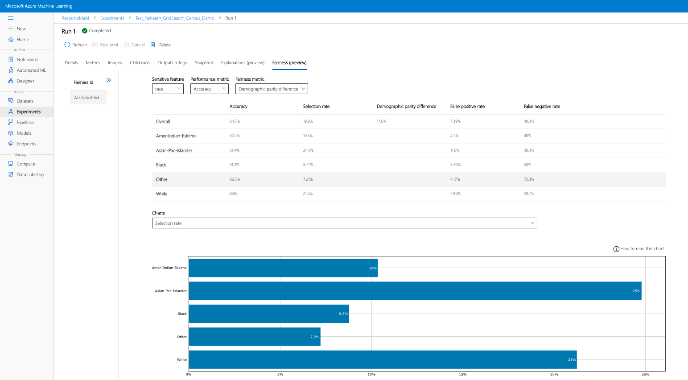
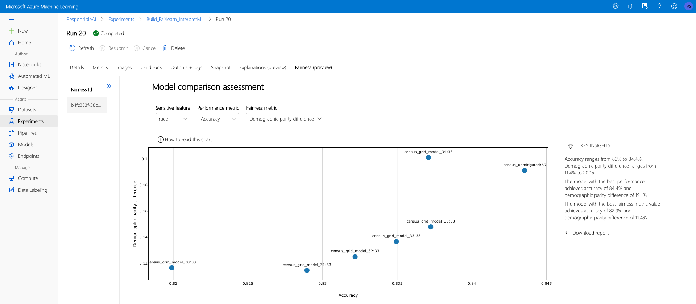

# Use Azure Machine Learning with the Fairlearn open-source package to assess the fairness of ML models (preview)

[!INCLUDE [sdk v1](../includes/machine-learning-sdk-v1.md)]

In this how-to guide, you will learn to use the [Fairlearn](https://fairlearn.github.io/) open-source Python package with Azure Machine Learning to perform the following tasks:

* Assess the fairness of your model predictions. To learn more about fairness in machine learning, see the [fairness in machine learning article](../concept-fairness-ml.md).
* Upload, list and download fairness assessment insights to/from Azure Machine Learning studio.
* See a fairness assessment dashboard in Azure Machine Learning studio to interact with your model(s)' fairness insights.

>[!NOTE]
> Fairness assessment is not a purely technical exercise. **This package can help you assess the fairness of a machine learning model, but only you can configure and make decisions as to how the model performs.**  While this package helps to identify quantitative metrics to assess fairness, developers of machine learning models must also perform a qualitative analysis to evaluate the fairness of their own models.

[!INCLUDE [machine-learning-preview-generic-disclaimer](../includes/machine-learning-preview-generic-disclaimer.md)]

## Azure Machine Learning Fairness SDK 

The Azure Machine Learning Fairness SDK, `azureml-contrib-fairness`, integrates the open-source Python package, [Fairlearn](http://fairlearn.github.io),
within Azure Machine Learning. To learn more about Fairlearn's integration within Azure Machine Learning, check out these [sample notebooks](https://github.com/Azure/MachineLearningNotebooks/tree/master/contrib/fairness). For more information on Fairlearn, see the [example guide](https://fairlearn.org/main/auto_examples/) and [sample notebooks](https://github.com/fairlearn/fairlearn/blob/main/docs/contributor_guide/contributing_example_notebooks.rst). 

Use the following commands to install the `azureml-contrib-fairness` and `fairlearn` packages:
```bash
pip install azureml-contrib-fairness
pip install fairlearn==0.4.6
```
Later versions of Fairlearn should also work in the following example code.


## Upload fairness insights for a single model

The following example shows how to use the fairness package. We will upload model fairness insights into Azure Machine Learning and see the fairness assessment dashboard in Azure Machine Learning studio.

1. Train a sample model in Jupyter Notebook. 

    For the dataset, we use the well-known adult census dataset, which we fetch from OpenML. We pretend we have a loan decision problem with the label indicating whether an individual repaid a previous loan. We will train a model to predict if previously unseen individuals will repay a loan. Such a model might be used in making loan decisions.

    ```python
    import copy
    import numpy as np
    import pandas as pd

    from sklearn.compose import ColumnTransformer
    from sklearn.datasets import fetch_openml
    from sklearn.impute import SimpleImputer
    from sklearn.linear_model import LogisticRegression
    from sklearn.model_selection import train_test_split
    from sklearn.preprocessing import StandardScaler, OneHotEncoder
    from sklearn.compose import make_column_selector as selector
    from sklearn.pipeline import Pipeline
    
    from raiwidgets import FairnessDashboard

    # Load the census dataset
    data = fetch_openml(data_id=1590, as_frame=True)
    X_raw = data.data
    y = (data.target == ">50K") * 1
    
    # (Optional) Separate the "sex" and "race" sensitive features out and drop them from the main data prior to training your model
    X_raw = data.data
    y = (data.target == ">50K") * 1
    A = X_raw[["race", "sex"]]
    X = X_raw.drop(labels=['sex', 'race'],axis = 1)
    
    # Split the data in "train" and "test" sets
    (X_train, X_test, y_train, y_test, A_train, A_test) = train_test_split(
        X_raw, y, A, test_size=0.3, random_state=12345, stratify=y
    )

    # Ensure indices are aligned between X, y and A,
    # after all the slicing and splitting of DataFrames
    # and Series
    X_train = X_train.reset_index(drop=True)
    X_test = X_test.reset_index(drop=True)
    y_train = y_train.reset_index(drop=True)
    y_test = y_test.reset_index(drop=True)
    A_train = A_train.reset_index(drop=True)
    A_test = A_test.reset_index(drop=True)

    # Define a processing pipeline. This happens after the split to avoid data leakage
    numeric_transformer = Pipeline(
        steps=[
            ("impute", SimpleImputer()),
            ("scaler", StandardScaler()),
        ]
    )
    categorical_transformer = Pipeline(
        [
            ("impute", SimpleImputer(strategy="most_frequent")),
            ("ohe", OneHotEncoder(handle_unknown="ignore")),
        ]
    )
    preprocessor = ColumnTransformer(
        transformers=[
            ("num", numeric_transformer, selector(dtype_exclude="category")),
            ("cat", categorical_transformer, selector(dtype_include="category")),
        ]
    )

    # Put an estimator onto the end of the pipeline
    lr_predictor = Pipeline(
        steps=[
            ("preprocessor", copy.deepcopy(preprocessor)),
            (
                "classifier",
                LogisticRegression(solver="liblinear", fit_intercept=True),
            ),
        ]
    )

    # Train the model on the test data
    lr_predictor.fit(X_train, y_train)

    # (Optional) View this model in the fairness dashboard, and see the disparities which appear:
    from raiwidgets import FairnessDashboard
    FairnessDashboard(sensitive_features=A_test,
                      y_true=y_test,
                      y_pred={"lr_model": lr_predictor.predict(X_test)})
    ```

2. Log into Azure Machine Learning and register your model.
   
    The fairness dashboard can integrate with registered or unregistered models. Register your model in Azure Machine Learning with the following steps:
    ```python
    from azureml.core import Workspace, Experiment, Model
    import joblib
    import os
    
    ws = Workspace.from_config()
    ws.get_details()

    os.makedirs('models', exist_ok=True)
    
    # Function to register models into Azure Machine Learning
    def register_model(name, model):
        print("Registering ", name)
        model_path = "models/{0}.pkl".format(name)
        joblib.dump(value=model, filename=model_path)
        registered_model = Model.register(model_path=model_path,
                                        model_name=name,
                                        workspace=ws)
        print("Registered ", registered_model.id)
        return registered_model.id

    # Call the register_model function 
    lr_reg_id = register_model("fairness_logistic_regression", lr_predictor)
    ```

3. Precompute fairness metrics.

    Create a dashboard dictionary using Fairlearn's `metrics` package. The `_create_group_metric_set` method has arguments similar to the Dashboard constructor, except that the sensitive features are passed as a dictionary (to ensure that names are available). We must also specify the type of prediction (binary classification in this case) when calling this method.

    ```python
    #  Create a dictionary of model(s) you want to assess for fairness 
    sf = { 'Race': A_test.race, 'Sex': A_test.sex}
    ys_pred = { lr_reg_id:lr_predictor.predict(X_test) }
    from fairlearn.metrics._group_metric_set import _create_group_metric_set

    dash_dict = _create_group_metric_set(y_true=y_test,
                                        predictions=ys_pred,
                                        sensitive_features=sf,
                                        prediction_type='binary_classification')
    ```
4. Upload the precomputed fairness metrics.
    
    Now, import `azureml.contrib.fairness` package to perform the upload:

    ```python
    from azureml.contrib.fairness import upload_dashboard_dictionary, download_dashboard_by_upload_id
    ```
    Create an Experiment, then a Run, and upload the dashboard to it:
    ```python
    exp = Experiment(ws, "Test_Fairness_Census_Demo")
    print(exp)

    run = exp.start_logging()

    # Upload the dashboard to Azure Machine Learning
    try:
        dashboard_title = "Fairness insights of Logistic Regression Classifier"
        # Set validate_model_ids parameter of upload_dashboard_dictionary to False if you have not registered your model(s)
        upload_id = upload_dashboard_dictionary(run,
                                                dash_dict,
                                                dashboard_name=dashboard_title)
        print("\nUploaded to id: {0}\n".format(upload_id))
        
        # To test the dashboard, you can download it back and ensure it contains the right information
        downloaded_dict = download_dashboard_by_upload_id(run, upload_id)
    finally:
        run.complete()
    ```
5. Check the fairness dashboard from Azure Machine Learning studio

    If you complete the previous steps (uploading generated fairness insights to Azure Machine Learning), you can view the fairness dashboard in [Azure Machine Learning studio](https://ml.azure.com). This dashboard is the same visualization dashboard provided in Fairlearn, enabling you to analyze the disparities among your sensitive feature's subgroups (e.g., male vs. female).
    Follow one of these paths to access the visualization dashboard in Azure Machine Learning studio:

    * **Jobs pane (Preview)**
    1. Select **Jobs** in the left pane to see a list of experiments that you've run on Azure Machine Learning.
    1. Select a particular experiment to view all the runs in that experiment.
    1. Select a run, and then the **Fairness** tab to the explanation visualization dashboard.
    1. Once landing on the **Fairness** tab, click on a **fairness id** from the menu on the right.
    1. Configure your dashboard by selecting your sensitive attribute, performance metric, and fairness metric of interest to land on the fairness assessment page.
    1. Switch chart type from one to another to observe both **allocation** harms and **quality of service** harms.


    [](./media/how-to-machine-learning-fairness-aml/dashboard-1.png#lightbox)
    
    [](./media/how-to-machine-learning-fairness-aml/dashboard-2.png#lightbox)
    * **Models pane**
    1. If you registered your original model by following the previous steps, you can select **Models** in the left pane to view it.
    1. Select a model, and then the **Fairness** tab to view the explanation visualization dashboard.

    To learn more about the visualization dashboard and what it contains, check out Fairlearn's [user guide](https://fairlearn.org/main/user_guide/assessment/index.html#fairlearn-dashboard).

## Upload fairness insights for multiple models

To compare multiple models and see how their fairness assessments differ, you can pass more than one model to the visualization dashboard and compare their performance-fairness trade-offs.

1. Train your models:
    
    We now create a second classifier, based on a Support Vector Machine estimator, and upload a fairness dashboard dictionary using Fairlearn's `metrics` package. We assume that the previously trained model is still available.


    ```python
    # Put an SVM predictor onto the preprocessing pipeline
    from sklearn import svm
    svm_predictor = Pipeline(
        steps=[
            ("preprocessor", copy.deepcopy(preprocessor)),
            (
                "classifier",
                svm.SVC(),
            ),
        ]
    )

    # Train your second classification model
    svm_predictor.fit(X_train, y_train)
    ```

2. Register your models

    Next register both models within Azure Machine Learning. For convenience, store the results in a dictionary, which maps the `id` of the registered model (a string in `name:version` format) to the predictor itself:

    ```python
    model_dict = {}

    lr_reg_id = register_model("fairness_logistic_regression", lr_predictor)
    model_dict[lr_reg_id] = lr_predictor

    svm_reg_id = register_model("fairness_svm", svm_predictor)
    model_dict[svm_reg_id] = svm_predictor
    ```

3. Load the Fairness dashboard locally

    Before uploading the fairness insights into Azure Machine Learning, you can examine these predictions in a locally invoked Fairness dashboard. 


    ```python
    #  Generate models' predictions and load the fairness dashboard locally 
    ys_pred = {}
    for n, p in model_dict.items():
        ys_pred[n] = p.predict(X_test)

    from raiwidgets import FairnessDashboard

    FairnessDashboard(sensitive_features=A_test,
                      y_true=y_test.tolist(),
                      y_pred=ys_pred)
    ```

3. Precompute fairness metrics.

    Create a dashboard dictionary using Fairlearn's `metrics` package.

    ```python
    sf = { 'Race': A_test.race, 'Sex': A_test.sex }

    from fairlearn.metrics._group_metric_set import _create_group_metric_set

    dash_dict = _create_group_metric_set(y_true=Y_test,
                                        predictions=ys_pred,
                                        sensitive_features=sf,
                                        prediction_type='binary_classification')
    ```
4. Upload the precomputed fairness metrics.
    
    Now, import `azureml.contrib.fairness` package to perform the upload:

    ```python
    from azureml.contrib.fairness import upload_dashboard_dictionary, download_dashboard_by_upload_id
    ```
    Create an Experiment, then a Run, and upload the dashboard to it:
    ```python
    exp = Experiment(ws, "Compare_Two_Models_Fairness_Census_Demo")
    print(exp)

    run = exp.start_logging()

    # Upload the dashboard to Azure Machine Learning
    try:
        dashboard_title = "Fairness Assessment of Logistic Regression and SVM Classifiers"
        # Set validate_model_ids parameter of upload_dashboard_dictionary to False if you have not registered your model(s)
        upload_id = upload_dashboard_dictionary(run,
                                                dash_dict,
                                                dashboard_name=dashboard_title)
        print("\nUploaded to id: {0}\n".format(upload_id))
        
        # To test the dashboard, you can download it back and ensure it contains the right information
        downloaded_dict = download_dashboard_by_upload_id(run, upload_id)
    finally:
        run.complete()
    ```


    Similar to the previous section, you can follow one of the paths described above (via **Experiments** or **Models**) in Azure Machine Learning studio to access the visualization dashboard and compare the two models in terms of fairness and performance.


## Upload unmitigated and mitigated fairness insights

You can use Fairlearn's [mitigation algorithms](https://fairlearn.org/main/user_guide/mitigation/index.html), compare their generated mitigated model(s) to the original unmitigated model, and navigate the performance/fairness trade-offs among compared models.

To see an example that demonstrates the use of the [Grid Search](https://fairlearn.org/v0.7.0/api_reference/fairlearn.reductions.html#fairlearn.reductions.GridSearch) mitigation algorithm (which creates a collection of mitigated models with different fairness and performance trade offs) check out this [sample notebook](https://github.com/Azure/MachineLearningNotebooks/blob/master/contrib/fairness/fairlearn-azureml-mitigation.ipynb). 

Uploading multiple models' fairness insights in a single Run allows for comparison of models with respect to fairness and performance. You can click on any of the models displayed in the model comparison chart to see the detailed fairness insights of the particular model.


[](./media/how-to-machine-learning-fairness-aml/multi-model-dashboard.png#lightbox)
    

## Next steps

[Learn more about model fairness](../concept-fairness-ml.md)

[Check out Azure Machine Learning Fairness sample notebooks](https://github.com/Azure/MachineLearningNotebooks/tree/master/contrib/fairness)
