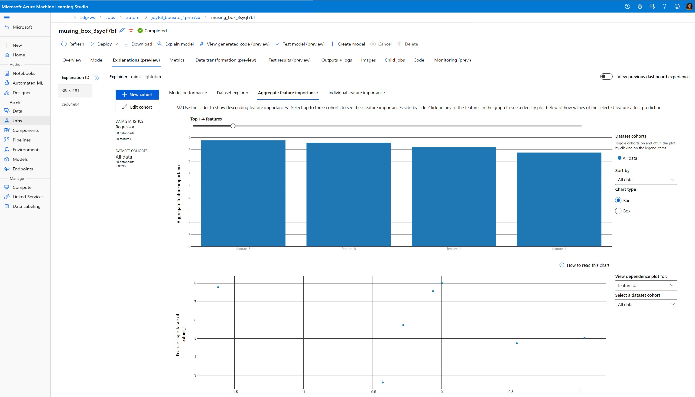

# Interpretability: Model explainability in automated ML (preview)

[!INCLUDE [sdk v1](../includes/machine-learning-sdk-v1.md)]

In this article, you learn how to get explanations for automated machine learning (automated ML) models in Azure Machine Learning using the Python SDK. Automated ML helps you understand feature importance of the models that are generated. 

All SDK versions after 1.0.85 set `model_explainability=True` by default. In SDK version 1.0.85 and earlier versions users need to set `model_explainability=True` in the `AutoMLConfig` object in order to use model interpretability. 


In this article, you learn how to:

- Perform interpretability during training for best model or any model.
- Enable visualizations to help you see patterns in data and explanations.
- Implement interpretability during inference or scoring.

## Prerequisites

- Interpretability features. Run `pip install azureml-interpret` to get the necessary package.
- Knowledge of building automated ML experiments. For more information on how to use the Azure Machine Learning SDK, complete this [object detection model tutorial](../tutorial-auto-train-image-models.md) or see how to [configure automated ML experiments](../how-to-configure-auto-train.md).

[!INCLUDE [disclaimer](../includes/machine-learning-preview-generic-disclaimer.md)]

## Interpretability during training for the best model

Retrieve the explanation from the `best_run`, which includes explanations for both raw and engineered features.

> [!NOTE]
> Interpretability, model explanation, is not available for the TCNForecaster model recommended by Auto ML forecasting experiments.

### Download the engineered feature importances from the best run

You can use `ExplanationClient` to download the engineered feature explanations from the artifact store of the `best_run`. 

```python
from azureml.interpret import ExplanationClient

client = ExplanationClient.from_run(best_run)
engineered_explanations = client.download_model_explanation(raw=False)
print(engineered_explanations.get_feature_importance_dict())
```

### Download the raw feature importances from the best run

You can use `ExplanationClient` to download the raw feature explanations from the artifact store of the `best_run`.

```python
from azureml.interpret import ExplanationClient

client = ExplanationClient.from_run(best_run)
raw_explanations = client.download_model_explanation(raw=True)
print(raw_explanations.get_feature_importance_dict())
```

## Interpretability during training for any model 

When you compute model explanations and visualize them, you're not limited to an existing model explanation for an AutoML model. You can also get an explanation for your model with different test data. The steps in this section show you how to compute and visualize engineered feature importance based on your test data.

### Retrieve any other AutoML model from training

```python
automl_run, fitted_model = local_run.get_output(metric='accuracy')
```

### Set up the model explanations

Use `automl_setup_model_explanations` to get the engineered and raw explanations. The `fitted_model` can generate the following items:

- Featured data from trained or test samples
- Engineered feature name lists
- Findable classes in your labeled column in classification scenarios

The `automl_explainer_setup_obj` contains all the structures from above list.

```python
from azureml.train.automl.runtime.automl_explain_utilities import automl_setup_model_explanations

automl_explainer_setup_obj = automl_setup_model_explanations(fitted_model, X=X_train, 
                                                             X_test=X_test, y=y_train, 
                                                             task='classification')
```

### Initialize the Mimic Explainer for feature importance

To generate an explanation for automated ML models, use the `MimicWrapper` class. You can initialize the MimicWrapper with these parameters:

- The explainer setup object
- Your workspace
- A surrogate model to explain the `fitted_model` automated ML model

The MimicWrapper also takes the `automl_run` object where the engineered explanations will be uploaded.

```python
from azureml.interpret import MimicWrapper

# Initialize the Mimic Explainer
explainer = MimicWrapper(ws, automl_explainer_setup_obj.automl_estimator,
                         explainable_model=automl_explainer_setup_obj.surrogate_model, 
                         init_dataset=automl_explainer_setup_obj.X_transform, run=automl_run,
                         features=automl_explainer_setup_obj.engineered_feature_names, 
                         feature_maps=[automl_explainer_setup_obj.feature_map],
                         classes=automl_explainer_setup_obj.classes,
                         explainer_kwargs=automl_explainer_setup_obj.surrogate_model_params)
```

### Use Mimic Explainer for computing and visualizing engineered feature importance

You can call the `explain()` method in MimicWrapper with the transformed test samples to get the feature importance for the generated engineered features. You can also sign in to [Azure Machine Learning studio](https://ml.azure.com/) to view the explanations dashboard visualization of the feature importance values of the generated engineered features by automated ML featurizers.

```python
engineered_explanations = explainer.explain(['local', 'global'], eval_dataset=automl_explainer_setup_obj.X_test_transform)
print(engineered_explanations.get_feature_importance_dict())
```
For models trained with automated ML, you can get the best model using the `get_output()` method and compute explanations locally.  You can visualize the explanation results with `ExplanationDashboard` from the `raiwidgets` package.

```python
best_run, fitted_model = remote_run.get_output()

from azureml.train.automl.runtime.automl_explain_utilities import AutoMLExplainerSetupClass, automl_setup_model_explanations
automl_explainer_setup_obj = automl_setup_model_explanations(fitted_model, X=X_train,
                                                             X_test=X_test, y=y_train,
                                                             task='regression')

from interpret.ext.glassbox import LGBMExplainableModel
from azureml.interpret.mimic_wrapper import MimicWrapper

explainer = MimicWrapper(ws, automl_explainer_setup_obj.automl_estimator, LGBMExplainableModel,
                         init_dataset=automl_explainer_setup_obj.X_transform, run=best_run,
                         features=automl_explainer_setup_obj.engineered_feature_names,
                         feature_maps=[automl_explainer_setup_obj.feature_map],
                         classes=automl_explainer_setup_obj.classes)
                         
pip install interpret-community[visualization]

engineered_explanations = explainer.explain(['local', 'global'], eval_dataset=automl_explainer_setup_obj.X_test_transform)
print(engineered_explanations.get_feature_importance_dict()),
from raiwidgets import ExplanationDashboard
ExplanationDashboard(engineered_explanations, automl_explainer_setup_obj.automl_estimator, datasetX=automl_explainer_setup_obj.X_test_transform)

 

raw_explanations = explainer.explain(['local', 'global'], get_raw=True,
                                     raw_feature_names=automl_explainer_setup_obj.raw_feature_names,
                                     eval_dataset=automl_explainer_setup_obj.X_test_transform)
print(raw_explanations.get_feature_importance_dict()),
from raiwidgets import ExplanationDashboard
ExplanationDashboard(raw_explanations, automl_explainer_setup_obj.automl_pipeline, datasetX=automl_explainer_setup_obj.X_test_raw)
```

### Use Mimic Explainer for computing and visualizing raw feature importance

You can call the `explain()` method in MimicWrapper with the transformed test samples to get the feature importance for the raw features. In the [Machine Learning studio](https://ml.azure.com/), you can view the dashboard visualization of the feature importance values of the raw features.

```python
raw_explanations = explainer.explain(['local', 'global'], get_raw=True,
                                     raw_feature_names=automl_explainer_setup_obj.raw_feature_names,
                                     eval_dataset=automl_explainer_setup_obj.X_test_transform,
                                     raw_eval_dataset=automl_explainer_setup_obj.X_test_raw)
print(raw_explanations.get_feature_importance_dict())
```

## Interpretability during inference

In this section, you learn how to operationalize an automated ML model with the explainer that was used to compute the explanations in the previous section.

### Register the model and the scoring explainer

Use the `TreeScoringExplainer` to create the scoring explainer that'll compute the engineered feature importance values at inference time. You initialize the scoring explainer with the `feature_map` that was computed previously. 

Save the scoring explainer, and then register the model and the scoring explainer with the Model Management Service. Run the following code:

```python
from azureml.interpret.scoring.scoring_explainer import TreeScoringExplainer, save

# Initialize the ScoringExplainer
scoring_explainer = TreeScoringExplainer(explainer.explainer, feature_maps=[automl_explainer_setup_obj.feature_map])

# Pickle scoring explainer locally
save(scoring_explainer, exist_ok=True)

# Register trained automl model present in the 'outputs' folder in the artifacts
original_model = automl_run.register_model(model_name='automl_model', 
                                           model_path='outputs/model.pkl')

# Register scoring explainer
automl_run.upload_file('scoring_explainer.pkl', 'scoring_explainer.pkl')
scoring_explainer_model = automl_run.register_model(model_name='scoring_explainer', model_path='scoring_explainer.pkl')
```

### Create the conda dependencies for setting up the service

Next, create the necessary environment dependencies in the container for the deployed model. Please note that azureml-defaults with version >= 1.0.45 must be listed as a pip dependency, because it contains the functionality needed to host the model as a web service.

```python
from azureml.core.conda_dependencies import CondaDependencies

azureml_pip_packages = [
    'azureml-interpret', 'azureml-train-automl', 'azureml-defaults'
]

myenv = CondaDependencies.create(conda_packages=['scikit-learn', 'pandas', 'numpy', 'py-xgboost<=0.80'],
                                 pip_packages=azureml_pip_packages,
                                 pin_sdk_version=True)

with open("myenv.yml","w") as f:
    f.write(myenv.serialize_to_string())

with open("myenv.yml","r") as f:
    print(f.read())

```

### Create the scoring script

Write a script that loads your model and produces predictions and explanations based on a new batch of data.

```python
%%writefile score.py
import joblib
import pandas as pd
from azureml.core.model import Model
from azureml.train.automl.runtime.automl_explain_utilities import automl_setup_model_explanations


def init():
    global automl_model
    global scoring_explainer

    # Retrieve the path to the model file using the model name
    # Assume original model is named automl_model
    automl_model_path = Model.get_model_path('automl_model')
    scoring_explainer_path = Model.get_model_path('scoring_explainer')

    automl_model = joblib.load(automl_model_path)
    scoring_explainer = joblib.load(scoring_explainer_path)


def run(raw_data):
    data = pd.read_json(raw_data, orient='records')
    # Make prediction
    predictions = automl_model.predict(data)
    # Setup for inferencing explanations
    automl_explainer_setup_obj = automl_setup_model_explanations(automl_model,
                                                                 X_test=data, task='classification')
    # Retrieve model explanations for engineered explanations
    engineered_local_importance_values = scoring_explainer.explain(automl_explainer_setup_obj.X_test_transform)
    # Retrieve model explanations for raw explanations
    raw_local_importance_values = scoring_explainer.explain(automl_explainer_setup_obj.X_test_transform, get_raw=True)
    # You can return any data type as long as it is JSON-serializable
    return {'predictions': predictions.tolist(),
            'engineered_local_importance_values': engineered_local_importance_values,
            'raw_local_importance_values': raw_local_importance_values}
```

### Deploy the service

Deploy the service using the conda file and the scoring file from the previous steps.

```python
from azureml.core.webservice import Webservice
from azureml.core.webservice import AciWebservice
from azureml.core.model import Model, InferenceConfig
from azureml.core.environment import Environment

aciconfig = AciWebservice.deploy_configuration(cpu_cores=1,
                                               memory_gb=1,
                                               tags={"data": "Bank Marketing",  
                                                     "method" : "local_explanation"},
                                               description='Get local explanations for Bank marketing test data')
myenv = Environment.from_conda_specification(name="myenv", file_path="myenv.yml")
inference_config = InferenceConfig(entry_script="score_local_explain.py", environment=myenv)

# Use configs and models generated above
service = Model.deploy(ws,
                       'model-scoring',
                       [scoring_explainer_model, original_model],
                       inference_config,
                       aciconfig)
service.wait_for_deployment(show_output=True)
```

### Inference with test data

Inference with some test data to see the predicted value from AutoML model, currently supported only in Azure Machine Learning SDK. View the feature importances contributing towards a predicted value. 

```python
if service.state == 'Healthy':
    # Serialize the first row of the test data into json
    X_test_json = X_test[:1].to_json(orient='records')
    print(X_test_json)
    # Call the service to get the predictions and the engineered explanations
    output = service.run(X_test_json)
    # Print the predicted value
    print(output['predictions'])
    # Print the engineered feature importances for the predicted value
    print(output['engineered_local_importance_values'])
    # Print the raw feature importances for the predicted value
    print('raw_local_importance_values:\n{}\n'.format(output['raw_local_importance_values']))
```

## Visualize to discover patterns in data and explanations at training time

You can visualize the feature importance chart in your workspace in [Azure Machine Learning studio](https://ml.azure.com). After your AutoML run is complete, select **View model details** to view a specific run. Select the **Explanations** tab to see the visualizations in  the explanation dashboard.

[](./media/how-to-machine-learning-interpretability-automl/automl-explanation.png#lightbox)

For more information on the explanation dashboard visualizations and specific plots, please refer to the [how-to doc on interpretability](how-to-machine-learning-interpretability-aml.md).

## Next steps

For more information about how you can enable model explanations and feature importance in areas other than automated ML, see [more techniques for model interpretability](../how-to-machine-learning-interpretability.md).
