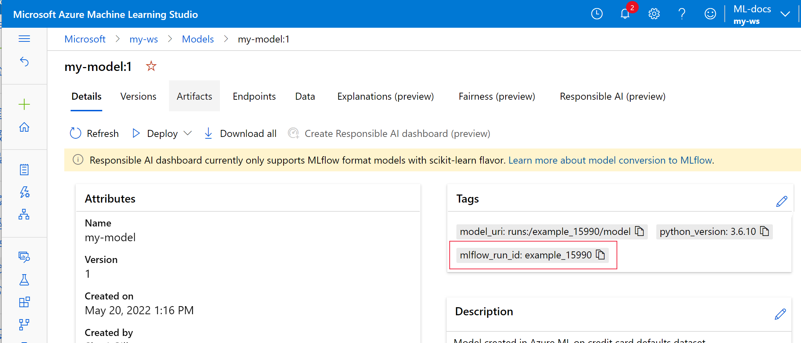
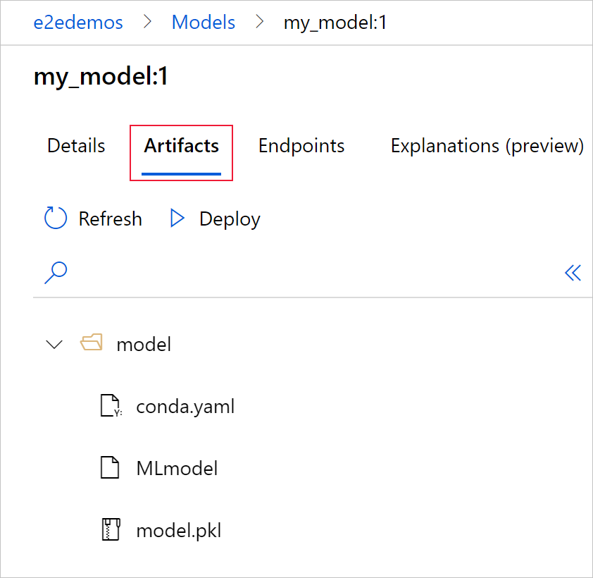
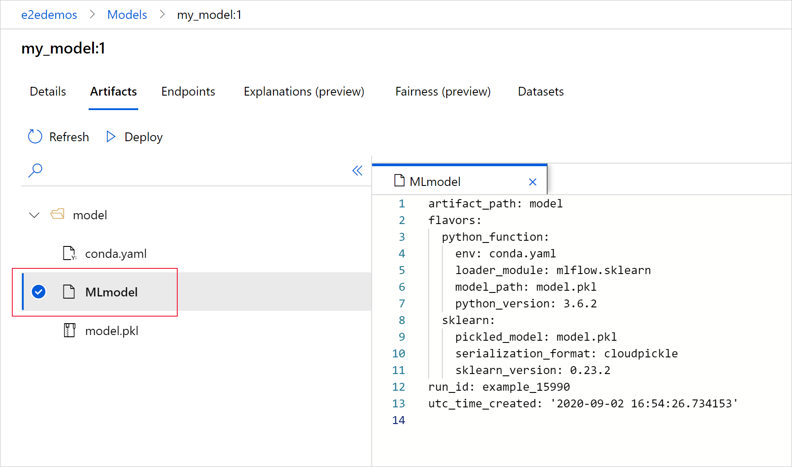

# Track ML models with MLflow and Azure Machine Learning 

[!INCLUDE [sdk v1](../includes/machine-learning-sdk-v1.md)]

In this article, learn how to enable [MLflow Tracking](https://mlflow.org/docs/latest/quickstart.html#using-the-tracking-api) to connect Azure Machine Learning as the backend of your MLflow experiments.

[MLflow](https://www.mlflow.org) is an open-source library for managing the lifecycle of your machine learning experiments. MLflow Tracking is a component of MLflow that logs and tracks your training run metrics and model artifacts, no matter your experiment's environment--locally on your computer, on a remote compute target, a virtual machine, or an [Azure Databricks cluster](../how-to-use-mlflow-azure-databricks.md).

See [MLflow and Azure Machine Learning](../concept-mlflow.md) for all supported MLflow and Azure Machine Learning functionality including MLflow Project support (preview) and model deployment.
 
> [!Tip] 
> If you want to track experiments running on Azure Databricks or Azure Synapse Analytics, see the dedicated articles [Track Azure Databricks ML experiments with MLflow and Azure Machine Learning](../how-to-use-mlflow-azure-databricks.md) or [Track Azure Synapse Analytics ML experiments with MLflow and Azure Machine Learning](../how-to-use-mlflow-azure-synapse.md).

> [!NOTE]
> The information in this document is primarily for data scientists and developers who want to monitor the model training process. If you are an administrator interested in monitoring resource usage and events from Azure Machine Learning, such as quotas, completed training jobs, or completed model deployments, see [Monitoring Azure Machine Learning](../monitor-azure-machine-learning.md).

## Prerequisites

* Install the `mlflow` package. 
    * You can use the [MLflow Skinny](https://github.com/mlflow/mlflow/blob/master/README_SKINNY.rst) which is a lightweight MLflow package without SQL storage, server, UI, or data science dependencies. This is recommended for users who primarily need the tracking and logging capabilities without importing the full suite of MLflow features including deployments.

* Install the `azureml-mlflow` package. 
* [Create an Azure Machine Learning Workspace](../quickstart-create-resources.md).
    * See which [access permissions you need to perform your MLflow operations with your workspace](../how-to-assign-roles.md#mlflow-operations).

* Install and [set up Azure Machine Learning CLI (v1)](reference-azure-machine-learning-cli.md) and make sure you install the ml extension.

    [!INCLUDE [cli v1 deprecation](../includes/machine-learning-cli-v1-deprecation.md)]

* Install and set up [Azure Machine Learning SDK for Python](introduction.md#sdk-v1).

## Track runs from your local machine or remote compute

Tracking using MLflow with Azure Machine Learning lets you store the logged metrics and artifacts runs that were executed on your local machine into your Azure Machine Learning workspace.

### Set up tracking environment

To track a run that is not running on Azure Machine Learning compute (from now on referred to as *"local compute"*), you need to point your local compute to the Azure Machine Learning MLflow Tracking URI. 

> [!NOTE]
> When running on Azure Compute (Azure Notebooks, Jupyter Notebooks hosted on Azure Compute Instances or Compute Clusters) you don't have to configure the tracking URI. It's automatically configured for you.

# [Using the Azure Machine Learning SDK](#tab/azuremlsdk)

[!INCLUDE [sdk v1](../includes/machine-learning-sdk-v1.md)]

You can get the Azure Machine Learning MLflow tracking URI using the [Azure Machine Learning SDK v1 for Python](introduction.md#sdk-v1). Ensure you have the library `azureml-sdk` installed in the cluster you are using. The following sample gets the unique MLFLow tracking URI associated with your workspace. Then the method [`set_tracking_uri()`](https://mlflow.org/docs/latest/python_api/mlflow.html#mlflow.set_tracking_uri) points the MLflow tracking URI to that URI.

1. Using the workspace configuration file:

    ```Python
    from azureml.core import Workspace
    import mlflow
    
    ws = Workspace.from_config()
    mlflow.set_tracking_uri(ws.get_mlflow_tracking_uri())
    ```

    > [!TIP]
    > You can download the workspace configuration file by:
    > 1. Navigate to [Azure Machine Learning studio](https://ml.azure.com)
    > 2. Click on the uper-right corner of the page -> Download config file.
    > 3. Save the file `config.json` in the same directory where you are working on.

1. Using the subscription ID, resource group name and workspace name:

    ```Python
    from azureml.core import Workspace
    import mlflow

    #Enter details of your Azure Machine Learning workspace
    subscription_id = '<SUBSCRIPTION_ID>'
    resource_group = '<RESOURCE_GROUP>'
    workspace_name = '<AZUREML_WORKSPACE_NAME>'

    ws = Workspace.get(name=workspace_name,
                       subscription_id=subscription_id,
                       resource_group=resource_group)

    mlflow.set_tracking_uri(ws.get_mlflow_tracking_uri())
    ```

# [Using an environment variable](#tab/environ)

[!INCLUDE [cli v1](../includes/machine-learning-cli-v1.md)]

Another option is to set one of the MLflow environment variables [MLFLOW_TRACKING_URI](https://mlflow.org/docs/latest/tracking.html#logging-to-a-tracking-server) directly in your terminal. 

```Azure CLI
export MLFLOW_TRACKING_URI=$(az ml workspace show --query mlflow_tracking_uri | sed 's/"//g') 
```

>[!IMPORTANT]
> Make sure you are logged in to your Azure account on your local machine, otherwise the tracking URI returns an empty string. If you are using any Azure Machine Learning compute the tracking environment and experiment name is already configured.

# [Building the MLflow tracking URI](#tab/build)

The Azure Machine Learning Tracking URI can be constructed using the subscription ID, region of where the resource is deployed, resource group name and workspace name. The following code sample shows how:

```python
import mlflow

region = ""
subscription_id = ""
resource_group = ""
workspace_name = ""

azureml_mlflow_uri = f"azureml://{region}.api.azureml.ms/mlflow/v1.0/subscriptions/{subscription_id}/resourceGroups/{resource_group}/providers/Microsoft.MachineLearningServices/workspaces/{workspace_name}"
mlflow.set_tracking_uri(azureml_mlflow_uri)
```

> [!NOTE]
> You can also get this URL by: 
> 1. Navigate to [Azure Machine Learning studio](https://ml.azure.com)
> 2. Click on the uper-right corner of the page -> View all properties in Azure Portal -> MLflow tracking URI.
> 3. Copy the URI and use it with the method `mlflow.set_tracking_uri`.

---

### Set experiment name

All MLflow runs are logged to the active experiment. By default, runs are logged to an experiment named `Default` that is automatically created for you. To configure the experiment you want to work on use MLflow command [`mlflow.set_experiment()`](https://mlflow.org/docs/latest/python_api/mlflow.html#mlflow.set_experiment).
    
```Python
experiment_name = 'experiment_with_mlflow'
mlflow.set_experiment(experiment_name)
```

> [!TIP]
> When submitting jobs using Azure Machine Learning SDK, you can set the experiment name using the property `experiment_name` when you submit it. You don't have to configure it on your training script.

### Start training run

After you set the MLflow experiment name, you can start your training run with `start_run()`. Then use `log_metric()` to activate the MLflow logging API and begin logging your training run metrics.

```Python
import os
from random import random

with mlflow.start_run() as mlflow_run:
    mlflow.log_param("hello_param", "world")
    mlflow.log_metric("hello_metric", random())
    os.system(f"echo 'hello world' > helloworld.txt")
    mlflow.log_artifact("helloworld.txt")
```

For details about how to log metrics, parameters and artifacts in a run using MLflow view [How to log and view metrics](how-to-log-view-metrics.md).

## Track runs running on Azure Machine Learning

[!INCLUDE [sdk v1](../includes/machine-learning-sdk-v1.md)]

Remote runs (jobs) let you train your models in a more robust and repetitive way. They can also leverage more powerful computes, such as Machine Learning Compute clusters. See [Use compute targets for model training](how-to-set-up-training-targets.md) to learn about different compute options.

When submitting runs, Azure Machine Learning automatically configures MLflow to work with the workspace the run is running in. This means that there is no need to configure the MLflow tracking URI. On top of that, experiments are automatically named based on the details of the experiment submission.

> [!IMPORTANT]
> When submitting training jobs to Azure Machine Learning, you don't have to configure the MLflow tracking URI on your training logic as it is already configured for you. You don't need to configure the experiment name in your training routine neither.

### Creating a training routine

First, you should create a `src` subdirectory and create a file with your training code in a `train.py` file in the `src` subdirectory. All your training code will go into the `src` subdirectory, including `train.py`.

The training code is taken from this [MLflow example](https://github.com/Azure/azureml-examples/blob/main/cli/jobs/basics/src/hello-mlflow.py) in the Azure Machine Learning example repo. 

Copy this code into the file:

```Python
# imports
import os
import mlflow

from random import random

# define functions
def main():
    mlflow.log_param("hello_param", "world")
    mlflow.log_metric("hello_metric", random())
    os.system(f"echo 'hello world' > helloworld.txt")
    mlflow.log_artifact("helloworld.txt")


# run functions
if __name__ == "__main__":
    # run main function
    main()
```

### Configuring the experiment

You will need to use Python to submit the experiment to Azure Machine Learning. In a notebook or Python file, configure your compute and training run environment with the [`Environment`](/python/api/azureml-core/azureml.core.environment.environment) class. 

```Python
from azureml.core import Environment
from azureml.core.conda_dependencies import CondaDependencies

env = Environment(name="mlflow-env")

# Specify conda dependencies with scikit-learn and temporary pointers to mlflow extensions
cd = CondaDependencies.create(
    conda_packages=["scikit-learn", "matplotlib"],
    pip_packages=["azureml-mlflow", "pandas", "numpy"]
    )

env.python.conda_dependencies = cd
```

Then, construct  [`ScriptRunConfig`](/python/api/azureml-core/azureml.core.script_run_config.scriptrunconfig) with your remote compute as the compute target.

```Python
from azureml.core import ScriptRunConfig

src = ScriptRunConfig(source_directory="src",
                      script=training_script,
                      compute_target="<COMPUTE_NAME>",
                      environment=env)
```

With this compute and training run configuration, use the `Experiment.submit()` method to submit a run. This method automatically sets the MLflow tracking URI and directs the logging from MLflow to your Workspace.

```Python
from azureml.core import Experiment
from azureml.core import Workspace
ws = Workspace.from_config()

experiment_name = "experiment_with_mlflow"
exp = Experiment(workspace=ws, name=experiment_name)

run = exp.submit(src)
```

## View metrics and artifacts in your workspace

The metrics and artifacts from MLflow logging are tracked in your workspace. To view them anytime, navigate to your workspace and find the experiment by name in your workspace in [Azure Machine Learning studio](https://ml.azure.com).  Or run the below code. 

Retrieve run metric using MLflow [get_run()](https://mlflow.org/docs/latest/python_api/mlflow.html#mlflow.get_run).

```Python
from mlflow.tracking import MlflowClient

# Use MlFlow to retrieve the run that was just completed
client = MlflowClient()
run_id = mlflow_run.info.run_id
finished_mlflow_run = MlflowClient().get_run(run_id)

metrics = finished_mlflow_run.data.metrics
tags = finished_mlflow_run.data.tags
params = finished_mlflow_run.data.params

print(metrics,tags,params)
```

To view the artifacts of a run, you can use [MlFlowClient.list_artifacts()](https://mlflow.org/docs/latest/python_api/mlflow.tracking.html#mlflow.tracking.MlflowClient.list_artifacts)

```Python
client.list_artifacts(run_id)
```

To download an artifact to the current directory, you can use [MLFlowClient.download_artifacts()](https://www.mlflow.org/docs/latest/python_api/mlflow.tracking.html#mlflow.tracking.MlflowClient.download_artifacts)

```Python
client.download_artifacts(run_id, "helloworld.txt", ".")
```

For more details about how to retrieve information from experiments and runs in Azure Machine Learning using MLflow view [Manage experiments and runs with MLflow](../how-to-track-experiments-mlflow.md).

## Compare and query

Compare and query all MLflow runs in your Azure Machine Learning workspace with the following code. 
[Learn more about how to query runs with MLflow](https://mlflow.org/docs/latest/search-syntax.html#programmatically-searching-runs). 

```Python
from mlflow.entities import ViewType

all_experiments = [exp.experiment_id for exp in MlflowClient().list_experiments()]
query = "metrics.hello_metric > 0"
runs = mlflow.search_runs(experiment_ids=all_experiments, filter_string=query, run_view_type=ViewType.ALL)

runs.head(10)
```

## Automatic logging
With Azure Machine Learning and MLFlow, users can log metrics, model parameters and model artifacts automatically when training a model.  A [variety of popular machine learning libraries](https://mlflow.org/docs/latest/tracking.html#automatic-logging) are supported. 

To enable [automatic logging](https://mlflow.org/docs/latest/tracking.html#automatic-logging) insert the following code before your training code:

```Python
mlflow.autolog()
```

[Learn more about Automatic logging with MLflow](https://mlflow.org/docs/latest/python_api/mlflow.html#mlflow.autolog). 

## Manage models

Register and track your models with the [Azure Machine Learning model registry](concept-model-management-and-deployment.md#register-package-and-deploy-models-from-anywhere), which supports the MLflow model registry. Azure Machine Learning models are aligned with the MLflow model schema making it easy to export and import these models across different workflows. The MLflow-related metadata, such as run ID, is also tracked with the registered model for traceability. Users can submit training runs, register, and deploy models produced from MLflow runs.

If you want to deploy and register your production ready model in one step, see [Deploy and register MLflow models](how-to-deploy-mlflow-models.md).

To register and view a model from a run, use the following steps:

1. Once a run is complete, call the [`register_model()`](https://mlflow.org/docs/latest/python_api/mlflow.html#mlflow.register_model) method.

    ```Python
    # the model folder produced from a run is registered. This includes the MLmodel file, model.pkl and the conda.yaml.
    model_path = "model"
    model_uri = 'runs:/{}/{}'.format(run_id, model_path) 
    mlflow.register_model(model_uri,"registered_model_name")
    ```

1. View the registered model in your workspace with [Azure Machine Learning studio](https://ml.azure.com).

    In the following example the registered model, `my-model` has MLflow tracking metadata tagged. 

    

1. Select the **Artifacts** tab to see all the model files that align with the MLflow model schema (conda.yaml, MLmodel, model.pkl).

    

1. Select MLmodel to see the MLmodel file generated by the run.

    


## Clean up resources

If you don't plan to use the logged metrics and artifacts in your workspace, the ability to delete them individually is currently unavailable. Instead, delete the resource group that contains the storage account and workspace, so you don't incur any charges:

1. In the Azure portal, select **Resource groups** on the far left.

   

1. From the list, select the resource group you created.

1. Select **Delete resource group**.

1. Enter the resource group name. Then select **Delete**.

## Example notebooks

The [MLflow with Azure Machine Learning notebooks](https://github.com/Azure/MachineLearningNotebooks/tree/master/how-to-use-azureml/track-and-monitor-experiments/using-mlflow) demonstrate and expand upon concepts presented in this article. Also see the community-driven repository, [AzureML-Examples](https://github.com/Azure/azureml-examples).

## Next steps

* [Deploy models with MLflow](how-to-deploy-mlflow-models.md).
* Monitor your production models for [data drift](how-to-enable-data-collection.md).
* [Track Azure Databricks runs with MLflow](../how-to-use-mlflow-azure-databricks.md).
* [Manage your models](concept-model-management-and-deployment.md).
