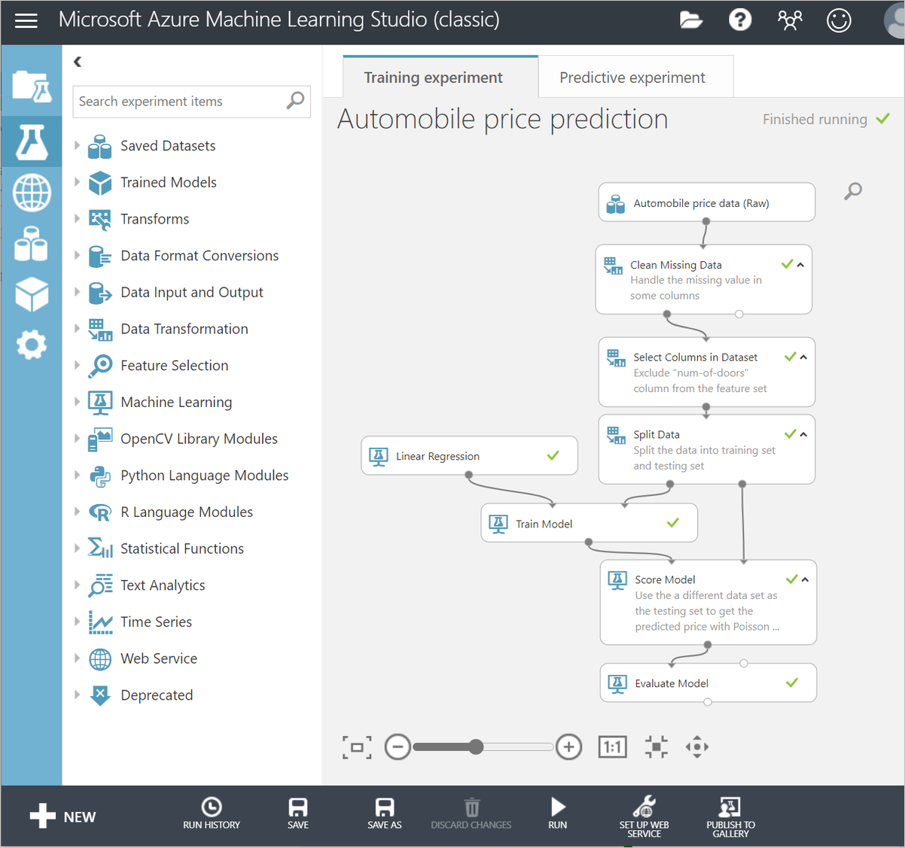
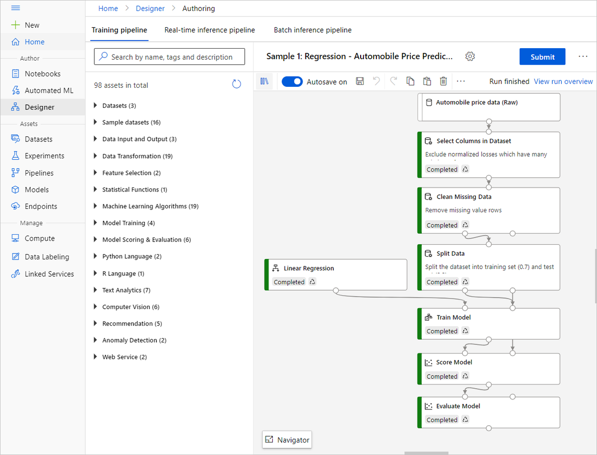
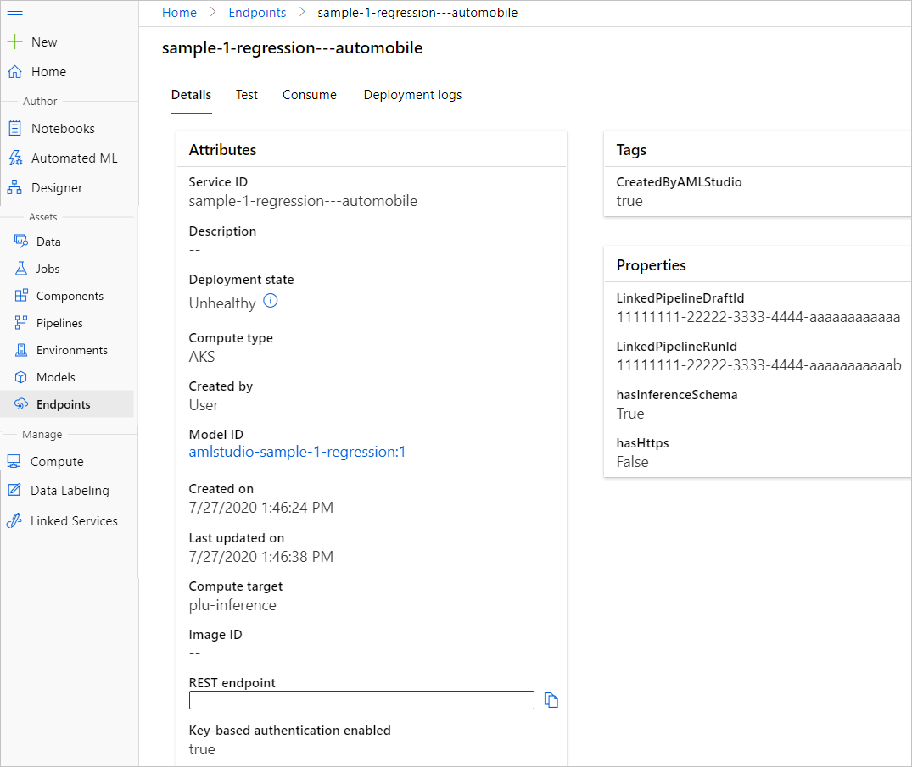

# Migrate to Azure Machine Learning from ML Studio (classic)

> [!IMPORTANT]
> Support for Machine Learning Studio (classic) will end on 31 August 2024. We recommend you transition to [Azure Machine Learning](../overview-what-is-azure-machine-learning.md) by that date.
>
> Beginning 1 December 2021, you will not be able to create new Machine Learning Studio (classic) resources. Through 31 August 2024, you can continue to use the existing Machine Learning Studio (classic) resources.  
>
> ML Studio (classic) documentation is being retired and may not be updated in the future.

Learn how to migrate from Studio (classic) to Azure Machine Learning. Azure Machine Learning provides a modernized data science platform that combines no-code and code-first approaches.

This is a guide for a basic "lift and shift" migration. If you want to optimize an existing machine learning workflow, or modernize a machine learning platform, see the [Azure Machine Learning adoption framework](https://aka.ms/mlstudio-classic-migration-repo) for additional resources including digital survey tools, worksheets, and planning templates.

Please work with your Cloud Solution Architect on the migration.

## Recommended approach

To migrate to Azure Machine Learning, we recommend the following approach:

> [!div class="checklist"]
> * Step 1: Assess Azure Machine Learning
> * Step 2: Define a strategy and plan
> * Step 3: Rebuild experiments and web services
> * Step 4: Integrate client apps
> * Step 5: Clean up Studio (classic) assets
> * Step 6: Review and expand scenarios

## Step 1: Assess Azure Machine Learning
1. Learn about [Azure Machine Learning](https://azure.microsoft.com/services/machine-learning/); its benefits, costs, and architecture.

1. Compare the capabilities of Azure Machine Learning and Studio (classic).

    >[!NOTE]
    > The **designer** feature in Azure Machine Learning provides a similar drag-and-drop experience to Studio (classic). However, Azure Machine Learning also provides robust [code-first workflows](../concept-model-management-and-deployment.md) as an alternative. This migration series focuses on the designer, since it's most similar to the Studio (classic) experience.

    The following table summarizes the key differences between ML Studio (classic) and Azure Machine Learning.

    | Feature | ML Studio (classic) | Azure Machine Learning |
    |---| --- | --- |
    | Drag and drop interface | Classic experience | Updated experience - [Azure Machine Learning designer](../concept-designer.md)| 
    | Code SDKs | Not supported | Fully integrated with [Azure Machine Learning Python](/python/api/overview/azure/ml/) and [R](https://github.com/Azure/azureml-sdk-for-r) SDKs |
    | Experiment | Scalable (10-GB training data limit) | Scale with compute target |
    | Training compute targets | Proprietary compute target, CPU support only | Wide range of customizable [training compute targets](../concept-compute-target.md#training-compute-targets). Includes GPU and CPU support | 
    | Deployment compute targets | Proprietary web service format, not customizable | Wide range of customizable [deployment compute targets](../concept-compute-target.md#compute-targets-for-inference). Includes GPU and CPU support |
    | ML Pipeline | Not supported | Build flexible, modular [pipelines](../concept-ml-pipelines.md) to automate workflows |
    | MLOps | Basic model management and deployment; CPU only deployments | Entity versioning (model, data, workflows), workflow automation, integration with CICD tooling, CPU and GPU deployments [and more](../concept-model-management-and-deployment.md) |
    | Model format | Proprietary format, Studio (classic) only | Multiple supported formats depending on training job type |
    | Automated model training and hyperparameter tuning |  Not supported | [Supported](../concept-automated-ml.md). Code-first and no-code options. | 
    | Data drift detection | Not supported | [Supported](../v1/how-to-monitor-datasets.md) |
    | Data labeling projects | Not supported | [Supported](../how-to-create-image-labeling-projects.md) |
    | Role-Based Access Control (RBAC) | Only contributor and owner role | [Flexible role definition and RBAC control](../how-to-assign-roles.md) |
    | AI Gallery | Supported ([https://gallery.azure.ai/](https://gallery.azure.ai/)) | Unsupported    Learn with [sample Python SDK notebooks](https://github.com/Azure/MachineLearningNotebooks). |

3. Verify that your critical Studio (classic) modules are supported in Azure Machine Learning designer. For more information, see the [Studio (classic) and designer component-mapping](#studio-classic-and-designer-component-mapping) table below.

4. [Create an Azure Machine Learning workspace](../quickstart-create-resources.md).

## Step 2: Define a strategy and plan

1. Define business justifications and expected outcomes.
1. Align an actionable Azure Machine Learning adoption plan to business outcomes.
1. Prepare people, processes, and environments for change.

Please work with your Cloud Solution Architect to define your strategy.

See the [Azure Machine Learning Adoption Framework](https://aka.ms/mlstudio-classic-migration-repo) for planning resources including a planning doc template. 

## Step 3: Rebuild your first model

After you've defined a strategy, migrate your first model.

1. [Migrate datasets to Azure Machine Learning](migrate-register-dataset.md).
1. Use the designer to [rebuild experiments](migrate-rebuild-experiment.md).
1. Use the designer to [redeploy web services](migrate-rebuild-web-service.md).

    >[!NOTE]
    > Above guidance are built on top of Azure Machine Learning v1 concepts and features. Azure Machine Learning has CLI v2 and Python SDK v2. We suggest to rebuild your ML Studio(classic) models using v2 instead of v1. Start with [Azure Machine Learning v2](../concept-v2.md)  

## Step 4: Integrate client apps

1. Modify client applications that invoke Studio (classic) web services to use your new [Azure Machine Learning endpoints](migrate-rebuild-integrate-with-client-app.md).

## Step 5: Cleanup Studio (classic) assets

1. [Clean up Studio (classic) assets](../classic/export-delete-personal-data-dsr.md) to avoid extra charges. You may want to retain assets for fallback until you have validated Azure Machine Learning workloads.

## Step 6: Review and expand scenarios

1. Review the model migration for best practices and validate workloads.
1. Expand scenarios and migrate additional workloads to Azure Machine Learning.

## Studio (classic) and designer component-mapping

Consult the following table to see which modules to use while rebuilding Studio (classic) experiments in the designer.

> [!IMPORTANT]
> The designer implements modules through open-source Python packages rather than C# packages like Studio (classic). Because of this difference, the output of designer components may vary slightly from their Studio (classic) counterparts.

|Category|Studio (classic) module|Replacement designer component|
|--------------|----------------|--------------------------------------|
|Data input and output|- Enter Data Manually   - Export Data   - Import Data   - Load Trained Model   - Unpack Zipped Datasets|- Enter Data Manually   - Export Data   - Import Data|
|Data Format Conversions|- Convert to CSV   - Convert to Dataset   - Convert to ARFF   - Convert to SVMLight   - Convert to TSV|- Convert to CSV   - Convert to Dataset|
|Data Transformation - Manipulation|- Add Columns  - Add Rows   - Apply SQL Transformation   - Cleaning Missing Data   - Convert to Indicator Values   - Edit Metadata   - Join Data   - Remove Duplicate Rows   - Select Columns in Dataset   - Select Columns Transform   - SMOTE   - Group Categorical Values|- Add Columns  - Add Rows   - Apply SQL Transformation   - Cleaning Missing Data   - Convert to Indicator Values   - Edit Metadata   - Join Data   - Remove Duplicate Rows   - Select Columns in Dataset   - Select Columns Transform   - SMOTE|
|Data Transformation – Scale and Reduce |- Clip Values   - Group Data into Bins   - Normalize Data  - Principal Component Analysis |- Clip Values   - Group Data into Bins   - Normalize Data|
|Data Transformation – Sample and Split|- Partition and Sample   - Split Data|- Partition and Sample   - Split Data|
|Data Transformation – Filter |- Apply Filter   - FIR Filter   - IIR Filter   - Median Filter   - Moving Average Filter   - Threshold Filter   - User Defined Filter||
|Data Transformation – Learning with Counts |- Build Counting Transform   - Export Count Table   - Import Count Table   - Merge Count Transform   - Modify Count Table Parameters||
|Feature Selection |- Filter Based Feature Selection   - Fisher Linear Discriminant Analysis    - Permutation Feature Importance |- Filter Based Feature Selection    - Permutation Feature Importance|
| Model - Classification| - Multiclass Decision Forest   - Multiclass Decision Jungle    - Multiclass Logistic Regression   - Multiclass Neural Network   - One-vs-All Multiclass  - Two-Class Averaged Perceptron  - Two-Class Bayes Point Machine  - Two-Class Boosted Decision Tree    - Two-Class Decision Forest    - Two-Class Decision Jungle    - Two-Class Locally-Deep SVM   - Two-Class Logistic Regression    - Two-Class Neural Network   - Two-Class Support Vector Machine  | - Multiclass Decision Forest    - Multiclass Boost Decision Tree    - Multiclass Logistic Regression   - Multiclass Neural Network   - One-vs-All Multiclass    - Two-Class Averaged Perceptron    - Two-Class Boosted Decision Tree    - Two-Class Decision Forest  -  Two-Class Logistic Regression   - Two-Class Neural Network  -   Two-Class Support Vector Machine  |
| Model - Clustering| - K-means clustering| - K-means clustering|
| Model - Regression| - Bayesian Linear Regression    - Boosted Decision Tree Regression   - Decision Forest Regression    - Fast Forest Quantile Regression    - Linear Regression   - Neural Network Regression   - Ordinal Regression  Poisson Regression| - Boosted Decision Tree Regression   - Decision Forest Regression    - Fast Forest Quantile Regression   - Linear Regression    - Neural Network Regression   - Poisson Regression|
| Model – Anomaly Detection| - One-Class SVM    - PCA-Based Anomaly Detection | - PCA-Based Anomaly Detection|
| Machine Learning – Evaluate  | - Cross Validate Model   - Evaluate Model   - Evaluate Recommender | - Cross Validate Model   - Evaluate Model   - Evaluate Recommender|
| Machine Learning – Train| - Sweep Clustering    - Train Anomaly Detection Model  - Train Clustering Model    - Train Matchbox Recommender  -  Train Model   - Tune Model Hyperparameters| - Train Anomaly Detection Model    - Train Clustering Model   -  Train Model  -  - Train PyTorch Model   - Train SVD Recommender   - Train Wide and Deep Recommender  - Tune Model Hyperparameters|
| Machine Learning – Score| - Apply Transformation   - Assign Data to clusters   - Score Matchbox Recommender   - Score Model|-  Apply Transformation    - Assign Data to clusters   - Score Image Model    - Score Model  - Score SVD Recommender   -Score Wide and Deep Recommender|
| OpenCV Library Modules| - Import Images  - Pre-trained Cascade Image Classification | |
| Python Language Modules| - Execute Python Script| - Execute Python Script    - Create Python Model |
| R Language Modules  | - Execute R Script    - Create R Model| - Execute R Script|
| Statistical Functions | - Apply Math Operation  -  Compute Elementary Statistics   - Compute Linear Correlation   - Evaluate Probability Function   - Replace Discrete Values   - Summarize Data   - Test Hypothesis using t-Test| - Apply Math Operation   - Summarize Data|
| Text Analytics| - Detect Languages   - Extract Key Phrases from Text   - Extract N-Gram Features from Text   - Feature Hashing  - Latent Dirichlet Allocation   - Named Entity Recognition  -  Preprocess Text   - Score Vowpal Wabbit Version 7-10 Model   - Score Vowpal Wabbit Version 8 Model  - Train Vowpal Wabbit Version 7-10 Model   - Train Vowpal Wabbit Version 8 Model |-  Convert Word to Vector   - Extract N-Gram Features from Text  -  Feature Hashing   - Latent Dirichlet Allocation  - Preprocess Text   - Score Vowpal Wabbit Model   - Train Vowpal Wabbit Model|
| Time Series| - Time Series Anomaly Detection | |
| Web Service | - Input   -   Output | - Input    - Output|
| Computer Vision| | - Apply Image Transformation   - Convert to Image Directory   - Init Image Transformation   - Split Image Directory    - DenseNet Image Classification    - ResNet Image Classification |

For more information on how to use individual designer components, see the [designer component reference](../component-reference/component-reference.md).

### What if a designer component is missing?

Azure Machine Learning designer contains the most popular modules from Studio (classic). It also includes new modules that take advantage of the latest machine learning techniques. 

If your migration is blocked due to missing modules in the designer, contact us by [creating a support ticket](https://portal.azure.com/#blade/Microsoft_Azure_Support/HelpAndSupportBlade/newsupportrequest).

## Example migration

The following experiment migration highlights some of the differences between Studio (classic) and Azure Machine Learning.

### Datasets

In Studio (classic), **datasets** were saved in your workspace and could only be used by Studio (classic).

In Azure Machine Learning, **datasets** are registered to the workspace and can be used across all of Azure Machine Learning. For more information on the benefits of Azure Machine Learning datasets, see [Secure data access](concept-data.md).

### Pipeline

In Studio (classic), **experiments** contained the processing logic for your work. You created experiments with drag-and-drop modules.

In Azure Machine Learning, **pipelines** contain the processing logic for your work. You can create pipelines with either drag-and-drop modules or by writing code.

### Web service endpoint

Studio (classic) used **REQUEST/RESPOND API** for real-time prediction and **BATCH EXECUTION API** for batch prediction or retraining.

Azure Machine Learning uses **real-time endpoints** (managed endpoints) for real-time prediction and **pipeline endpoints** for batch prediction or retraining.

## Next steps

In this article, you learned the high-level requirements for migrating to Azure Machine Learning. For detailed steps, see the other articles in the Studio (classic) migration series:

1. **Migration overview**.
1. [Migrate dataset](migrate-register-dataset.md).
1. [Rebuild a Studio (classic) training pipeline](migrate-rebuild-experiment.md).
1. [Rebuild a Studio (classic) web service](migrate-rebuild-web-service.md).
1. [Integrate an Azure Machine Learning web service with client apps](migrate-rebuild-integrate-with-client-app.md).
1. [Migrate Execute R Script](migrate-execute-r-script.md).

See the [Azure Machine Learning Adoption Framework](https://aka.ms/mlstudio-classic-migration-repo) for additional migration resources.
