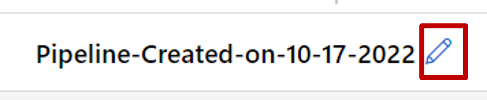

# Tutorial: Designer - train a no-code regression model

Train a linear regression model that predicts car prices using the Azure Machine Learning designer. This tutorial is part one of a two-part series.

This tutorial uses the Azure Machine Learning designer, for more information, see [What is Azure Machine Learning designer?](concept-designer.md)

>[!Note]
> Designer supports two types of components, classic prebuilt components (v1) and custom components (v2). These two types of components are NOT compatible. 
>
>Classic prebuilt components provide prebuilt components majorly for data processing and traditional machine learning tasks like regression and classification. This type of component continues to be supported but will not have any new components added. 
>
>Custom components allow you to wrap your own code as a component. It supports sharing components across workspaces and seamless authoring across Studio, CLI v2, and SDK v2 interfaces. 
>
>For new projects, we highly suggest you use custom component, which is compatible with AzureML V2 and will keep receiving new updates. 
>
>This article applies to classic prebuilt components and not compatible with CLI v2 and SDK v2.

In part one of the tutorial, you learn how to:

> [!div class="checklist"]
> * Create a new pipeline.
> * Import data.
> * Prepare data.
> * Train a machine learning model.
> * Evaluate a machine learning model.

In [part two](tutorial-designer-automobile-price-deploy.md) of the tutorial, you deploy your model as a real-time inferencing endpoint to predict the price of any car based on technical specifications you send it. 

> [!NOTE]
>A completed version of this tutorial is available as a sample pipeline.
>
>To find it, go to the designer in your workspace. In the **New pipeline** section, select **Sample 1 - Regression: Automobile Price Prediction(Basic)**.

[!INCLUDE [machine-learning-missing-ui](../includes/machine-learning-missing-ui.md)]

## Create a new pipeline

Azure Machine Learning pipelines organize multiple machine learning and data processing steps into a single resource. Pipelines let you organize, manage, and reuse complex machine learning workflows across projects and users.

To create an Azure Machine Learning pipeline, you need an Azure Machine Learning workspace. In this section, you learn how to create both these resources.

### Create a new workspace

You need an Azure Machine Learning workspace to use the designer. The workspace is the top-level resource for Azure Machine Learning, it provides a centralized place to work with all the artifacts you create in Azure Machine Learning. For instruction on creating a workspace, see [Create workspace resources](../quickstart-create-resources.md).

> [!NOTE]
> If your workspace uses a Virtual network, there are additional configuration steps you must use to use the designer. For more information, see [Use Azure Machine Learning studio in an Azure virtual network](../how-to-enable-studio-virtual-network.md)

### Create the pipeline

>[!Note]
> Designer supports two type of components, classic prebuilt components and custom components. These two types of components are not compatible.  
>
>Classic prebuilt components provides prebuilt components majorly for data processing and traditional machine learning tasks like regression and classification. This type of component continues to be supported but will not have any new components added.
>
>
>Custom components allow you to provide your own code as a component. It supports sharing across workspaces and seamless authoring across Studio, CLI, and SDK interfaces.
>
>This article applies to classic prebuilt components. 

1. Sign in to <a href="https://ml.azure.com?tabs=jre" target="_blank">ml.azure.com</a>, and select the workspace you want to work with.

1. Select **Designer** -> **Classic prebuilt**

    :::image type="content" source="./media/tutorial-designer-automobile-price-train-score/launch-designer.png" alt-text="Screenshot of the visual workspace showing how to access the designer.":::

1. Select **Create a new pipeline using classic prebuilt components**.

1. Click the pencil icon beside the automatically generated pipeline draft name, rename it to *Automobile price prediction*. The name doesn't need to be unique.

 

## Import data

There are several sample datasets included in the designer for you to experiment with. For this tutorial, use **Automobile price data (Raw)**.

1. To the left of the pipeline canvas is a palette of datasets and components. Select **Component** -> **Sample data**.

1. Select the dataset **Automobile price data (Raw)**, and drag it onto the canvas.

   :::image type="content" source="./media/tutorial-designer-automobile-price-train-score/automobile-data.png" alt-text="Gif of dragging the Automobile price data to the canvas.":::

### Visualize the data

You can visualize the data to understand the dataset that you'll use.

1. Right-click the **Automobile price data (Raw)** and select **Preview Data**.

1. Select the different columns in the data window to view information about each one.

    Each row represents an automobile, and the variables associated with each automobile appear as columns. There are 205 rows and 26 columns in this dataset.

## Prepare data

Datasets typically require some preprocessing before analysis. You might have noticed some missing values when you inspected the dataset. These missing values must be cleaned so that the model can analyze the data correctly.

### Remove a column

When you train a model, you have to do something about the data that's missing. In this dataset, the **normalized-losses** column is missing many values, so you'll exclude that column from the model altogether.

1. In the datasets and component palette to the left of the canvas, click **Component** and search for the **Select Columns in Dataset** component.

1. Drag the **Select Columns in Dataset** component onto the canvas. Drop the component below the dataset component.

1. Connect the **Automobile price data (Raw)** dataset to the **Select Columns in Dataset** component. Drag from the dataset's output port, which is the small circle at the bottom of the dataset on the canvas, to the input port of **Select Columns in Dataset**, which is the small circle at the top of the component.

    > [!TIP]
    > You create a flow of data through your pipeline when you connect the output port of one component to an input port of another.

    :::image type="content" source="./media/tutorial-designer-automobile-price-train-score/connect-modules.gif" alt-text="Screenshot of connecting Automobile price data component to select columns in dataset component.":::

1. Select the **Select Columns in Dataset** component.

1. Click on the arrow icon under Settings to the right of the canvas to open the component details pane. Alternatively, you can double-click the **Select Columns in Dataset** component to open the details pane.

1. Select **Edit column** to the right of the pane.

1. Expand the **Column names** drop down next to **Include**, and select  **All columns**.

1. Select the **+** to add a new rule.

1. From the drop-down menus, select **Exclude** and **Column names**.

1. Enter *normalized-losses* in the text box.

1. In the lower right, select **Save** to close the column selector.

    :::image type="content" source="./media/tutorial-designer-automobile-price-train-score/exclude-column.png" alt-text="Screenshot of select columns with exclude highlighted.":::

1. In the **Select Columns in Dataset** component details pane, expand **Node info**.

1. Select the **Comment** text box and enter *Exclude normalized losses*.

    Comments will appear on the graph to help you organize your pipeline.

### Clean missing data

Your dataset still has missing values after you remove the **normalized-losses** column. You can remove the remaining missing data by using the **Clean Missing Data** component.

> [!TIP]
> Cleaning the missing values from input data is a prerequisite for using most of the components in the designer.

1. In the datasets and component palette to the left of the canvas, click **Component** and search for the **Clean Missing Data** component.

1. Drag the **Clean Missing Data** component to the pipeline canvas. Connect it to the **Select Columns in Dataset** component.

1. Select the **Clean Missing Data** component.

1. Click on the arrow icon under Settings to the right of the canvas to open the component details pane. Alternatively, you can double-click the **Clean Missing Data** component to open the details pane.

1. Select **Edit column** to the right of the pane.

1. In the **Columns to be cleaned** window that appears, expand the drop-down menu next to **Include**. Select, **All columns**

1. Select **Save**

1. In the **Clean Missing Data** component details pane, under **Cleaning mode**, select **Remove entire row**.

1. In the **Clean Missing Data** component details pane, expand **Node info**. 

1. Select the **Comment** text box and enter *Remove missing value rows*.

    Your pipeline should now look something like this:

    :::image type="content" source="./media/tutorial-designer-automobile-price-train-score/pipeline-clean.png" alt-text="Screenshot of automobile price data connected to select columns in dataset component, which is connected to clean missing data.":::

## Train a machine learning model

Now that you have the components in place to process the data, you can set up the training components.

Because you want to predict price, which is a number, you can use a regression algorithm. For this example, you use a linear regression model.

### Split the data

Splitting data is a common task in machine learning. You'll split your data into two separate datasets. One dataset trains the model and the other will test how well the model performed.

1. In the datasets and component palette to the left of the canvas, click **Component** and search for the **Split Data** component.

1. Drag the **Split Data** component to the pipeline canvas.

1. Connect the left port of the **Clean Missing Data** component to the **Split Data** component.

    > [!IMPORTANT]
    > Make sure that the left output port of **Clean Missing Data** connects to **Split Data**. The left port contains the cleaned data. The right port contains the discarded data.

1. Select the **Split Data** component.

1. Click on the arrow icon under Settings to the right of the canvas to open the component details pane. Alternatively, you can double-click the **Split Data** component to open the details pane.

1. In the **Split Data** details pane, set the **Fraction of rows in the first output dataset** to 0.7.

    This option splits 70 percent of the data to train the model and 30 percent for testing it. The 70 percent dataset will be accessible through the left output port. The remaining data is available through the right output port.

1. In the **Split Data** details pane, expand **Node info**.

1. Select the **Comment** text box and enter *Split the dataset into training set (0.7) and test set (0.3)*.

### Train the model

Train the model by giving it a dataset that includes the price. The algorithm constructs a model that explains the relationship between the features and the price as presented by the training data.

1. In the datasets and component palette to the left of the canvas, click **Component** and search for the **Linear Regression** component.

1. Drag the **Linear Regression** component to the pipeline canvas.

1. In the datasets and component palette to the left of the canvas, click **Component** and search for the **Train Model** component.

1. Drag the **Train Model** component to the pipeline canvas.

1. Connect the output of the **Linear Regression** component to the left input of the **Train Model** component.

1. Connect the training data output (left port) of the **Split Data** component to the right input of the **Train Model** component.

    > [!IMPORTANT]
    > Make sure that the left output port of **Split Data** connects to **Train Model**. The left port contains the training set. The right port contains the test set.

    :::image type="content" source="./media/tutorial-designer-automobile-price-train-score/pipeline-train-model.png" alt-text="Screenshot showing the Linear Regression  connects to left port of Train Model  and the Split Data connects to right port of Train Model.":::

1. Select the **Train Model** component.

1. Click on the arrow icon under Settings to the right of the canvas to open the component details pane. Alternatively, you can double-click the **Train Model** component to open the details pane.

1. Select **Edit column** to the right of the pane.

1. In the **Label column** window that appears, expand the drop-down menu and select **Column names**.

1. In the text box, enter *price* to specify the value that your model is going to predict.

    >[!IMPORTANT]
    > Make sure you enter the column name exactly. Do not capitalize **price**.

    Your pipeline should look like this:

    :::image type="content" source="./media/tutorial-designer-automobile-price-train-score/pipeline-train-graph.png" alt-text="Screenshot showing the correct configuration of the pipeline after adding the Train Model component.":::

### Add the Score Model component

After you train your model by using 70 percent of the data, you can use it to score the other 30 percent to see how well your model functions.

1. In the datasets and component palette to the left of the canvas, click **Component** and search for the **Score Model** component.

1. Drag the **Score Model** component to the pipeline canvas.

1. Connect the output of the **Train Model** component to the left input port of **Score Model**. Connect the test data output (right port) of the **Split Data** component to the right input port of **Score Model**.

### Add the Evaluate Model component

Use the **Evaluate Model** component to evaluate how well your model scored the test dataset.

1. In the datasets and component palette to the left of the canvas, click **Component** and search for the **Evaluate Model** component.

1. Drag the **Evaluate Model** component to the pipeline canvas.

1. Connect the output of the **Score Model** component to the left input of **Evaluate Model**.

    The final pipeline should look something like this:

    :::image type="content" source="./media/tutorial-designer-automobile-price-train-score/pipeline-final-graph.png" alt-text="Screenshot showing the correct configuration of the pipeline.":::

## Submit pipeline

1. Select **Configure & Submit** on the right top corner to submit the pipeline.

    :::image type="content" source="./media/tutorial-designer-automobile-price-train-score/configure-submit.png" alt-text="Screenshot showing configure and submit button." border="false":::

1. Then you'll see a step-by-step wizard, follow the wizard to submit the pipeline job.

    :::image type="content" source="./media/tutorial-designer-automobile-price-train-score/submission-wizard.png" alt-text="Screenshot showing submission wizard." lightbox ="./media/tutorial-designer-automobile-price-train-score/submission-wizard.png":::

In *Basics* step, you can configure the experiment, job display name, job description etc.

In *Inputs & Outputs* step, you can assign value to the Inputs/Outputs that are promoted to pipeline level. In this example it will be empty because we didn't promote any input/output to pipeline level.

In *Runtime settings*, you can configure the default datastore and default compute to the pipeline. It's the default datastore/compute to all components in the pipeline. However, if you set a different compute or datastore for a component explicitly, the system respects the component level setting. Otherwise, it uses the default. 

The *Review + Submit* step is the last step to review all settings before submit. The wizard will remember your last configuration if you ever submit the pipeline.

After submitting the pipeline job, there will be a message on the top with a link to the job detail. You can select this link to review the job details.

  :::image type="content" source="./media/tutorial-designer-automobile-price-train-score/submit-message.png" alt-text="Screenshot showing submission message." lightbox ="./media/tutorial-designer-automobile-price-train-score/submit-message.png":::

### View scored labels

In the job detail page, you can check the pipeline job status, results and logs.

:::image type="content" source="./media/tutorial-designer-automobile-price-train-score/score-result.png" alt-text="Screenshot showing the pipeline job detail page.":::

After the job completes, you can view the results of the pipeline job. First, look at the predictions generated by the regression model.

1. Right-click the **Score Model** component, and select **Preview data** > **Scored dataset** to view its output.

    Here you can see the predicted prices and the actual prices from the testing data.

    :::image type="content" source="./media/tutorial-designer-automobile-price-train-score/score-result.png" alt-text="Screenshot of the output visualization highlighting the Scored Label column.":::

### Evaluate models

Use the **Evaluate Model** to see how well the trained model performed on the test dataset.

1. Right-click the **Evaluate Model** component and select **Preview data** > **Evaluation results** to view its output.

The following statistics are shown for your model:

* **Mean Absolute Error (MAE)**: The average of absolute errors. An error is the difference between the predicted value and the actual value.
* **Root Mean Squared Error (RMSE)**: The square root of the average of squared errors of predictions made on the test dataset.
* **Relative Absolute Error**: The average of absolute errors relative to the absolute difference between actual values and the average of all actual values.
* **Relative Squared Error**: The average of squared errors relative to the squared difference between the actual values and the average of all actual values.
* **Coefficient of Determination**: Also known as the R squared value, this statistical metric indicates how well a model fits the data.

For each of the error statistics, smaller is better. A smaller value indicates that the predictions are closer to the actual values. For the coefficient of determination, the closer its value is to one (1.0), the better the predictions.

## Clean up resources

Skip this section if you want to continue on with part 2 of the tutorial, [deploying models](tutorial-designer-automobile-price-deploy.md).

[!INCLUDE [aml-ui-cleanup](../includes/aml-ui-cleanup.md)]

## Next steps

In part two, you'll learn how to deploy your model as a real-time endpoint.

> [!div class="nextstepaction"]
> [Continue to deploying models](tutorial-designer-automobile-price-deploy.md)
