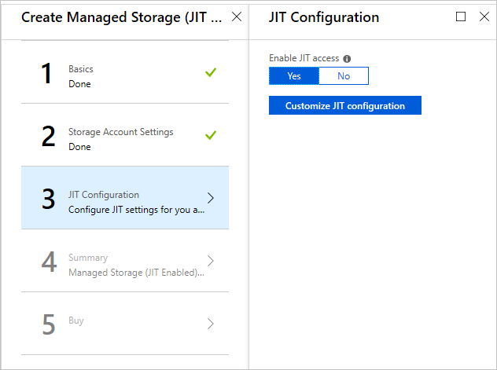
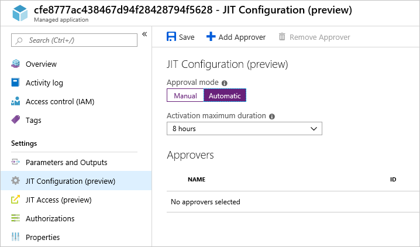
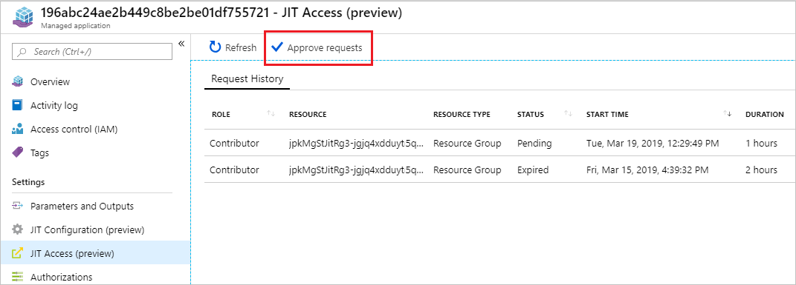
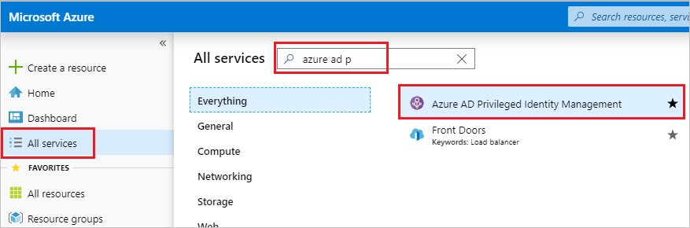
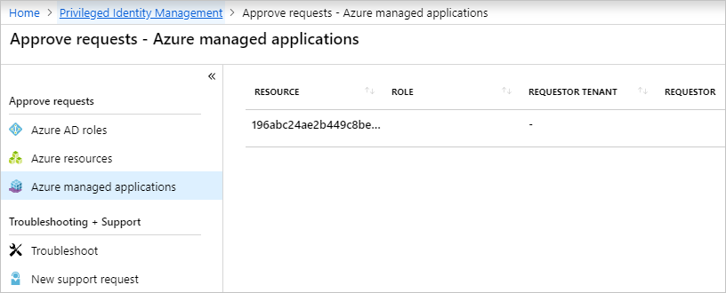

# Configure and approve just-in-time access for Azure Managed Applications

As a consumer of a managed application, you might not be comfortable giving the publisher permanent access to the managed resource group. To give you greater control over granting access to managed resources, Azure Managed Applications provides a feature called just-in-time (JIT) access, which is currently in preview. It enables you to approve when and for how long the publisher has access to the resource group. The publisher can make required updates during that time, but when that time is over, the publisher's access expires.

The work flow for granting access is:

1. The publisher adds a managed application to the marketplace and specifies that JIT access is available.

1. During deployment, you enable JIT access for your instance of the managed application.

1. After deployment, you can change the settings for JIT access.

1. The publisher sends a request for access.

1. You approve the request.

This article focuses on the actions consumers take to enable JIT access and approve requests. To learn about publishing a managed application with JIT access, see [Request just-in-time access in Azure Managed Applications](request-just-in-time-access.md).

> [!NOTE]
> To use just-in-time access, you must have a [Azure Active Directory P2 license](../active-directory/privileged-identity-management/subscription-requirements.md).

## Enable during deployment

1. Sign in to the [Azure portal](https://portal.azure.com).

1. Find a marketplace entry for a managed application with JIT enabled. Select **Create**.

1. While providing values for the new managed application, the **JIT Configuration** step allows you to enable or disable JIT access for the managed application. Select **Yes** for **Enable JIT Access**. This option is selected by default for managed applications that defined with JIT enabled in the marketplace.

   

   You can only enable JIT access during deployment. If you select **No**, the publisher gets permanent access to the managed resource group. You can't enable JIT access later.

1. To change the default approval settings, select **Customize JIT Configuration**.

   

   By default, a managed application with JIT enabled has the following settings:

   * Approval mode – automatic
   * Maximum access duration – 8 hours
   * Approvers – none

   When the approval mode is set to **automatic**, the approvers receive a notification for each request but the request is automatically approved. When set to **manual**, the approvers receive a notification for each request, and one of them must approve it.

   The activation maximum duration specifies the maximum amount of time a publisher can request for access to the managed resource group.

   The approvers list is the Azure Active Directory users that can approve of JIT access requests. To add an approver, select **Add Approver** and search for the user.

   After updating the setting, select **Save**.

## Update after deployment

You can change the values for how requests are approved. However, if you didn't enable JIT access during deployment, you can't enable it later.

To change the settings for a deployed managed application:

1. In the portal, select the manage application.

1. Select **JIT Configuration** and change the settings as needed.

   

1. When done, select **Save**.

## Approve requests

When the publisher requests access, you're notified of the request. You can approve JIT access requests either directly through the managed application, or across all managed applications through the Azure AD Privileged Identity Management service. To use just-in-time access, you must have a [Azure Active Directory P2 license](../active-directory/privileged-identity-management/subscription-requirements.md).

To approve requests through the managed application:

1. Select **JIT Access** for the managed application, and select **Approve Requests**.

   
 
1. Select the request to approve.

   

1. In the form, provide the reason for the approval and select **Approve**.

To approve requests through Azure AD Privileged Identity Management:

1. Select **All services** and begin searching for **Azure AD Privileged Identity Management**. Select it from the available options.

   

1. Select **Approve requests**.

   

1. Select **Azure managed applications**, and select the request to approve.

   

## Next steps

To learn about publishing a managed application with JIT access, see [Request just-in-time access in Azure Managed Applications](request-just-in-time-access.md).
