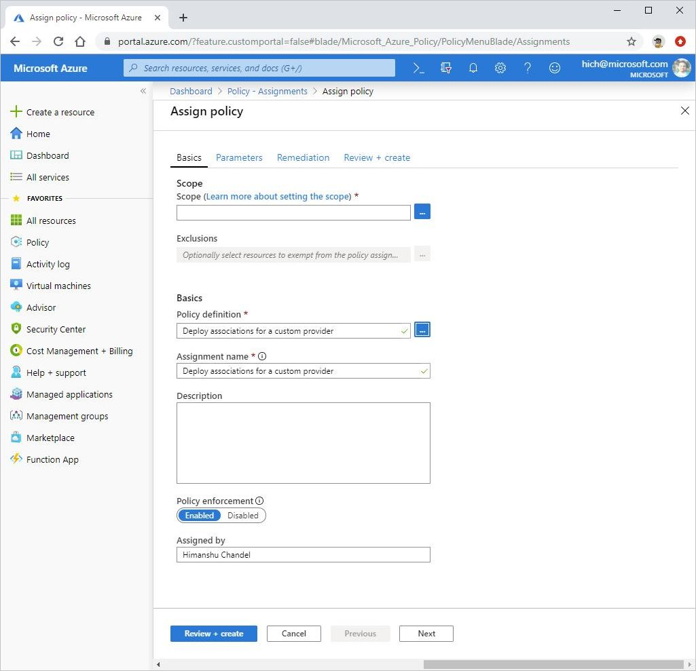

# Deploy associations for a custom provider using Azure policy

Azure policies can be used to deploy associations to associate resources to a custom provider. In this article, we describe a built-in policy that deploys associations and how you can use that policy.

## Built-in policy to deploy associations

Deploy associations for a custom provider is a built-in policy that can be used to deploy association to associate a resource to a custom provider. The policy accepts three paramaters:

- Custom provider Id - This is the resource Id of the custom provider to which the resources need to be associated.
- Resource types to associate - These are the list of resource types to be associated to the custom provider. You can associate multiple resource types to a custom provider using the same policy.
- Association name prefix - This is the prefix to be added to the name of the association resource being created. The default value is "DeployedByPolicy".

The policy uses DeployIfNotExists evaluation which runs after a Resource Provider has handled a create or update resource request of the selected resource type(s) and has returned a success status code. After that, the association resource gets deployed using a template deployment.
For more information on associations, see [Azure Custom Providers resource onboarding](./concepts-custom-providers-resourceonboarding.md)

## How to use deploy associations built-in policy 

### Prerequisites
If the custom provider needs permissions to the subscription to perform an action, the policy deployment of association resource wouldn't work without granting the permissions.

### Policy assignment
To use the built-in policy, create a policy assignment and assign the Deploy associations for a custom provider policy. Once the policy has been assigned successfully, 
the policy will identify non-compliant resources and deploy association for resources that are non-compliant.



## Getting help

If you have questions about Azure Custom Resource Providers development, try asking them on [Stack Overflow](https://stackoverflow.com/questions/tagged/azure-custom-providers). A similar question might have already been answered, so check first before posting. Add the tag ```azure-custom-providers``` to get a fast response!

## Next steps

In this article, you learnt about using built-in policy to deploy associations. See these articles to learn more:

- [Concepts: Azure Custom Providers resource onboarding](./concepts-custom-providers-resourceonboarding.md)
- [Tutorial: Resource onboarding with custom providers](./tutorial-custom-providers-resource-onboarding.md)
- [Tutorial: Create custom actions and resources in Azure](./tutorial-custom-providers-101.md)
- [Quickstart: Create a custom resource provider and deploy custom resources](./create-custom-provider.md)
- [How to: Adding custom actions to an Azure REST API](./custom-providers-action-endpoint-how-to.md)
- [How to: Adding custom resources to an Azure REST API](./custom-providers-resources-endpoint-how-to.md)
