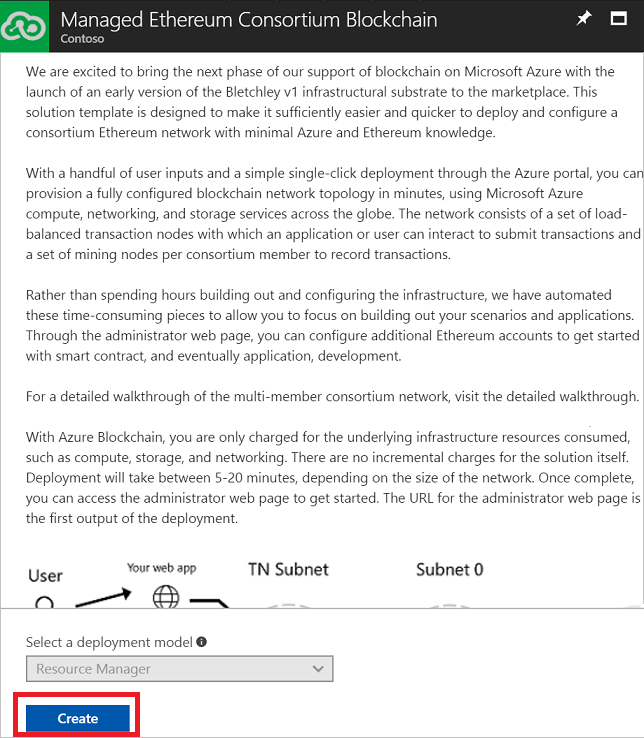

# Consume Azure managed applications in the Marketplace

As discussed in the [Managed Application overview](overview.md) article, there are two scenarios in the end to end experience. One is the publisher or vendor who wants to create a managed application for use by customers. The second is the end customer or the consumer of the managed application. This article covers the second scenario. It describes how you can deploy a managed application from the Microsoft Azure Marketplace.

## Create from the Marketplace

Deploying a managed application from the Marketplace is similar to deploying any type of resources from the Marketplace. 

In the portal, select **+ New** and search for the type of solution to deploy. From the available options, select the one you need.

Review the summary of the application, and select **Create**.

Like any other solution, you are presented with fields to provide values for. These fields vary by the type of managed application you create. 

## View support information

After your managed application has deployed, view the support information for the application. In the managed application blade, the support information is listed.

## View publisher permissions

The vendor that manages your application is granted access to your resources. To see those permissions, select **Authorizations**.

## Next steps

* For information about publishing a managed application in the Marketplace, see [Azure Managed Applications in Marketplace](publish-marketplace-app.md).
* To publish managed applications that are only available to users in your organization, see [Create and publish Service Catalog Managed Application](publish-service-catalog-app.md).
* To consume managed applications that are only available to users in your organization, see [Consume a Service Catalog Managed Application](consume-service-catalog-app.md).