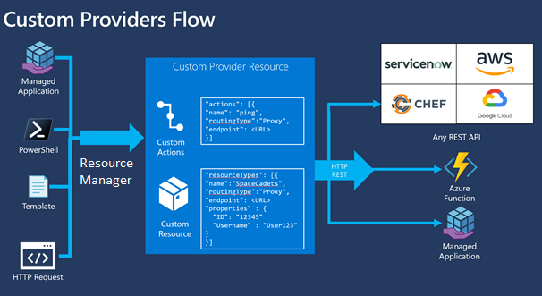

# Azure Custom Providers Preview overview

With Azure custom providers, you can extend Azure to work with your service. You create your own resource provider, including customized resource types and actions. The solution is integrated with Azure Resource Manager. After defining your custom provider, you can use Resource Manager's deployment methods, such as templates, to deploy your custom resources.

> [!IMPORTANT]
> Custom Providers is currently in public preview.
> This preview version is provided without a service level agreement, and it's not recommended for production workloads. Certain features might not be supported or might have constrained capabilities. 
> For more information, see [Supplemental Terms of Use for Microsoft Azure Previews](https://azure.microsoft.com/support/legal/preview-supplemental-terms/).

This article provides an overview of custom providers and its capabilities. The following image shows the work flow for resources and actions defined in a custom provider.



## Define your custom provider

You start by letting Azure Resource Manager know about your custom provider. You deploy to Azure a custom provider resource, which uses the resource type of **Microsoft.CustomProviders/resourceProviders**. In that resource, you define the customized resources for your service. For example, if your service needs a resource type named **users**, you include that resource type in your custom provider definition.

For each resource type, you provide an endpoint that contains the REST operations (PUT, GET, DELETE) for that resource type. The endpoint can be hosted on any environment.

You can also define custom actions for your resource provider. Actions represent POST operations. Use actions for operations such as start, stop, or restart. You provide an endpoint that handles the request.

The following example shows how to define a custom provider with an action and a resource type.

```json
{
  "apiVersion": "2018-09-01-preview",
  "type": "Microsoft.CustomProviders/resourceProviders",
  "name": "[parameters('funcName')]",
  "location": "[parameters('location')]",
  "properties": {
    "actions": [
      {
        "name": "ping",
        "routingType": "Proxy",
        "endpoint": "[concat('https://', parameters('funcName'), '.azurewebsites.net/api/{requestPath}')]"
      }
    ],
    "resourceTypes": [
      {
        "name": "users",
        "routingType": "Proxy,Cache",
        "endpoint": "[concat('https://', parameters('funcName'), '.azurewebsites.net/api/{requestPath}')]"
      }
    ]
  }
},
```

For **routingType**, the accepted values are `Proxy` and `Cache`. Proxy means requests for the resource type or action are handled by the endpoint. The cache setting is only supported for resource types, not actions. To specify cache, you must also specify proxy. Cache means responses from the endpoint are stored to optimize read operations. Using the cache setting makes it easier to implement an API that is consistent and compliant with other Resource Manager services.

## Deploy your resource types

After defining your custom provider, you can deploy your customized resource types.

```json
{
    "apiVersion": "2018-09-01-preview",
    "type": "Microsoft.CustomProviders/resourceProviders/users",
    "name": "[concat(parameters('rpname'), '/santa')]",
    "location": "[parameters('location')]",
    "properties": {
        "FullName": "Santa Claus",
        "Location": "NorthPole"
    }
}
```

You can deploy your custom resource types in the same template as other Azure resource types.

## Manage access

Use Azure [role-based access control](../role-based-access-control/overview.md) to manage access to your resource provider. You can assign [built-in roles](../role-based-access-control/built-in-roles.md) such as Owner, Contributor, or Reader to users. Or, you can define [custom roles](../role-based-access-control/custom-roles.md) that are specific to the operation in your resource provider.

## Next steps

In this article, you learned about custom providers. Go to the next article to create a custom provider.

> [!div class="nextstepaction"]
> [Tutorial: Create custom provider and deploy custom resources](create-custom-provider.md)
