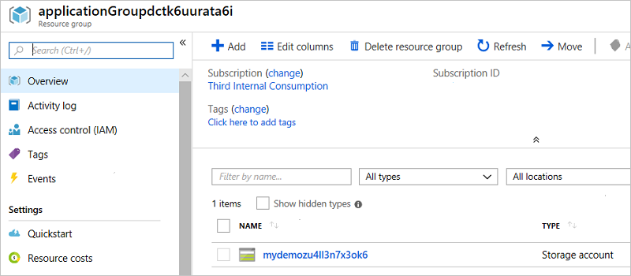

# Deploy service catalog app through Azure portal

In the [preceding quickstart](publish-managed-app-definition-quickstart.md), you published a managed application definition. In this quickstart, you create a service catalog app from that definition.

## Create service catalog app

In the Azure portal, use the following steps:

1. Select **Create a resource**.

   

1. Search for **Service Catalog Managed Application** and select it from the available options.

   

1. You see a description of the Managed Application service. Select **Create**.

   

1. The portal shows the managed application definitions that you have access to. From the available definitions, select the one you wish to deploy. In this quickstart, use the **Managed Storage Account** definition that you created in the preceding quickstart. Select **Create**.

   

1. Provide values for the **Basics** tab. Select the Azure subscription to deploy your service catalog app to. Create a new resource group named **applicationGroup**. Select a location for your app. When finished, select **OK**.

   

1. Provide a prefix for the storage account name. Select the type of storage account to create. When finished, select **OK**.

   

1. Review the summary. After validation succeeds, select **OK** to begin deployment.

   

## View results

After the service catalog app has been deployed, you have two new resource groups. One resource group holds the service catalog app. The other resource group holds the resources for the service catalog app.

1. View the resource group named **applicationGroup** to see the service catalog app.

   

1. View the resource group named **applicationGroup{hash-characters}** to see the resources for the service catalog app.

   

## Next steps

* To learn how to create the definition files for a managed application, see [Create and publish a managed application definition](publish-service-catalog-app.md).
* For Azure CLI, see [Deploy service catalog app with Azure CLI](./scripts/managed-application-cli-sample-create-application.md).
* For PowerShell, see [Deploy service catalog app with PowerShell](./scripts/managed-application-poweshell-sample-create-application.md).