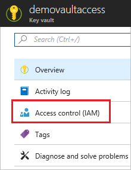
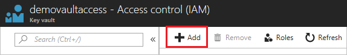
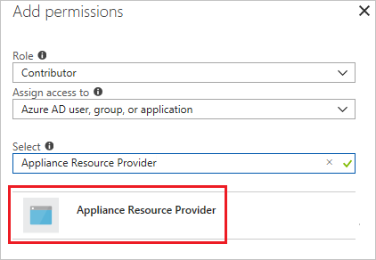

# Access Key Vault secret when deploying Azure Managed Applications

When you need to pass a secure value (like a password) as a parameter during deployment, you can retrieve the value from an [Azure Key Vault](../key-vault/key-vault-whatis.md). To access the Key Vault when deploying Managed Applications, you must grant access to the **Appliance Resource Provider** service principal. The Managed Applications service uses this identity to run operations. To successfully retrieve a value from a Key Vault during deployment, the service principal must be able to access the Key Vault.

This article describes how to configure the Key Vault to work with Managed Applications.

## Enable template deployment

1. In the portal, select your Key Vault.

1. Select **Access policies**.   

   

1. Select **Click to show advanced access policies**.

   

1. Select **Enable access to Azure Resource Manager for template deployment**. Then, select **Save**.

   

## Add service as contributor

1. Select **Access control (IAM)**.

   

1. Select **Add role assignment**.

   

1. Select **Contributor** for the role. Search for **Appliance Resource Provider** and select it from the available options.

   

1. Select **Save**.

## Reference Key Vault secret

To pass a secret from a Key Vault to a template in your Managed Application, you must use a [linked template](../azure-resource-manager/resource-group-linked-templates.md) and reference the Key Vault in the parameters for the linked template. Provide the resource ID of the Key Vault and the name of the secret.

```json
"resources": [{
  "apiVersion": "2015-01-01",
  "name": "linkedTemplate",
  "type": "Microsoft.Resources/deployments",
  "properties": {
    "mode": "incremental",
    "templateLink": {
      "uri": "https://raw.githubusercontent.com/Azure/azure-docs-json-samples/master/azure-resource-manager/keyvaultparameter/sqlserver.json",
      "contentVersion": "1.0.0.0"
    },
    "parameters": {
      "adminPassword": {
        "reference": {
          "keyVault": {
            "id": "/subscriptions/<subscription-id>/resourceGroups/<rg-name>/providers/Microsoft.KeyVault/vaults/<key-vault-name>"
          },
          "secretName": "<secret-name>"
        }
      },
      "adminLogin": { "value": "[parameters('adminLogin')]" },
      "sqlServerName": {"value": "[parameters('sqlServerName')]"}
    }
  }
}],
```

## Next steps

You've configured your Key Vault to be accessible during deployment of a Managed Application.

* For information about passing a value from a Key Vault as a template parameter, see [Use Azure Key Vault to pass secure parameter value during deployment](../azure-resource-manager/resource-manager-keyvault-parameter.md).
* For managed application examples, see [Sample projects for Azure managed applications](sample-projects.md).
* To learn how to create a UI definition file for a managed application, see [Get started with CreateUiDefinition](create-uidefinition-overview.md).