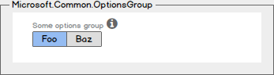

# Microsoft.Common.OptionsGroup UI element
A selection control with a row of available options.

## UI sample


## Schema
```json
{
  "name": "element1",
  "type": "Microsoft.Common.OptionsGroup",
  "label": "Some options group",
  "defaultValue": "Value two",
  "toolTip": "",
  "constraints": {
    "allowedValues": [
      {
        "label": "Value one",
        "value": "one"
      },
      {
        "label": "Value two",
        "value": "two"
      }
    ],
    "required": true
  },
  "visible": true
}
```

## Remarks
- The label for `constraints.allowedValues` is the display text for an item, and its value is the output value of the element when selected.
- If specified, the default value must be a label present in `constraints.allowedValues`. If not specified, the first item in `constraints.allowedValues` is selected by default. The default value is **null**.
- `constraints.allowedValues` must have at least one item.

## Sample output
```json
"two"
```

## Next steps
* For an introduction to creating UI definitions, see [Getting started with CreateUiDefinition](create-uidefinition-overview.md).
* For a description of common properties in UI elements, see [CreateUiDefinition elements](create-uidefinition-elements.md).
