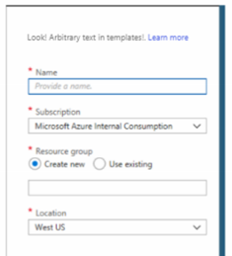

# Microsoft.Common.TextBlock UI element
A control that can be used to add text to the portal interface.

## UI sample


## Schema
```json
{
  "name": "text1",
  "type": "Microsoft.Common.TextBlock",
  "visible": true,
  "options": {
    "text": "Look! Arbitrary text in templates!",
    "link": {
      "label": "Learn more",
      "uri": "https://www.microsoft.com"
    }
  }
}
```

## Sample output

```json
"Look! Arbitrary text in templates! Learn more"
```

## Next steps
* For an introduction to creating UI definitions, see [Getting started with CreateUiDefinition](create-uidefinition-overview.md).
* For a description of common properties in UI elements, see [CreateUiDefinition elements](create-uidefinition-elements.md).
