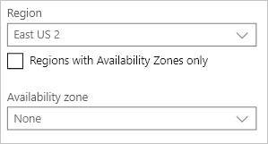

# Microsoft.Network.AvailabilityZoneDropdown UI element
A control for selecting the availability zone.

## UI sample


## Schema
```json
{
  "name": "element1",
  "type": "Microsoft.Network.AvailabilityZoneDropdown",
  "label": "Availability zone dropdown label",
  "toolTip": "This is the tooltip for availability zones",
  "defaultValue": "None",
  "constraints": {
    "required": "true"
  },
  "options": {
  },
  "visible": true
}
```

## Next steps
* For an introduction to creating UI definitions, see [Getting started with CreateUiDefinition](create-uidefinition-overview.md).
* For a description of common properties in UI elements, see [CreateUiDefinition elements](create-uidefinition-elements.md).
