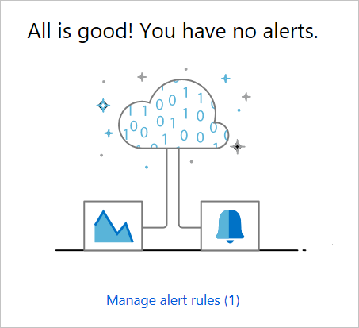

# Monitor a deployed instance of a managed application

After you've deployed a managed application to your Azure subscription, you may want to check the status of the application. This article shows options in the Azure portal for checking the status. You can monitor the availability of the resources in your managed application. You can also set up and view alerts.

## View resource health

1. Select your managed application instance.

   

1. Select **Resource Health**.

   

1. View the availability of the resources in your managed application.

   

## View alerts

1. Select **Alerts**.

   

1. If you have alert rules configured, you see information about alerts that have been raised.

   

1. To add alert rules, select **+ New alert rule**.

   

You can create alerts for your managed application instance or the resources in the managed application. For information about creating alerts, see [Overview of alerts in Microsoft Azure](../azure-monitor/platform/alerts-overview.md).

## Next steps

* For managed application examples, see [Sample projects for Azure managed applications](sample-projects.md).
* To deploy a managed application, see [Deploy service catalog app through Azure portal](deploy-service-catalog-quickstart.md).