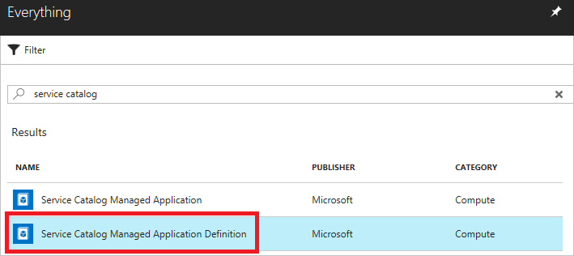
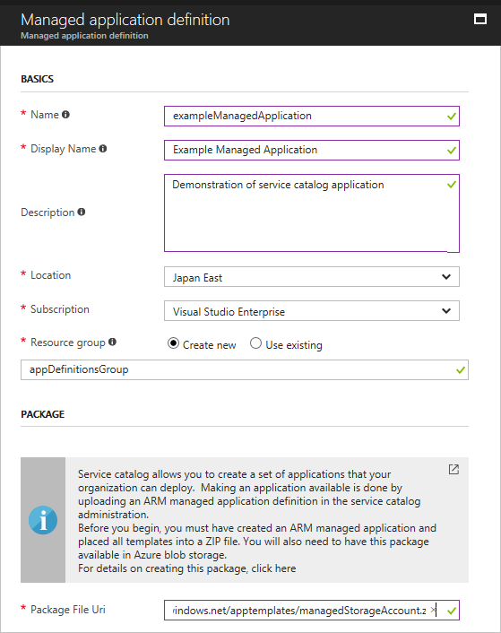
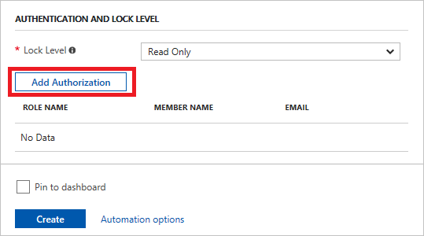
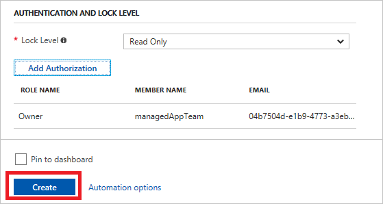

# Publish a managed application for internal consumption

You can create and publish Azure [managed applications](overview.md) that are intended for members of your organization. For example, an IT department can publish managed applications that ensure compliance with organizational standards. These managed applications are available through the service catalog, not the Azure marketplace.

To publish a managed application for the service catalog, you must:

* Create a template that defines the resources to deploy with the managed application.
* Define the user interface elements for the portal when deploying the managed application.
* Create a .zip package that contains the required template files.
* Decide which user, group, or application needs access to the resource group in the user's subscription.
* Create the managed application definition that points to the .zip package and requests access for the identity.

The [managed application for this article](https://github.com/Azure/azure-managedapp-samples/tree/master/samples/201-managed-web-app) is available in GitHub. It includes a virtual machine that hosts a web application.

## Create the resource template

Every managed application definition contains a file named **mainTemplate.json**. In it, you define the Azure resources to provision. The template is no different than a regular Resource Manager template.

Let's look at the [mainTemplate.json](https://github.com/Azure/azure-managedapp-samples/blob/master/samples/201-managed-web-app/mainTemplate.json) for this managed application. It includes several parameters for defining the virtual machine. You could define all the resources in a single template, but this example uses two nested templates. One nested template deploys the resources for log analytics. The other template deploys the virtual machine, storage account, and virtual network.

```json
{
    "$schema": "http://schema.management.azure.com/schemas/2015-01-01/deploymentTemplate.json#",
    "contentVersion": "1.0.0.0",
    "parameters": {
        "location": {
            "type": "string",
            "defaultValue": "[resourceGroup().location]",
            "metadata": {
                "description": "Specify the location for the Azure resources"
            }
        },
        "vmSize": {
            "type": "string",
            "defaultValue": "Standard_D1_v2",
            "metadata": {
                "description": "Select the VM Size"
            }
        },
        "vmNamePrefix": {
            "type": "string",
            "metadata": {
                "description": "Assign a prefix for the VM name"
            }
        },
        "userName": {
            "type": "string",
            "metadata": {
                "description": "Specify the user name for the virtual machine guest OS"
            }
        },
        "pwd": {
            "type": "securestring",
            "metadata": {
                "description": "Specify the password for the user account for the virtual machine"
            }
        },
        "enablePremiumManagement": {
            "type": "string",
            "allowedValues": [
                "Yes",
                "No"
            ],
            "metadata": {
                "description": "Select whether premium management should be enabled or not"
            }
        },
        "dnsName": {
            "type": "string",
            "metadata": {
                "description": "Specify the DNS name for the managed web app"
            }
        },
        "publicIPAddressName": {
            "type": "string",
            "metadata": {
                "description": "Assign a name for the public IP address"
            }
        }
    },
    "variables": {
        "artifacts": {
            "logAnalytics": "[uri(deployment().properties.templateLink.uri, 'nestedtemplates/oms.json')]",
            "compute": "[uri(deployment().properties.templateLink.uri, 'nestedtemplates/managedVm.json')]",
            "scripts": "[uri(deployment().properties.templateLink.uri, 'scripts/ManagedWebApplication.ps1.zip')]"
        },
        "logAnalyticsLocationMap": {
            "eastasia": "southeastasia",
            "southeastasia": "southeastasia",
            "centralus": "westcentralus",
            "eastus": "eastus",
            "eastus2": "eastus",
            "westus": "westcentralus",
            "northcentralus": "westcentralus",
            "southcentralus": "westcentralus",
            "northeurope": "westeurope",
            "westeurope": "westeurope",
            "japanwest": "southeastasia",
            "japaneast": "southeastasia",
            "brazilsouth": "eastus",
            "australiaeast": "australiasoutheast",
            "australiasoutheast": "australiasoutheast",
            "southindia": "southeastasia",
            "centralindia": "southeastasia",
            "westindia": "southeastasia",
            "canadacentral": "eastus",
            "canadaeast": "eastus",
            "uksouth": "westeurope",
            "ukwest": "westeurope",
            "westcentralus": "westcentralus",
            "westus2": "westcentralus",
            "koreacentral": "southeastasia",
            "koreasouth": "southeastasia",
            "eastus2euap": "eastus"
        },
        "logAnalyticsLocation": "[variables('logAnalyticsLocationMap')[parameters('location')]]",
        "logAnalyticsWorkspaceName": "[concat(resourceGroup().name, '-', uniqueString('oms'))]"
    },
    "resources": [
        {
            "type": "Microsoft.Resources/deployments",
            "apiVersion": "2016-09-01",
            "name": "logAnalytics",
            "properties": {
                "mode":"Incremental",
                "templateLink": {
                    "contentVersion": "1.0.0.0",
                    "uri": "[variables('artifacts').logAnalytics]"
                },
                "parameters": {
                    "omsWorkspaceName": {
                        "value": "[variables('logAnalyticsWorkspaceName')]"
                    },
                    "omsWorkspaceRegion": {
                        "value": "[variables('logAnalyticsLocation')]"
                    },
                    "enablePremiumManagement": {
                        "value": "[parameters('enablePremiumManagement')]"
                    }
                }
            }
        },
        {
            "type": "Microsoft.Resources/deployments",
            "apiVersion": "2016-09-01",
            "name": "compute",
            "dependsOn": [
                "logAnalytics"
            ],
            "properties": {
                "mode":"Incremental",
                "templateLink": {
                    "contentVersion": "1.0.0.0",
                    "uri": "[variables('artifacts').compute]"
                },
                "parameters": {
                    "location": {
                        "value": "[parameters('location')]"
                    },
                    "vmSize": {
                        "value": "[parameters('vmSize')]"
                    },
                    "vmNamePrefix": {
                        "value": "[parameters('vmNamePrefix')]"
                    },
                    "userName": {
                        "value": "[parameters('userName')]"
                    },
                    "pwd": {
                        "value": "[parameters('pwd')]"
                    },
                    "dscScript": {
                        "value": "[variables('artifacts').scripts]"
                    },
                    "logAnalyticsWorkspaceName": {
                        "value": "[variables('logAnalyticsWorkspaceName')]"
                    },
                    "publicIPAddressName": {
                        "value": "[parameters('publicIPAddressName')]"
                    },
                    "dnsName": {
                        "value": "[parameters('dnsName')]"
                    }
                }
            }
        }
    ],
    "outputs": {
        "applicationEndpoint": {
            "type": "string",
            "value": "[reference('compute').outputs.vmEndpoint.value]"
        }
    }
}
```

This article does not present all of the templates for this managed application. To view the nested templates, see [managedVm.json](https://github.com/Azure/azure-managedapp-samples/blob/master/samples/201-managed-web-app/nestedtemplates/managedVm.json) and [oms.json](https://github.com/Azure/azure-managedapp-samples/blob/master/samples/201-managed-web-app/nestedtemplates/oms.json).

## Create the user interface definition

The Azure portal uses the **createUiDefinition.json** file to generate the user interface for users who create the managed application. You define how users provide input for each parameter. You can use options like a drop-down list, text box, password box, and other input tools. To learn how to create a UI definition file for a managed application, see [Get started with CreateUiDefinition](create-uidefinition-overview.md).

The following example shows the createUiDefinition.json file for this managed application. It includes steps where users can configure the virtual machine and web application.

```json
{
    "handler": "Microsoft.Compute.MultiVm",
    "version": "0.1.2-preview",
    "parameters": {
        "basics": [
            {}
        ],
        "steps": [
            {
                "name": "credentialsConfig",
                "label": "VM Credential",
                "subLabel": {
                    "preValidation": "Configure the Web App VM credentials",
                    "postValidation": "Done"
                },
                "bladeTitle": "Credential",
                "elements": [
                    {
                        "name": "adminUsername",
                        "type": "Microsoft.Compute.UserNameTextBox",
                        "label": "User name",
                        "toolTip": "Admin username for the virtual machine",
                        "osPlatform": "Windows",
                        "constraints": {
                            "required": true
                        }
                    },
                    {
                        "name": "adminPassword",
                        "type": "Microsoft.Compute.CredentialsCombo",
                        "label": {
                            "password": "Password",
                            "confirmPassword": "Confirm password"
                        },
                        "toolTip": {
                            "password": "Admin password for the virtual machine"
                        },
                        "osPlatform": "Windows",
                        "constraints": {
                            "required": true
                        }
                    }
                ]
            },
            {
                "name": "vmConfig",
                "label": "Web App Virtual Machine settings",
                "subLabel": {
                    "preValidation": "Configure the virtual machine settings",
                    "postValidation": "Done"
                },
                "bladeTitle": "Web App VM Settings",
                "elements": [
                    {
                        "name": "vmNamePrefix",
                        "type": "Microsoft.Common.TextBox",
                        "label": "Virtual Machine Name prefix",
                        "toolTip": "Prefix of the VM for your web app",
                        "defaultValue": "",
                        "constraints": {
                            "required": true,
                            "regex": "[a-z][a-z0-9-]{2,5}[a-z0-9]$",
                            "validationMessage": "Must be 3-5 characters."
                        }
                    },
                    {
                        "name": "vmSize",
                        "type": "Microsoft.Compute.SizeSelector",
                        "label": "Virtual machine size",
                        "toolTip": "The size of the virtual machine for web app",
                        "recommendedSizes": [
                            "Standard_D1_v2"
                        ],
                        "constraints": {
                            "allowedSizes": [
                                "Standard_D1_v2"
                            ]
                        },
                        "osPlatform": "Windows",
                        "count": 1
                    }
                ]
            },
            {
                "name": "webConfig",
                "label": "Web App settings",
                "subLabel": {
                    "preValidation": "Configure the web app endpoint",
                    "postValidation": "Done"
                },
                "bladeTitle": "Web App Endpoint settings",
                "elements": [
                    {
                        "name": "dnsAndPublicIP",
                        "type": "Microsoft.Network.PublicIpAddressCombo",
                        "label": {
                            "publicIpAddress": "Public IP address",
                            "domainNameLabel": "DNS label"
                        },
                        "toolTip": {
                            "domainNameLabel": "DNS endpoint for the Managed Web App IP address."
                        },
                        "defaultValue": {
                            "publicIpAddressName": "ip01"
                        },
                        "options": {
                            "hideNone": true,
                            "hideDomainNameLabel": false
                        },
                        "constraints": {
                            "required": {
                                "domainNameLabel": true
                            }
                        }
                    },
                    {
                        "name": "management",
                        "type": "Microsoft.Common.OptionsGroup",
                        "label": "Enable premium management?",
                        "defaultValue": "Yes",
                        "toolTip": "Select Yes to set up premium management for the virtual machines and web app",
                        "constraints": {
                            "allowedValues": [
                                {
                                    "label": "Yes",
                                    "value": "Yes"
                                },
                                {
                                    "label": "No",
                                    "value": "No"
                                }
                            ]
                        },
                        "visible": true
                    }
                ]
            }
        ],
        "outputs": {
            "location": "[location()]",
            "vmSize": "[steps('vmConfig').vmSize]",
            "vmNamePrefix": "[steps('vmConfig').vmNamePrefix]",
            "userName": "[steps('credentialsConfig').adminUsername]",
            "pwd": "[steps('credentialsConfig').adminPassword.password]",
            "dnsName": "[steps('webConfig').dnsAndPublicIP.domainNameLabel]",
            "publicIPAddressName": "[steps('webConfig').dnsAndPublicIP.name]",
            "enablePremiumManagement": "[steps('webConfig').management]"
        }
    }
}
```

## Package the files

After all the needed files are ready, package them as a .zip file. The two files must be at the root level of the .zip file. If you put them in a folder, you receive an error when creating the managed application definition that states the required files are not present. Upload the package to an accessible location from where it can be consumed. For this article, the [.zip file](https://raw.githubusercontent.com/Azure/azure-managedapp-samples/master/samples/201-managed-web-app/managedwebapp.zip) is already available in GitHub.

You can use either Azure CLI or the portal to create a managed application for the service catalog. Both approaches are shown in this article.

## Create managed application with Azure CLI

### Create an Azure Active Directory user group or application

The next step is to select a user group or application for managing the resources on behalf of the customer. This user group or application has permissions on the managed resource group according to the role that is assigned. The role can be any built-in Role-Based Access Control (RBAC) role like Owner or Contributor. You also can give an individual user permission to manage the resources, but typically you assign this permission to a user group. To create a new Active Directory user group, see [Create a group and add members in Azure Active Directory](../active-directory/active-directory-groups-create-azure-portal.md).

You need the object ID of the user group to use for managing the resources. The following example shows how to get the object ID from the group's display name:

```azurecli-interactive
az ad group show --group exampleGroupName
```

The example command returns the following output:

```azurecli
{
    "displayName": "exampleGroupName",
    "mail": null,
    "objectId": "9aabd3ad-3716-4242-9d8e-a85df479d5d9",
    "objectType": "Group",
    "securityEnabled": true
}
```

To retrieve just the object ID, use:

```azurecli-interactive
groupid=$(az ad group show --group exampleGroupName --query objectId --output tsv)
```

### Get the role definition ID

Next, you need the role definition ID of the RBAC built-in role you want to grant access to the user, user group, or application. Typically, you use the Owner or Contributor or Reader role. The following command shows how to get the role definition ID for the Owner role:

```azurecli-interactive
az role definition list --name owner
```

That command returns the following output:

```azurecli
{
    "id": "/subscriptions/<subscription-id>/providers/Microsoft.Authorization/roleDefinitions/8e3af657-a8ff-443c-a75c-2fe8c4bcb635",
    "name": "8e3af657-a8ff-443c-a75c-2fe8c4bcb635",
    "properties": {
      "assignableScopes": [
        "/"
      ],
      "description": "Lets you manage everything, including access to resources.",
      "permissions": [
        {
          "actions": [
            "*"
         ],
         "notActions": []
        }
      ],
      "roleName": "Owner",
      "type": "BuiltInRole"
    },
    "type": "Microsoft.Authorization/roleDefinitions"
}
```

You need the value of the "name" property from the preceding example. You can retrieve just that property with:

```azurecli-interactive
roleid=$(az role definition list --name Owner --query [].name --output tsv)
```

### Create the managed application definition

If you do not already have a resource group for storing your managed application definition, create one now:

```azurecli-interactive
az group create --name managedApplicationGroup --location westcentralus
```

Now, create the managed application definition resource.

```azurecli-interactive
az managedapp definition create \
  --name managedWebApp \
  --location "westcentralus" \
  --resource-group managedApplicationGroup \
  --lock-level ReadOnly \
  --display-name "Managed web application" \
  --description "Azure web application" \
  --authorizations "$groupid:$roleid" \
  --package-file-uri https://raw.githubusercontent.com/Azure/azure-managedapp-samples/master/samples/201-managed-web-app/managedwebapp.zip
```

The parameters used in the preceding example are:

* **resource-group**: The name of the resource group where the managed application definition is created.
* **lock-level**: The type of lock placed on the managed resource group. It prevents the customer from performing undesirable operations on this resource group. Currently, ReadOnly is the only supported lock level. When ReadOnly is specified, the customer can only read the resources present in the managed resource group.
* **authorizations**: Describes the principal ID and the role definition ID that are used to grant permission to the managed resource group. It's specified in the format of `<principalId>:<roleDefinitionId>`. Multiple values also can be specified for this property. If multiple values are needed, they should be specified in the form `<principalId1>:<roleDefinitionId1> <principalId2>:<roleDefinitionId2>`. Multiple values are separated by a space.
* **package-file-uri**: The location of the managed application package that contains the template files, which can be an Azure Storage blob.

## Create managed application with portal

1. If needed, create an Azure Active Directory user group to manage the resources. For more information, see [Create a group and add members in Azure Active Directory](../active-directory/active-directory-groups-create-azure-portal.md).
1. In the upper left corner, select **+ New**.

   

1. Search for **service catalog**.

1. In the results, scroll until you find **Service Catalog Managed Application Definition**. Select it.

   

1. Select **Create** to start the process of creating the managed application definition.

   

1. Provide values for name, display name, description, location, subscription, and resource group. For package file URI, provide the path to the zip file you created.

   

1. When you get to the Authentication and Lock Level section, select **Add Authorization**.

   

1. Select an Azure Active Directory group to manage the resources, and select **OK**.

   

1. When you have provided all the values, select **Create**.

   

## Next steps

* For an introduction to managed applications, see [Managed application overview](overview.md).
* For examples of the files, see [Managed application samples](https://github.com/Azure/azure-managedapp-samples/tree/master/samples).
* For information about publishing managed applications to the Azure Marketplace, see [Azure managed applications in the Marketplace](publish-marketplace-app.md).
* To learn how to create a UI definition file for a managed application, see [Get started with CreateUiDefinition](create-uidefinition-overview.md).
