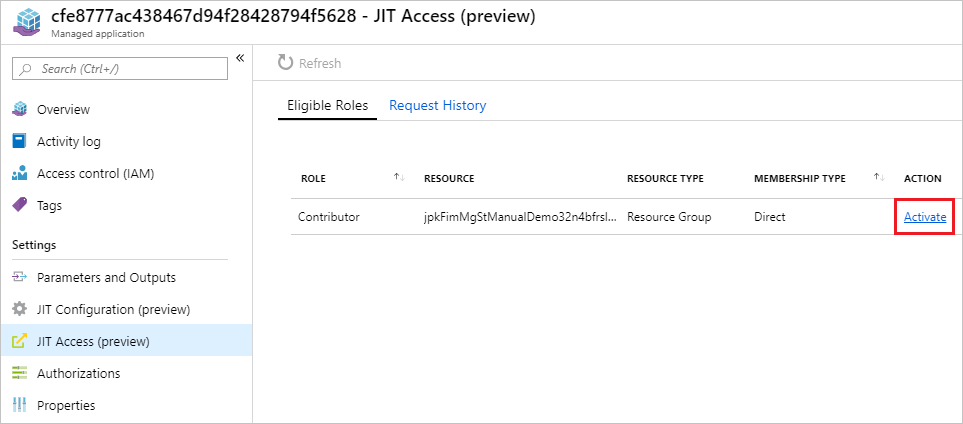
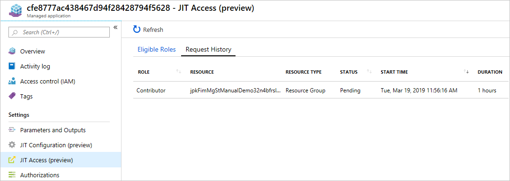

# Test your portal interface for Azure Managed Applications

Not all consumers of Managed Applications want their service providers to have standing high-level access for their resources and not all service providers want standing high-level access for their support teams. Instead, Just-in-time (JIT) access allows service providers to request temporary elevated access to a managed application’s resources for troubleshooting or maintaining a customer’s Managed App. Publishers can now enable the JIT capability on their Managed Applications offerings to provide JIT enabled Managed Applications, giving them standing read-only access with the ability to elevate access for a period of time on request. 
Publishing JIT Capable Managed Applications
To learn more about publishing your first Managed Application offer to the Azure Marketplace, please read Azure Managed Applications in the Marketplace.

Prepare your Managed Application Package
Note: The schema mentioned in this section for CreateUiDefinition.json file is not final – there could be changes to this schema as appropriate in the future iterations.
To support JIT capability for your offer, add the following content to your CreateUiDefinition.json file:
 
In "steps":

```json
{
    "name": "jitConfiguration",
    "label": "JIT Configuration",
    "subLabel": {
        "preValidation": "Configure JIT settings for you application",
        "postValidation": "Done"
    },
    "bladeTitle": "JIT Configuration",
    "elements": [
        {
          "name": "jitConfigurationControl",
          "type": "Microsoft.Solutions.JitConfigurator",
          "label": "JIT Configuration"
        }
    ]
}
```
 
In "outputs":

```json
"jitAccessPolicy": "[parse(concat('{\"jitAccessEnabled\":', string(steps('jitConfiguration').jitConfigurationControl.jitEnabled), ',\"jitApprovalMode\":\"', steps('jitConfiguration').jitConfigurationControl.jitApprovalMode, '\",\"maximumJitAccessDuration\":\"', steps('jitConfiguration').jitConfigurationControl.maxAccessDuration, '\",\"jitApprovers\":', string(steps('jitConfiguration').jitConfigurationControl.approvers), '}'))]"
```

Enable JIT configuration for a Managed Application package
Login to the Cloud Partner publishing portal : https://cloudpartner.azure.com
While publishing the package, select 'Yes' for 'Enable JIT Access' option


Making a JIT Access Request as a Service Provider

Select the role to activate
When viewing the Managed Application you want to make a JIT Access Request for, open the 'JIT Access' menu item. 

On the ‘Eligible Roles’ tab, click on the ‘Activate’ link in the ACTION column for the role you want to activate for your JIT Access Request.



Submit request for role activation
On the 'Activate Role' form, select a start time and duration for your role to be active, then click 'Activate' to send the request.

 

Follow the notifications to see the progress and the result of creating new JIT request. Sample statuses:
In Progress


Success

View JIT request status & request history
To view the status of all JIT requests for a managed application, open the 'JIT Access' menu item, then select the 'Request History' tab.



## Known issues

•	The JIT requestor’s principal Id in the ISV tenants should explicitly be part of the application package. It is not enough for this user to be part of a security group. This is a temporary limitation that will be fixed in the future releases of this feature.


## Next steps


