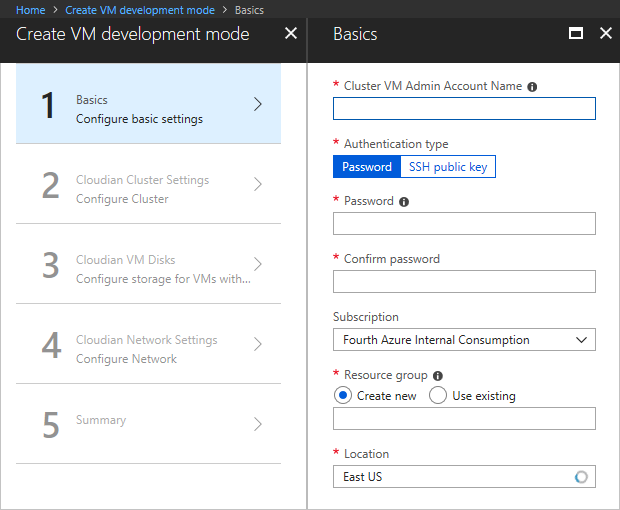
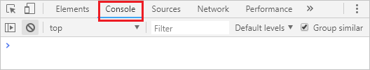
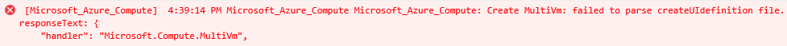

# Test Azure portal interface for your managed application
After [creating the createUiDefinition.json file](create-uidefinition-overview.md) for your Azure Managed Application, you need to test the user experience. To simplify testing, use a script that loads your file in the portal. You don't need to actually deploy your managed application.

## Prerequisites

* A **createUiDefinition.json** file. If you don't have this file, copy the [sample file](https://github.com/Azure/azure-quickstart-templates/blob/master/100-marketplace-sample/createUiDefinition.json) and save it locally.

* An Azure subscription. If you don't have an Azure subscription, [create a free account](https://azure.microsoft.com/free/) before you begin.

## Download test script

To test your interface in the portal, copy one of the following scripts to your local machine:

* [PowerShell side-load script](https://github.com/Azure/azure-quickstart-templates/blob/master/SideLoad-CreateUIDefinition.ps1)
* [Azure CLI side-load script](https://github.com/Azure/azure-quickstart-templates/blob/master/sideload-createuidef.sh)

## Run script

To see your interface file in the portal, run your downloaded script. The script creates a storage account in your Azure subscription, and uploads your createUiDefinition.json file to the storage account. The storage account is created the first time you run the script or if the storage account has been deleted. If the storage account already exists in your Azure subscription, the script reuses it. The script opens the portal and loads your file from the storage account.

Provide a location for the storage account, and specify the folder that has your createUiDefinition.json file.

For PowerShell, use:

```powershell
.\SideLoad-CreateUIDefinition.ps1 `
  -StorageResourceGroupLocation southcentralus `
  -ArtifactsStagingDirectory .\100-Marketplace-Sample
```

For Azure CLI, use:

```azurecli
./sideload-createuidef.sh \
  -l southcentralus \
  -a .\100-Marketplace-Sample
```

If your createUiDefinition.json file is in the same folder as the script, and you've already created the storage account, you don't need to provide those parameters.

For PowerShell, use:

```powershell
.\SideLoad-CreateUIDefinition.ps1
```

For Azure CLI, use:

```azurecli
./sideload-createuidef.sh
```

## Test your interface

The script opens a new tab in your browser. It displays the portal with your interface for creating the managed application.



Before filling out the fields, open the Web Developer Tools in your browser. The **Console** displays important messages about your interface.



If your interface definition has an error, you see the description in the console.



Provide values for the fields. When finished, you see the values that are passed to the template.


You can use these values as the parameter file for testing your deployment template.

## Troubleshooting the interface

Some common errors you might see are:

* The portal doesn't load your interface. Instead, it shows an icon of a cloud with tear drop. Usually, you see this icon when there's a syntax error in your file. Open the file in VS Code (or other JSON editor that has schema validation) and look for syntax errors.

* The portal hangs at the summary screen. Usually, this interruption happens when there's a bug in the output section. For example, you may have referenced a control that doesn't exist.

* A parameter in the output is empty. The parameter might be referencing a property that doesn't exist. For example, the reference to the control is valid, but the property reference isn't valid.

## Test your solution files

Now that you've verified your portal interface is working as expected, it's time to validate that your createUiDefinition file is properly integrated with your mainTemplate.json file. You can run a validation script test to test the content of your solution files, including the createUiDefinition file. The script validates the JSON syntax, checks for regex expressions on text fields, and makes sure the output values of the portal interface match the parameters of your template. For information on running this script, see [Run static validation checks for templates](https://github.com/Azure/azure-quickstart-templates/tree/master/test/template-validation-tests).

## Next steps

After validating your portal interface, learn about making your [Azure managed application available in the Marketplace](publish-marketplace-app.md).
