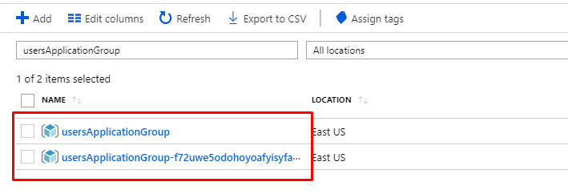
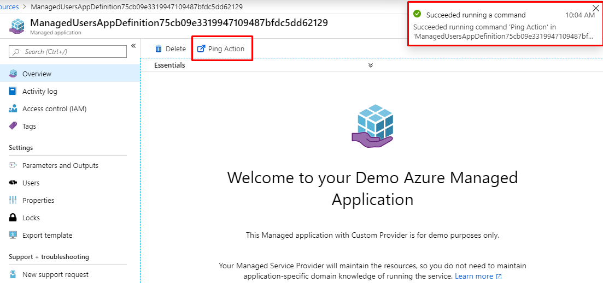
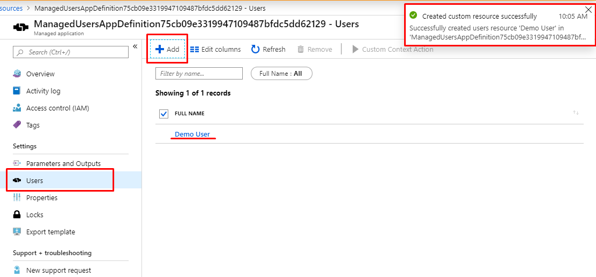
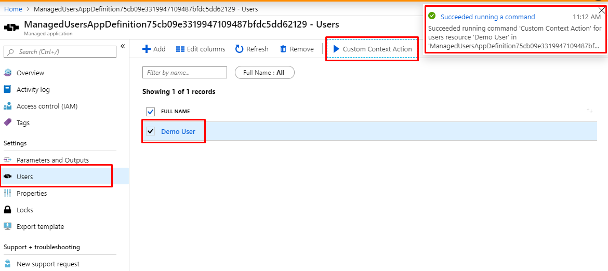

# Tutorial: Create managed application with custom actions and resources

In this tutorial, you create your own managed application with custom actions and resources. The managed application will contain a custom action on the `Overview` page, a custom resource type displayed as a separate menu item in `Table of Content` and a custom context action on the custom resource page.

This tutorial includes the following steps:

> [!div class="checklist"]
> * Author user interface definition file for creating a managed application instance
> * Author deployment template with Azure Custom Provider, Azure Storage Account and Azure Function
> * Author view definition artifact with custom actions and resources
> * Deploy a managed application definition
> * Deploy an instance of managed application
> * Perform custom actions and create custom resources

## Prerequisites

To complete this tutorial, you need to know:

* How to [Create and publish a managed application definition](publish-service-catalog-app.md)
* How to [Deploy Service Catalog app through Azure portal](deploy-service-catalog-quickstart.md)
* How to [Create Azure portal user interface for your managed application](create-uidefinition-overview.md)
* [View definition artifact](concepts-view-definition.md) capabilities
* [Azure Custom Provider](custom-providers-overview.md) capabilities

## Authoring user interface definition file

In this tutorial, you create a managed application and its managed resource group will contain custom provider instance, storage account, and function. The Azure Function used in this example implements an API that handles custom provider operations for actions and resources. Azure Storage Account is used as basic storage for your custom provider resources.

The user interface definition for creating a managed application instance includes `funcname` and `storagename` input elements. Storage account name and function name must be globally unique. By default function files will be deployed from [sample function package](https://raw.githubusercontent.com/raosuhas/azure-quickstart-templates/master/201-managed-application-with-customprovider/artifacts/functionzip/functionpackage.zip), but you can change it by adding an input element for providing a function package link in *createUIDefinition.json*:

```json
{
  "name": "zipFileBlobUri",
  "type": "Microsoft.Common.TextBox",
  "defaultValue": "https://raw.githubusercontent.com/raosuhas/azure-quickstart-templates/master/201-managed-application-with-customprovider/artifacts/functionzip/functionpackage.zip",
  "label": "The Uri to the uploaded function zip file",
  "toolTip": "The Uri to the uploaded function zip file",
  "visible": true
}
```

and output in *createUIDefinition.json*:

```json
  "zipFileBlobUri": "[steps('applicationSettings').zipFileBlobUri]"
```

<br>
<details>
<summary>Show <i>createUiDefinition.json</i> file</summary>

```json
{
  "$schema": "https://schema.management.azure.com/schemas/0.1.2-preview/CreateUIDefinition.MultiVm.json#",
  "handler": "Microsoft.Azure.CreateUIDef",
  "version": "0.1.2-preview",
  "parameters": {
    "basics": [
      {}
    ],
    "steps": [
      {
        "name": "applicationSettings",
        "label": "Application Settings",
        "subLabel": {
          "preValidation": "Configure your application settings",
          "postValidation": "Done"
        },
        "bladeTitle": "Application Settings",
        "elements": [
          {
            "name": "funcname",
            "type": "Microsoft.Common.TextBox",
            "label": "Name of the function to be created",
            "toolTip": "Name of the function to be created",
            "visible": true,
            "constraints": {
              "required": true
            }
          },
          {
            "name": "storagename",
            "type": "Microsoft.Common.TextBox",
            "label": "Name of the storage to be created",
            "toolTip": "Name of the storage to be created",
            "visible": true,
            "constraints": {
              "required": true
            }
          }
        ]
      }
    ],
    "outputs": {
      "funcname": "[steps('applicationSettings').funcname]",
      "storageName": "[steps('applicationSettings').storagename]"
    }
  }
}
```

</details>

## Authoring deployment template with custom provider

To create a managed application instance with custom provider, you need to define custom provider resource of type **Microsoft.CustomProviders/resourceProviders** in your **mainTemplate.json**. In that resource, you define the resource types and actions for your service. To deploy Azure Function and Azure Storage Account instances define resources of type `Microsoft.Web/sites` and `Microsoft.Storage/storageAccounts` respectively.

In this tutorial, you create one `users` resource type, `ping` custom action, and `users/contextAction` custom action that will be performed in a context of a `users` custom resource. For each resource type and action provide an endpoint pointing to the function with name provided in [createUIDefinition.json](#authoring-user-interface-definition-file). Specify the **routingType** as `Proxy,Cache` for resource types and `Proxy` for actions:

```json
{
  "apiVersion": "[variables('customrpApiversion')]",
  "type": "Microsoft.CustomProviders/resourceProviders",
  "name": "[variables('customProviderName')]",
  "location": "[parameters('location')]",
  "properties": {
    "actions": [
      {
        "name": "ping",
        "routingType": "Proxy",
        "endpoint": "[listSecrets(resourceId('Microsoft.Web/sites/functions', parameters('funcname'), 'HttpTrigger1'), '2018-02-01').trigger_url]"
      },
      {
        "name": "users/contextAction",
        "routingType": "Proxy",
        "endpoint": "[listSecrets(resourceId('Microsoft.Web/sites/functions', parameters('funcname'), 'HttpTrigger1'), '2018-02-01').trigger_url]"
      }
    ],
    "resourceTypes": [
      {
        "name": "users",
        "routingType": "Proxy,Cache",
        "endpoint": "[listSecrets(resourceId('Microsoft.Web/sites/functions', parameters('funcname'), 'HttpTrigger1'), '2018-02-01').trigger_url]"
      }
    ]
  },
  "dependsOn": [
    "[concat('Microsoft.Web/sites/',parameters('funcname'))]"
  ]
}
```

<br>
<details>
<summary>Show full <i>mainTemplate.json</i> file</summary>

```json
{
  "$schema": "http://schema.management.azure.com/schemas/2014-04-01-preview/deploymentTemplate.json#",
  "contentVersion": "1.0.0.0",
  "parameters": {
    "location": {
      "type": "string",
      "defaultValue": "eastus",
      "allowedValues": [
        "australiaeast",
        "eastus",
        "westeurope"
      ],
      "metadata": {
        "description": "Location for the resources."
      }
    },
    "funcname": {
      "type": "string",
      "metadata": {
        "description": "Name of the Azure Function that hosts the code. Must be globally unique"
      },
      "defaultValue": ""
    },
    "storageName": {
      "type": "string",
      "metadata": {
        "description": "Name of the storage account that hosts the function. Must be globally unique. The field can contain only lowercase letters and numbers. Name must be between 3 and 24 characters"
      },
      "defaultValue": ""
    },
    "zipFileBlobUri": {
      "type": "string",
      "defaultValue": "https://raw.githubusercontent.com/raosuhas/azure-quickstart-templates/master/201-managed-application-with-customprovider/artifacts/functionzip/functionpackage.zip",
      "metadata": {
        "description": "The Uri to the uploaded function zip file"
      }
    }
  },
  "variables": {
    "customrpApiversion": "2018-09-01-preview",
    "customProviderName": "public",
    "serverFarmName": "functionPlan"
  },
  "resources": [
    {
      "type": "Microsoft.Web/serverfarms",
      "apiVersion": "2016-09-01",
      "name": "[variables('serverFarmName')]",
      "location": "[parameters('location')]",
      "sku": {
        "name": "Y1",
        "tier": "Dynamic",
        "size": "Y1",
        "family": "Y",
        "capacity": 0
      },
      "kind": "functionapp",
      "properties": {
        "name": "[variables('serverFarmName')]",
        "perSiteScaling": false,
        "reserved": false,
        "targetWorkerCount": 0,
        "targetWorkerSizeId": 0
      }
    },
    {
      "type": "Microsoft.Web/sites",
      "kind": "functionapp",
      "name": "[parameters('funcname')]",
      "apiVersion": "2018-02-01",
      "location": "[parameters('location')]",
      "dependsOn": [
        "[resourceId('Microsoft.Storage/storageAccounts', parameters('storageName'))]",
        "[resourceId('Microsoft.Web/serverfarms', variables('serverFarmName'))]"
      ],
      "identity": {
        "type": "SystemAssigned"
      },
      "properties": {
        "name": "[parameters('funcname')]",
        "siteConfig": {
          "appSettings": [
            {
              "name": "AzureWebJobsDashboard",
              "value": "[concat('DefaultEndpointsProtocol=https;AccountName=',parameters('storageName'),';AccountKey=',listKeys(resourceId('Microsoft.Storage/storageAccounts', parameters('storageName')), '2015-05-01-preview').key1)]"
            },
            {
              "name": "AzureWebJobsStorage",
              "value": "[concat('DefaultEndpointsProtocol=https;AccountName=',parameters('storageName'),';AccountKey=',listKeys(resourceId('Microsoft.Storage/storageAccounts', parameters('storageName')), '2015-05-01-preview').key1)]"
            },
            {
              "name": "FUNCTIONS_EXTENSION_VERSION",
              "value": "~2"
            },
            {
              "name": "AzureWebJobsSecretStorageType",
              "value": "Files"
            },
            {
              "name": "WEBSITE_CONTENTAZUREFILECONNECTIONSTRING",
              "value": "[concat('DefaultEndpointsProtocol=https;AccountName=',parameters('storageName'),';AccountKey=',listKeys(resourceId('Microsoft.Storage/storageAccounts', parameters('storageName')), '2015-05-01-preview').key1)]"
            },
            {
              "name": "WEBSITE_CONTENTSHARE",
              "value": "[concat(toLower(parameters('funcname')), 'b86e')]"
            },
            {
              "name": "WEBSITE_NODE_DEFAULT_VERSION",
              "value": "6.5.0"
            },
            {
              "name": "WEBSITE_RUN_FROM_PACKAGE",
              "value": "[parameters('zipFileBlobUri')]"
            }
          ]
        },
        "clientAffinityEnabled": false,
        "reserved": false,
        "serverFarmId": "[resourceId('Microsoft.Web/serverfarms', variables('serverFarmName'))]"
      }
    },
    {
      "type": "Microsoft.Storage/storageAccounts",
      "name": "[parameters('storageName')]",
      "apiVersion": "2018-02-01",
      "kind": "StorageV2",
      "location": "[parameters('location')]",
      "sku": {
        "name": "Standard_LRS"
      }
    },
    {
      "apiVersion": "[variables('customrpApiversion')]",
      "type": "Microsoft.CustomProviders/resourceProviders",
      "name": "[variables('customProviderName')]",
      "location": "[parameters('location')]",
      "properties": {
        "actions": [
          {
            "name": "ping",
            "routingType": "Proxy",
            "endpoint": "[listSecrets(resourceId('Microsoft.Web/sites/functions', parameters('funcname'), 'HttpTrigger1'), '2018-02-01').trigger_url]"
          },
          {
            "name": "users/contextAction",
            "routingType": "Proxy",
            "endpoint": "[listSecrets(resourceId('Microsoft.Web/sites/functions', parameters('funcname'), 'HttpTrigger1'), '2018-02-01').trigger_url]"
          }
        ],
        "resourceTypes": [
          {
            "name": "users",
            "routingType": "Proxy,Cache",
            "endpoint": "[listSecrets(resourceId('Microsoft.Web/sites/functions', parameters('funcname'), 'HttpTrigger1'), '2018-02-01').trigger_url]"
          }
        ]
      },
      "dependsOn": [
        "[concat('Microsoft.Web/sites/',parameters('funcname'))]"
      ]
    }
  ],
  "outputs": {}
}
```

</details>

## Authoring view definition artifact

To define user interface that includes custom actions and custom resources in your managed application, you need to author **viewDefinition.json** artifact. For more information about view definition artifact, see [View definition artifact in Azure Managed Applications](concepts-view-definition.md).

In this tutorial, you define:
* *Overview* page with toolbar button that represents a custom action `TestAction` with basic text input.
* *Users* page that represents a custom resource type `users`.
* Custom resource action `users/contextAction` in *Users* page that will be performed in a context of custom resource of type `users`.

<br>
<details>
<summary>Show <i>viewDefinition.json</i> file</summary>

```json
{
  "views": [{
    "kind": "Overview",
    "properties": {
      "header": "Welcome to your Demo Azure Managed Application",
      "description": "This Managed application with Custom Provider is for demo purposes only.",
      "commands": [{
          "displayName": "Ping Action",
          "path": "/customping",
          "icon": "LaunchCurrent"
      }]
    }
  },
  {
    "kind": "CustomResources",
    "properties": {
      "displayName": "Users",
      "version": "1.0.0.0",
      "resourceType": "users",
      "createUIDefinition": {
        "parameters": {
          "steps": [{
            "name": "add",
            "label": "Add user",
            "elements": [{
              "name": "name",
              "label": "User's Full Name",
              "type": "Microsoft.Common.TextBox",
              "defaultValue": "",
              "toolTip": "Provide a full user name.",
              "constraints": { "required": true }
            },
            {
              "name": "location",
              "label": "User's Location",
              "type": "Microsoft.Common.TextBox",
              "defaultValue": "",
              "toolTip": "Provide a Location.",
              "constraints": { "required": true }
            }]
          }],
          "outputs": {
            "name": "[steps('add').name]",
            "properties": {
              "FullName": "[steps('add').name]",
              "Location": "[steps('add').location]"
            }
          }
        }
      },
      "commands": [{
        "displayName": "Custom Context Action",
        "path": "users/contextAction",
        "icon": "Start"
      }],
      "columns": [
        { "key": "properties.FullName", "displayName": "Full Name" },
        { "key": "properties.Location", "displayName": "Location", "optional": true }
      ]
    }
  }]
}
```

</details>

## Deploy a managed application definition

Package the following managed application artifacts to zip archive and upload it to storage:

* createUiDefinition.json
* mainTemplate.json
* viewDefinition.json

All files must be at root level. The package with artifacts can be stored in any storage, for example GitHub blob or Azure Storage Account blob. Here is a script to upload the application package to storage account: 

[!INCLUDE [sample-cli-install](../../includes/sample-cli-install.md)]

```powershell
$resourceGroup="appResourcesGroup"
$storageName="mystorageaccount$RANDOM"

# Sign in to your Azure subscription
Connect-AzAccount
# Create resource group for managed application definition and application package
New-AzResourceGroup -Name $resourceGroup -Location eastus

# Create storage account for a package with application artifacts
$storageAccount=New-AzStorageAccount `
  -ResourceGroupName $resourceGroup `
  -Name $storageName `
  -SkuName Standard_LRS `
  -Location eastus `
$ctx=$storageAccount.Context

# Create storage container and upload zip to blob
New-AzStorageContainer -Name appcontainer -Context $ctx -Permission blob
Set-AzStorageBlobContent `
  -File "path_to_your_zip_package" `
  -Container appcontainer `
  -Blob app.zip `
  -Context $ctx 

# Get blob absolute uri
$blobUri=(Get-AzureStorageBlob -Container appcontainer -Blob app.zip -Context $ctx).ICloudBlob.uri.AbsoluteUri
```

Run the Azure CLI script below or follow the steps in Azure portal to deploy a Service Catalog managed application definition:

# [Azure CLI](#tab/azurecli-interactive)

```azurecli-interactive
resourceGroup="appResourcesGroup"
# Select subscription and create resource group (if you have not created yet)
az account set --subscription <subscriptionID>
az group create --name $resourceGroup --location eastus

# Get object ID of your identity
userid=$(az ad user show --upn-or-object-id example@contoso.org --query objectId --output tsv)
# Get role definition ID for the Owner role
roleid=$(az role definition list --name Owner --query [].name --output tsv)

# Create managed application definition resource
az managedapp definition create \
  --name "ManagedUsersAppDefinition" \
  --location "eastus" \
  --resource-group $resourceGroup \
  --lock-level ReadOnly \
  --display-name "Managed users app definition" \
  --description "Managed application with Azure Custom Provider" \
  --authorizations "$userid:$roleid" \
  --package-file-uri "path to your app.zip package"
```

# [Portal](#tab/azure-portal)

1. In the Azure portal, select **All services**. In the list of resources, type and select **Managed Applications Center**.
2. On the **Managed Applications Center**, choose **Service Catalog application definition** and click **Add**. 
    
    

3. Provide values for creating a Service Catalog definition:

    * Provide a unique **Name** for the Service Catalog definition, **Display Name** and *Description*(optional).
    * Select the **Subscription**, **Resource group**, and **Location** where application definition will be created. You can use the same resource group that is used for zip package or create a new resource group.
    * For a **Package File Uri**, provide the path to the zip file you created in previous step.

    

4. When you get to the Authentication and Lock Level section, select **Add Authorization**.

    

5. Select an Azure Active Directory group to manage the resources, and select **OK**.

   

6. When you have provided all the values, select **Create**.

   

---

## Deploying an instance of managed application

When managed application definition is deployed, run the script below or follow the steps in Azure portal to deploy your managed application instance with custom provider:

# [Azure CLI](#tab/azurecli-interactive)

```azurecli-interactive
appResourcesGroup="appResourcesGroup"
applicationGroup="usersApplicationGroup"

# Create resource group for managed application instance
az group create --name $applicationGroup --location eastus

# Get ID of managed application definition
appid=$(az managedapp definition show --name ManagedUsersAppDefinition --resource-group $appResourcesGroup --query id --output tsv)

# Create the managed application
az managedapp create \
  --name ManagedUsersApp \
  --location "eastus" \
  --kind "Servicecatalog" \
  --resource-group $applicationGroup \
  --managedapp-definition-id $appid \
  --managed-rg-id "managedResourcesGroup" \
  --parameters "{\"funcname\": {\"value\": \"managedusersappfunction\"}, \"storageName\": {\"value\": \"managedusersappstorage\"}}"
```

# [Portal](#tab/azure-portal)

1. In the Azure portal, select **All services**. In the list of resources, type and select **Managed Applications Center**.
2. On the **Managed Applications Center**, choose **Service Catalog applications** and click **Add**. 

    

3. In **Service Catalog applications** page type Service Catalog definition display name in search box and select definition created in previous step and click **Create**.

    

4. Provide values for creating a managed application instance from Service Catalog definition:

    * Select the **Subscription**, **Resource group**, and **Location** where application instance will be created.
    * Provide a unique Azure Function name and Azure Storage Account name.

    

5. When validation passed, click **OK** to deploy an instance of a managed application. 
    
    

---

## Performing custom provider actions and create resources

After the service catalog application instance has been deployed, you have two new resource groups. First resource group `applicationGroup` contains an instance of the managed application, second resource group `managedResourceGroup` holds the resources for the managed application, including **custom provider**.



You can go to managed application instance and perform **custom action** in "Overview" page, create **users** custom resource in "Users" page and run **custom context action** on custom resource.

<br>
<details>
<summary>Show details</summary>







</details>

[!INCLUDE [clean-up-section-portal](../../includes/clean-up-section-portal.md)]

## Looking for help

If you have questions about Azure Managed Applications, try asking on [Stack Overflow](http://stackoverflow.com/questions/tagged/azure-managedapps). A similar question may have already been asked and answered, so check first before posting. Add the tag `azure-managedapps` to get a fast response!

## Next Steps

> To publish your managed application to the Azure Marketplace, see [Azure managed applications in the Marketplace](publish-marketplace-app.md).
