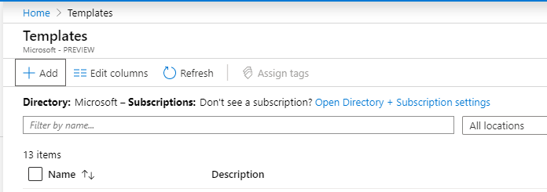
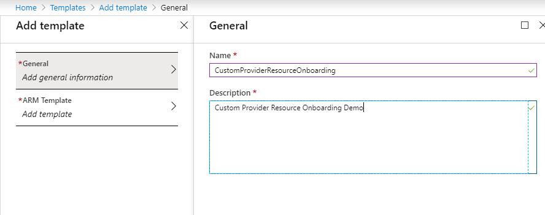
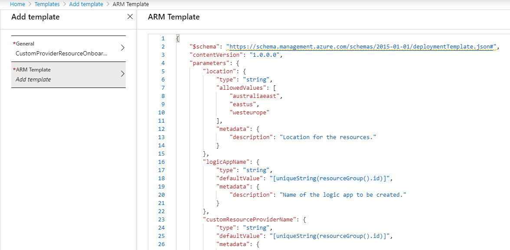
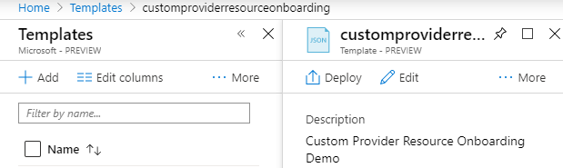
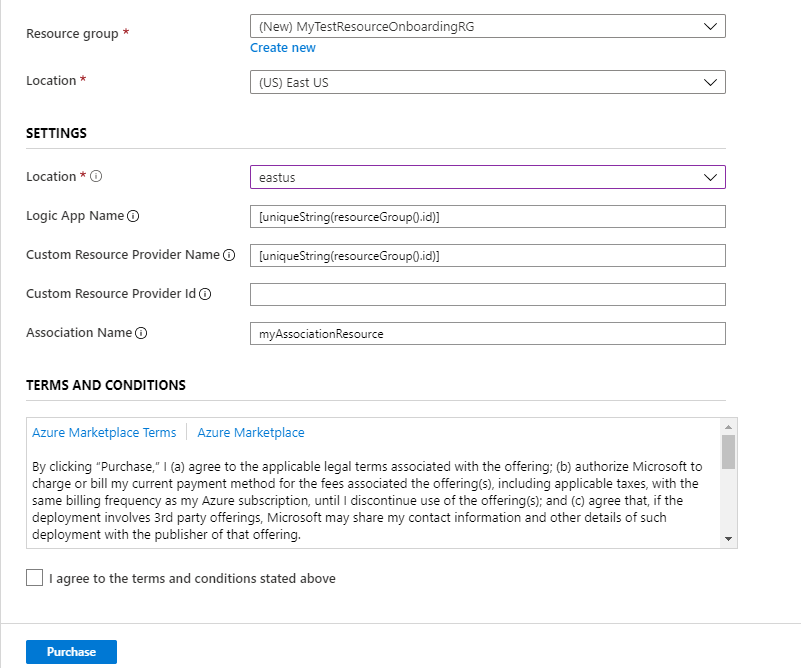
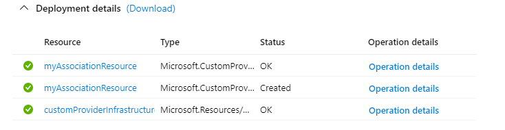

# Tutorial: resource onboarding with Azure Custom Providers

This tutorial will deploy a custom resource provider to Azure that extends the Azure Resource Manager API with the "Microsoft.CustomProviders/associations" resource type. This sample shows how to extend existing resources that are outside the resource group where the custom provider instance lives. In this sample, the custom resource provider is powered by an Azure Logic App, but any public API endpoint can be used.

## Prerequisites

To complete this tutorial, you need to know:

* [Azure Custom Provider](custom-providers-overview.md) capabilities.
* [Resource onboarding with custom providers](concepts-custom-providers-resourceonboarding.md).

## Getting started with resource onboarding

For this sample, there are two pieces that need to be deployed: the custom provider and the association. To simplify the sample, there is a single template that can optionally deploy both.

The template will make use of the following resources:

* Microsoft.CustomProviders/resourceProviders
* Microsoft.Logic/workflows
* Microsoft.CustomProviders/associations

```json
{
    "$schema": "https://schema.management.azure.com/schemas/2015-01-01/deploymentTemplate.json#",
    "contentVersion": "1.0.0.0",
    "parameters": {
        "location": {
            "type": "string",
            "allowedValues": [
                "australiaeast",
                "eastus",
                "westeurope"
            ],
            "metadata": {
                "description": "Location for the resources."
            }
        },
        "logicAppName": {
            "type": "string",
            "defaultValue": "[uniqueString(resourceGroup().id)]",
            "metadata": {
                "description": "Name of the logic app to be created."
            }
        },
        "customResourceProviderName": {
            "type": "string",
            "defaultValue": "[uniqueString(resourceGroup().id)]",
            "metadata": {
                "description": "Name of the custom provider to be created."
            }
        },
        "customResourceProviderId": {
            "type": "string",
            "defaultValue": "",
            "metadata": {
                "description": "The resource ID of an existing custom provider. Provide this to skip deployment of new logic app and custom provider."
            }
        },
        "associationName": {
            "type": "string",
            "defaultValue": "myAssociationResource",
            "metadata": {
                "description": "Name of the custom resource that is being created."
            }
        }
    },
    "resources": [
        {
            "type": "Microsoft.Resources/deployments",
            "apiVersion": "2017-05-10",
            "condition": "[empty(parameters('customResourceProviderId'))]",
            "name": "customProviderInfrastructureTemplate",
            "properties": {
                "mode": "Incremental",
                "template": {
                    "$schema": "https://schema.management.azure.com/schemas/2015-01-01/deploymentTemplate.json#",
                    "contentVersion": "1.0.0.0",
                    "parameters": {
                        "logicAppName": {
                            "type": "string",
                            "defaultValue": "[parameters('logicAppName')]"
                        }
                    },
                    "resources": [
                        {
                            "type": "Microsoft.Logic/workflows",
                            "apiVersion": "2017-07-01",
                            "name": "[parameters('logicAppName')]",
                            "location": "[parameters('location')]",
                            "properties": {
                                "state": "Enabled",
                                "definition": {
                                    "$schema": "https://schema.management.azure.com/providers/Microsoft.Logic/schemas/2016-06-01/workflowdefinition.json#",
                                    "actions": {
                                        "Switch": {
                                            "cases": {
                                                "Case": {
                                                    "actions": {
                                                        "CreateCustomResource": {
                                                            "inputs": {
                                                                "body": {
                                                                    "properties": "@addProperty(triggerBody().Body['properties'], 'myDynamicProperty', 'myDynamicValue')"
                                                                },
                                                                "statusCode": 200
                                                            },
                                                            "kind": "Http",
                                                            "type": "Response"
                                                        }
                                                    },
                                                    "case": "CREATE"
                                                }
                                            },
                                            "default": {
                                                "actions": {
                                                    "DefaultHttpResponse": {
                                                        "inputs": {
                                                            "statusCode": 200
                                                        },
                                                        "kind": "Http",
                                                        "type": "Response"
                                                    }
                                                }
                                            },
                                            "expression": "@triggerBody().operationType",
                                            "type": "Switch"
                                        }
                                    },
                                    "contentVersion": "1.0.0.0",
                                    "outputs": {},
                                    "parameters": {},
                                    "triggers": {
                                        "CustomProviderWebhook": {
                                            "inputs": {
                                                "schema": {}
                                            },
                                            "kind": "Http",
                                            "type": "Request"
                                        }
                                    }
                                }
                            }
                        },
                        {
                            "type": "Microsoft.CustomProviders/resourceProviders",
                            "apiVersion": "2018-09-01-preview",
                            "name": "[parameters('customResourceProviderName')]",
                            "location": "[parameters('location')]",
                            "properties": {
                                "resourceTypes": [
                                    {
                                        "name": "associations",
                                        "mode": "Secure",
                                        "routingType": "Webhook,Cache,Extension",
                                        "endpoint": "[[listCallbackURL(concat(resourceId('Microsoft.Logic/workflows', parameters('logicAppName')), '/triggers/CustomProviderWebhook'), '2017-07-01').value]"
                                    }
                                ]
                            }
                        }
                    ],
                    "outputs": {
                        "customProviderResourceId": {
                            "type": "string",
                            "value": "[resourceId('Microsoft.CustomProviders/resourceProviders', parameters('customResourceProviderName'))]"
                        }
                    }
                }
            }
        },
        {
            "type": "Microsoft.CustomProviders/associations",
            "apiVersion": "2018-09-01-preview",
            "name": "[parameters('associationName')]",
            "location": "global",
            "properties": {
                "targetResourceId": "[if(empty(parameters('customResourceProviderId')), reference('customProviderInfrastructureTemplate').outputs.customProviderResourceId.value, parameters('customResourceProviderId'))]",
                "myCustomInputProperty": "myCustomInputValue",
                "myCustomInputObject": {
                    "Property1": "Value1"
                }
            }
        }
    ],
    "outputs": {
        "associationResource": {
            "type": "object",
            "value": "[reference(parameters('associationName'), '2018-09-01-preview', 'Full')]"
        }
    }
}
```

### Deploy the custom provider infrastructure

The first part of the template is deploying the custom provider infrastructure. This infrastructure defines the effect of the "associations" resource. If you are unfamiliar with custom providers, see [custom provider basics](custom-providers-overview.md).

Let's deploy the custom provider infrastructure, either copy, save, and deploy the above template or follow along and deploy through the Azure portal.

1. Open the Azure portal from https://portal.azure.com.

2. Search "templates" in `All Services` or the middle search bar. 


3. Hit the `+ Add` button in the top left of the "Templates" blade.



4. Fill in "name" and "description" fields under "General" for the new template.



5. Fill in the Resource Manager template by copying the JSON template from the "Getting started with resource onboarding"



6. Hit the `Add` button to create a new template. If the new template doesn't show up, hit `Refresh`.

7. Select the newly created template and hit the `Deploy` button.



8. Input the setting parameters for the required fields and select the subscription and resource group. The "Custom Resource Provider ID" can be left empty.

| Setting Name | Required | Description |
| ------------ | -------- | ----------- |
| Location | *yes* | The location for the resources in the template. |
| Logic App Name | *no* | The logic app name. |
| Custom Resource Provider Name | *no* | The custom resource provider name. |
| Custom Resource Provider ID | *no* | An existing custom resource provider that supports the "association" resource. Specifying this will skip the logic app and custom provider deployment. |
| Association Name | *no* | The name of the association resource. |

Sample parameters:



9. Navigate to the deployment and wait for it to finish. It should display success and output the new "association" resource.

Deployment success:



Resource group with "Show hidden types":


10. Explore the logic app "Run history" tab to see the calls for the "association" create.


## Deploy additional associations

Once we have the custom provider infrastructure set up, we can easily deploy additional "associations". The resource group for additional "associations" does not have to be the same as the resource group the custom provider infrastructure was deployed to. In order to create an association, "Microsoft.CustomProviders/resourceproviders/write" permissions are needed on the specified "Custom Resource Provider ID".

1. Navigate to the custom provider "Microsoft.CustomProviders/resourceProviders" resource in the resource group of the previous deployment. The "Show hidden types" checkbox will need to be selected.


2. Copy the "Resource ID" property of the custom provider.

3. Search "templates" in `All Services` or the middle search bar. 


4. Select the previously created template and hit the `Deploy` button.


5. Input the setting parameters for the required fields and select the subscription and a different resource group. For the "Custom Resource Provider ID" setting, input the copied "Resource ID" of the previously deployed custom provider.

6. Navigate to the deployment and wait for it to finish. It should now only deploy the new "associations" resource.


Optionally, you can navigate back to the logic app "Run history" and see that another call was made to the logic app. The logic app can be updated to augment additional functionality for the each created association.

## Looking for help

If you have questions about Azure Custom Providers, try asking on [Stack Overflow](http://stackoverflow.com/questions/tagged/azure-custom-providers). A similar question may have already been asked and answered, so check first before posting. Add the tag `azure-custom-providers` to get a fast response!

