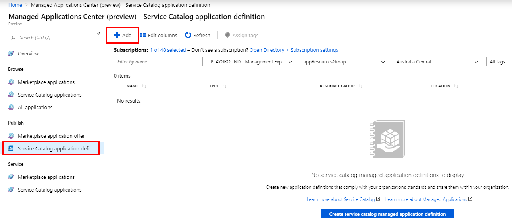
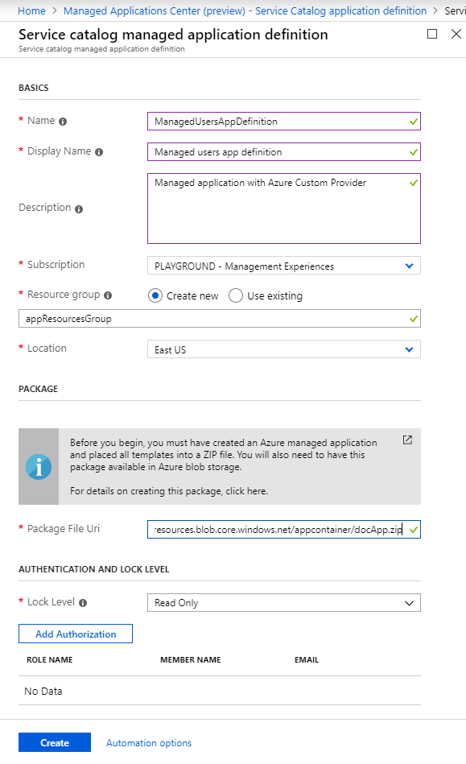
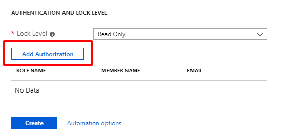
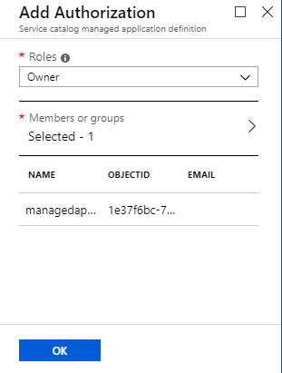
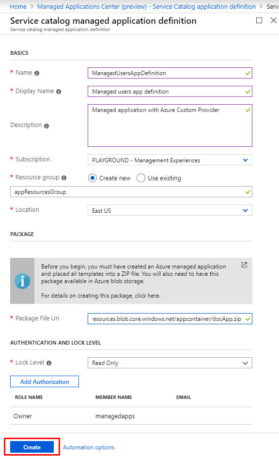
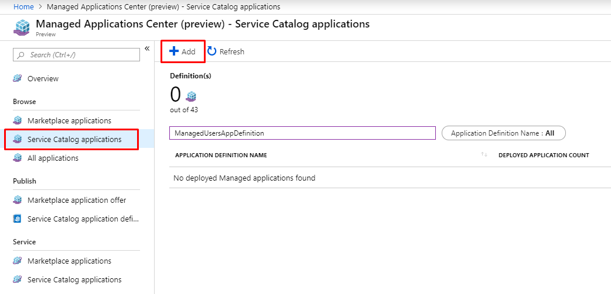
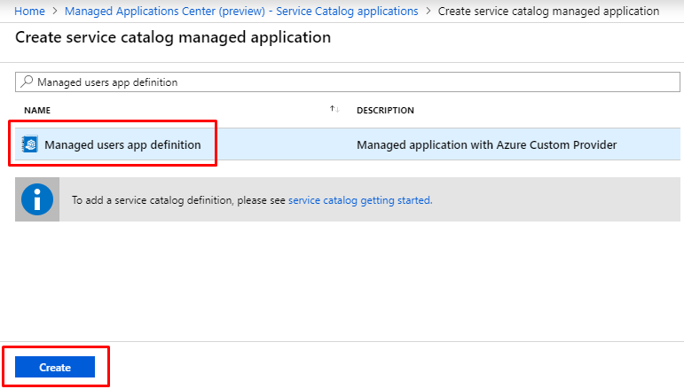
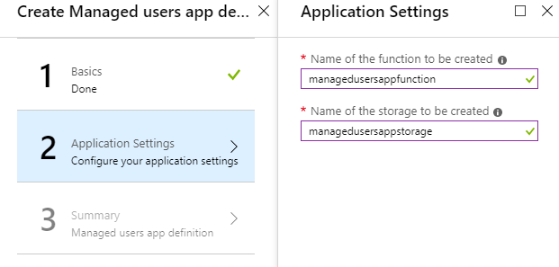
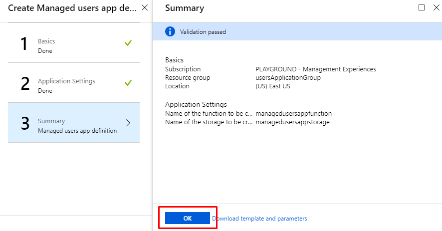

# Tutorial: Create managed application with resource onboarding

In this tutorial, you create your own managed application with resource onboarding. The managed application will contain a custom action on the `Overview` page, a custom resource type displayed as a separate menu item in `Table of Content` and a custom context action on the custom resource page.

This tutorial includes the following steps:

> [!div class="checklist"]
> * Author user interface definition file for creating a managed application instance
> * Author deployment template with Azure Custom Provider, Azure Logic App and Log Analytic Workspaces
> * Author view definition artifact with resource onboarding
> * Author custom role definition artifact
> * Deploy a managed application definition
> * Deploy an instance of managed application
> * Onboard Azure Virtual Machines to the Log Analytics Workspace

## Prerequisites

To complete this tutorial, you need to know:

* How to [Create and publish a managed application definition](publish-service-catalog-app.md).
* How to [Deploy Service Catalog app through Azure portal](deploy-service-catalog-quickstart.md).
* How to [Create Azure portal user interface for your managed application](create-uidefinition-overview.md).
* [View definition artifact](concepts-view-definition.md) capabilities.
* [Azure Custom Provider](custom-providers-overview.md) capabilities.

## User interface definition

In this tutorial, the user interface definition (`createUIDefinition.json`) does not have any required inputs. The user interface definition allows the author of the managed application to accept parameters from the end users, which can applied to the `mainTemplate.json`.

The `createUIDefinition.json` for the managed application:

```json
{
	"$schema": "https://schema.management.azure.com/schemas/0.1.2-preview/CreateUIDefinition.MultiVm.json#",
	"handler": "Microsoft.Azure.CreateUIDef",
	"version": "0.1.2-preview",
	"parameters": {
		"basics": [
			{}
		],
		"steps": [
			{
				"name": "logicApp",
				"label": "Logic App Managed Application",
				"subLabel": {
					"preValidation": "Configure the infrastructure settings",
					"postValidation": "Done"
				},
				"bladeTitle": "Logic App Name",
				"elements": [
					{
						"name": "logicAppName",
						"type": "Microsoft.Common.TextBox",
						"label": "Logic App Name",
						"defaultValue": "myDemoLogicApp",
						"toolTip": "This Azure Logic App Name.",
						"constraints": {
							"required": true,
							"regex": "^[a-z0-9A-Z]{1,30}$",
							"validationMessage": "Only alphanumeric characters are allowed, and the value must be 1-30 characters long."
						},
						"visible": true
					}
				]
			}
		],
		"outputs": {
			"logicAppName": "[steps('logicApp').logicAppName]",
			"managedIdentity": { "type": "SystemAssigned" }
		}
	}
}
```

## Template with custom provider

To create a managed application instance with custom provider, you need to define custom provider resource with name **public** and type **Microsoft.CustomProviders/resourceProviders** in your **mainTemplate.json**. The custom provider allows you to add custom control operations to Azure. In this sample, we will be adding the ability to onboard the MMA agent onto Azure Virtual Machines using Azure Logic Apps, but this concept extends to modifying an Azure Resource.

In this tutorial, you will create one `associations` resource type, which is a special resource type that allows the custom provider to extend existing Azure resources. For more information on associations, see [resource onboarding basics](./concepts-custom-providers-resourceonboarding.md). For this custom provider, we are setting the callback URL of the logic app as the endpoint to handle the side effects. Custom providers can accept any endpoint.

The `mainTemplate.json` for the managed application:

* Azure Custom Provider to extend virtual machines.
* Azure Logic App to apply side effects to virtual machines.
* Log Analytics Workspace to store collected data from the virtual machines.
* Role assignments to give the logic app permission to impersonate the managed application.
* Datasources to configure the data collected through the MMA agent.

```json
{
    "$schema": "https://schema.management.azure.com/schemas/2015-01-01/deploymentTemplate.json#",
    "contentVersion": "1.0.0.0",
    "parameters": {
        "logicAppName": {
            "type": "string",
            "defaultValue": "[newGuid()]"
        },
        "workspaceName": {
            "type": "string",
            "defaultValue": "[uniqueString(resourceGroup().id)]"
        }
    },
    "variables": {
        "managedApplicationId": "[resourceGroup().managedBy]",
        "managedApplicationName": "[last(split(variables('managedApplicationId'), '/'))]",
        "applicationResourceGroupName": "[split(variables('managedApplicationId'), '/')[4]]"
    },
    "resources": [
        {
            "type": "Microsoft.CustomProviders/resourceProviders",
            "apiVersion": "2018-09-01-preview",
            "name": "public",
            "location": "eastus",
            "properties": {
                "resourceTypes": [
                    {
                        "name": "associations",
                        "routingType": "Webhook,Cache,Extension",
                        "endpoint": "[listCallbackURL(concat(resourceId('Microsoft.Logic/workflows', parameters('logicAppName')), '/triggers/CustomProviderWebhook'), '2017-07-01').value]"
                    }
                ]
            },
            "dependsOn": [
                "[concat('Microsoft.Logic/workflows/', parameters('logicAppName'))]"
            ]
        },
        {
            "type": "Microsoft.Logic/workflows",
            "apiVersion": "2017-07-01",
            "name": "[parameters('logicAppName')]",
            "location": "eastus",
            "identity": {
                "type": "SystemAssigned"
            },
            "properties": {
                "state": "Enabled",
                "definition": {
                    "$schema": "https://schema.management.azure.com/providers/Microsoft.Logic/schemas/2016-06-01/workflowdefinition.json#",
                    "actions": {
                        "Switch": {
                            "cases": {
                                "Case": {
                                    "actions": {
                                        "AddMMAExtension": {
                                            "inputs": {
                                                "body": {
                                                    "location": "@{body('GetVM').location}",
                                                    "properties": {
                                                        "autoUpgradeMinorVersion": true,
                                                        "protectedSettings": {
                                                            "workspaceKey": "@{parameters('workspaceKey')}"
                                                        },
                                                        "publisher": "Microsoft.EnterpriseCloud.Monitoring",
                                                        "settings": {
                                                            "workspaceId": "@{parameters('workspaceId')}"
                                                        },
                                                        "type": "MicrosoftMonitoringAgent",
                                                        "typeHandlerVersion": "1.0"
                                                    }
                                                },
                                                "headers": {
                                                    "Authorization": "Bearer @{first(body('ListTokens').value).access_token}"
                                                },
                                                "method": "PUT",
                                                "queries": {
                                                    "api-version": "2015-06-15"
                                                },
                                                "uri": "https://management.azure.com/@{triggerOutputs()?['headers']?['x-ms-customproviders-extendedresource']}/extensions/OMSExtension"
                                            },
                                            "runAfter": {
                                                "GetVM": [
                                                    "Succeeded"
                                                ]
                                            },
                                            "type": "Http"
                                        },
                                        "CreateResponse": {
                                            "inputs": {
                                                "body": {
                                                    "Properties": {}
                                                },
                                                "statusCode": 200
                                            },
                                            "kind": "Http",
                                            "runAfter": {
                                                "AddMMAExtension": [
                                                    "Succeeded"
                                                ]
                                            },
                                            "type": "Response"
                                        },
                                        "GetVM": {
                                            "inputs": {
                                                "headers": {
                                                    "Authorization": "Bearer @{first(body('ListTokens').value).access_token}"
                                                },
                                                "method": "GET",
                                                "queries": {
                                                    "api-version": "2015-06-15"
                                                },
                                                "uri": "https://management.azure.com/@{triggerOutputs()?['headers']?['x-ms-customproviders-extendedresource']}"
                                            },
                                            "runAfter": {
                                                "ListTokens": [
                                                    "Succeeded"
                                                ]
                                            },
                                            "type": "Http"
                                        },
                                        "ListTokens": {
                                            "inputs": {
                                                "authentication": {
                                                    "type": "ManagedServiceIdentity"
                                                },
                                                "body": {},
                                                "method": "POST",
                                                "queries": {
                                                    "api-version": "2018-09-01-preview"
                                                },
                                                "uri": "https://management.azure.com/@{parameters('managedApplicationId')}/listTokens"
                                            },
                                            "runAfter": {},
                                            "type": "Http"
                                        }
                                    },
                                    "case": "CREATE"
                                },
                                "Case_2": {
                                    "actions": {
                                        "DeleteResponse": {
                                            "inputs": {
                                                "statusCode": 200
                                            },
                                            "kind": "Http",
                                            "runAfter": {},
                                            "type": "Response"
                                        }
                                    },
                                    "case": "DELETE"
                                }
                            },
                            "default": {
                                "actions": {
                                    "ErrorResponse": {
                                        "inputs": {
                                            "body": {
                                                "error": {
                                                    "code": "UnsupportedOperation",
                                                    "message": "Invalid Operation Type!"
                                                }
                                            },
                                            "statusCode": 400
                                        },
                                        "kind": "Http",
                                        "runAfter": {},
                                        "type": "Response"
                                    }
                                }
                            },
                            "expression": "@triggerBody().operationType",
                            "runAfter": {},
                            "type": "Switch"
                        }
                    },
                    "contentVersion": "1.0.0.0",
                    "outputs": {},
                    "parameters": {
                        "managedApplicationId": {
                            "defaultValue": "[variables('managedApplicationId')]",
                            "type": "string"
                        },
                        "workspaceId": {
                            "defaultValue": "[reference(resourceId('Microsoft.OperationalInsights/workspaces/', parameters('workspaceName')), '2015-03-20').customerId]",
                            "type": "String"
                        },
                        "workspaceKey": {
                            "defaultValue": "[listKeys(resourceId('Microsoft.OperationalInsights/workspaces/', parameters('workspaceName')), '2015-03-20').primarySharedKey]",
                            "type": "String"
                        }
                    },
                    "triggers": {
                        "CustomProviderWebhook": {
                            "inputs": {
                                "method": "POST",
                                "schema": {}
                            },
                            "kind": "Http",
                            "type": "Request"
                        }
                    }
                }
            },
            "dependsOn": [
                "[concat('Microsoft.OperationalInsights/workspaces/', parameters('workspaceName'))]"
            ]
        },
        {
            "type": "Microsoft.Resources/deployments",
            "apiVersion": "2017-05-10",
            "name": "roleAssignmentNestedTemplate",
            "resourceGroup": "[variables('applicationResourceGroupName')]",
            "properties": {
                "mode": "Incremental",
                "template": {
                    "$schema": "https://schema.management.azure.com/schemas/2015-01-01/deploymentTemplate.json#",
                    "contentVersion": "1.0.0.0",
                    "resources": [
                        {
                            "type": "Microsoft.Solutions/applications/providers/roleAssignments",
                            "apiVersion": "2019-04-01-preview",
                            "name": "[concat(variables('managedApplicationName'), '/Microsoft.Authorization/', guid(resourceGroup().id))]",
                            "properties": {
                                "roleDefinitionId": "[concat(subscription().id, '/providers/Microsoft.Authorization/roleDefinitions/', '8e3af657-a8ff-443c-a75c-2fe8c4bcb635')]",
                                "principalId": "[reference(parameters('logicAppName'), '2017-07-01', 'Full').identity.principalId]",
                                "scope": "[variables('managedApplicationId')]",
                                "principalType": "ServicePrincipal"
                            }
                        }
                    ]
                }
            },
            "dependsOn": [
                "[concat('Microsoft.Logic/workflows/', parameters('logicAppName'))]"
            ]
        },
        {
            "type": "microsoft.operationalinsights/workspaces",
            "apiVersion": "2015-11-01-preview",
            "name": "[parameters('workspaceName')]",
            "location": "eastus",
            "properties": {
                "source": "Azure",
                "sku": {
                    "name": "pergb2018"
                },
                "retentionInDays": 30
            }
        },
        {
            "apiVersion": "2015-11-01-preview",
            "type": "Microsoft.OperationalInsights/workspaces/datasources",
            "name": "[concat(parameters('workspaceName'), '/windowMemory')]",
            "dependsOn": [
                "[concat('Microsoft.OperationalInsights/workspaces/', parameters('workspaceName'))]"
            ],
            "kind": "WindowsPerformanceCounter",
            "properties": {
                "counterName": "Available MBytes",
                "instanceName": "*",
                "intervalSeconds": 10,
                "objectName": "Memory",
                "collectorType": "Default"
            }
        },
        {
            "apiVersion": "2015-11-01-preview",
            "type": "Microsoft.OperationalInsights/workspaces/datasources",
            "name": "[concat(parameters('workspaceName'), '/windowProcessor')]",
            "dependsOn": [
                "[concat('Microsoft.OperationalInsights/workspaces/', parameters('workspaceName'))]"
            ],
            "kind": "WindowsPerformanceCounter",
            "properties": {
                "counterName": "% Processor Time",
                "instanceName": "_Total",
                "intervalSeconds": 10,
                "objectName": "Processor",
                "collectorType": "Default"
            }
        },
        {
            "apiVersion": "2015-11-01-preview",
            "type": "Microsoft.OperationalInsights/workspaces/datasources",
            "name": "[concat(parameters('workspaceName'), '/windowsLogicalDisk')]",
            "dependsOn": [
                "[concat('Microsoft.OperationalInsights/workspaces/', parameters('workspaceName'))]"
            ],
            "kind": "WindowsPerformanceCounter",
            "properties": {
                "counterName": "% Free Space",
                "instanceName": "*",
                "intervalSeconds": 10,
                "objectName": "LogicalDisk",
                "collectorType": "Default"
            }
        }
    ],
    "outputs": {}
}
```

## View definition artifact

To define user interface that includes custom actions and custom resources in your managed application, you need to author **viewDefinition.json** artifact. For more information about view definition artifact, see [View definition artifact in Azure Managed Applications](concepts-view-definition.md).

The view definition in this tutorial defines the `"kind": "Associations"`. This allows consumers to specify existing resources that match the `targetResourceType` property and apply side effects. In this case, the side effects are handled by the Azure Logic App, which will install the MMA agent extension onto the virtual machine.

In this tutorial, you define:
* An *Overview* page with custom description text.
* A *Virtual Machines* page that represents a custom resource type `associations`.

The `viewDefinition.json` for the managed application:

```json
{
    "views": [
        {
            "kind": "Overview",
            "properties": {
                "header": "Welcome to your Azure Managed Application",
                "description": "This managed application is for demo purposes only.",
                "commands": []
            }
        },
        {
            "kind": "Associations",
            "properties": 
            {
                "description": "Configure Virtual Machines with workspaces!",
                "displayName": "Virtual Machines",
                "targetResourceType": "Microsoft.Compute/virtualmachines"
            }
        }
    ]
}
```

To learn more about view definitions, [see the view definition basics](concepts-view-definition.md).

## Custom role definition artifact

The custom role definition artifact is used to determine what permissions that application needs to perform its functions. In this case, we are specify the managed application needs contributor role to function.

The `customRoleDefinition.json` for the managed application:

```json
{
  "roles": [
    {
      "properties": {
        "roleName": "Contributor"
      }
    }
  ]
}
```

To learn more about custom role definitions, [see the custom role definition basics](concepts-custom-role-definition.md).

## Managed application definition

Package the following managed application artifacts to zip archive and upload it to storage:

* createUiDefinition.json
* mainTemplate.json
* viewDefinition.json
* customRoleDefinition.json

All files must be at root level. The package with artifacts can be stored in any storage, for example GitHub blob or Azure Storage Account blob. Here is a script to upload the application package to storage account: 

```powershell
$resourceGroup="appResourcesGroup"
$storageName="mystorageaccount$RANDOM"

# Sign in to your Azure subscription
Connect-AzAccount
# Create resource group for managed application definition and application package
New-AzResourceGroup -Name $resourceGroup -Location eastus

# Create storage account for a package with application artifacts
$storageAccount=New-AzStorageAccount `
  -ResourceGroupName $resourceGroup `
  -Name $storageName `
  -SkuName Standard_LRS `
  -Location eastus `
$ctx=$storageAccount.Context

# Create storage container and upload zip to blob
New-AzStorageContainer -Name appcontainer -Context $ctx -Permission blob
Set-AzStorageBlobContent `
  -File "path_to_your_zip_package" `
  -Container appcontainer `
  -Blob app.zip `
  -Context $ctx 

# Get blob absolute uri
$blobUri=(Get-AzureStorageBlob -Container appcontainer -Blob app.zip -Context $ctx).ICloudBlob.uri.AbsoluteUri
```

Run the Azure CLI script below or follow the steps in Azure portal to deploy a Service Catalog managed application definition:

[!INCLUDE [sample-cli-install](../../includes/sample-cli-install.md)]

# [Azure CLI](#tab/azurecli-interactive)

```azurecli-interactive
resourceGroup="appResourcesGroup"
# Select subscription and create resource group (if you have not created yet)
az account set --subscription <subscriptionID>
az group create --name $resourceGroup --location eastus

# Get object ID of your identity
userid=$(az ad user show --upn-or-object-id example@contoso.org --query objectId --output tsv)
# Get role definition ID for the Owner role
roleid=$(az role definition list --name Owner --query [].name --output tsv)

# Create managed application definition resource
az managedapp definition create \
  --name "ManagedUsersAppDefinition" \
  --location "eastus" \
  --resource-group $resourceGroup \
  --lock-level ReadOnly \
  --display-name "Managed users app definition" \
  --description "Managed application with Azure Custom Provider" \
  --authorizations "$userid:$roleid" \
  --package-file-uri "path to your app.zip package"
```

# [Portal](#tab/azure-portal)

1. In the Azure portal, select **All services**. In the list of resources, type and select **Managed Applications Center**.
2. On the **Managed Applications Center**, choose **Service Catalog application definition** and click **Add**. 
    
    

3. Provide values for creating a Service Catalog definition:

    * Provide a unique **Name** for the Service Catalog definition, **Display Name** and *Description*(optional).
    * Select the **Subscription**, **Resource group**, and **Location** where application definition will be created. You can use the same resource group that is used for zip package or create a new resource group.
    * For a **Package File Uri**, provide the path to the zip file you created in previous step.

    

4. When you get to the Authentication and Lock Level section, select **Add Authorization**.

    

5. Select an Azure Active Directory group to manage the resources, and select **OK**.

   

6. When you have provided all the values, select **Create**.

   

---

## Managed application instance

When managed application definition is deployed, run the script below or follow the steps in Azure portal to deploy your managed application instance with custom provider:

# [Azure CLI](#tab/azurecli-interactive)

```azurecli-interactive
appResourcesGroup="appResourcesGroup"
applicationGroup="usersApplicationGroup"

# Create resource group for managed application instance
az group create --name $applicationGroup --location eastus

# Get ID of managed application definition
appid=$(az managedapp definition show --name ManagedUsersAppDefinition --resource-group $appResourcesGroup --query id --output tsv)

# Create the managed application
az managedapp create \
  --name ManagedUsersApp \
  --location "eastus" \
  --kind "Servicecatalog" \
  --resource-group $applicationGroup \
  --managedapp-definition-id $appid \
  --managed-rg-id "managedResourcesGroup" \
```

# [Portal](#tab/azure-portal)

1. In the Azure portal, select **All services**. In the list of resources, type and select **Managed Applications Center**.
2. On the **Managed Applications Center**, choose **Service Catalog applications** and click **Add**. 

    

3. On the **Service Catalog applications** page type Service Catalog definition display name in search box. Select the definition created in previous step and click **Create**.

    

4. Provide values for creating a managed application instance from Service Catalog definition:

    * Select the **Subscription**, **Resource group**, and **Location** where application instance will be created.

    

5. When validation passed, click **OK** to deploy an instance of a managed application. 
    
    

---

## Resource onboarding

After the service catalog application instance has been deployed, you have two new resource groups. First resource group `applicationGroup` contains an instance of the managed application, second resource group `managedResourceGroup` holds the resources for the managed application, including **custom provider**.

## Looking for help

If you have questions about Azure Managed Applications, try asking on [Stack Overflow](http://stackoverflow.com/questions/tagged/azure-managedapps). A similar question may have already been asked and answered, so check first before posting. Add the tag `azure-managedapps` to get a fast response!

## Next steps

To publish your managed application to the Azure Marketplace, see [Azure managed applications in the Marketplace](publish-marketplace-app.md).
