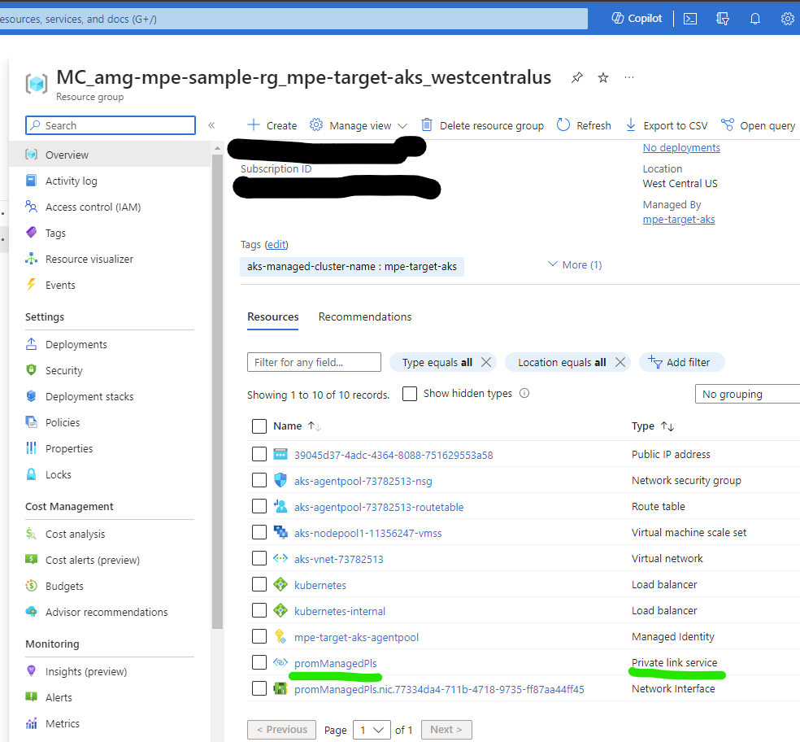
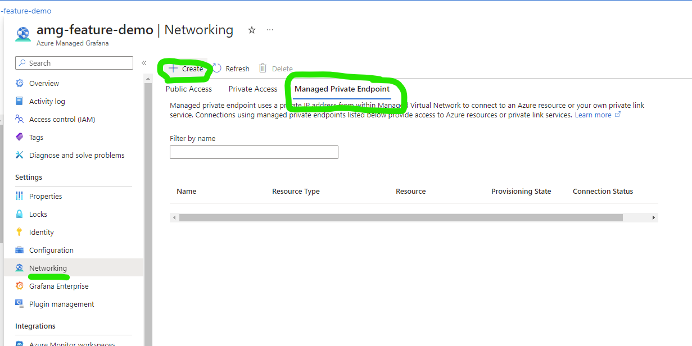
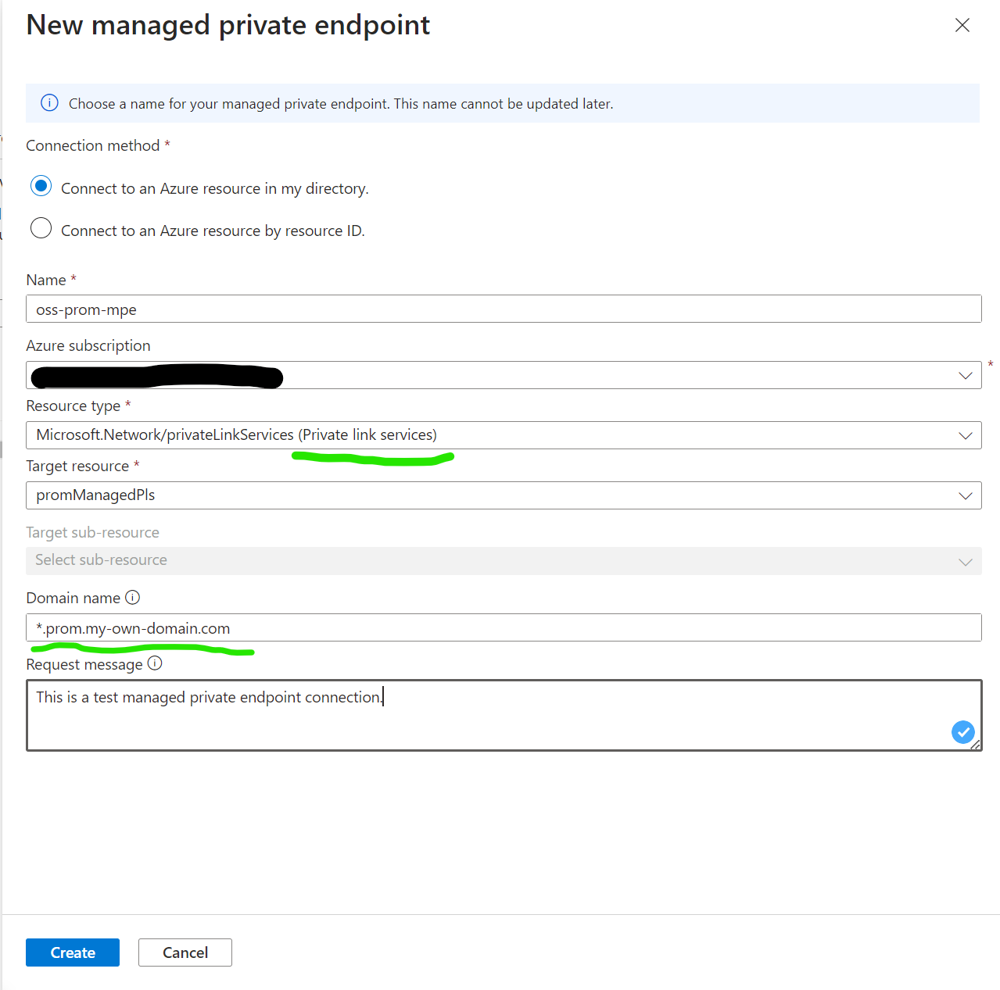
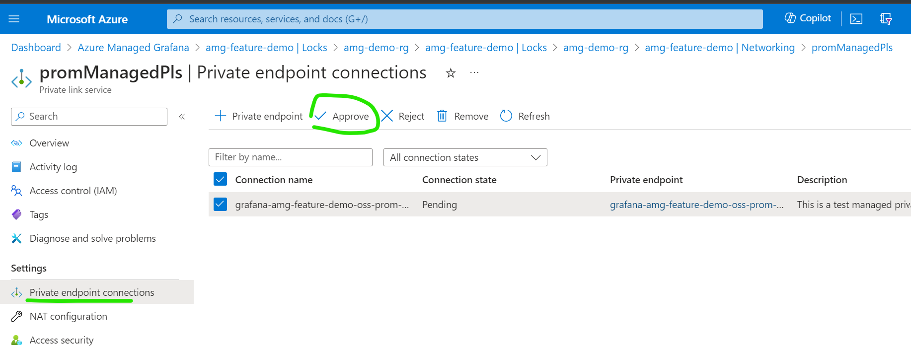
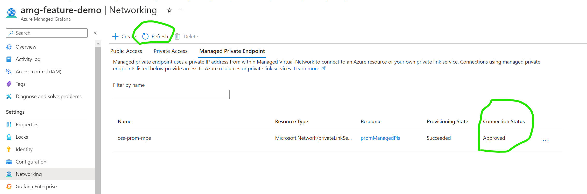
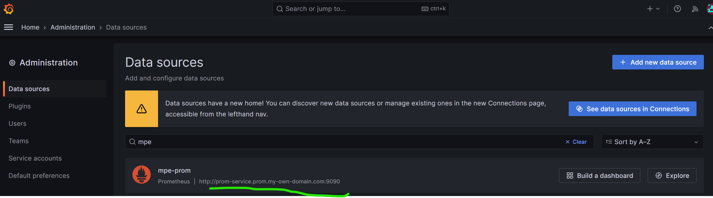
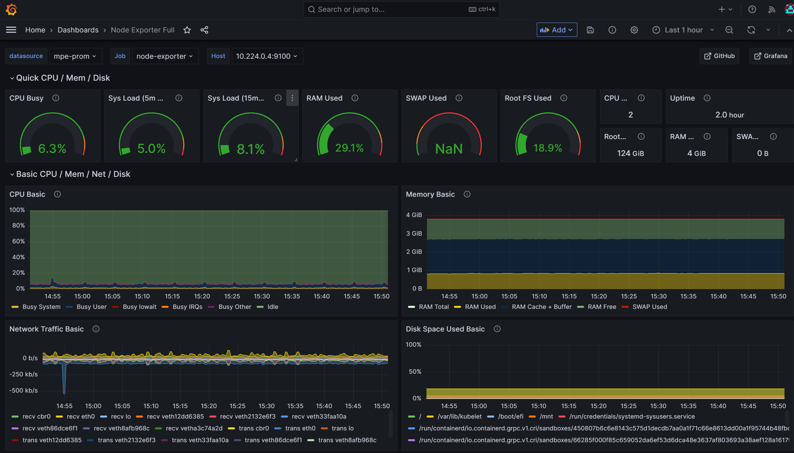

# Connecting Azure Managed Grafana to slef-hosted Prometheus on an AKS Cluster through private link

This guide will walk you through the steps to install Prometheus, an open-source monitoring and alerting toolkit, on an Azure Kubernetes Service (AKS) cluster. Then use an Azure Managed Grafana (AMG) feature called managed private endpoint (MPE) to connect to this Prometheus server.

## Prerequisites

Before you begin, make sure you have the following:

- [Azure account](https://azure.microsoft.com/en-us/free)
- [Azure CLI](https://learn.microsoft.com/en-us/cli/azure/install-azure-cli?view=azure-cli-latest)
- [kubectl](https://kubernetes.io/docs/tasks/tools/)
- [Helm](https://helm.sh/docs/intro/install/)

## Create an Azure Kubernetes Service (AKS) Cluster

Sign into the Azure CLI by running the login command.
```
az login
```

If you have multiple Azure subscriptions, you can select your Azure subscription with this command.
```
az account set -s <your-azure-subscription-id>
```

Install or update kubectl.
```
az aks install-cli
```

Create two bash/zsh variables which we will use in subsequent commands. You may change the syntax below if you are using another shell.
```
RESOURCE_GROUP=amg-mpe-sample-rg
AKS_NAME=mpe-target-aks
```

Create a resource group. We have chosen to create this in the westcentralus Azure region.
```
az group create --name $RESOURCE_GROUP --location westcentralus
```

Create a new AKS cluster using the az aks create command. Here we create a 3 node cluster using the B-series Burstable VM type which is cost-effective and suitable for small test/dev workloads such as this.
```
az aks create --resource-group $RESOURCE_GROUP \
  --name $AKS_NAME \
  --node-count 3 \
  --node-vm-size Standard_B2s \
  --generate-ssh-keys
```
This may take a few minutes to complete.

Authenticate to the cluster we have just created.
```
az aks get-credentials \
  --resource-group $RESOURCE_GROUP \
  --name $AKS_NAME
```
We can now access our Kubernetes cluster with kubectl. Use kubectl to see the nodes we have just created.

```
kubectl get nodes
```


# Install Prometheus
 

One really popular way of installing Prometheus is through the [prometheus-operator](https://prometheus-operator.dev/), which provides Kubernetes native deployment and management of [Prometheus](https://prometheus.io/) and related monitoring components. We are going to use the [kube-prometheus-stack](https://github.com/prometheus-community/helm-charts/tree/main/charts/kube-prometheus-stack) helm chart to deploy the prometheus-operator.

 

Add its repository to our repository list and update it.
```
helm repo add prometheus-community https://prometheus-community.github.io/helm-charts
helm repo update
```

Install the Helm chart into a namespace called monitoring, which will be created automatically.
```
helm install prometheus \
  prometheus-community/kube-prometheus-stack \
  --namespace monitoring \
  --create-namespace
```

The helm command will prompt you to check on the status of the deployed pods.
```
kubectl --namespace monitoring get pods
```

Make sure the pods all "Running" before you continue. If in the unlikely circumstance they do not reach the running state, you may want to troubleshoot them.

# Add a private link service to the Prometheus server
Azure [Private Link service](https://learn.microsoft.com/en-us/azure/private-link/private-link-service-overview) allows consuming your Kubernetes service through private link across different Azure virtual networks. AKS has a [native integration with Azure Private Link Service](https://cloud-provider-azure.sigs.k8s.io/topics/pls-integration/) that you can easily annotate a Kubernets service object to create a corresponding private link service azure resource.
```
kubectl --namespace monitoring apply -f pls-prometheus-svc.yaml
```

After a few minutes, you will be able to see the private link service with name `promManagedPls` being created in the AKS managed resource group.


# Connect with managed private endpoint
You can use [Azure portal to create an Azure Managed Grafana](https://learn.microsoft.com/en-us/azure/managed-grafana/quickstart-managed-grafana-portal) easily. After this, we can create a [managed private endpoint](https://learn.microsoft.com/en-us/azure/managed-grafana/how-to-connect-to-data-source-privately) to connect to the private link service.
1. Create a new managed private endpoint by clicking 'Network' -> 'Managed Private Endpoint' -> 'Create'.

2. After select 'Private link services' in the target resource type, you can select the private link service with name `promManagedPls` created in the above step. Each managed private endpoint will get a private IP address. You can also provide a domain name for this managed private endpoint. The AMG service will ensure that this domain will be resolved to the managed private endpoint's private IP inside the AMG environment. e.g. I am setting the domain as `*.prom.my-own-domain.com`.

3. Approve the private endpoint connection inside the private link service Azure portal UI.

4. After the private endpoint connection is approved, please click the 'Refresh' button to synchronize the `Connection state`. It should show as 'Approved' in the `Connection state`.

5. Add Prometheus data source in Grafana UI. The URL can be `http://prom-service.prom.my-own-domain.com:9090`.

6. Try the data source using sample '[Node Explorter Full](https://grafana.com/grafana/dashboards/1860-node-exporter-full/)' dashboard. You can import the dashboard with Id `1860` to leverage the self-hosted Promethues.
