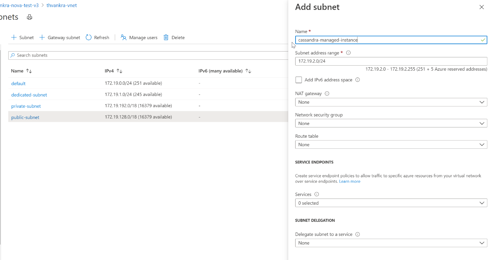
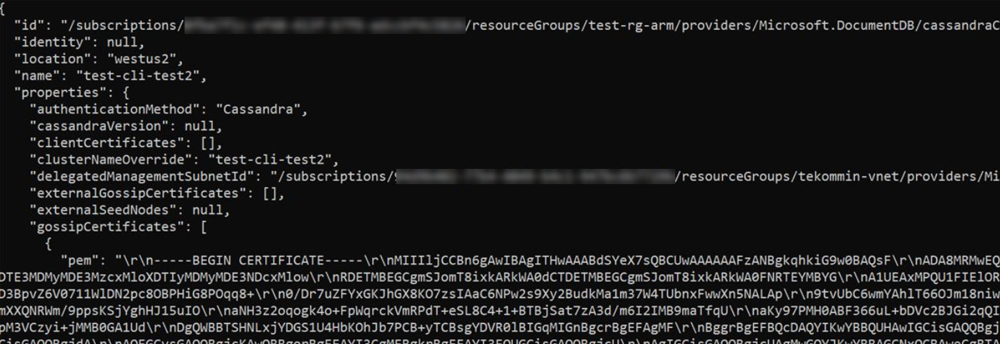
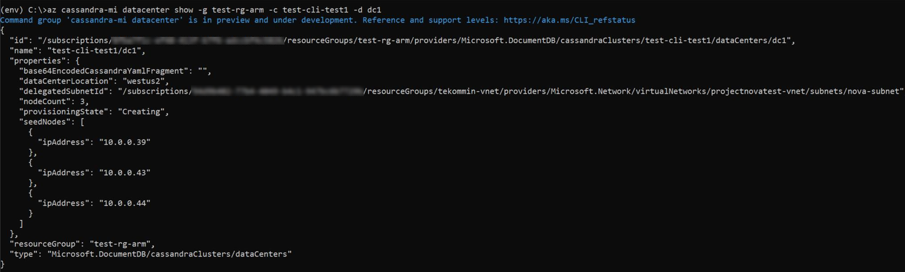

# Quickstart: Configure a hybrid cluster with Azure Managed Instance for Apache Cassandra

Azure Managed Instance for Apache Cassandra provides automated deployment and scaling operations for managed open-source Apache Cassandra datacenters. This service helps you accelerate hybrid scenarios and reduce ongoing maintenance. 

This quickstart demonstrates how to use the Azure CLI commands to configure a hybrid cluster. If you have existing datacenters in an on-premises or self-hosted environment, you can use Azure Managed Instance for Apache Cassandra to add other datacenters to that cluster and maintain them.

[!INCLUDE [azure-cli-prepare-your-environment.md](~/articles/reusable-content/azure-cli/azure-cli-prepare-your-environment.md)]

* This article requires the Azure CLI version 2.30.0 or higher. If you are using Azure Cloud Shell, the latest version is already installed.

* [Azure Virtual Network](../virtual-network/virtual-networks-overview.md) with connectivity to your self-hosted or on-premises environment. For more information on connecting on premises environments to Azure, see the [Connect an on-premises network to Azure](/azure/architecture/reference-architectures/hybrid-networking/) article.

## <a id="configure-hybrid"></a>Configure a hybrid cluster

1. Sign in to the [Azure portal](https://portal.azure.com/) and navigate to your Virtual Network resource.

1. Open the **Subnets** tab and create a new subnet. To learn more about the fields in the **Add subnet** form, see the [Virtual Network](../virtual-network/virtual-network-manage-subnet.md#add-a-subnet) article:

   :::image type="content" source="./media/configure-hybrid-cluster/subnet.png" alt-text="Add a new subnet to your Virtual Network." lightbox="./media/configure-hybrid-cluster/subnet.png" border="true":::
    <!--  -->

   > [!NOTE]
   > The Deployment of a Azure Managed Instance for Apache Cassandra requires internet access. Deployment fails in environments where internet access is restricted. Make sure you aren't blocking access within your VNet to the following vital Azure services that are necessary for Managed Cassandra to work properly. You can also find an extensive list of IP address and port dependencies [here](network-rules.md).
   > - Azure Storage
   > - Azure KeyVault
   > - Azure Virtual Machine Scale Sets
   > - Azure Monitoring
   > - Microsoft Entra ID
   > - Azure Security

1. Now we will apply some special permissions to the VNet and subnet which Cassandra Managed Instance requires, using Azure CLI. Use the `az role assignment create` command, replacing `<subscriptionID>`, `<resourceGroupName>`, and `<vnetName>` with the appropriate values:

   ```azurecli-interactive
   az role assignment create \
     --assignee a232010e-820c-4083-83bb-3ace5fc29d0b \
     --role 4d97b98b-1d4f-4787-a291-c67834d212e7 \
     --scope /subscriptions/<subscriptionID>/resourceGroups/<resourceGroupName>/providers/Microsoft.Network/virtualNetworks/<vnetName>
   ```

   > [!NOTE]
   > The `assignee` and `role` values in the previous command are fixed service principle and role identifiers respectively.

1. Next, we will configure resources for our hybrid cluster. Since you already have a cluster, the cluster name here will only be a logical resource to identify the name of your existing cluster. Make sure to use the name of your existing cluster when defining `clusterName` and `clusterNameOverride` variables in the following script.

   You also need, at minimum, the seed nodes from your existing datacenter, and the gossip certificates required for node-to-node encryption. Azure Managed Instance for Apache Cassandra requires node-to-node encryption for communication between datacenters. If you do not have node-to-node encryption implemented in your existing cluster, you would need to implement it - see documentation [here](https://docs.datastax.com/en/cassandra-oss/3.x/cassandra/configuration/secureSSLNodeToNode.html). You should supply the path to the location of the certificates. Each certificate should be in PEM format, e.g. `-----BEGIN CERTIFICATE-----\n...PEM format 1...\n-----END CERTIFICATE-----`. In general, there are two ways of implementing certificates:

   1. Self signed certs. This means a private and public (no CA) certificate for each node - in this case we need all public certificates.

   1. Certs signed by a CA. This can be a self-signed CA or even a public one. In this case we need the root CA certificate (refer to instructions on [preparing SSL certificates for production](https://docs.datastax.com/en/cassandra-oss/3.x/cassandra/configuration/secureSSLCertWithCA.html)), and all intermediaries (if applicable).

   Optionally, if you want to implement client-to-node certificate authentication or mutual Transport Layer Security (mTLS) as well, you need to provide the certificates in the same format as when creating the hybrid cluster. See Azure CLI sample below - the certificates are provided in the `--client-certificates` parameter. This will upload and apply your client certificates to the truststore for your Cassandra Managed Instance cluster (i.e. you do not need to edit cassandra.yaml settings). Once applied, your cluster will require Cassandra to verify the certificates when a client connects (see `require_client_auth: true` in Cassandra [client_encryption_options](https://cassandra.apache.org/doc/latest/cassandra/configuration/cass_yaml_file.html#client_encryption_options)).

   > [!NOTE]
   > The value of the `delegatedManagementSubnetId` variable you will supply below is exactly the same as the value of `--scope` that you supplied in the command above:

   ```azurecli-interactive
   resourceGroupName='MyResourceGroup'
   clusterName='cassandra-hybrid-cluster-legal-name'
   clusterNameOverride='cassandra-hybrid-cluster-illegal-name'
   location='eastus2'
   delegatedManagementSubnetId='/subscriptions/<subscriptionID>/resourceGroups/<resourceGroupName>/providers/Microsoft.Network/virtualNetworks/<vnetName>/subnets/<subnetName>'

   # You can override the cluster name if the original name is not legal for an Azure resource:
   # overrideClusterName='ClusterNameIllegalForAzureResource'
   # the default cassandra version will be v3.11

   az managed-cassandra cluster create \
     --cluster-name $clusterName \
     --resource-group $resourceGroupName \
     --location $location \
     --delegated-management-subnet-id $delegatedManagementSubnetId \
     --external-seed-nodes 10.52.221.2 10.52.221.3 10.52.221.4 \
     --external-gossip-certificates /usr/csuser/clouddrive/rootCa.pem /usr/csuser/clouddrive/gossipKeyStore.crt_signed
     # optional - add your existing datacenter's client-to-node certificates (if implemented):
     # --client-certificates /usr/csuser/clouddrive/rootCa.pem /usr/csuser/clouddrive/nodeKeyStore.crt_signed
   ```

   > [!NOTE]
   > If your cluster already has node-to-node and client-to-node encryption, you should know where your existing client and/or gossip SSL certificates are kept. If you are uncertain, you should be able to run `keytool -list -keystore <keystore-path> -rfc -storepass <password>` to print the certs.

1. After the cluster resource is created, run the following command to get the cluster setup details:

   ```azurecli-interactive
   resourceGroupName='MyResourceGroup'
   clusterName='cassandra-hybrid-cluster'

   az managed-cassandra cluster show \
      --cluster-name $clusterName \
      --resource-group $resourceGroupName \
   ```

1. The previous command returns information about the managed instance environment. You'll need the gossip certificates so that you can install them on the trust store for nodes in your existing datacenter. The following screenshot shows the output of the previous command and the format of certificates:

   :::image type="content" source="./media/configure-hybrid-cluster/show-cluster.png" alt-text="Get the certificate details from the cluster." lightbox="./media/configure-hybrid-cluster/show-cluster.png" border="true":::
    <!--  -->

   > [!NOTE]
   > The certificates returned from the above command contain line breaks represented as text, for example `\r\n`. You should copy each certificate to a file and format it before attempting to import it into your existing datacenter's trust store.

   > [!TIP]
   > Copy the `gossipCertificates` array value shown in the above screen shot into a file, and use the following bash script (you would need to [download and install jq](https://stedolan.github.io/jq/download/) for your platform) to format the certs and create separate pem files for each.
   >
   > ```bash
   > readarray -t cert_array < <(jq -c '.[]' gossipCertificates.txt)
   > # iterate through the certs array, format each cert, write to a numbered file.
   > num=0
   > filename=""
   > for item in "${cert_array[@]}"; do
   >   let num=num+1
   >   filename="cert$num.pem"
   >   cert=$(jq '.pem' <<< $item)
   >   echo -e $cert >> $filename
   >   sed -e 's/^"//' -e 's/"$//' -i $filename
   > done
   > ```

1. Next, create a new datacenter in the hybrid cluster. Make sure to replace the variable values with your cluster details:

   ```azurecli-interactive
   resourceGroupName='MyResourceGroup'
   clusterName='cassandra-hybrid-cluster'
   dataCenterName='dc1'
   dataCenterLocation='eastus2'
   virtualMachineSKU='Standard_D8s_v4'
   noOfDisksPerNode=4

   az managed-cassandra datacenter create \
     --resource-group $resourceGroupName \
     --cluster-name $clusterName \
     --data-center-name $dataCenterName \
     --data-center-location $dataCenterLocation \
     --delegated-subnet-id $delegatedManagementSubnetId \
     --node-count 9
     --sku $virtualMachineSKU \
     --disk-capacity $noOfDisksPerNode \
     --availability-zone false
   ```

   > [!NOTE]
   > The value for `--sku` can be chosen from the following available SKUs:
   >
   > - Standard_E8s_v4
   > - Standard_E16s_v4
   > - Standard_E20s_v4
   > - Standard_E32s_v4
   > - Standard_DS13_v2
   > - Standard_DS14_v2
   > - Standard_D8s_v4
   > - Standard_D16s_v4
   > - Standard_D32s_v4
   >
   > Note also that `--availability-zone` is set to `false`. To enable availability zones, set this to `true`. Availability zones increase the availability SLA of the service. For more details, review the full SLA details [here](https://azure.microsoft.com/support/legal/sla/managed-instance-apache-cassandra/v1_0/).

   > [!WARNING]
   > Availability zones are not supported in all regions. Deployments will fail if you select a region where Availability zones are not supported. See [here](../availability-zones/az-overview.md#azure-regions-with-availability-zones) for supported regions. The successful deployment of availability zones is also subject to the availability of compute resources in all of the zones in the given region. Deployments may fail if the SKU you have selected, or capacity, is not available across all zones.

1. Now that the new datacenter is created, run the show datacenter command to view its details:

   ```azurecli-interactive
   resourceGroupName='MyResourceGroup'
   clusterName='cassandra-hybrid-cluster'
   dataCenterName='dc1'

   az managed-cassandra datacenter show \
     --resource-group $resourceGroupName \
     --cluster-name $clusterName \
     --data-center-name $dataCenterName
   ```

1. The previous command outputs the new datacenter's seed nodes:

   :::image type="content" source="./media/configure-hybrid-cluster/show-datacenter.png" alt-text="Get datacenter details." lightbox="./media/configure-hybrid-cluster/show-datacenter.png" border="true":::
    <!--  -->

1. Now add the new datacenter's seed nodes to your existing datacenter's [seed node configuration](https://docs.datastax.com/en/cassandra-oss/3.0/cassandra/configuration/configCassandra_yaml.html#configCassandra_yaml__seed_provider) within the [cassandra.yaml](https://docs.datastax.com/en/cassandra-oss/3.0/cassandra/configuration/configCassandra_yaml.html) file. And install the managed instance gossip certificates that you collected earlier to the trust store for each node in your existing cluster, using `keytool` command for each cert:

   ```bash
   keytool -importcert -keystore generic-server-truststore.jks -alias CassandraMI -file cert1.pem -noprompt -keypass myPass -storepass truststorePass
   ```

   > [!NOTE]
   > If you want to add more datacenters, you can repeat the above steps, but you only need the seed nodes.

   > [!IMPORTANT]
   > If your existing Apache Cassandra cluster only has a single data center, and this is the first time a data center is being added, ensure that the `endpoint_snitch` parameter in `cassandra.yaml` is set to `GossipingPropertyFileSnitch`.

   > [!IMPORTANT]
   > If your existing application code is using QUORUM for consistency, you should ensure that **prior to changing the replication settings in the step below**, your existing application code is using **LOCAL_QUORUM** to connect to your existing cluster (otherwise live updates will fail after you change replication settings in the below step). Once the replication strategy has been changed, you can revert to QUORUM if preferred. 
   

1. Finally, use the following CQL query to update the replication strategy in each keyspace to include all datacenters across the cluster:

   ```bash
   ALTER KEYSPACE "ks" WITH REPLICATION = {'class': 'NetworkTopologyStrategy', 'on-premise-dc': 3, 'managed-instance-dc': 3};
   ```

   You also need to update several system tables:

   ```bash
   ALTER KEYSPACE "system_auth" WITH REPLICATION = {'class': 'NetworkTopologyStrategy', 'on-premise-dc': 3, 'managed-instance-dc': 3}
   ALTER KEYSPACE "system_distributed" WITH REPLICATION = {'class': 'NetworkTopologyStrategy', 'on-premise-dc': 3, 'managed-instance-dc': 3}
   ALTER KEYSPACE "system_traces" WITH REPLICATION = {'class': 'NetworkTopologyStrategy', 'on-premise-dc': 3, 'managed-instance-dc': 3}
   ```

   > [!IMPORTANT]
   > If the data center(s) in your existing cluster do not enforce [client-to-node encryption (SSL)](https://cassandra.apache.org/doc/3.11/cassandra/operating/security.html#client-to-node-encryption), and you intend for your application code to connect directly to Cassandra Managed Instance, you will also need to enable SSL in your application code. 


## <a id="hybrid-real-time-migration"></a>Use hybrid cluster for real-time migration

The above instructions provide guidance for configuring a hybrid cluster. However, this is also a great way of achieving a seamless zero-downtime migration. If you have an on-premises or other Cassandra environment that you want to decommission with zero downtime, in favour of running your workload in Azure Managed Instance for Apache Cassandra, the following steps must be completed in this order:

1. Configure hybrid cluster - follow the instructions above.
1. Temporarily disable automatic repairs in Azure Managed Instance for Apache Cassandra for the duration of the migration:

    ```azurecli-interactive
    az managed-cassandra cluster update \
      --resource-group $resourceGroupName \
      --cluster-name $clusterName --repair-enabled false
    ```

1. In Azure CLI, run the below command to execute `nodetool rebuild` on each node in your new Azure Managed Instance for Apache Cassandra data center, replacing `<ip address>` with the IP address of the node, and `<sourcedc>` with the name of your existing data center (the one you are migrating from):

    ```azurecli-interactive
    az managed-cassandra cluster invoke-command \
      --resource-group $resourceGroupName \
      --cluster-name $clusterName \
      --host <ip address> \
      --command-name nodetool --arguments rebuild="" "<sourcedc>"=""
    ```

    You should run this **only after all of the prior steps have been taken**. This should ensure that all historical data is replicated to your new data centers in Azure Managed Instance for Apache Cassandra. You can run rebuild on one or more nodes at the same time. Run on one node at a time to reduce the impact on the existing cluster. Run on multiple nodes when the cluster can handle the extra I/O and network pressure. For most installations you can only run one or two in parallel to not overload the cluster.  

   > [!WARNING]
   > You must specify the source *data center* when running `nodetool rebuild`. If you provide the data center incorrectly on the first attempt, this will result in token ranges being copied, without data being copied for your non-system tables. Subsequent attempts will fail even if you provide the data center correctly. You can resolve this by deleting entries for each non-system keyspace in `system.available_ranges` via the `cqlsh` query tool in your target Cassandra MI data center:
   > ```shell
   > delete from system.available_ranges where keyspace_name = 'myKeyspace';
   > ```

1. Cut over your application code to point to the seed nodes in your new Azure Managed Instance for Apache Cassandra data center(s).

    > [!IMPORTANT]
    > As also mentioned in the hybrid setup instructions, if the data center(s) in your existing cluster do not enforce [client-to-node encryption (SSL)](https://cassandra.apache.org/doc/3.11/cassandra/operating/security.html#client-to-node-encryption), you will need to enable this in your application code, as Cassandra Managed Instance enforces this. 

1. Run ALTER KEYSPACE for each keyspace, in the same manner as done earlier, but now removing your old data center(s).

1. Run [nodetool decommission](https://cassandra.apache.org/doc/latest/cassandra/tools/nodetool/decommission.html) for each old data center node.

1. Switch your application code back to quorum (if required/preferred).

1. Re-enable automatic repairs:

    ```azurecli-interactive
    az managed-cassandra cluster update \
      --resource-group $resourceGroupName \
      --cluster-name $clusterName --repair-enabled true
    ```

## Troubleshooting

If you encounter an error when applying permissions to your Virtual Network using Azure CLI, such as *Cannot find user or service principal in graph database for 'e5007d2c-4b13-4a74-9b6a-605d99f03501'*, you can apply the same permission manually from the Azure portal. Learn how to do this [here](add-service-principal.md).

> [!NOTE]
> The Azure Cosmos DB role assignment is used for deployment purposes only. Azure Managed Instanced for Apache Cassandra has no backend dependencies on Azure Cosmos DB.

## Clean up resources

If you're not going to continue to use this managed instance cluster, delete it with the following steps:

1. From the left-hand menu of Azure portal, select **Resource groups**.
1. From the list, select the resource group you created for this quickstart.
1. On the resource group **Overview** pane, select **Delete resource group**.
1. In the next window, enter the name of the resource group to delete, and then select **Delete**.

## Next steps

In this quickstart, you learned how to create a hybrid cluster using Azure CLI and Azure Managed Instance for Apache Cassandra. You can now start working with the cluster.

> [!div class="nextstepaction"]
> [Manage Azure Managed Instance for Apache Cassandra resources using Azure CLI](manage-resources-cli.md)
