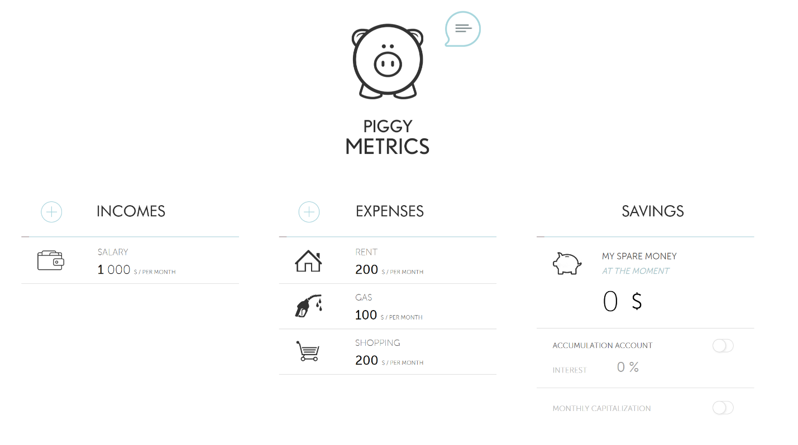

# Quickstart: Launch a Java Spring application on Azure using the Azure portal

Azure Managed Service for Spring Cloud enables you to easily run a Spring Cloud based microservices on Azure.

This quickstart shows you how to deploy an existing Java Spring Cloud application to Azure. When you're finished, the provided sample application will be accessible on the web and ready to be managed via the Azure portal.



Using this application you learn how to:

> [!div class="checklist"]
> * Provision a service instance 
> * Set a configuration server for an instance
> * Build a microservices application locally
> * Deploy each microservice
> * Edit environment variables for applications
> * Assign public IP for your application gateway

## Prerequisites

To complete this quickstart:

1. [Install Git](https://git-scm.com/)
2. [Install JDK 8](https://www.oracle.com/technetwork/java/javase/downloads/jdk8-downloads-2133151.html)
3. [Install Maven 3.0 or above](https://maven.apache.org/download.cgi)
4. [Sign up for an Azure subscription](https://azure.microsoft.com/free/)
	

## Provision a service instance on the Azure portal

1. In a web browser, open the [Azure portal](https://portal.azure.com), and sign into your account.

1. Search for the **Azure Managed Service for Java Spring Cloud** and click on it to go to the overview page. Click the **Create** button to get started.

1. Fill out the form, considering the following guidelines:

- Resource Name: Specify the name of your service instance.
- Subscription: Select the subscription you want to be billed for this resource.
- Resource group: Creating new resource groups for new resources is generally considered the best practice.
- Location: Location of your service instance. Only West Europe and East US are supported at this time. 
-	VM Size: VM node size used for the underlying Kubernetes cluster. Only Standard D3 v2 (4 vCPU, 14 GiB RAM) is supported at this time.
-	VM Count: Number of VMs running in the underlying Kubernetes cluster. After provisioning, you can scale out and in as necessary.

The service instance can take up to 10 minutes to be fully deployed. When it is, you will be able to see the overview page for the service instance.

## Setup your configuration server

1.	Go to the service overview page.

2.	Click **Configuration** entry in the menu.

3.	Fill in the text box with "https://github.com/xscript/piggymetrics-config" and click **Save**.

## Build the microservices application

1. Open up a command window and run the following command to clone the sample app repository to your local machine.

```git
git clone https://github.com/xscript/PiggyMetrics
```

2.	Change directory and build the project by running below commands.

```git
cd PiggyMetrics
mvn clean package -D skipTests
```

You should now have individual JAR files for each service in their respective folders.

## Deploy the microservices application

1. Back on the Azure portal, go to the service overview page and click the **Create Application** button. Next, fill out the form. We will start with the "gateway" application.

- Application Name: Use "gateway" as the application name.
- Artifact Type: Only JAR file is supported at this time.
- Select Artifact: Upload the JAR file from your local machine. Choose JAR file from PiggyMetrics\gateway\target\gateway.jar.
- Java Environment: The Java Runtime version. Only Java 8 is supported at this time.
-	Port: Specify the port number of your application. Use 80 here.
-	vCPU: Specify the maximum CPU resource for your application. Use 0.5 here.
-	Memory: Specify the maximum memory resource for your application. Use 1000 MB here.
-	App Instance Count: Specify the instance count of your application. You can specify more than 2 instances for more capacity and high availability. The instance count can be updated after creation. Use 1 here. 


2. Repeat step 1 with the **auth-service** application and **account-service** application, which are stored in the same directory as **gateway**.


>[!NOTE]
> Application names have to be exactly "account-service" and "auth-service" for the provided configuration server to work properly.
> 
> 


## Set environment variables for applications

Properly setting environment variables are essential to run the application.

1.	Go to the service **Overview** page.
2.	Click **Application Dashboard** entry in the menu.
3.	Click account-service application to show **Application Details** page and open the **Environment Variables** tab.
4.	Add a new environment variable named "security.oauth2.client.client-secret" with value "XUoJBrTtqXBonU5zMVzSUtrLPKRQztLUQE4poDoIR1QdcDfGgnGgJO5wbFC7xCEL"
5.	Restart account-service by clicking the **Restart** button at the top of the page.
6.	Go to auth-service's application details page and open the **Environment Variables** tab.
7.	Add a new environment variable named "ACCOUNT_SERVICE_PASSWORD" with value "XUoJBrTtqXBonU5zMVzSUtrLPKRQztLUQE4poDoIR1QdcDfGgnGgJO5wbFC7xCEL" as below snapshot. 
8.	Restart auth-service by clicking the **Restart** button at the top of the page.


## Assign public IP to gateway
1.	Go to the service **Overview** page and open **Application Dashboard** page.
2.	Click gateway application to show the **Application Details** page.
3.	Click **Assign Public IP** to assign a public IP to gateway. This can take up to a couple minutes. You can use this public IP to access all microservices via gateway. 
4.	Use Piggy Metrics by entering the assigned public IP into an internet browser.


## Next steps

In this quickstart, you learned how to:

> [!div class="checklist"]
> * Provision a service instance
> * Set a configuration server for an instance
> * Build a microservices application locally
> * Deploy each microservice
> * Edit environment variables for applications
> * Assign public IP for your application gateway

To learn more about Service Fabric and .NET, take a look at this tutorial:
<!-- > [!div class="nextstepaction"]
> [.NET application on Service Fabric](service-fabric-tutorial-create-dotnet-app.md) -->
