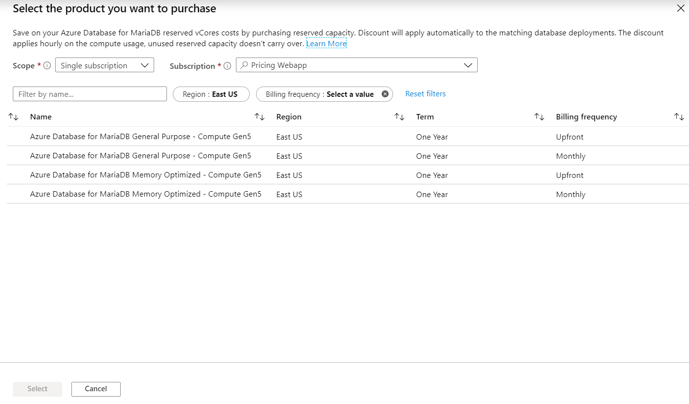

# Prepay for Azure Database for MariaDB compute resources with reserved capacity

[!INCLUDE [azure-database-for-mariadb-deprecation](includes/azure-database-for-mariadb-deprecation.md)]

Azure Database for MariaDB now helps you save money by prepaying for compute resources compared to pay-as-you-go prices. With Azure Database for MariaDB reserved capacity, you make an upfront commitment on MariaDB servers for a one or three year period to get a significant discount on the compute costs. To purchase Azure Database for MariaDB reserved capacity, you need to specify the Azure region, deployment type, performance tier, and term.  

You do not need to assign the reservation to specific Azure Database for MariaDB servers. An already running Azure Database for MariaDB or ones that are newly deployed, will automatically get the benefit of reserved pricing. By purchasing a reservation, you are pre-paying for the compute costs for a period of one or three years. As soon as you buy a reservation, the Azure Database for MariaDB compute charges that match the reservation attributes are no longer charged at the pay-as-you go rates. A reservation does not cover software, networking, or storage charges associated with the MariaDB Database server. At the end of the reservation term, the billing benefit expires, and the Azure Database for MariaDB are billed at the pay-as-you go price. Reservations do not auto-renew. For pricing information, see the [Azure Database for MariaDB reserved capacity offering](https://azure.microsoft.com/pricing/details/mariadb/).  

You can buy Azure Database for MariaDB reserved capacity in the [Azure portal](https://portal.azure.com/). Pay for the reservation [up front or with monthly payments](../cost-management-billing/reservations/prepare-buy-reservation.md). To buy the reserved capacity:

* You must be in the owner role for at least one Enterprise or individual subscription with pay-as-you-go rates.
* For Enterprise subscriptions, **Add Reserved Instances** must be enabled in the [EA portal](https://ea.azure.com/). Or, if that setting is disabled, you must be an EA Admin on the subscription.
* For Cloud Solution Provider (CSP) program, only the admin agents or sales agents can purchase Azure Database for MariaDB reserved capacity.  

The details on how enterprise customers and Pay-As-You-Go customers are charged for reservation purchases, see [understand Azure reservation usage for your Enterprise enrollment](../cost-management-billing/reservations/understand-reserved-instance-usage-ea.md) and [understand Azure reservation usage for your Pay-As-You-Go subscription](../cost-management-billing/reservations/understand-reserved-instance-usage.md).

## Determine the right server size before purchase

The size of reservation should be based on the total amount of compute used by the existing or soon-to-be-deployed databases instance within a specific region and using the same performance tier and hardware generation. 

For example, let's suppose that you are running one general purpose, Gen5 – 32 vCore MariaDB database, and two memory optimized, Gen5 – 16 vCore MariaDB databases. Further, let's supposed that you plan to deploy within the next month an additional general purpose, Gen5 – 32 vCore database server, and one memory optimized, Gen5 – 16 vCore database server. Let's suppose that you know that you will need these resources for at least 1 year. In this case, you should purchase a 64 (2x32) vCores, 1 year reservation for single database general purpose - Gen5 and a 48 (2x16 + 16) vCore 1 year reservation for single database memory optimized - Gen5

## Buy Azure Database for MariaDB reserved capacity

1. Sign in to the [Azure portal](https://portal.azure.com/).
2. Select **All services** > **Reservations**.
3.  Select **Add** and then in the Purchase reservations pane, select **Azure Database for MariaDB** to purchase a new reservation for your MariaDB databases.
4.  Fill-in the required fields. Existing or new databases that match the attributes you select qualify to get the reserved capacity discount. The actual number of your Azure Database for MariaDB servers that get the discount depend on the scope and quantity selected.

The following table describes required fields.

| Field | Description |
| :------------ | :------- |
| Subscription   | The subscription used to pay for the Azure Database for MariaDB reserved capacity reservation. The payment method on the subscription is charged the upfront costs for the Azure Database for MariaDB reserved capacity reservation. The subscription type must be an enterprise agreement (offer numbers: MS-AZR-0017P or MS-AZR-0148P) or an individual agreement with pay-as-you-go pricing (offer numbers: MS-AZR-0003P or MS-AZR-0023P). For an enterprise subscription, the charges are deducted from the enrollment's Azure Prepayment (previously called monetary commitment) balance or charged as overage. For an individual subscription with pay-as-you-go pricing, the charges are billed to the credit card or invoice payment method on the subscription.
| Scope | The vCore reservation's scope can cover one subscription or multiple subscriptions (shared scope). If you select:    **Shared**, the vCore reservation discount is applied to Azure Database for MariaDB servers running in any subscriptions within your billing context. For enterprise customers, the shared scope is the enrollment and includes all subscriptions within the enrollment. For Pay-As-You-Go customers, the shared scope is all Pay-As-You-Go subscriptions created by the account administrator.  **Management group**, the reservation discount is applied to the matching resource in the list of subscriptions that are a part of both the management group and billing scope.   **Single subscription**, the vCore reservation discount is applied to Azure Database for MariaDB servers in this subscription.    **Single resource group**, the reservation discount is applied to Azure Database for MariaDB servers in the selected subscription and the selected resource group within that subscription.
| Region | The Azure region that's covered by the Azure Database for MariaDB reserved capacity reservation.
| Deployment Type | The Azure Database for MariaDB resource type that you want to buy the reservation for.
| Performance Tier | The service tier for the Azure Database for MariaDB servers.
| Term | One year
| Quantity | The amount of compute resources being purchased within the Azure Database for MariaDB reserved capacity reservation. The quantity is a number of vCores in the selected Azure region and Performance tier that are being reserved and will get the billing discount. For example, if you are running or planning to run an Azure Database for MariaDB servers with the total compute capacity of Gen5 16 vCores in the East US region, then you would specify quantity as 16 to maximize the benefit for all servers.

## Cancel, exchange, or refund reservations

You can cancel, exchange, or refund reservations with certain limitations. For more information, see [Self-service exchanges and refunds for Azure Reservations](../cost-management-billing/reservations/exchange-and-refund-azure-reservations.md).

## vCore size flexibility

vCore size flexibility helps you scale up or down within a performance tier and region, without losing the reserved capacity benefit.

## Need help? Contact us

If you have questions or need help, [create a support request](https://portal.azure.com/#blade/Microsoft_Azure_Support/HelpAndSupportBlade/newsupportrequest).

## Next steps

The vCore reservation discount is applied automatically to the number of Azure Database for MariaDB servers that match the Azure Database for MariaDB reserved capacity reservation scope and attributes. You can update the scope of the Azure Database for MariaDB reserved capacity reservation through Azure portal, PowerShell, CLI or through the API.   
To learn how to manage the Azure Database for MariaDB reserved capacity, see manage Azure Database for MariaDB reserved capacity.

To learn more about Azure Reservations, see the following articles:

* [What are Azure Reservations](../cost-management-billing/reservations/save-compute-costs-reservations.md)?
* [Manage Azure Reservations](../cost-management-billing/reservations/manage-reserved-vm-instance.md)
* [Understand Azure Reservations discount](../cost-management-billing/reservations/understand-reservation-charges.md)
* [Understand reservation usage for your Pay-As-You-Go subscription](../cost-management-billing/reservations/understand-reservation-charges-mariadb.md)
* [Understand reservation usage for your Enterprise enrollment](../cost-management-billing/reservations/understand-reserved-instance-usage-ea.md)
* [Azure Reservations in Partner Center Cloud Solution Provider (CSP) program](/partner-center/azure-reservations)
