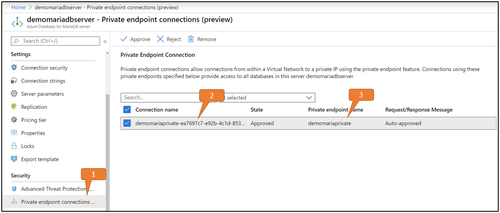
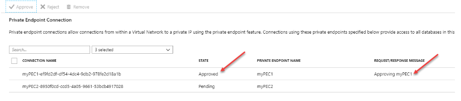

# Private Link for Azure Database for MariaDB (Preview)

Private Link allows you to connect to various PaaS services in Azure via a private endpoint. Azure Private Link essentially brings Azure services inside your private Virtual Network (VNet). The PaaS resources can be accessed using the private IP address just like any other resource in the VNet.

For a list to PaaS services that support Private Link functionality, review the Private Link [documentation](https://docs.microsoft.com/azure/private-link/index). A private endpoint is a private IP address within a specific [VNet](https://docs.microsoft.com/azure/virtual-network/virtual-networks-overview) and Subnet.

> [!NOTE]
> This feature is available in all Azure regions where Azure Database for MariaDB supports General Purpose and Memory Optimized pricing tiers.

## Data exfiltration prevention

Data ex-filtration in Azure Database for MariaDB is when an authorized user, such as a database admin, is able to extract data from one system and move it to another location or system outside the organization. For example, the user moves the data to a storage account owned by a third party.

Consider a scenario with a user running MariaDB workbench inside an Azure VM connecting to an Azure Database for MariaDB instance. This MariaDB instance is in the West US data center. The example below shows how to limit access with public endpoints on Azure Database for MariaDB using network access controls.

* Disable all Azure service traffic to Azure Database for MariaDB via the public endpoint by setting Allow Azure Services to OFF. Ensure no IP addresses or ranges are allowed to access the server either via [firewall rules](https://docs.microsoft.com/azure/mariadb/concepts-firewall-rules) or [virtual network service endpoints](https://docs.microsoft.com/azure/mariadb/concepts-data-access-security-vnet).

* Only allow traffic to the Azure Database for MariaDB using the Private IP address of the VM. For more information, see the articles on [Service Endpoint](concepts-data-access-security-vnet.md) and [VNet firewall rules](howto-manage-vnet-portal.md).

* On the Azure VM, narrow down the scope of outgoing connection by using Network Security Groups (NSGs) and Service Tags as follows:

    * Specify an NSG rule to allow traffic for Service Tag = SQL.WestUs - only allowing connection to Azure Database for MariaDB in West US
    * Specify an NSG rule (with a higher priority) to deny traffic for Service Tag = SQL - denying connections to MariaDB Database in all regions  

At the end of this setup, the Azure VM can connect only to Azure Database for MariaDB in the West US region. However, the connectivity isn't restricted to a single Azure Database for MariaDB. The VM can still connect to any Azure Database for MariaDB in the West US region, including the databases that aren't part of the subscription. While we've reduced the scope of data exfiltration in the above scenario to a specific region, we haven't eliminated it altogether. 

With Private Link, you can now set up network access controls like NSGs to restrict access to the private endpoint. Individual Azure PaaS resources are then mapped to specific private endpoints. A malicious insider can only access the mapped PaaS resource (for example an Azure Database for MariaDB) and no other resource.

## On-premises connectivity over private peering

When you connect to the public endpoint from on-premises machines, your IP address needs to be added to the IP-based firewall using a server-level firewall rule. While this model works well for allowing access to individual machines for dev or test workloads, it's difficult to manage in a production environment.

With Private Link, you can enable cross-premises access to the private endpoint using [Express Route](https://azure.microsoft.com/services/expressroute/) (ER), private peering or [VPN tunnel](https://docs.microsoft.com/azure/vpn-gateway/). They can subsequently disable all access via public endpoint and not use the IP-based firewall.

## Configure Private Link for Azure Database for MariaDB

### Creation Process

Private Endpoints are required to enable Private Link. This can be done using the following how-to guides.

* [Azure portal](https://docs.microsoft.com/azure/mariadb/howto-configure-privatelink-portal)
* [CLI](https://docs.microsoft.com/azure/mariadb/howto-configure-privatelink-cli)

### Approval Process

Once the network admin creates the Private Endpoint (PE), the admin can manage the Private Endpoint Connection (PEC) to Azure Database for MariaDB.

> [!NOTE]
> Currently, Azure Database for MariaDB only supports auto-approval for the private endpoint.

* Navigate to the Azure Database for MariaDB server resource in the Azure portal. 
    * Select the Private endpoint connections in the left pane
    * Shows a list of all Private Endpoint Connections (PECs)
    * Corresponding Private Endpoint (PE) created

* Select an individual PEC from the list by selecting it.

* The MariaDB server admin can choose to approve or reject a PEC and optionally add a short text response.

* After approval or rejection, the list will reflect the appropriate state along with the response text

## Use cases of Private Link for Azure Database for MariaDB

Clients can connect to the Private endpoint from the same VNet, peered VNet in same region, or via VNet-to-VNet connection across regions. Additionally, clients can connect from on-premises using ExpressRoute, private peering, or VPN tunneling. Below is a simplified diagram showing the common use cases.

### Connecting from an Azure VM in Peered Virtual Network (VNet)
Configure [VNet peering](https://docs.microsoft.com/azure/virtual-network/tutorial-connect-virtual-networks-powershell) to establish connectivity to the Azure Database for MariaDB from an Azure VM in a peered VNet.

### Connecting from an Azure VM in VNet-to-VNet environment
Configure [VNet-to-VNet VPN gateway connection](https://docs.microsoft.com/azure/vpn-gateway/vpn-gateway-howto-vnet-vnet-resource-manager-portal) to establish connectivity to a Azure Database for MariaDB from an Azure VM in a different region or subscription.

### Connecting from an on-premises environment over VPN
To establish connectivity from an on-premises environment to the Azure Database for MariaDB, choose and implement one of the options:

* [Point-to-Site connection](https://docs.microsoft.com/azure/vpn-gateway/vpn-gateway-howto-point-to-site-rm-ps)
* [Site-to-Site VPN connection](https://docs.microsoft.com/azure/vpn-gateway/vpn-gateway-create-site-to-site-rm-powershell)
* [ExpressRoute circuit](https://docs.microsoft.com/azure/expressroute/expressroute-howto-linkvnet-portal-resource-manager)

## Private Link combined with firewall rules

The following situations and outcomes are possible when you use Private Link in combination with firewall rules:

* If you don't configure any firewall rules, then by default, no traffic will be able to access the Azure Database for MariaDB.

* If you configure public traffic or a service endpoint and you create private endpoints, then different types of incoming traffic are authorized by the corresponding type of firewall rule.

* If you don't configure any public traffic or service endpoint and you create private endpoints, then the Azure Database for MariaDB is accessible only through the private endpoints. If you don't configure public traffic or a service endpoint, after all approved private endpoints are rejected or deleted, no traffic will be able to access the Azure Database for MariaDB.

## Next steps

To learn more about Azure Database for MariaDB security features, see the following articles:

* To configure a firewall for Azure Database for MariaDB, see [Firewall support](https://docs.microsoft.com/azure/mariadb/concepts-firewall-rules).

* To learn how to configure a virtual network service endpoint for your Azure Database for MariaDB, see [Configure access from virtual networks](https://docs.microsoft.com/azure/mariadb/concepts-data-access-security-vnet).

* For an overview of Azure Database for MariaDB connectivity, see [Azure Database for MariaDB Connectivity Architecture](https://docs.microsoft.com/azure/MariaDB/concepts-connectivity-architecture)
