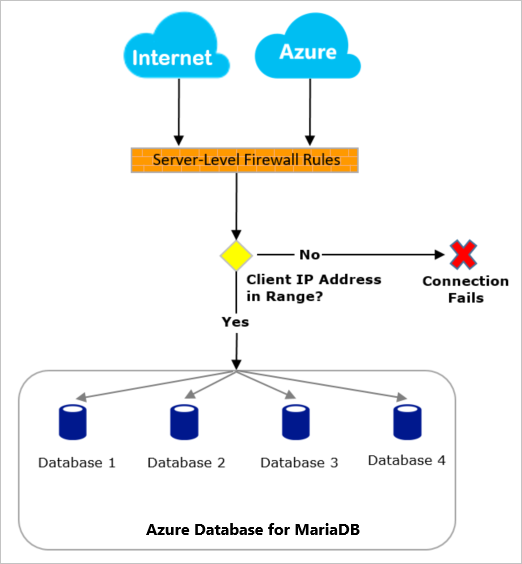
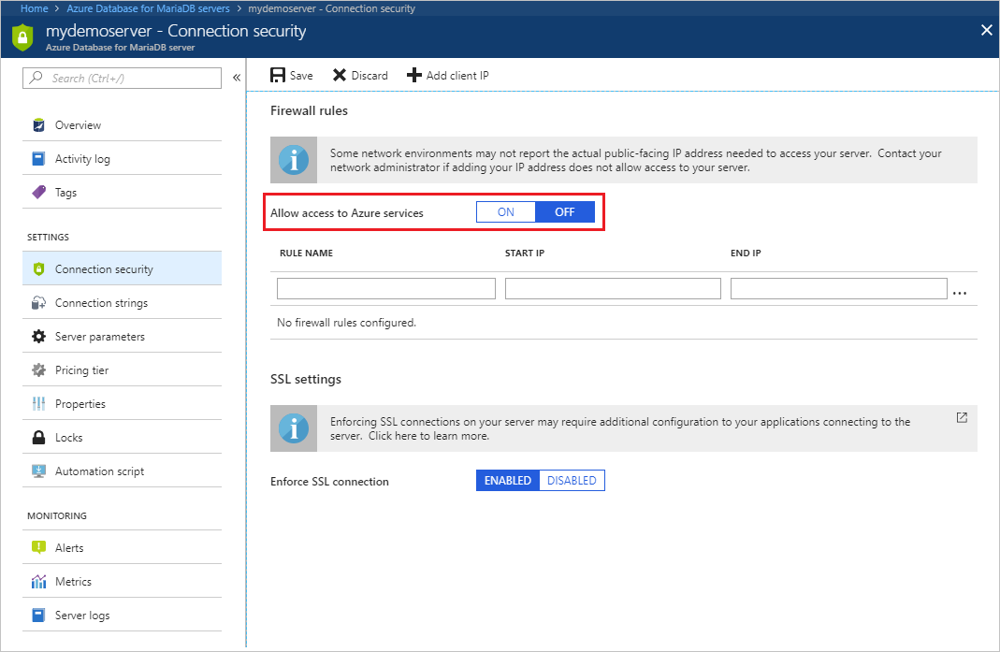

# Azure Database for MariaDB server firewall rules
Firewalls prevent all access to your database server until you specify which computers have permission. The firewall grants access to the server based on the originating IP address of each request.

To configure a firewall, create firewall rules that specify ranges of acceptable IP addresses. You can create firewall rules at the server level.

**Firewall rules:** These rules enable clients to access your entire Azure Database for MariaDB server, that is, all the databases within the same logical server. Server-level firewall rules can be configured by using the Azure portal or Azure CLI commands. To create server-level firewall rules, you must be the subscription owner or a subscription contributor.

## Firewall overview
All database access to your Azure Database for MariaDB server is by default blocked by the firewall. To begin using your server from another computer, you need to specify one or more server-level firewall rules to enable access to your server. Use the firewall rules to specify which IP address ranges from the Internet to allow. Access to the Azure portal website itself is not impacted by the firewall rules.

Connection attempts from the Internet and Azure must first pass through the firewall before they can reach your Azure Database for MariaDB database, as shown in the following diagram:

## Connecting from the Internet
Server-level firewall rules apply to all databases on the Azure Database for MariaDB server.

If the IP address of the request is within one of the ranges specified in the server-level firewall rules, then the connection is granted.

If the IP address of the request is outside the ranges specified in any of the database-level or server-level firewall rules, then the connection request fails.

## Connecting from Azure
To allow applications from Azure to connect to your Azure Database for MariaDB server, Azure connections must be enabled. For example, to host an Azure Web Apps application, or an application that runs in an Azure VM, or to connect from an Azure Data Factory data management gateway. The resources do not need to be in the same Virtual Network (VNet) or Resource Group for the firewall rule to enable those connections. When an application from Azure attempts to connect to your database server, the firewall verifies that Azure connections are allowed. There are a couple of methods to enable these types of connections. A firewall setting with starting and ending address equal to 0.0.0.0 indicates these connections are allowed. Alternatively, you can set the **Allow access to Azure services** option to **ON** in the portal from the **Connection security** pane and hit **Save**. If the connection attempt is not allowed, the request does not reach the Azure Database for MariaDB server.

> [!IMPORTANT]
> This option configures the firewall to allow all connections from Azure including connections from the subscriptions of other customers. When selecting this option, make sure your login and user permissions limit access to only authorized users.
> 

## Programmatically managing firewall rules
In addition to the Azure portal, firewall rules can be managed programmatically by using the Azure CLI. 

<!--See also [Create and manage Azure Database for MariaDB firewall rules using Azure CLI](./howto-manage-firewall-using-cli.md)-->

## Troubleshooting the database firewall
Consider the following points when access to the Microsoft Azure Database for MariaDB server service does not behave as expected:

* **Changes to the allow list have not taken effect yet:** There may be as much as a five-minute delay for changes to the Azure Database for MariaDB Server firewall configuration to take effect.

* **The login is not authorized or an incorrect password was used:** If a login does not have permissions on the Azure Database for MariaDB server or the password used is incorrect, the connection to the Azure Database for MariaDB server is denied. Creating a firewall setting only provides clients with an opportunity to attempt connecting to your server; each client must provide the necessary security credentials.

* **Dynamic IP address:** If you have an Internet connection with dynamic IP addressing and you are having trouble getting through the firewall, you can try one of the following solutions:

* Ask your Internet Service Provider (ISP) for the IP address range assigned to your client computers that access the Azure Database for MariaDB server, and then add the IP address range as a firewall rule.

* Get static IP addressing instead for your client computers, and then add the IP addresses as firewall rules.

## Next steps
- [Create and manage Azure Database for MariaDB firewall rules using the Azure portal](./howto-manage-firewall-portal.md)

<!--
- [Create and manage Azure Database for MariaDB firewall rules using Azure CLI](./howto-manage-firewall-using-cli.md) -->
