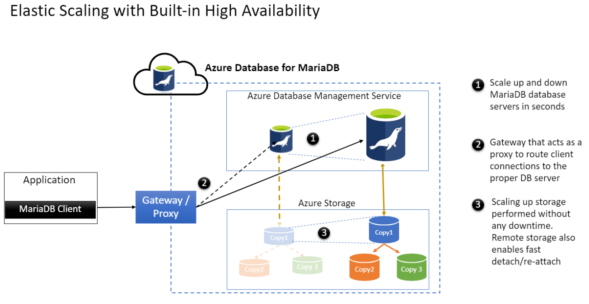
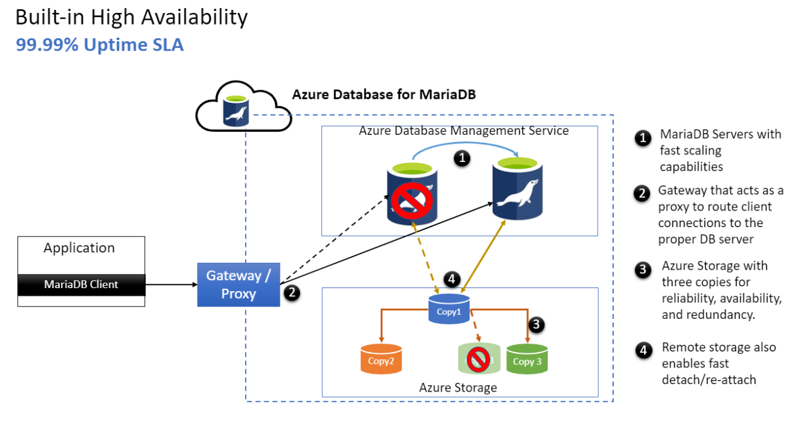

# High availability in Azure Database for MariaDB

[!INCLUDE [azure-database-for-mariadb-deprecation](includes/azure-database-for-mariadb-deprecation.md)]

The Azure Database for MariaDB service is suitable for running mission-critical databases that require high uptime. It provides high availability during:

- Planned events, such as user-initiated scale compute operations.
- Unplanned events, such as underlying hardware, software, or network failures.

Azure Database for MariaDB provides a [financially backed service-level agreement](https://azure.microsoft.com/support/legal/sla/MariaDB) for uptime. Because the service is built on Azure architecture, you can take advantage of its capabilities for high availability, redundancy, and resiliency without configuring any additional components.

## Components in Azure Database for MariaDB

| Component | Description|
| ------------ | ----------- |
| MariaDB database server | Azure Database for MariaDB provides security, isolation, resource safeguards, and fast restart capability for database servers. These capabilities facilitate operations such as scaling and database server recovery (in seconds) after an outage.  Data modifications in the database server typically occur in the context of a database transaction. All database changes are recorded synchronously in the form of write-ahead logs (*ib_log* files) on Azure Storage, which is attached to the database server. During the database [checkpoint](https://mariadb.com/kb/innodb-redo-log/#checkpoints) process, data pages from the database server memory are also flushed to the storage. |
| Remote storage | All MariaDB physical data files and log files are stored on Azure Storage, which stores three copies of data within a region to provide data redundancy, availability, and reliability. The storage layer is independent of the database server. It can be detached from a failed database server and reattached to a new database server in a few seconds.  Azure Storage continuously monitors for any storage faults. If it detects a block corruption, it automatically fixes the problem by instantiating a new storage copy. |
| Gateway | The gateway acts as a database proxy by routing all client connections to the database server. |

## Mitigation of planned downtime

The architecture of Azure Database for MariaDB provides high availability during planned downtime operations.

Here are some scenarios for planned maintenance:

| Scenario | Description|
| ------------ | ----------- |
| Compute scale-up or scale-down | When you perform a compute scale-up or scale-down operation, Azure Database for MariaDB provisions a new database server by using the scaled compute configuration. On the old database server, the service allows active checkpoints to finish, drains client connections, and cancels any uncommitted transactions. The service then shuts down the old database server. It detaches the storage from the old database server and attaches the storage to the new database server. When the client application retries the connection or tries to make a new connection, the gateway directs the connection request to the new database server.|
| Scaling up storage | Scaling up the storage is an online operation and doesn't interrupt the database server.|
| New software deployment (Azure) | Rollouts of new features or bug fixes automatically happen as part of the service's planned maintenance. For more information, see the [documentation](concepts-monitoring.md#planned-maintenance-notification) and check your [portal](https://aka.ms/servicehealthpm).|
| Minor version upgrades | Azure Database for MariaDB automatically patches database servers to the minor version that Azure determines. Automatic patching happens as part of the service's planned maintenance. It incurs a short downtime in terms of seconds, and the database server is automatically restarted with the new minor version. For more information, see the [documentation](concepts-monitoring.md#planned-maintenance-notification) and check your [portal](https://aka.ms/servicehealthpm).|

## Mitigation of unplanned downtime

Unplanned downtime can occur as a result of unforeseen failures, including underlying hardware faults, network problems, and software bugs. If the database server goes down unexpectedly, a new database server is automatically provisioned in seconds. The remote storage is automatically attached to the new database server.

The MariaDB engine performs the recovery operation by using write-ahead log and database files, and it opens the database server to allow clients to connect. Uncommitted transactions are lost, and the application must retry them.

Although you can't avoid unplanned downtime, Azure Database for MariaDB mitigates it by automatically performing recovery operations at both the database server and storage layers without requiring human intervention.

### Unplanned downtime: Failure scenarios and service recovery

Here are two failure scenarios and how Azure Database for MariaDB automatically recovers:

| Scenario | Automatic recovery |
| ---------- | ---------- |
| Database server failure | If the database server is down because of an underlying hardware fault, Azure Database for MariaDB drops active connections and cancels any inflight transactions. The service automatically deploys a new database server and attaches the remote data storage to the new database server. After the database recovery is complete, clients can connect to the new database server through the gateway.  Applications that use the MariaDB databases need to be built in a way that they detect and retry dropped connections and failed transactions. When the application retries a connection, the gateway transparently redirects the connection to the newly created database server. |
| Storage failure | Storage-related problems, such as a disk failure or a physical block corruption, don't affect applications. Because the data is stored in three copies, the surviving storage serves the copy of the data. Azure Database for MariaDB automatically corrects block corruptions. If a copy of data is lost, the service automatically creates a new copy of the data. |

Here are failure scenarios that require user action to recover:

| Scenario | Recovery plan |
| ---------- | ---------- |
| Region failure | Failure of a region is a rare event. However, if you need protection from a region failure, you can configure one or more read replicas in other regions for disaster recovery. For details, see [this article](howto-read-replicas-portal.md) about creating and managing read replicas. If a region-level failure happens, you can manually promote a read replica configured in another region to be your production database server. |
| Logical/user error | Recovery from user errors, such as accidentally dropped tables or incorrectly updated data, involves performing a [point-in-time recovery](concepts-backup.md). This action restores and recovers the data until the time just before the error occurred.  If you want to restore only a subset of databases or specific tables rather than all databases in the database server, you can restore the database server in a new instance, export the tables via [mysqldump](howto-migrate-dump-restore.md), and then [restore](howto-migrate-dump-restore.md#restore-your-mariadb-database) those tables in your database. |

## Summary

Azure Database for MariaDB has inherent high-availability capabilities to help protect your databases from common outages. It provides fast restart capability of database servers, redundant storage, and efficient routing from the gateway. For additional data protection, you can configure backups to be geo-replicated and deploy read replicas in other regions.

## Next steps

- Learn about [Azure regions](../availability-zones/az-overview.md).
- Learn about [handling transient connectivity errors](concepts-connectivity.md).
- Learn how to [replicate your data with read replicas](howto-read-replicas-portal.md).
